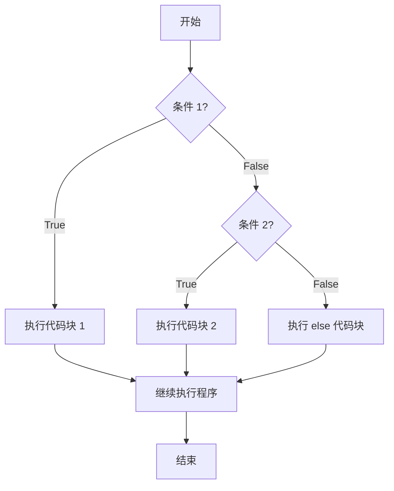

# JavaScript If Else

在编程中，我们经常需要根据不同的条件执行不同的代码。JavaScript 提供了条件语句来实现这种逻辑控制，其中最基本也是最常用的就是 `if-else` 语句。本文将详细介绍 JavaScript 中的条件语句，帮助你掌握如何在代码中做出决策。

## 什么是条件语句？

条件语句允许我们根据特定条件的真假来执行或跳过特定的代码块。JavaScript 中最基本的条件语句是 `if` 语句。

### 基本语法

```js
if (条件) {
  // 如果条件为 true，执行这里的代码
}
```

当条件评估为 `true` 时，大括号 `{}` 内的代码将被执行；如果条件为 `false`，则跳过这些代码。

## if 语句

让我们看一个简单的 `if` 语句示例：

```js
let temperature = 25;

if (temperature > 20) {
  console.log("天气很暖和！");
}
```

输出：
```
天气很暖和！
```

在这个例子中，因为 `temperature` 的值是 25，大于 20，所以条件 `temperature > 20` 评估为 `true`，因此打印出 "天气很暖和！"。

## if-else 语句

如果你希望在条件不满足时执行另一段代码，可以使用 `if-else` 语句：

```js
let temperature = 15;

if (temperature > 20) {
  console.log("天气很暖和！");
} else {
  console.log("天气有点冷！");
}
```

输出：
```
天气有点冷！
```

因为 `temperature` 的值是 15，不大于 20，所以条件 `temperature > 20` 评估为 `false`，执行 `else` 代码块，打印出 "天气有点冷！"。

## if-else if-else 语句

对于多条件判断，可以使用 `else if` 子句：

```js
let temperature = 30;

if (temperature < 0) {
  console.log("寒冷的冬天！");
} else if (temperature < 20) {
  console.log("凉爽的天气！");
} else if (temperature < 30) {
  console.log("温暖的天气！");
} else {
  console.log("炎热的夏天！");
}
```

输出：
```
炎热的夏天！
```

在这个例子中，JavaScript 从上到下检查每个条件。当找到一个为 `true` 的条件时，执行相应的代码块，然后跳出整个 if-else 结构。

:::note
JavaScript 会按照条件的顺序依次检查。一旦找到第一个为 true 的条件，它就会执行对应的代码块，并忽略后续的条件检查。
:::

## 比较运算符

在条件语句中，我们经常使用比较运算符来评估条件：

| 运算符 | 描述 | 示例 |
|-------|------|------|
| `==` | 相等（值相同） | `5 == "5"` 返回 `true` |
| `===` | 严格相等（值和类型都相同） | `5 === "5"` 返回 `false` |
| `!=` | 不相等（值不同） | `5 != "6"` 返回 `true` |
| `!==` | 严格不相等（值或类型不同） | `5 !== "5"` 返回 `true` |
| `>` | 大于 | `5 > 3` 返回 `true` |
| `<` | 小于 | `5 < 3` 返回 `false` |
| `>=` | 大于或等于 | `5 >= 5` 返回 `true` |
| `<=` | 小于或等于 | `5 <= 4` 返回 `false` |

:::tip
推荐使用严格相等运算符 `===` 和严格不相等运算符 `!==`，以避免类型转换带来的意外结果。
:::

## 逻辑运算符

你可以使用逻辑运算符组合多个条件：

| 运算符 | 描述 | 示例 |
|-------|------|------|
| `&&` | 逻辑与（所有条件都为 true） | `(x > 5 && y < 10)` |
| `\|\|` | 逻辑或（至少有一个条件为 true） | `(x > 5 \|\| y < 10)` |
| `!` | 逻辑非（条件的反面） | `!(x > 5)` |

```js
let age = 25;
let hasLicense = true;

if (age >= 18 && hasLicense) {
  console.log("你可以开车！");
} else {
  console.log("你不能开车！");
}
```

输出：
```
你可以开车！
```

## 三元运算符

JavaScript 提供了一种简洁的条件表达式形式——三元运算符，语法为：`条件 ? 表达式1 : 表达式2`。

```js
let age = 20;
let status = age >= 18 ? "成年人" : "未成年人";
console.log(status);
```

输出：
```
成年人
```

三元运算符是 `if-else` 语句的简化形式，特别适合简单的条件赋值。

## 嵌套 if 语句

你可以在一个 `if` 或 `else` 语句内部放置另一个 `if` 语句：

```js
let temperature = 25;
let isRaining = false;

if (temperature > 20) {
  if (!isRaining) {
    console.log("是个出去玩的好天气！");
  } else {
    console.log("天气暖和，但是在下雨。");
  }
} else {
  console.log("天气有点冷。");
}
```

输出：
```
是个出去玩的好天气！
```

:::caution
嵌套的 if 语句会使代码变得复杂和难以理解。如果可能，尝试使用逻辑运算符组合条件，或将逻辑拆分为更小的函数。
:::

## 实际案例：用户登录验证

让我们看一个更实际的例子，使用条件语句验证用户登录：

```js
let username = "user123";
let password = "pass456";
let inputUsername = "user123";
let inputPassword = "wrongpass";
let isRememberMeChecked = true;

// 验证登录
if (username === inputUsername && password === inputPassword) {
  console.log("登录成功！");
  
  if (isRememberMeChecked) {
    console.log("已记住你的登录信息");
  }
} else if (username === inputUsername) {
  console.log("密码错误！");
} else {
  console.log("用户名不存在！");
}
```

输出：
```
密码错误！
```

## 实际案例：购物车折扣计算

这个例子展示了如何使用条件语句为购物车实现不同的折扣规则：

```js
let totalAmount = 2500;
let userType = "premium";
let discountAmount = 0;
let finalAmount;

// 计算折扣
if (userType === "premium") {
  // 优质客户固定享有 10% 折扣
  discountAmount = totalAmount * 0.1;
  
  // 额外的消费折扣
  if (totalAmount >= 2000) {
    discountAmount += totalAmount * 0.05;  // 额外 5% 折扣
  } else if (totalAmount >= 1000) {
    discountAmount += totalAmount * 0.02;  // 额外 2% 折扣
  }
} else {
  // 普通客户只享有消费折扣
  if (totalAmount >= 2000) {
    discountAmount = totalAmount * 0.07;  // 7% 折扣
  } else if (totalAmount >= 1000) {
    discountAmount = totalAmount * 0.05;  // 5% 折扣
  } else if (totalAmount >= 500) {
    discountAmount = totalAmount * 0.02;  // 2% 折扣
  }
}

finalAmount = totalAmount - discountAmount;
console.log(`原价: ${totalAmount} 元`);
console.log(`折扣: ${discountAmount} 元`);
console.log(`最终价格: ${finalAmount} 元`);
```

输出：
```
原价: 2500 元
折扣: 375 元
最终价格: 2125 元
```

## 条件语句的流程图示

条件语句的执行流程可以通过流程图清晰地表示：



## 总结

JavaScript 条件语句是编程中做出决策的基础：

- **if 语句**：当条件为 true 时执行代码块
- **if-else 语句**：在条件为 true/false 时执行不同的代码块
- **if-else if-else 语句**：处理多个条件
- **三元运算符**：简洁地表达条件逻辑
- **嵌套 if 语句**：处理复杂的条件组合

掌握条件语句对于编写响应用户输入、处理不同场景和创建动态应用至关重要。通过练习和实践，你将能够灵活运用这些条件控制结构，编写出更加智能和交互性强的程序。

## 练习

为了巩固所学内容，尝试完成以下练习：

1. 编写一个程序，根据分数（0-100）判断等级：90-100 为 A，80-89 为 B，70-79 为 C，60-69 为 D，低于 60 为 F。

2. 创建一个简单的计算器程序，根据用户输入的两个数字和运算符（+、-、*、/）执行相应的计算。

3. 实现一个根据年龄、身高和体重计算 BMI 并给出健康建议的程序。

## 更多资源

- [MDN Web Docs: if...else](https://developer.mozilla.org/zh-CN/docs/Web/JavaScript/Reference/Statements/if...else)
- [JavaScript.info: Conditional operators](https://javascript.info/ifelse)
- [W3Schools: JavaScript if else](https://www.w3schools.com/js/js_if_else.asp)

祝你学习愉快！随着你对 JavaScript 的深入学习，你会发现条件语句是构建交互式网页和应用程序的重要基石。