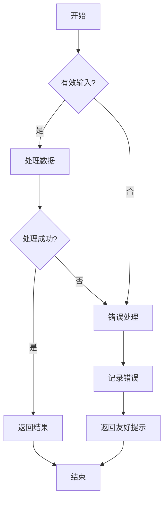

# JavaScript 控制流最佳实践

## 引言

控制流是任何编程语言的基础，它决定了程序如何执行和响应不同情况。在JavaScript中，掌握控制流的最佳实践不仅能让你的代码更加高效，还能提高可读性和可维护性。本文将介绍JavaScript中条件语句、循环和错误处理的最佳实践，帮助你编写更加优雅和健壮的代码。

## 条件语句最佳实践

### 1. 使用严格相等运算符（=== 和 !==）

JavaScript中有两种相等运算符：`==`（宽松相等）和`===`（严格相等）。建议始终使用严格相等运算符，避免类型转换导致的意外结果。

```javascript
// 不推荐
if (x == '5') {
  // 即使x是数字5也会返回true，因为会进行类型转换
}

// 推荐
if (x === '5') {
  // 仅当x是字符串'5'时才返回true
}
```

### 2. 避免嵌套条件语句

多层嵌套的条件语句会使代码难以阅读和维护。考虑使用提前返回、逻辑运算符或三元运算符简化嵌套结构。

```javascript
// 不推荐
function getInsuranceAmount(status) {
  let amount;
  if (status) {
    if (status === 'good') {
      amount = 100;
    } else {
      amount = 200;
    }
  } else {
    amount = 0;
  }
  return amount;
}

// 推荐
function getInsuranceAmount(status) {
  if (!status) return 0;
  return status === 'good' ? 100 : 200;
}
```

### 3. 善用短路求值

利用逻辑运算符的短路求值特性可以简化条件表达式。

```javascript
// 不推荐
if (user) {
  if (user.isAdmin) {
    showAdminPanel();
  }
}

// 推荐
user && user.isAdmin && showAdminPanel();
```

### 4. 使用switch语句处理多条件分支

当有多个条件分支时，使用`switch`语句比多个`if-else`更清晰。

```javascript
// 不推荐
if (fruit === 'apple') {
  console.log('苹果的价格是¥3/个');
} else if (fruit === 'banana') {
  console.log('香蕉的价格是¥2/个');
} else if (fruit === 'orange') {
  console.log('橙子的价格是¥4/个');
} else {
  console.log('没有此水果');
}

// 推荐
switch (fruit) {
  case 'apple':
    console.log('苹果的价格是¥3/个');
    break;
  case 'banana':
    console.log('香蕉的价格是¥2/个');
    break;
  case 'orange':
    console.log('橙子的价格是¥4/个');
    break;
  default:
    console.log('没有此水果');
}
```

### 5. 使用对象映射代替switch

对于简单的值映射，使用对象可能比`switch`语句更简洁。

```javascript
// 不推荐
switch (fruit) {
  case 'apple': return 3;
  case 'banana': return 2;
  case 'orange': return 4;
  default: return 0;
}

// 推荐
const fruitPrices = {
  apple: 3,
  banana: 2,
  orange: 4
};
return fruitPrices[fruit] || 0;
```

## 循环最佳实践

### 1. 选择适当的循环类型

JavaScript提供多种循环类型，根据需求选择最合适的：

```javascript
// 标准for循环：适合已知迭代次数
for (let i = 0; i < 5; i++) {
  console.log(i);
}

// for...of：适合遍历数组元素值
const colors = ['red', 'green', 'blue'];
for (const color of colors) {
  console.log(color);
}

// for...in：适合遍历对象属性（不推荐用于数组）
const person = { name: 'John', age: 30 };
for (const key in person) {
  console.log(`${key}: ${person[key]}`);
}

// while：适合不确定迭代次数的情况
let i = 0;
while (i < 5) {
  console.log(i);
  i++;
}
```

### 2. 避免在循环中修改循环变量

在循环体内修改循环变量会使代码难以理解和维护。

```javascript
// 不推荐
for (let i = 0; i < 10; i++) {
  // 一些代码
  i = i + 2; // 修改循环变量
  // 更多代码
}

// 推荐
for (let i = 0; i < 10; i++) {
  // 一些代码
  let temp = i + 2; // 使用临时变量
  // 更多代码
}
```

### 3. 优先使用数组方法代替循环

现代JavaScript提供了多种数组方法，如`map`、`filter`、`reduce`等，可以替代传统循环，使代码更简洁易读。

```javascript
const numbers = [1, 2, 3, 4, 5];

// 不推荐
const doubled = [];
for (let i = 0; i < numbers.length; i++) {
  doubled.push(numbers[i] * 2);
}

// 推荐
const doubled = numbers.map(num => num * 2);

// 不推荐
let sum = 0;
for (let i = 0; i < numbers.length; i++) {
  sum += numbers[i];
}

// 推荐
const sum = numbers.reduce((total, num) => total + num, 0);
```

### 4. 避免无限循环

确保循环条件最终会变为false，防止程序陷入无限循环。

```javascript
// 危险的代码，可能导致无限循环
let i = 0;
while (i < 10) {
  console.log(i);
  // 忘记递增i
}

// 安全的代码
let i = 0;
while (i < 10) {
  console.log(i);
  i++; // 确保i会增加
}

// 如果需要无限循环，确保有明确的退出条件
while (true) {
  // 一些代码
  if (someCondition) break;
}
```

## 错误处理最佳实践

### 1. 使用try-catch处理可预见的错误

使用`try-catch`包裹可能抛出异常的代码，避免程序崩溃。

```javascript
// 不推荐
const data = JSON.parse(userInput); // 如果userInput不是有效的JSON，会抛出异常

// 推荐
try {
  const data = JSON.parse(userInput);
  // 处理数据
} catch (error) {
  console.error('无效的JSON格式:', error.message);
  // 优雅地处理错误
}
```

### 2. 避免空的catch块

捕获异常后应当做适当处理，不要忽略错误。

```javascript
// 不推荐
try {
  riskyOperation();
} catch (error) {
  // 空的catch块，错误被吞噬
}

// 推荐
try {
  riskyOperation();
} catch (error) {
  console.error('操作失败:', error.message);
  // 或者显示友好的用户消息
  showUserFriendlyError('操作暂时无法完成，请稍后再试');
}
```

### 3. 使用finally块进行清理

无论try块中的代码是否抛出异常，finally块都会执行，适合放置清理代码。

```javascript
let connection = null;
try {
  connection = openDatabaseConnection();
  // 使用连接进行操作
} catch (error) {
  console.error('数据库操作失败:', error.message);
} finally {
  // 即使发生异常也会执行关闭连接
  if (connection) {
    connection.close();
  }
}
```

### 4. 使用自定义错误类型

对于应用特定的错误，考虑创建自定义错误类型，便于更精确地处理不同类型的错误。

```javascript
// 自定义错误类
class ValidationError extends Error {
  constructor(message) {
    super(message);
    this.name = 'ValidationError';
  }
}

// 使用自定义错误
function validateUser(user) {
  if (!user.name) {
    throw new ValidationError('用户名不能为空');
  }
  if (!user.email) {
    throw new ValidationError('邮箱不能为空');
  }
}

// 捕获特定类型的错误
try {
  validateUser({ name: 'John', email: '' });
} catch (error) {
  if (error instanceof ValidationError) {
    console.error('验证失败:', error.message);
  } else {
    console.error('未预期的错误:', error);
  }
}
```

## 实际案例：购物车结算流程

下面是一个结合上述最佳实践的实际案例，模拟购物车结算流程：

```javascript
/**
 * 购物车结算示例
 * 展示了控制流最佳实践的应用
 */
function checkout(cart) {
  // 提前验证
  if (!cart || !Array.isArray(cart.items) || cart.items.length === 0) {
    throw new Error('购物车为空或格式不正确');
  }

  try {
    // 使用数组方法计算总价
    const subtotal = cart.items.reduce((total, item) => {
      // 使用对象映射获取折扣率
      const discountRates = {
        'regular': 1.0,
        'silver': 0.95,
        'gold': 0.9,
        'platinum': 0.85
      };
      
      // 使用短路求值和默认值
      const rate = discountRates[cart.memberType] || 1.0;
      
      return total + (item.price * item.quantity * rate);
    }, 0);
    
    // 根据小计确定运费
    let shipping = 0;
    
    // 使用清晰的条件分支
    if (subtotal === 0) {
      shipping = 0;
    } else if (subtotal < 100) {
      shipping = 10;
    } else if (subtotal < 200) {
      shipping = 5;
    } else {
      shipping = 0; // 200及以上免运费
    }
    
    // 使用三元运算符处理优惠券
    const couponDiscount = cart.coupon && cart.coupon.valid ? cart.coupon.amount : 0;
    
    // 计算最终总价
    const total = Math.max(0, subtotal + shipping - couponDiscount);
    
    return {
      subtotal,
      shipping,
      discount: couponDiscount,
      total
    };
  } catch (error) {
    console.error('结算过程出错:', error.message);
    // 重新抛出错误，但附加更多上下文
    throw new Error(`无法完成结算: ${error.message}`);
  }
}

// 使用示例
try {
  const result = checkout({
    items: [
      { name: 'T恤', price: 25, quantity: 2 },
      { name: '牛仔裤', price: 50, quantity: 1 }
    ],
    memberType: 'gold',
    coupon: { valid: true, amount: 10 }
  });
  
  console.log('结算成功!');
  console.log(`小计: ¥${result.subtotal.toFixed(2)}`);
  console.log(`运费: ¥${result.shipping.toFixed(2)}`);
  console.log(`优惠: ¥${result.discount.toFixed(2)}`);
  console.log(`总计: ¥${result.total.toFixed(2)}`);
} catch (error) {
  console.error('结算失败:', error.message);
}
```

输出结果：
```
结算成功!
小计: ¥90.00
运费: ¥5.00
优惠: ¥10.00
总计: ¥85.00
```

## 控制流的可视化理解

:::tip
思考控制流时，可以将其想象为程序执行的"路线图"。良好的控制流设计就像规划最优的道路系统：清晰、高效、没有死胡同。
:::

下面是一个简单的流程图，展示了良好的控制流结构：



## 总结

通过遵循这些JavaScript控制流的最佳实践，你能够编写出更加可读、可维护和健壮的代码：

1. **条件语句**：使用严格相等运算符，避免深度嵌套，利用短路求值和对象映射简化逻辑
2. **循环**：选择合适的循环类型，避免修改循环变量，优先使用数组方法，防止无限循环
3. **错误处理**：合理使用try-catch-finally结构，创建自定义错误类型，始终处理捕获到的异常

控制流是构建复杂应用程序的基础，掌握这些最佳实践不仅能让你的代码更专业，还能减少错误和提高性能。

## 练习与学习资源

### 练习题：

1. 重写下面的条件语句，使用更简洁的形式：
   ```javascript
   let message;
   if (age < 18) {
     message = "未成年";
   } else {
     message = "成年人";
   }
   ```

2. 将下面的循环改为使用数组方法：
   ```javascript
   const numbers = [1, 2, 3, 4, 5];
   const evenNumbers = [];
   for (let i = 0; i < numbers.length; i++) {
     if (numbers[i] % 2 === 0) {
       evenNumbers.push(numbers[i]);
     }
   }
   ```

3. 添加适当的错误处理代码，改善下面的函数：
   ```javascript
   function divideNumbers(a, b) {
     return a / b;
   }
   ```

### 学习资源：

- [MDN Web Docs: JavaScript 控制流](https://developer.mozilla.org/zh-CN/docs/Web/JavaScript/Guide/Control_flow_and_error_handling)
- [JavaScript 设计模式与开发实践](https://book.douban.com/subject/26382780/)
- [Clean Code: JavaScript](https://github.com/ryanmcdermott/clean-code-javascript)

继续练习和应用这些最佳实践，你将能够更自信地编写复杂的JavaScript程序，并在遇到问题时更有效地进行调试。