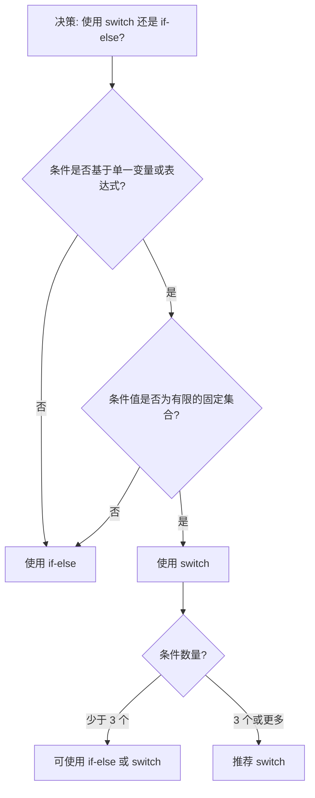

# JavaScript Switch Case

在编程中，我们经常需要根据不同的条件执行不同的代码块。虽然 `if-else` 语句可以处理这类情况，但当条件选项较多时，代码会变得冗长且难以阅读。这时，`switch` 语句就成为了一个更优雅的选择。

## 什么是 Switch 语句？

`switch` 语句是一种控制流语句，它根据一个表达式的值，将程序控制转移到与该值匹配的 case 标签处。它为多条件判断提供了一种清晰、高效的方式。

## 基本语法

```javascript
switch (expression) {
  case value1:
    // 当 expression 等于 value1 时执行的代码
    break;
  case value2:
    // 当 expression 等于 value2 时执行的代码
    break;
  case value3:
    // 当 expression 等于 value3 时执行的代码
    break;
  default:
    // 当 expression 不匹配任何 case 值时执行的代码
}
```

### 工作原理

1. 计算 `switch` 括号内的表达式
2. 将表达式的结果与每个 `case` 的值进行比较
3. 如果找到匹配项，执行对应的代码块
4. 遇到 `break` 语句后，程序跳出 `switch` 块
5. 如果没有匹配项，执行 `default` 块中的代码（如果有的话）

:::tip
`break` 语句非常重要！如果省略 `break`，程序会继续执行下一个 case 中的代码，无论它是否匹配。这称为 "fall-through" 行为。
:::

## 简单示例

让我们看一个根据星期几来显示消息的简单示例：

```javascript
const day = 3;
let dayName;

switch (day) {
  case 1:
    dayName = "星期一";
    break;
  case 2:
    dayName = "星期二";
    break;
  case 3:
    dayName = "星期三";
    break;
  case 4:
    dayName = "星期四";
    break;
  case 5:
    dayName = "星期五";
    break;
  case 6:
    dayName = "星期六";
    break;
  case 7:
    dayName = "星期日";
    break;
  default:
    dayName = "无效的日期";
}

console.log(dayName); // 输出: 星期三
```

## 省略 break 语句的后果

如前所述，如果忘记添加 `break` 语句，程序会继续执行下一个 case 中的代码：

```javascript
const fruit = "香蕉";

switch (fruit) {
  case "苹果":
    console.log("苹果很健康");
    // 注意：这里没有 break
  case "香蕉":
    console.log("香蕉富含钾");
    // 注意：这里没有 break
  case "橙子":
    console.log("橙子富含维生素C");
    break;
  default:
    console.log("未知水果");
}

// 输出:
// 香蕉富含钾
// 橙子富含维生素C
```

在上面的例子中，程序从匹配的 "香蕉" case 开始执行，但由于没有 `break` 语句，它会继续执行后续 case 中的代码，直到遇到 `break` 或 `switch` 结束。

## 合并多个 case

有时，我们可能希望多个 case 执行相同的代码。可以通过故意省略 `break` 语句来实现这一点：

```javascript
const grade = "B";
let feedback;

switch (grade) {
  case "A":
    feedback = "优秀！";
    break;
  case "B":
  case "C":
    feedback = "良好！";
    break;
  case "D":
    feedback = "及格！";
    break;
  case "F":
    feedback = "不及格！";
    break;
  default:
    feedback = "无效的成绩";
}

console.log(feedback); // 输出: 良好！
```

在这个例子中，"B" 和 "C" 共享相同的代码块。

## switch 语句与严格比较

`switch` 语句使用严格相等（`===`）进行比较，这意味着不会进行类型转换：

```javascript
const value = "10";

switch (value) {
  case 10:
    console.log("数字 10");
    break;
  case "10":
    console.log("字符串 10");
    break;
  default:
    console.log("其他值");
}

// 输出: 字符串 10
```

## 在 case 中使用表达式

在 JavaScript 中，`case` 子句必须是常量表达式或字面量，不能是变量或函数调用：

```javascript
// 有效的 case 值
switch (x) {
  case 5:
    // ...
    break;
  case "hello":
    // ...
    break;
  case true:
    // ...
    break;
  case 1 + 2:  // 这是常量表达式，计算结果为 3
    // ...
    break;
}

// 无效的 case 值
const y = 5;
switch (x) {
  case y:  // 在某些JavaScript环境中可能有效，但不建议这样使用
    // ...
    break;
  case getValue():  // 不能在 case 中调用函数
    // ...
    break;
}
```

## 实际应用案例

### 案例1：构建简单的计算器

```javascript
function calculator(num1, operator, num2) {
  let result;

  switch (operator) {
    case '+':
      result = num1 + num2;
      break;
    case '-':
      result = num1 - num2;
      break;
    case '*':
      result = num1 * num2;
      break;
    case '/':
      if (num2 === 0) {
        return "错误：除数不能为零";
      }
      result = num1 / num2;
      break;
    default:
      return "错误：无效的运算符";
  }

  return `${num1} ${operator} ${num2} = ${result}`;
}

console.log(calculator(5, '+', 3)); // 输出: 5 + 3 = 8
console.log(calculator(10, '*', 2)); // 输出: 10 * 2 = 20
console.log(calculator(7, '/', 0)); // 输出: 错误：除数不能为零
console.log(calculator(5, '%', 2)); // 输出: 错误：无效的运算符
```

### 案例2：HTTP 状态码处理

```javascript
function handleHttpStatus(statusCode) {
  switch (statusCode) {
    case 200:
    case 201:
      return "成功请求";
    case 301:
    case 302:
      return "重定向";
    case 400:
      return "客户端错误 - 错误请求";
    case 401:
      return "客户端错误 - 未授权";
    case 403:
      return "客户端错误 - 禁止访问";
    case 404:
      return "客户端错误 - 未找到";
    case 500:
    case 501:
    case 502:
    case 503:
      return "服务器错误";
    default:
      return "未知状态码";
  }
}

console.log(handleHttpStatus(200)); // 输出: 成功请求
console.log(handleHttpStatus(404)); // 输出: 客户端错误 - 未找到
console.log(handleHttpStatus(503)); // 输出: 服务器错误
```

## switch vs. if-else

什么时候应该使用 `switch` 而不是 `if-else`？



### 使用 switch 的优势：
- 当有多个条件分支时，代码更清晰易读
- 执行效率可能更高，因为只需评估一次表达式

### 使用 if-else 的优势：
- 条件可以是任何表达式，而不仅限于相等比较
- 对于少数条件分支，代码可能更简洁

## 常见错误与最佳实践

### 忘记 break 语句

最常见的错误是忘记添加 `break` 语句，导致意外的 "fall-through" 行为：

```javascript
// 错误示例
switch (fruit) {
  case "苹果":
    console.log("这是一个苹果");
  case "香蕉":  // 如果 fruit 是 "苹果"，这行也会执行！
    console.log("这是一个香蕉");
    break;
}
```

### 最佳实践

1. **始终添加 `break` 语句**，除非你有明确的意图让代码执行下一个 case。
2. **始终包含 `default` 子句**，以处理未预期的输入。
3. **在有意使用 fall-through 时添加注释**，让其他开发者知道这是有意为之。

```javascript
switch (fruit) {
  case "苹果":
    console.log("这是一个苹果");
    // 故意不加 break，执行下一个 case
  case "香蕉":
    console.log("水果很健康");
    break;
  default:
    console.log("未知水果");
}
```

## 总结

`switch` 语句是 JavaScript 中处理多条件分支的强大工具。它提供了比多个嵌套 `if-else` 语句更清晰的语法结构，特别是在处理多个离散值时。关键是要记住：

1. `switch` 使用严格相等（`===`）进行比较。
2. 每个 `case` 后需要 `break` 语句来防止 fall-through。
3. `default` 子句用于处理所有不匹配的情况。
4. 可以通过省略 `break` 来让多个 `case` 共享同一个代码块。

## 练习

1. 编写一个 `switch` 语句，根据月份名称（英文）返回该月的天数。
2. 创建一个简单的菜单系统，用户输入选项数字（1-4），程序根据选择执行不同的操作。
3. 实现一个函数，使用 `switch` 语句将分数（0-100）转换为字母等级（A、B、C、D、F）。

## 附加资源

- [MDN Web Docs: switch](https://developer.mozilla.org/zh-CN/docs/Web/JavaScript/Reference/Statements/switch)
- [JavaScript.info: switch语句](https://zh.javascript.info/switch)

:::caution
请记住，虽然 `switch` 语句是一种强大的工具，但它不是万能的。对于复杂的条件逻辑，特别是当比较不仅仅是相等关系时，`if-else` 语句可能是更好的选择。
:::