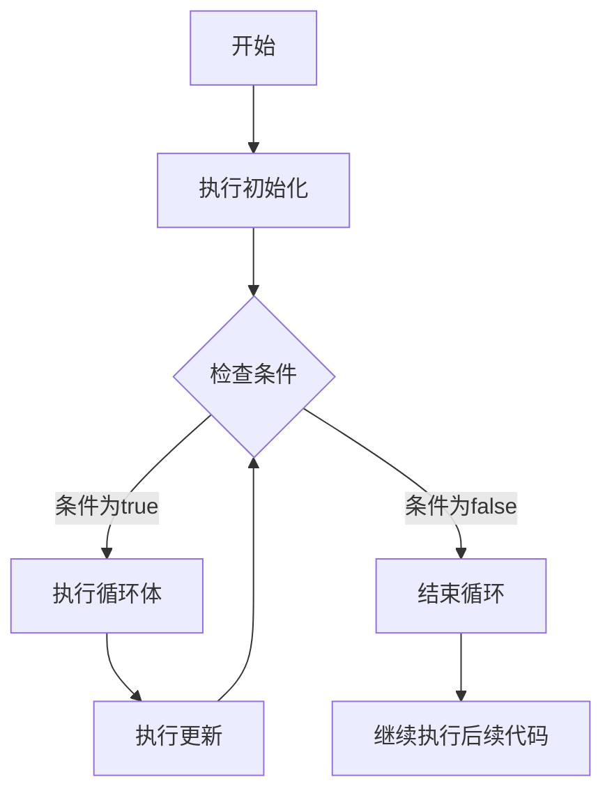

# JavaScript For循环

在JavaScript编程中，循环是最基础也是最重要的控制流结构之一。当我们需要重复执行某段代码多次时，循环结构能帮我们大大简化这一过程。而`for`循环是其中最常用、最灵活的循环结构之一。

## 什么是For循环？

`for`循环提供了一种紧凑的方式来重复执行代码块，同时管理循环计数器。当你知道代码需要执行的确切次数时，`for`循环通常是最佳选择。

### 基本语法

```javascript
for (初始化; 条件; 更新) {
  // 循环体 - 要重复执行的代码
}
```

`for`循环包含三个关键部分，由分号分隔：

1. **初始化**：在循环开始前执行一次，通常用于初始化计数器变量
2. **条件**：在每次循环迭代前检查，如果为`true`则执行循环体，否则退出循环
3. **更新**：在每次循环体执行后执行，通常用于更新计数器变量

## For循环执行流程

为了更清楚地理解`for`循环的执行过程，我们可以通过以下流程图来说明：



## 基本示例

让我们从一个简单的例子开始，打印数字1到5：

```javascript
for (let i = 1; i <= 5; i++) {
  console.log(i);
}
```

输出：
```
1
2
3
4
5
```

在这个例子中：
- 初始化：`let i = 1` 设置计数器初始值为1
- 条件：`i <= 5` 检查计数器是否小于等于5，如果是则继续循环
- 更新：`i++` 在每次循环后将计数器加1

:::tip
在JavaScript中，`i++`是后缀递增操作符，等同于`i = i + 1`。这是循环中最常用的计数器更新方式。
:::

## For循环的变体

### 递减的循环

我们也可以创建一个递减的循环，从大数开始到小数结束：

```javascript
for (let i = 5; i >= 1; i--) {
  console.log(i);
}
```

输出：
```
5
4
3
2
1
```

### 使用不同的步长

循环的步长不必限于1，我们可以使用任何增量：

```javascript
// 打印1到10之间的奇数
for (let i = 1; i <= 10; i += 2) {
  console.log(i);
}
```

输出：
```
1
3
5
7
9
```

### 多个初始化或更新表达式

`for`循环的初始化和更新部分可以包含多个表达式，用逗号分隔：

```javascript
// 两个计数器同时递增和递减
for (let i = 0, j = 5; i <= 5; i++, j--) {
  console.log(`i = ${i}, j = ${j}`);
}
```

输出：
```
i = 0, j = 5
i = 1, j = 4
i = 2, j = 3
i = 3, j = 2
i = 4, j = 1
i = 5, j = 0
```

### 省略部分

`for`循环的三个部分都可以省略，但分号必须保留：

```javascript
// 省略初始化（在循环外初始化）
let i = 1;
for (; i <= 5; i++) {
  console.log(i);
}

// 省略更新（在循环体内更新）
for (let i = 1; i <= 5;) {
  console.log(i);
  i++;
}

// 省略条件（需要在循环内设置break条件，否则会成为无限循环）
for (let i = 1;; i++) {
  if (i > 5) break;
  console.log(i);
}
```

:::caution
当省略条件部分时，循环默认为无限循环。确保在循环体内使用`break`语句来避免程序崩溃。
:::

## For循环的实际应用

### 遍历数组

`for`循环最常见的用途之一是遍历数组：

```javascript
const fruits = ["苹果", "香蕉", "橙子", "葡萄", "西瓜"];

for (let i = 0; i < fruits.length; i++) {
  console.log(`索引 ${i}: ${fruits[i]}`);
}
```

输出：
```
索引 0: 苹果
索引 1: 香蕉
索引 2: 橙子
索引 3: 葡萄
索引 4: 西瓜
```

### 创建HTML元素列表

在web开发中，可以用`for`循环动态创建HTML元素：

```javascript
// 创建一个无序列表
function createList(items) {
  let listHTML = '<ul>';
  
  for (let i = 0; i < items.length; i++) {
    listHTML += `<li>${items[i]}</li>`;
  }
  
  listHTML += '</ul>';
  return listHTML;
}

// 使用函数
const todoItems = ["学习JavaScript", "完成项目", "准备面试"];
document.getElementById("list-container").innerHTML = createList(todoItems);
```

### 计算总和

计算数字数组的总和：

```javascript
const numbers = [10, 20, 30, 40, 50];
let sum = 0;

for (let i = 0; i < numbers.length; i++) {
  sum += numbers[i];
}

console.log(`总和: ${sum}`); // 输出: 总和: 150
```

### 寻找最大值或最小值

从数组中找出最大值：

```javascript
const scores = [85, 92, 78, 95, 88];
let maxScore = scores[0]; // 假设第一个元素是最大的

for (let i = 1; i < scores.length; i++) {
  if (scores[i] > maxScore) {
    maxScore = scores[i];
  }
}

console.log(`最高分: ${maxScore}`); // 输出: 最高分: 95
```

## 嵌套For循环

`for`循环可以嵌套，这在处理多维数据结构时特别有用：

```javascript
// 创建一个乘法表
for (let i = 1; i <= 9; i++) {
  let row = '';
  for (let j = 1; j <= i; j++) {
    row += `${j}×${i}=${j*i}\t`;
  }
  console.log(row);
}
```

输出将是一个九九乘法表。

:::warning
嵌套循环会导致操作次数成倍增长。例如，两个嵌套的循环各执行n次，总操作次数是n²。在处理大数据集时要小心使用，避免性能问题。
:::

## 与其他循环结构的对比

### For循环 vs While循环

- `for`循环适合已知迭代次数的场景
- `while`循环适合在条件满足时持续执行的场景

```javascript
// for循环实现
for (let i = 0; i < 5; i++) {
  console.log(i);
}

// 等价的while循环
let i = 0;
while (i < 5) {
  console.log(i);
  i++;
}
```

### For循环 vs For...of循环

- `for`循环提供了更多控制，如跳过元素或反向迭代
- `for...of`循环简化了数组和其他可迭代对象的遍历

```javascript
const colors = ["红", "绿", "蓝"];

// 传统for循环
for (let i = 0; i < colors.length; i++) {
  console.log(colors[i]);
}

// for...of循环
for (let color of colors) {
  console.log(color);
}
```

## 循环控制语句

在循环中，我们有两个特殊的控制语句：

### break语句

`break`语句立即终止整个循环，并继续执行循环后的代码：

```javascript
for (let i = 1; i <= 10; i++) {
  if (i === 6) {
    break; // 当i等于6时，终止循环
  }
  console.log(i);
}
console.log("循环已终止");
```

输出：
```
1
2
3
4
5
循环已终止
```

### continue语句

`continue`语句跳过当前迭代，继续执行下一次迭代：

```javascript
for (let i = 1; i <= 10; i++) {
  if (i % 2 === 0) {
    continue; // 跳过所有偶数
  }
  console.log(i);
}
```

输出：
```
1
3
5
7
9
```

## 性能考虑

在处理大型数据集时，`for`循环的性能很重要。以下是一些优化提示：

1. **缓存数组长度**：在循环外部缓存数组的长度，而不是在每次迭代时计算
   ```javascript
   const arr = [1, 2, 3, 4, 5];
   const length = arr.length;
   for (let i = 0; i < length; i++) {
     // 使用缓存的长度
   }
   ```

2. **避免在循环内修改DOM**：收集所有更改，然后在循环外批量应用
   ```javascript
   // 不推荐
   for (let i = 0; i < 1000; i++) {
     document.getElementById("result").innerHTML += i + " ";
   }
   
   // 推荐
   let result = "";
   for (let i = 0; i < 1000; i++) {
     result += i + " ";
   }
   document.getElementById("result").innerHTML = result;
   ```

3. **考虑使用反向循环**：在某些情况下，反向循环可能更快
   ```javascript
   const arr = [1, 2, 3, 4, 5];
   for (let i = arr.length - 1; i >= 0; i--) {
     // 处理元素
   }
   ```

## 总结

`for`循环是JavaScript中强大而灵活的控制流结构，用于重复执行代码块指定的次数。它特别适合当你事先知道需要执行的迭代次数时，例如处理数组等场景。通过理解`for`循环的基本语法和各种变体，我们可以编写更加简洁、高效的代码。

关键要点：
- `for`循环由三个部分组成：初始化、条件和更新
- 循环部分可以根据需要省略
- 可以使用`break`和`continue`控制循环流程
- 嵌套循环对处理多维数据非常有用，但要注意性能影响
- 对于大数据集，应考虑循环性能优化

## 练习题

为了巩固所学知识，尝试以下练习：

1. 编写一个`for`循环，打印10到1的倒计时。
2. 使用`for`循环计算1到100的所有偶数之和。
3. 创建一个嵌套`for`循环来打印一个5×5的星号矩形。
4. 编写一个函数，使用`for`循环检查一个字符串是否是回文（正反读都一样）。
5. 使用`for`循环，找出数组`[23, 45, 12, 67, 89, 34]`中的最大值和最小值。

通过反复练习和实践，你将能够熟练掌握`for`循环的使用，为进一步学习JavaScript编程打下坚实的基础。

:::note 额外资源
- [MDN Web Docs: for语句](https://developer.mozilla.org/zh-CN/docs/Web/JavaScript/Reference/Statements/for)
- [JavaScript.info: 循环：while和for](https://zh.javascript.info/while-for)
:::