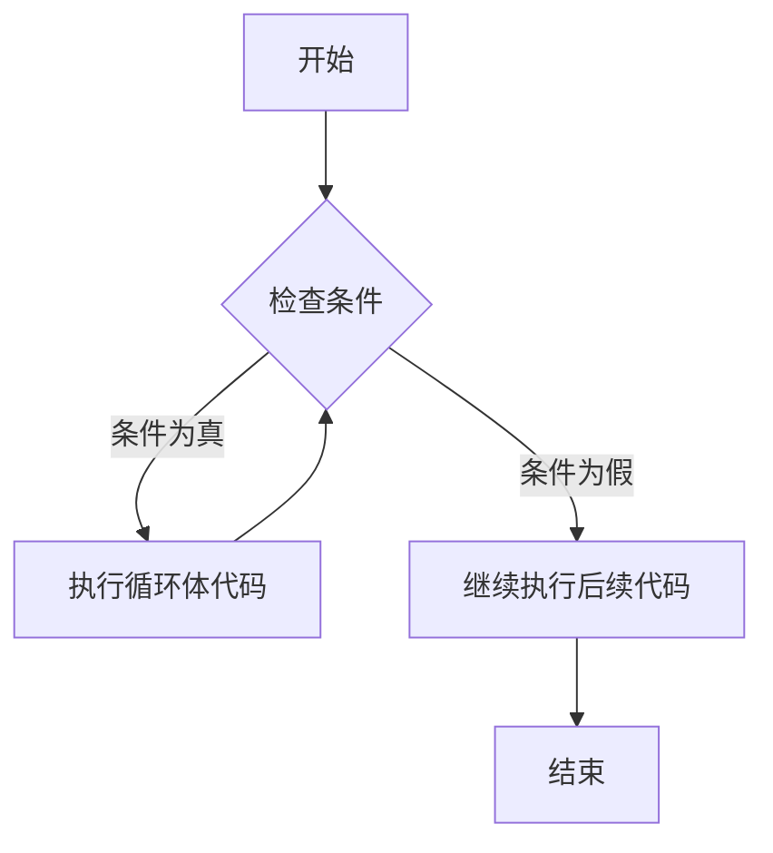
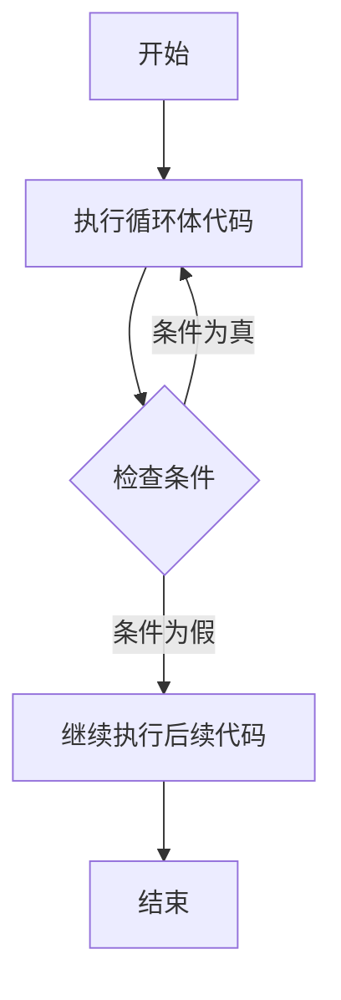

# JavaScript While循环

在JavaScript编程中，循环是一种重要的控制流结构，它允许我们重复执行特定的代码块，直到满足某个条件为止。而`while`循环是JavaScript中最基本的循环结构之一。本教程将帮助你全面了解`while`循环的用法。

## 什么是while循环？

`while`循环是一种前测试循环语句，它会在每次循环执行前检查条件。如果条件为真，循环体内的代码将会执行；如果条件为假，循环将终止，程序继续执行循环后的代码。

### 基本语法

```javascript
while (条件) {
    // 循环体代码
    // 需要在循环体内有改变条件的语句
    // 否则可能导致无限循环
}
```

`while`循环的工作流程如下：



## while循环的基本用法

让我们来看一个简单的例子，使用`while`循环来打印数字1到5：

```javascript
let i = 1;
while (i <= 5) {
    console.log(i);
    i++; // 增加计数器变量
}
```

**输出：**
```
1
2
3
4
5
```

在上面的例子中：
1. 我们初始化了一个变量`i`并赋值为1
2. `while`循环检查条件`i <= 5`是否为真
3. 如果条件为真，执行循环体内的代码（打印`i`的值）
4. 然后增加`i`的值
5. 返回步骤2，重新检查条件
6. 当`i`变为6时，条件`i <= 5`变为假，循环终止

:::warning
如果你不在循环体内更新循环条件，就会导致无限循环，可能使浏览器或程序崩溃！
:::

## 避免无限循环

无限循环是初学者常犯的错误。看一个无限循环的例子：

```javascript
let count = 1;
while (count <= 5) {
    console.log("这是第" + count + "次循环");
    // 忘记更新count变量
}
```

在这个例子中，`count`变量永远不会增加，所以条件`count <= 5`将始终为真，导致循环无限执行。

为了避免无限循环，请确保：
1. 循环条件最终会变为假
2. 循环体内有能改变条件的代码

## while循环的实际应用场景

### 1. 用户输入验证

在网页应用中，我们可以使用`while`循环来验证用户输入，直到用户提供有效的输入为止：

```javascript
function getUserInput() {
    let input;
    while (isNaN(input) || input <= 0) {
        input = Number(prompt("请输入一个正数："));
    }
    return input;
}
```

### 2. 游戏循环

在游戏开发中，`while`循环常用于创建游戏主循环：

```javascript
let gameActive = true;
let score = 0;

while (gameActive) {
    // 更新游戏状态
    score += playRound();
    
    // 检查游戏是否应该结束
    if (score >= 100 || livesRemaining <= 0) {
        gameActive = false;
    }
}

console.log("游戏结束！最终得分：" + score);
```

### 3. 处理数据结构

`while`循环也可用于遍历链表等数据结构：

```javascript
function printLinkedList(head) {
    let current = head;
    while (current !== null) {
        console.log(current.value);
        current = current.next;
    }
}
```

## do...while循环：后测试循环

JavaScript还提供了`do...while`循环，它是一种后测试循环，无论条件是否为真，循环体至少会执行一次：

```javascript
let i = 1;
do {
    console.log(i);
    i++;
} while (i <= 5);
```

`do...while`循环的工作流程：



:::tip
当你需要确保代码至少执行一次，然后再检查条件时，`do...while`循环是理想选择。
:::

## while循环与其他循环的比较

JavaScript提供了多种循环结构，了解它们的差异可以帮助你选择最合适的循环类型：

| 循环类型 | 适用场景 | 特点 |
|---------|---------|------|
| `while` | 当你不知道循环次数，而是基于条件执行时 | 前测试循环，可能一次都不执行 |
| `do...while` | 当你需要至少执行一次循环体时 | 后测试循环，至少执行一次 |
| `for` | 当你知道循环次数或需要遍历时 | 集初始化、条件检查、递增为一体 |
| `for...of` | 当你需要遍历可迭代对象时 | 更简洁的数组/对象属性遍历 |

## 性能考虑

在性能方面，`while`循环和`for`循环的效率几乎相同。选择使用哪种循环应该基于代码可读性和具体的应用场景，而不是性能差异。

:::caution
当处理大数据集或需要高性能时，避免在循环内部创建新对象或进行DOM操作，这些操作可能会导致性能问题。
:::

## 实践练习：猜数字游戏

下面是一个使用`while`循环实现的猜数字游戏：

```javascript
function guessNumberGame() {
    const secretNumber = Math.floor(Math.random() * 100) + 1;
    let guesses = 0;
    let guess;
    let gameOver = false;
    
    console.log("欢迎来到猜数字游戏！我已经想好了一个1到100之间的数字。");
    
    while (!gameOver) {
        guess = Number(prompt("请猜一个数字(1-100)："));
        guesses++;
        
        if (isNaN(guess)) {
            console.log("请输入有效的数字！");
        } else if (guess === secretNumber) {
            console.log(`恭喜你猜对了！答案是${secretNumber}。你总共猜了${guesses}次。`);
            gameOver = true;
        } else if (guess < secretNumber) {
            console.log("太小了，再猜大一点！");
        } else {
            console.log("太大了，再猜小一点！");
        }
    }
}
```

## 总结

`while`循环是JavaScript中一个强大而灵活的控制流结构，它让我们可以在满足特定条件时重复执行代码块。记住以下关键点：

1. `while`循环在执行前检查条件
2. 确保循环条件最终会变为假，避免无限循环
3. 使用`do...while`当你需要循环体至少执行一次时
4. 为了代码可维护性，循环体内应保持简洁
5. 根据具体应用场景选择适合的循环类型

## 练习

为了巩固你的理解，尝试完成以下练习：

1. 使用`while`循环计算1到100的所有偶数之和
2. 实现一个倒计时程序，从10倒数到1
3. 编写一个程序，使用`while`循环找出数组中的最大值
4. 使用`do...while`循环创建一个简单的菜单系统，直到用户选择退出选项

## 延伸阅读

要深入了解JavaScript循环和控制流，请参考以下资源：

- MDN Web文档中关于[while语句](https://developer.mozilla.org/zh-CN/docs/Web/JavaScript/Reference/Statements/while)的说明
- 学习JavaScript中的其他循环类型，如`for`循环和`for...of`循环
- 探索循环中的流程控制语句，如`break`和`continue`

祝你学习愉快！