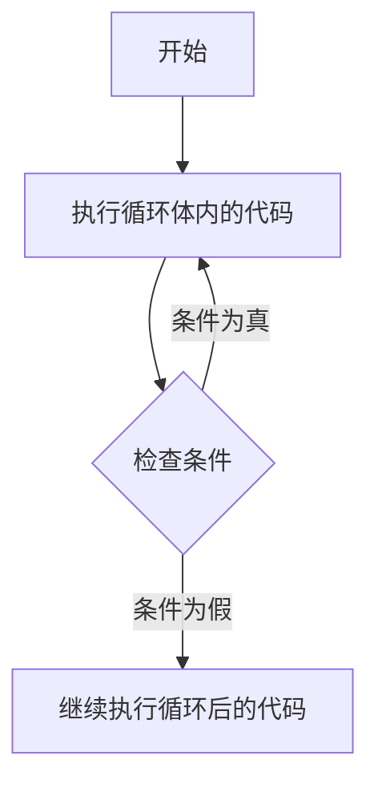

# JavaScript Do While循环

## 什么是Do While循环？

在JavaScript编程中，循环是一种能够重复执行代码块的控制结构，而`do...while`循环是其中一种特殊的循环类型。与其他循环不同，`do...while`循环具有一个关键特性：**它会先执行一次循环体，然后再检查条件**。

`do...while`循环的基本语法结构如下：

```javascript
do {
  // 循环体（要重复执行的代码）
} while (条件);
```

这种循环结构保证了循环体**至少会执行一次**，无论条件是否为真。这是它与普通`while`循环的主要区别。

## Do While循环的执行流程

`do...while`循环的执行过程可以用以下步骤描述：



1. 先执行一次循环体内的代码
2. 然后检查循环条件
3. 如果条件为真，返回第1步继续执行
4. 如果条件为假，退出循环，执行后续代码

## 基本示例

让我们通过一个简单的例子来理解`do...while`循环：

```javascript
let i = 1;

do {
  console.log(`当前计数：${i}`);
  i++;
} while (i <= 5);

console.log("循环结束");
```

输出：
```
当前计数：1
当前计数：2
当前计数：3
当前计数：4
当前计数：5
循环结束
```

在这个例子中：
- 我们初始化了一个变量`i`，值为1
- 循环体第一次无条件执行，打印出"当前计数：1"并将`i`增加到2
- 检查条件`i <= 5`，此时`i`为2，条件为真，继续执行循环
- 循环继续直到`i`变成6，此时条件为假，循环结束

## 与While循环的关键区别

:::tip 理解差异
**While循环**：先检查条件，条件为真才执行循环体
**Do While循环**：先执行循环体，然后再检查条件
:::

这个差异最明显的体现是当初始条件就为假时：

```javascript
// while循环示例 - 条件一开始就为假
let j = 10;
while (j < 5) {
  console.log(`这段代码不会被执行，因为j=${j}，不小于5`);
  j++;
}

// do...while循环示例 - 条件一开始就为假
let k = 10;
do {
  console.log(`这段代码会执行一次，即使k=${k}，不小于5`);
  k++;
} while (k < 5);
```

输出：
```
这段代码会执行一次，即使k=10，不小于5
```

## 实际应用场景

### 1. 用户输入验证

`do...while`循环非常适合需要至少执行一次，然后根据结果决定是否继续的场景，比如用户输入验证：

```javascript
let userInput;

do {
  userInput = prompt("请输入一个1到10之间的数字：");
  // 将输入转换为数字并检查是否有效
  userInput = Number(userInput);
} while (isNaN(userInput) || userInput < 1 || userInput > 10);

console.log(`谢谢！您输入的有效数字是：${userInput}`);
```

这段代码会不断提示用户输入，直到他们输入了一个符合要求的数字。

### 2. 游戏循环

游戏开发中，`do...while`循环可用于创建至少运行一次的游戏循环：

```javascript
let gameRunning = true;
let score = 0;

do {
  // 游戏逻辑
  score += Math.floor(Math.random() * 10); // 随机增加分数
  console.log(`当前得分：${score}`);
  
  // 检查游戏是否应该继续
  if (score >= 50) {
    console.log("恭喜，你赢了！");
    gameRunning = false;
  } else if (Math.random() < 0.2) { // 20%的几率游戏结束
    console.log("游戏结束！");
    gameRunning = false;
  }
  
} while (gameRunning);
```

### 3. 菜单驱动程序

创建交互式菜单系统时，`do...while`循环很有用：

```javascript
let option;

do {
  console.log("\n===== 主菜单 =====");
  console.log("1. 查看个人信息");
  console.log("2. 修改设置");
  console.log("3. 帮助");
  console.log("0. 退出");
  
  option = prompt("请选择一个选项 (0-3)：");
  
  switch (option) {
    case "1":
      console.log("显示个人信息...");
      break;
    case "2":
      console.log("显示设置选项...");
      break;
    case "3":
      console.log("显示帮助信息...");
      break;
    case "0":
      console.log("正在退出程序...");
      break;
    default:
      console.log("无效选择，请重试！");
  }
  
} while (option !== "0");
```

## 注意事项与最佳实践

### 避免无限循环

每个`do...while`循环都应该有一个明确的退出条件，否则会导致无限循环：

```javascript
// 危险！无限循环
do {
  console.log("这会一直执行下去！");
  // 没有改变循环条件的代码
} while (true);
```

确保循环体中包含能够最终使条件变为假的代码。

### 适当使用循环变量

当使用循环变量时，确保它们在循环体内适当更新：

```javascript
let counter = 1;
do {
  console.log(`计数器: ${counter}`);
  counter++; // 不要忘记更新循环变量
} while (counter <= 5);
```

### 何时选择do...while

- 当你需要确保代码至少执行一次时
- 当循环条件依赖于循环体内的操作时
- 当处理用户输入验证时

:::caution 谨慎使用
尽管`do...while`循环有其特定用途，但在大多数情况下，`for`或普通`while`循环可能更适合，特别是当你事先知道循环可能不需要执行任何次数时。
:::

## 总结

`do...while`循环是JavaScript中一种特殊的循环结构，它确保循环体至少执行一次，然后根据条件决定是否继续执行。这使它特别适合用户输入验证、菜单驱动程序和其他需要"先执行后检查"逻辑的场景。

记住`do...while`循环的关键特点：
- 循环体至少执行一次
- 条件检查发生在循环体执行之后
- 循环会一直执行，直到条件变为假

通过掌握`do...while`循环，你可以更灵活地控制程序流程，实现更复杂的交互逻辑。

## 练习题

为了巩固你对`do...while`循环的理解，尝试完成以下练习：

1. 编写一个程序，使用`do...while`循环询问用户猜测1到100之间的一个随机数，直到猜对为止。
2. 创建一个简单的计算器程序，使用`do...while`循环允许用户连续执行多次计算，直到用户选择退出。
3. 使用`do...while`循环编写一个程序，从用户那里收集有效的电子邮件地址（包含@符号且长度大于5）。

## 进一步学习资源

- [MDN Web Docs: do...while](https://developer.mozilla.org/zh-CN/docs/Web/JavaScript/Reference/Statements/do...while)
- [JavaScript.info: Loops: while and for](https://javascript.info/while-for)

通过实践和应用，你将很快掌握`do...while`循环，并能在适当的场合灵活运用它来解决问题。