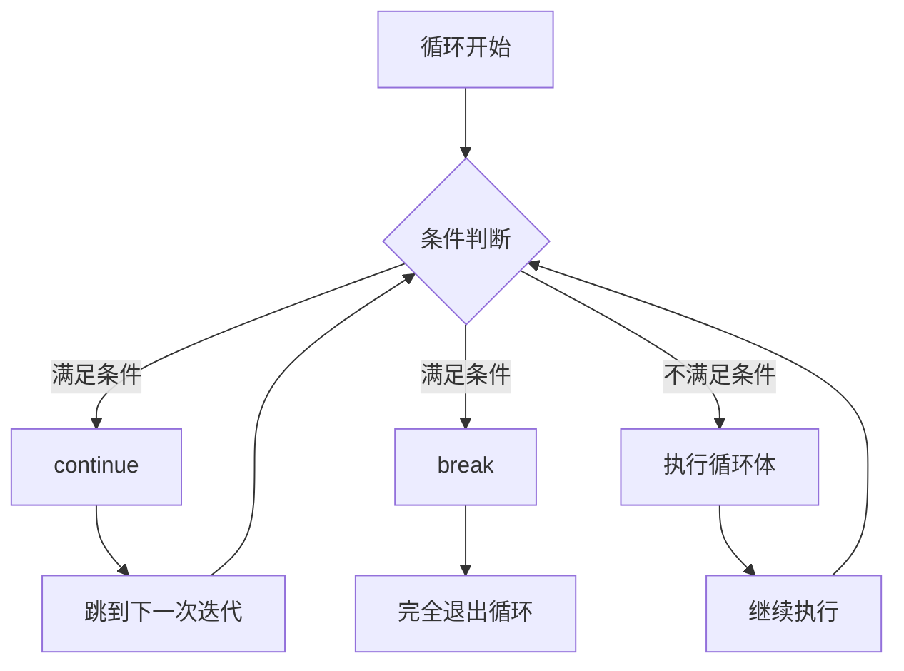

# JavaScript Continue语句

## 什么是continue语句？

在JavaScript循环结构中，`continue`语句是一个强大的控制流工具，它允许你跳过循环的当前迭代，立即进入下一个迭代。与`break`语句（完全终止循环）不同，`continue`只是略过当前这一次的循环执行，然后继续下一次循环。

这使得`continue`成为处理特定条件下不需要执行循环体内剩余代码的理想选择。

## continue语句的基本语法

`continue`语句的语法非常简单：

```javascript
continue;
```

在嵌套循环中，也可以使用带标签的`continue`：

```javascript
continue labelName;
```

## continue语句的工作原理

让我们通过一个简单的例子来看看`continue`是如何工作的：

```javascript
for (let i = 1; i <= 5; i++) {
  if (i === 3) {
    console.log(`发现数字3，跳过此次循环`);
    continue;
  }
  console.log(`当前数字是: ${i}`);
}
```

输出结果：
```
当前数字是: 1
当前数字是: 2
发现数字3，跳过此次循环
当前数字是: 4
当前数字是: 5
```

在上面的例子中，当`i`的值为3时，执行到`continue`语句，循环体中`continue`之后的代码被跳过，直接开始下一次迭代（`i = 4`）。

:::note
`continue`语句仅跳过当前迭代中剩余的代码，不会终止整个循环。
:::

## 在不同循环中使用continue

### 在for循环中使用continue

`for`循环是使用`continue`最常见的场景：

```javascript
for (let i = 0; i < 10; i++) {
  // 跳过所有偶数
  if (i % 2 === 0) {
    continue;
  }
  console.log(i); // 只打印奇数
}
```

输出结果：
```
1
3
5
7
9
```

### 在while循环中使用continue

在`while`循环中使用`continue`时需要特别注意，确保循环计数器在`continue`前更新：

```javascript
let i = 0;
while (i < 10) {
  i++; // 确保在continue之前更新
  if (i % 2 === 0) {
    continue;
  }
  console.log(i); // 只打印奇数
}
```

输出结果：
```
1
3
5
7
9
```

:::caution
在`while`循环中，如果你在`continue`语句之后更新循环变量，那么`continue`会导致循环变量不会被更新，可能导致无限循环！
:::

错误示例（无限循环）：
```javascript
let i = 0;
while (i < 5) {
  if (i < 3) {
    continue; // 危险！i永远不会增加，导致无限循环
  }
  console.log(i);
  i++;
}
```

### 在do...while循环中使用continue

在`do...while`循环中，`continue`的行为与`while`循环类似：

```javascript
let i = 0;
do {
  i++;
  if (i % 2 === 0) {
    continue;
  }
  console.log(i); // 只打印奇数
} while (i < 10);
```

输出结果：
```
1
3
5
7
9
```

## 带标签的continue

在嵌套循环中，`continue`默认只会跳过最内层循环的当前迭代。如果你想跳过外层循环的当前迭代，可以使用带标签的`continue`：

```javascript
outerLoop: for (let i = 1; i <= 3; i++) {
  for (let j = 1; j <= 3; j++) {
    if (i === 2 && j === 2) {
      console.log(`跳过外层循环当前迭代，i=${i}, j=${j}`);
      continue outerLoop;
    }
    console.log(`i=${i}, j=${j}`);
  }
}
```

输出结果：
```
i=1, j=1
i=1, j=2
i=1, j=3
i=2, j=1
跳过外层循环当前迭代，i=2, j=2
i=3, j=1
i=3, j=2
i=3, j=3
```

在上面的例子中，当`i=2`和`j=2`时，`continue outerLoop`会跳过外层循环的当前迭代（即`i=2`的整个迭代），直接进入`i=3`的迭代。

## 实际应用场景

### 1. 过滤数据

`continue`语句可以用于过滤数组中的特定元素：

```javascript
const numbers = [1, 2, 3, 4, 5, 6, 7, 8, 9, 10];
console.log("只处理奇数：");

for (let i = 0; i < numbers.length; i++) {
  // 跳过偶数
  if (numbers[i] % 2 === 0) {
    continue;
  }
  
  // 只处理奇数
  console.log(numbers[i] * 2);
}
```

输出结果：
```
只处理奇数：
2
6
10
14
18
```

### 2. 表单验证

在处理用户输入时，`continue`可以用于快速跳过不符合条件的输入：

```javascript
function validateUserInputs(inputs) {
  const validInputs = [];
  
  for (let i = 0; i < inputs.length; i++) {
    const input = inputs[i];
    
    // 空输入，跳过
    if (!input || input.trim() === '') {
      console.log(`输入 #${i+1} 为空，已跳过`);
      continue;
    }
    
    // 输入太短，跳过
    if (input.length < 3) {
      console.log(`输入 #${i+1} 太短，已跳过`);
      continue;
    }
    
    // 输入有效，添加到数组
    validInputs.push(input);
  }
  
  return validInputs;
}

const userInputs = ['', 'hi', 'hello', '   ', 'world', 'js'];
const valid = validateUserInputs(userInputs);
console.log("有效输入:", valid);
```

输出结果：
```
输入 #1 为空，已跳过
输入 #2 太短，已跳过
输入 #4 为空，已跳过
有效输入: [ 'hello', 'world', 'js' ]
```

### 3. 性能优化

在处理大型数据集时，`continue`可以帮助提前跳过不必要的计算：

```javascript
function processLargeDataSet(data) {
  let processedCount = 0;
  
  for (let i = 0; i < data.length; i++) {
    // 跳过不需要处理的数据
    if (!data[i].needsProcessing) {
      continue;
    }
    
    // 处理数据的复杂操作
    // ...这里可能是耗时的处理
    processedCount++;
  }
  
  return processedCount;
}
```

## continue vs break

虽然`continue`和`break`都是循环控制语句，但它们的作用有本质区别：



- `continue`：跳过当前迭代的剩余代码，进入下一次迭代
- `break`：完全终止循环，不再执行任何迭代

对比示例：

```javascript
console.log("使用continue（只跳过当前迭代）:");
for (let i = 1; i <= 5; i++) {
  if (i === 3) {
    continue;
  }
  console.log(i);
}

console.log("\n使用break（完全终止循环）:");
for (let i = 1; i <= 5; i++) {
  if (i === 3) {
    break;
  }
  console.log(i);
}
```

输出结果：
```
使用continue（只跳过当前迭代）:
1
2
4
5

使用break（完全终止循环）:
1
2
```

## 最佳实践

1. **适度使用**：过度使用`continue`可能会导致代码逻辑难以理解。
2. **在适当的地方使用**：`continue`最适合用于简单的跳过条件，而不是复杂的控制流。
3. **注意在while循环中的位置**：确保在`continue`之前更新循环变量，避免无限循环。
4. **考虑替代方案**：有时使用`if`语句包裹循环体主要代码可能比使用`continue`更清晰。

### 替代方案示例

使用`continue`：

```javascript
for (let i = 0; i < items.length; i++) {
  if (!isValid(items[i])) {
    continue;
  }
  
  // 处理有效项目的代码
  processItem(items[i]);
}
```

使用`if`语句：

```javascript
for (let i = 0; i < items.length; i++) {
  if (isValid(items[i])) {
    // 处理有效项目的代码
    processItem(items[i]);
  }
}
```

在简单情况下，两种方式都可接受，选择你觉得更清晰的方式。

## 总结

`continue`语句是JavaScript中一个很有用的流程控制工具，它允许你在特定条件下跳过循环的当前迭代，继续执行下一次迭代：

- 基本语法简单：`continue;`或带标签的`continue labelName;`
- 主要用于跳过循环中不需要处理的特定条件
- 在`while`和`do...while`循环中使用时，需要注意循环变量的更新位置
- 在嵌套循环中，可以使用带标签的`continue`来控制跳过哪一层循环的当前迭代

通过合理使用`continue`语句，你可以编写更简洁、更高效的代码，特别是在处理复杂的数据过滤和处理任务时。

## 练习

为了巩固所学知识，尝试完成以下练习：

1. 使用`continue`语句打印100以内能被7整除的所有数字。
2. 创建一个函数，接收一个字符串数组，使用`continue`跳过其中的空字符串，返回非空字符串的总长度。
3. 使用嵌套循环和带标签的`continue`语句，打印一个5x5的矩阵，但跳过对角线上的元素。

:::tip
在解决这些练习时，先思考逻辑，然后再实现代码。如果遇到困难，可以回顾本文中的示例，找到类似的解决方案。
:::

## 进一步阅读

要深入了解JavaScript的流程控制，建议查阅以下相关主题：

- JavaScript break语句
- JavaScript循环结构（for、while、do...while）
- 标签语句在JavaScript中的应用
- JavaScript数组迭代方法（如forEach、filter等）作为循环替代方案

掌握`continue`语句将帮助你更有效地控制程序流程，编写更简洁、高效的代码！