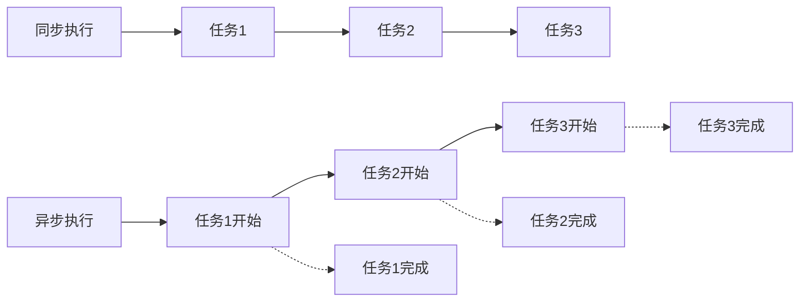

# JavaScript 异步基础

## 什么是异步编程？

在JavaScript中，异步编程是一种允许程序在等待某个操作完成的同时继续执行其他代码的编程方式。这与同步编程相反，在同步编程中，代码会按顺序执行，每个操作完成后才会执行下一个操作。

异步编程在JavaScript中尤为重要，因为JavaScript是单线程语言，如果所有操作都是同步的，那么耗时的操作（如网络请求或文件读取）会阻塞整个程序的执行。



## JavaScript 中的异步机制

JavaScript通过事件循环(Event Loop)来处理异步操作。以下是JavaScript中处理异步编程的主要方法：

1. 回调函数 (Callbacks)
2. Promise
3. Async/Await

让我们逐一了解这些方法。

## 回调函数 (Callbacks)

回调函数是JavaScript中最早用于处理异步操作的方式。简单来说，回调就是一个作为参数传递给另一个函数的函数，当某个操作完成时被调用。

### 基本示例

```javascript
function fetchData(callback) {
  // 模拟网络请求
  setTimeout(() => {
    const data = { name: "John", age: 30 };
    callback(data);
  }, 2000);
}

console.log("开始获取数据...");

fetchData((data) => {
  console.log("数据获取成功:", data);
});

console.log("请求已发送，等待数据返回...");
```

输出结果：
```
开始获取数据...
请求已发送，等待数据返回...
数据获取成功: { name: 'John', age: 30 }
```

### 回调地狱 (Callback Hell)

当需要执行多个依赖于前一个操作的异步操作时，使用回调函数可能导致代码嵌套过深，形成所谓的"回调地狱"。

```javascript
fetchUserData(userId, (userData) => {
  fetchUserPosts(userData.id, (posts) => {
    fetchPostComments(posts[0].id, (comments) => {
      fetchCommentAuthor(comments[0].authorId, (author) => {
        console.log(author);
        // 更多嵌套...
      });
    });
  });
});
```

:::caution 回调地狱问题
回调地狱使代码难以阅读、维护和调试。为了解决这个问题，ES6引入了Promise。
:::

## Promise

Promise是JavaScript中处理异步操作的一种方式，它代表一个异步操作的最终完成（或失败）及其结果值。Promise有三种状态：

- **待定（pending）**：初始状态，既没有被兑现，也没有被拒绝。
- **已兑现（fulfilled）**：操作成功完成。
- **已拒绝（rejected）**：操作失败。

### 创建Promise

```javascript
const myPromise = new Promise((resolve, reject) => {
  // 异步操作
  const success = true;
  
  if (success) {
    resolve("操作成功");  // 成功时调用
  } else {
    reject("操作失败");   // 失败时调用
  }
});
```

### 使用Promise

Promise提供了`.then()`和`.catch()`方法来处理成功和失败的情况：

```javascript
myPromise
  .then((result) => {
    console.log(result);  // "操作成功"
  })
  .catch((error) => {
    console.error(error); // 如果失败，打印"操作失败"
  });
```

### 链式调用

Promise的一个重要特性是可以链式调用，避免回调地狱：

```javascript
function fetchUserData(userId) {
  return new Promise((resolve, reject) => {
    // 模拟API调用
    setTimeout(() => {
      resolve({ id: userId, name: "用户" + userId });
    }, 1000);
  });
}

function fetchUserPosts(userId) {
  return new Promise((resolve, reject) => {
    setTimeout(() => {
      resolve(["文章1", "文章2", "文章3"]);
    }, 1000);
  });
}

fetchUserData(1)
  .then(user => {
    console.log("用户数据:", user);
    return fetchUserPosts(user.id);
  })
  .then(posts => {
    console.log("用户文章:", posts);
  })
  .catch(error => {
    console.error("发生错误:", error);
  });
```

输出结果：
```
用户数据: { id: 1, name: '用户1' }
用户文章: [ '文章1', '文章2', '文章3' ]
```

### Promise.all和Promise.race

- `Promise.all()`：等待所有Promise都完成（或第一个失败）
- `Promise.race()`：返回第一个完成（或失败）的Promise的结果

```javascript
const promise1 = new Promise(resolve => setTimeout(() => resolve("一"), 200));
const promise2 = new Promise(resolve => setTimeout(() => resolve("二"), 100));

Promise.all([promise1, promise2])
  .then(results => {
    console.log("所有Promise完成:", results); // ["一", "二"]
  });

Promise.race([promise1, promise2])
  .then(result => {
    console.log("最快的Promise完成:", result); // "二"
  });
```

## Async/Await

`async/await`是ES2017引入的语法糖，使异步代码看起来更像同步代码，可读性更高。

### 基本用法

```javascript
async function fetchData() {
  try {
    const response = await fetch('https://api.example.com/data');
    const data = await response.json();
    console.log(data);
    return data;
  } catch (error) {
    console.error("获取数据出错:", error);
  }
}

// 调用异步函数
fetchData().then(data => {
  console.log("处理返回的数据", data);
});
```

:::tip
`async`函数总是返回一个Promise，即使你在函数中直接返回一个值。
:::

### 使用async/await替代Promise链

前面使用Promise链的例子可以用async/await重写为：

```javascript
async function getUserAndPosts(userId) {
  try {
    const user = await fetchUserData(userId);
    console.log("用户数据:", user);
    
    const posts = await fetchUserPosts(user.id);
    console.log("用户文章:", posts);
  } catch (error) {
    console.error("发生错误:", error);
  }
}

getUserAndPosts(1);
```

### 并行执行异步操作

当多个异步操作之间没有依赖关系时，可以结合`Promise.all`和`async/await`并行执行它们：

```javascript
async function fetchMultipleData() {
  try {
    const [users, products] = await Promise.all([
      fetch('/api/users').then(res => res.json()),
      fetch('/api/products').then(res => res.json())
    ]);
    
    console.log("用户数据:", users);
    console.log("产品数据:", products);
  } catch (error) {
    console.error("获取数据失败:", error);
  }
}
```

## 实际案例：天气应用

以下是一个简单的天气应用示例，展示如何使用异步编程来获取和显示天气数据：

```javascript
// 使用回调函数的版本
function getWeatherWithCallback(city, callback) {
  console.log(`正在获取${city}的天气数据...`);
  // 模拟API请求
  setTimeout(() => {
    const weatherData = {
      city: city,
      temperature: Math.floor(Math.random() * 30),
      condition: ["晴朗", "多云", "雨天"][Math.floor(Math.random() * 3)]
    };
    callback(null, weatherData);
  }, 2000);
}

// 使用Promise的版本
function getWeatherWithPromise(city) {
  console.log(`正在获取${city}的天气数据...`);
  return new Promise((resolve, reject) => {
    setTimeout(() => {
      const weatherData = {
        city: city,
        temperature: Math.floor(Math.random() * 30),
        condition: ["晴朗", "多云", "雨天"][Math.floor(Math.random() * 3)]
      };
      resolve(weatherData);
    }, 2000);
  });
}

// 使用async/await的版本
async function getWeatherReport(city) {
  try {
    const data = await getWeatherWithPromise(city);
    console.log(`${data.city}的天气: ${data.temperature}°C, ${data.condition}`);
    
    // 基于天气条件提供建议
    if (data.condition === "雨天") {
      console.log("别忘了带伞！");
    } else if (data.temperature > 25) {
      console.log("天气炎热，记得补充水分！");
    }
    
    return data;
  } catch (error) {
    console.error("获取天气数据失败:", error);
  }
}

// 使用示例
getWeatherWithCallback("北京", (err, data) => {
  if (err) {
    console.error(err);
    return;
  }
  console.log(`${data.city}的天气: ${data.temperature}°C, ${data.condition}`);
});

getWeatherWithPromise("上海")
  .then(data => {
    console.log(`${data.city}的天气: ${data.temperature}°C, ${data.condition}`);
  })
  .catch(err => {
    console.error(err);
  });

getWeatherReport("广州");
```

## 总结

JavaScript的异步编程是前端开发中的关键概念，它允许我们在执行耗时操作时不阻塞主线程。

- **回调函数**是最基本的异步处理方式，但可能导致回调地狱
- **Promise**提供了更优雅的解决方案，支持链式调用和错误处理
- **async/await**是构建在Promise之上的语法糖，使异步代码更易读、更易维护

随着你对JavaScript的深入学习，熟练掌握这些异步编程技术将帮助你构建更高效、响应更快的应用程序。

## 练习

1. 创建一个函数，使用Promise模拟一个延迟3秒的异步操作
2. 实现一个函数，依次执行三个异步操作，每个操作都依赖于前一个操作的结果
3. 使用`Promise.all()`并行获取三个不同API的数据
4. 改写一个使用回调函数的代码，将其转换为使用async/await

## 进一步学习资源

- [MDN Web Docs: 使用Promise](https://developer.mozilla.org/zh-CN/docs/Web/JavaScript/Guide/Using_promises)
- [MDN Web Docs: async函数](https://developer.mozilla.org/zh-CN/docs/Web/JavaScript/Reference/Statements/async_function)
- [JavaScript.info: Promise](https://zh.javascript.info/promise-basics)
- [JavaScript.info: Async/await](https://zh.javascript.info/async-await)