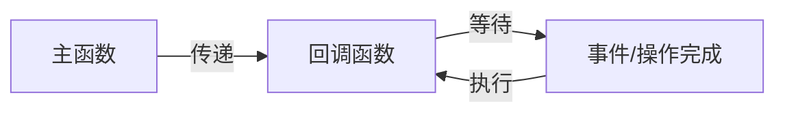

# JavaScript 回调模式

在JavaScript编程世界中，回调模式是最基础也是最常见的异步编程方式之一。作为初学者，掌握回调函数的工作原理及应用场景对于理解JavaScript的异步特性至关重要。本文将深入浅出地介绍回调模式的概念、用法以及常见问题。

## 什么是回调函数？

回调函数是一个作为参数传递给另一个函数的函数，它在某个操作完成后被调用执行。简单来说，回调函数就是"等待被调用的函数"。



## 回调函数基础

### 同步回调示例

让我们从一个简单的同步回调示例开始：

```javascript
function greeting(name) {
  console.log(`Hello, ${name}!`);
}

function processUserInput(callback) {
  const name = "John Doe";  // 假设这是用户输入
  callback(name);
}

processUserInput(greeting);
```

输出：
```
Hello, John Doe!
```

在这个例子中，`greeting`函数作为回调函数传递给`processUserInput`函数。

### 异步回调示例

回调最常见的应用场景是处理异步操作：

```javascript
function fetchData(callback) {
  console.log("开始获取数据...");
  
  // 模拟网络请求延迟
  setTimeout(() => {
    const data = { id: 1, name: "JavaScript回调模式" };
    console.log("数据获取完成!");
    callback(data);
  }, 2000);
  
  console.log("fetchData函数执行完毕");
}

console.log("程序开始");

fetchData((data) => {
  console.log("收到的数据:", data);
});

console.log("程序继续执行其他任务");
```

输出：
```
程序开始
开始获取数据...
fetchData函数执行完毕
程序继续执行其他任务
数据获取完成!
收到的数据: { id: 1, name: 'JavaScript回调模式' }
```

:::tip
注意输出顺序！这展示了JavaScript的异步特性。虽然`fetchData`中的回调被延迟执行，但主程序继续执行而不会被阻塞。
:::

## 回调函数的应用场景

### 1. 事件处理

在浏览器环境中，回调函数常用于事件处理：

```javascript
document.getElementById("myButton").addEventListener("click", function(event) {
  console.log("按钮被点击了!");
});
```

### 2. 数据请求

在进行网络请求时，我们需要等待服务器响应，这是回调函数的典型应用场景：

```javascript
function fetchUserData(userId, callback) {
  // 模拟API请求
  setTimeout(() => {
    const userData = {
      id: userId,
      name: "用户_" + userId,
      email: `user${userId}@example.com`
    };
    callback(null, userData); // 第一个参数通常用于传递错误
  }, 1000);
}

fetchUserData(123, (error, user) => {
  if (error) {
    console.error("获取用户数据失败:", error);
    return;
  }
  console.log("用户数据:", user);
});
```

### 3. 文件操作

在Node.js环境中，文件操作通常是异步的，需要使用回调函数：

```javascript
const fs = require('fs');

fs.readFile('example.txt', 'utf8', (err, data) => {
  if (err) {
    console.error('读取文件失败:', err);
    return;
  }
  console.log('文件内容:', data);
});
```

## 错误处理

在使用回调函数时，正确处理错误是非常重要的。JavaScript中常用的错误处理模式是"错误优先"回调：

```javascript
function performTask(input, callback) {
  // 验证输入
  if (!input) {
    return callback(new Error("输入不能为空"));
  }
  
  // 执行任务
  setTimeout(() => {
    const result = input.toUpperCase();
    callback(null, result);  // 成功时，第一个参数为null
  }, 1000);
}

performTask("hello", (err, result) => {
  if (err) {
    console.error("任务失败:", err.message);
    return;
  }
  console.log("任务结果:", result);
});

performTask("", (err, result) => {
  if (err) {
    console.error("任务失败:", err.message);
    return;
  }
  console.log("任务结果:", result);
});
```

输出：
```
任务失败: 输入不能为空
任务结果: HELLO
```

## 回调地狱

随着代码复杂度提高，多层嵌套的回调函数会导致所谓的"回调地狱"(Callback Hell)或"厄运金字塔"(Pyramid of Doom)：

```javascript
getData(function(a) {
  getMoreData(a, function(b) {
    getEvenMoreData(b, function(c) {
      getYetEvenMoreData(c, function(d) {
        getFinalData(d, function(finalData) {
          console.log(finalData);
        });
      });
    });
  });
});
```

:::caution
这种多层嵌套的代码难以维护和理解，会大大降低代码质量。
:::

## 解决回调地狱问题

### 1. 命名函数

使用命名函数可以减少嵌套层级：

```javascript
function handleFinalData(finalData) {
  console.log(finalData);
}

function handleD(d) {
  getFinalData(d, handleFinalData);
}

function handleC(c) {
  getYetEvenMoreData(c, handleD);
}

function handleB(b) {
  getEvenMoreData(b, handleC);
}

function handleA(a) {
  getMoreData(a, handleB);
}

getData(handleA);
```

### 2. 模块化

将复杂逻辑分解成独立的模块：

```javascript
function fetchUserProfile(userId, callback) {
  fetchUser(userId, function(err, user) {
    if (err) return callback(err);
    
    fetchUserPosts(user.id, function(err, posts) {
      if (err) return callback(err);
      
      // 组合数据
      user.posts = posts;
      callback(null, user);
    });
  });
}

// 使用
fetchUserProfile(123, function(err, profile) {
  if (err) {
    console.error(err);
    return;
  }
  console.log(profile);
});
```

### 3. 使用Promise或Async/Await

更现代的方法是使用Promise或Async/Await语法（我们将在后续章节中详细介绍）：

```javascript
// 使用Promise改写
function fetchUserPromise(userId) {
  return new Promise((resolve, reject) => {
    fetchUser(userId, (err, user) => {
      if (err) reject(err);
      else resolve(user);
    });
  });
}

// 使用async/await (更现代的方法)
async function getUserProfile(userId) {
  try {
    const user = await fetchUserPromise(userId);
    const posts = await fetchUserPostsPromise(user.id);
    return { ...user, posts };
  } catch (error) {
    console.error("获取用户资料失败:", error);
  }
}
```

## 实际应用案例

### 案例1：表单提交与验证

```javascript
function validateEmail(email) {
  const regex = /^[^\s@]+@[^\s@]+\.[^\s@]+$/;
  return regex.test(email);
}

function submitForm(formData, onSuccess, onError) {
  // 表单验证
  if (!formData.email || !validateEmail(formData.email)) {
    onError(new Error("邮箱格式不正确"));
    return;
  }
  
  if (!formData.password || formData.password.length < 8) {
    onError(new Error("密码至少需要8个字符"));
    return;
  }
  
  // 模拟向服务器提交数据
  setTimeout(() => {
    // 假设提交成功
    onSuccess({ message: "注册成功!" });
  }, 1500);
}

// 使用示例
const formData = {
  email: "user@example.com",
  password: "password123"
};

submitForm(
  formData,
  (result) => {
    console.log(result.message);
    // 可以进行页面跳转或显示成功消息
  },
  (error) => {
    console.error(error.message);
    // 显示错误信息
  }
);
```

### 案例2：图片加载器

```javascript
function loadImage(url, onSuccess, onError) {
  const img = new Image();
  
  img.onload = function() {
    onSuccess(img);
  };
  
  img.onerror = function() {
    onError(new Error(`加载图片失败: ${url}`));
  };
  
  img.src = url;
}

// 使用示例
function displayGallery(imageUrls) {
  let loadedCount = 0;
  const gallery = document.getElementById('gallery');
  
  imageUrls.forEach(url => {
    loadImage(
      url,
      (img) => {
        gallery.appendChild(img);
        loadedCount++;
        
        if (loadedCount === imageUrls.length) {
          console.log("所有图片加载完成!");
        }
      },
      (error) => {
        console.error(error.message);
        loadedCount++;
        
        // 添加一个占位符
        const placeholder = document.createElement('div');
        placeholder.className = 'placeholder';
        placeholder.textContent = '图片加载失败';
        gallery.appendChild(placeholder);
        
        if (loadedCount === imageUrls.length) {
          console.log("所有图片处理完成!");
        }
      }
    );
  });
}
```

## 最佳实践

使用回调函数时，请遵循这些最佳实践：

1. **始终处理错误**：使用错误优先回调模式，并确保处理所有可能的错误情况。

2. **避免深层嵌套**：当需要多个连续的异步操作时，考虑使用命名函数或Promise等替代方案。

3. **保持一致性**：在整个代码库中使用一致的回调模式和错误处理方式。

4. **参数命名清晰**：使用描述性的参数名称，如`onSuccess`、`onError`，而不是简单的`callback`。

5. **异步一致性**：确保回调总是异步调用，避免混合同步和异步调用方式。

6. **避免过多参数**：如果需要传递多个参数给回调函数，考虑将它们组织为一个对象。

## 总结

回调函数是JavaScript异步编程的基础，它们允许我们在操作完成后执行代码。虽然回调模式简单直观，但在复杂应用中可能导致回调地狱问题。理解回调的工作原理和最佳实践对于编写高质量的JavaScript代码至关重要。

随着JavaScript的发展，我们有了更多处理异步操作的工具，如Promise和Async/Await，它们建立在回调概念之上，但提供了更优雅的语法和更强的功能。不过，牢固掌握回调模式仍然是成为优秀JavaScript开发者的基础。

## 练习

1. 创建一个模拟用户登录的函数，使用回调函数处理成功和失败的情况。
2. 实现一个简单的计时器函数，可以在指定时间后执行回调函数。
3. 编写一个函数，依次读取多个文件，并在全部读取完成后执行回调函数。
4. 尝试重构一段回调地狱代码，使用命名函数或其他技术使其更加可读。

## 附加资源

- MDN Web Docs: [回调函数](https://developer.mozilla.org/zh-CN/docs/Glossary/Callback_function)
- JavaScript.info: [Introduction to callbacks](https://javascript.info/callbacks)
- Eloquent JavaScript: [异步编程](https://eloquentjavascript.net/11_async.html)

在下一章中，我们将探讨如何使用Promise来改进异步代码的组织方式，有效解决回调地狱问题。