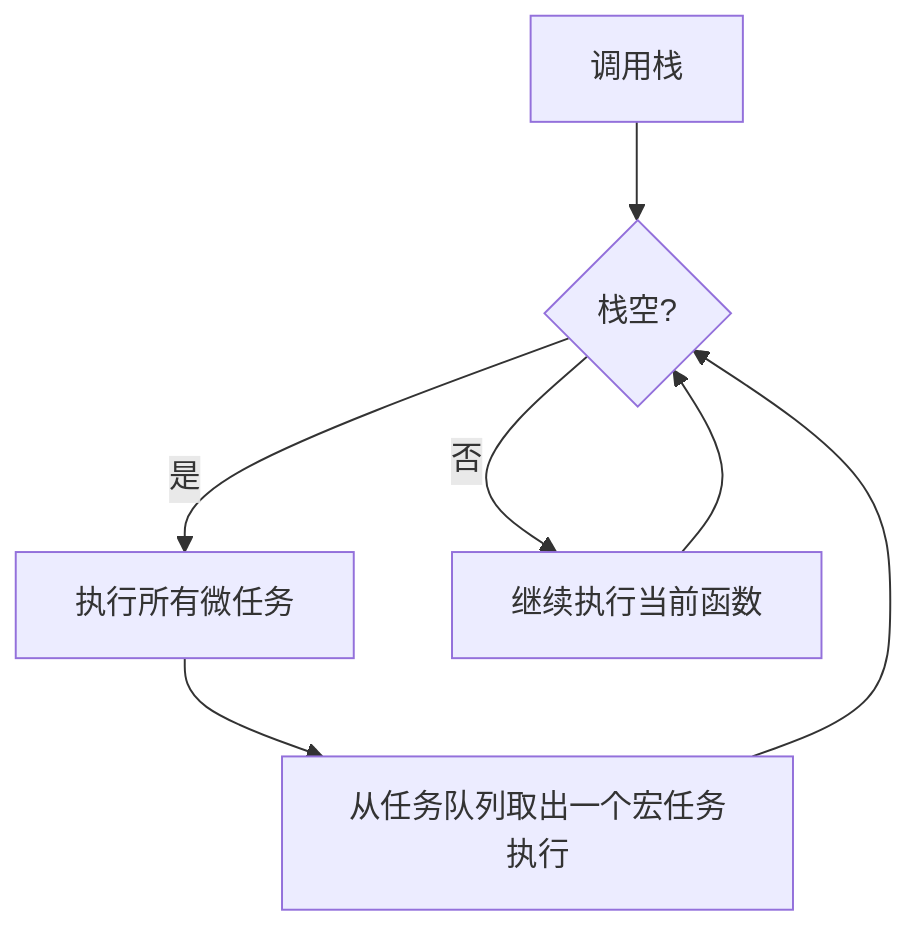
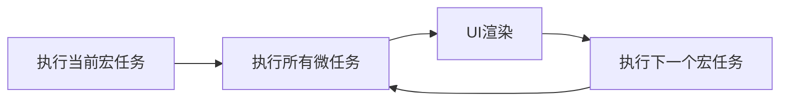

# JavaScript 事件循环

## 介绍

JavaScript是一种单线程语言，这意味着它一次只能执行一个操作。但在网页开发中，我们经常需要处理多个任务，比如用户交互、数据获取和计时器等。那么JavaScript如何在单线程环境下处理这些并发操作呢？答案就是**事件循环(Event Loop)**。

事件循环是JavaScript运行时环境(浏览器或Node.js)提供的一种机制，帮助处理异步操作，使JavaScript能够非阻塞地执行代码。理解事件循环对于编写高效、无阻塞的JavaScript代码至关重要。

## JavaScript 的执行环境

在深入事件循环之前，我们需要了解JavaScript的执行环境包含以下几个关键部分：

1. **调用栈(Call Stack)**：追踪当前正在执行的函数
2. **任务队列(Task Queue)**：存放待执行的宏任务(macrotasks)
3. **微任务队列(Microtask Queue)**：存放待执行的微任务(microtasks)
4. **事件循环(Event Loop)**：协调这些组件，决定何时执行哪些代码



## 调用栈

调用栈是JavaScript引擎跟踪函数执行的机制。当我们调用一个函数时，它会被添加(推入)到栈顶；当函数执行完成时，它会从栈中移除(弹出)。

让我们看一个简单的例子：

```javascript
function multiply(a, b) {
  return a * b;
}

function calculate() {
  const result = multiply(5, 3);
  console.log(result);
}

calculate();
```

执行过程如下：
1. `calculate()` 被推入调用栈
2. `calculate` 内部调用 `multiply(5, 3)`，所以 `multiply` 被推入栈顶
3. `multiply` 计算完成返回结果，从栈中弹出
4. `calculate` 继续执行，调用 `console.log()`
5. `console.log()` 执行完成后弹出栈
6. `calculate` 执行完成，从栈中弹出

## 宏任务(Macrotasks)

宏任务代表了大部分的异步操作，包括：
- `setTimeout`
- `setInterval`
- `setImmediate`(Node.js环境)
- I/O操作
- UI渲染
- 事件回调

这些任务会被添加到任务队列中，等待事件循环将它们移到调用栈中执行。

```javascript
console.log('开始');

setTimeout(() => {
  console.log('定时器回调');
}, 0);

console.log('结束');
```

输出结果：
```
开始
结束
定时器回调
```

虽然定时器设置为0毫秒，但它仍然作为宏任务被添加到任务队列，要等到当前执行栈清空后才会执行。

## 微任务(Microtasks)

微任务是另一种类型的异步任务，它们比宏任务具有更高的优先级。每当一个宏任务执行完毕，JavaScript引擎会清空整个微任务队列，然后再执行下一个宏任务。

常见的微任务包括：
- Promise回调 (`.then()`, `.catch()`, `.finally()`)
- `queueMicrotask()`
- `MutationObserver`
- `process.nextTick`(Node.js环境)

让我们看一个包含宏任务和微任务的例子：

```javascript
console.log('1. 脚本开始');

setTimeout(() => {
  console.log('2. 宏任务 - 定时器回调');
}, 0);

Promise.resolve()
  .then(() => {
    console.log('3. 微任务 - Promise回调');
  });

console.log('4. 脚本结束');
```

输出结果：
```
1. 脚本开始
4. 脚本结束
3. 微任务 - Promise回调
2. 宏任务 - 定时器回调
```

:::note
注意Promise回调在setTimeout回调之前执行，这是因为微任务队列会在每个宏任务执行完成后立即清空。
:::

## 事件循环详解

现在让我们更深入地了解事件循环的工作流程：

1. 执行全局JavaScript代码(第一个宏任务)
2. 检查调用栈是否为空
3. 如果调用栈为空，检查微任务队列
4. 执行所有微任务直到微任务队列为空
5. 执行下一个宏任务(从任务队列中取出)
6. 回到步骤2，重复循环



## 复杂示例

让我们通过一个更复杂的例子来理解事件循环：

```javascript
console.log('1. 脚本开始');

setTimeout(() => {
  console.log('2. 第一个宏任务(setTimeout)');
  
  Promise.resolve().then(() => {
    console.log('3. 第一个宏任务中的微任务');
  });
}, 0);

Promise.resolve().then(() => {
  console.log('4. 第一个微任务');
  
  setTimeout(() => {
    console.log('5. 微任务中的宏任务');
  }, 0);
});

Promise.resolve().then(() => {
  console.log('6. 第二个微任务');
});

console.log('7. 脚本结束');
```

输出结果：
```
1. 脚本开始
7. 脚本结束
4. 第一个微任务
6. 第二个微任务
2. 第一个宏任务(setTimeout)
3. 第一个宏任务中的微任务
5. 微任务中的宏任务
```

让我们分析这个执行过程：

1. 同步执行脚本，输出"1. 脚本开始"
2. 遇到`setTimeout`，将其回调函数加入宏任务队列
3. 遇到第一个`Promise.then`，将其回调函数加入微任务队列
4. 遇到第二个`Promise.then`，将其回调函数加入微任务队列
5. 输出"7. 脚本结束"，同步脚本执行完毕(第一个宏任务完成)
6. 检查微任务队列，执行第一个微任务，输出"4. 第一个微任务"，并将新的`setTimeout`加入宏任务队列
7. 继续执行第二个微任务，输出"6. 第二个微任务"
8. 微任务队列清空，取出宏任务队列中的第一个任务(第一个setTimeout回调)
9. 执行该宏任务，输出"2. 第一个宏任务(setTimeout)"，并将新的Promise回调加入微任务队列
10. 该宏任务执行完毕，检查微任务队列，执行微任务，输出"3. 第一个宏任务中的微任务"
11. 微任务队列清空，取出宏任务队列中的下一个任务(第二个setTimeout回调)
12. 执行该宏任务，输出"5. 微任务中的宏任务"

## 实际应用场景

### 场景1：点击事件和数据获取

```javascript
const button = document.querySelector('#loadDataButton');

button.addEventListener('click', () => {
  console.log('按钮被点击');
  
  // 模拟API请求
  fetch('https://api.example.com/data')
    .then(response => response.json())
    .then(data => {
      console.log('数据获取成功');
      updateUI(data); // 更新UI的函数
    })
    .catch(error => {
      console.error('获取数据失败', error);
    });
    
  console.log('请求已发送');
});

function updateUI(data) {
  // 更新UI的代码
  console.log('UI已更新');
}
```

当用户点击按钮时：
1. 点击事件作为宏任务被处理
2. 输出"按钮被点击"
3. `fetch` API发送网络请求，这是一个异步操作
4. 输出"请求已发送"
5. 当网络请求完成，`.then` 回调被添加到微任务队列
6. 处理JSON数据，并将下一个 `.then` 添加到微任务队列
7. 数据处理完成，输出"数据获取成功"
8. 调用 `updateUI` 函数
9. 输出"UI已更新"

### 场景2：定时器与动画

```javascript
function animateElement() {
  let position = 0;
  const element = document.getElementById('movingElement');
  
  function move() {
    position += 5;
    element.style.left = position + 'px';
    
    if (position < 300) {
      // 使用setTimeout创建下一帧
      setTimeout(move, 16); // 约60fps
    }
  }
  
  move();
}

// 启动动画
document.getElementById('startButton').addEventListener('click', animateElement);
```

这个例子中：
1. 点击事件触发 `animateElement` 函数
2. `move` 函数更新元素位置
3. 如果动画未完成，使用 `setTimeout` 安排下一次更新
4. 每个 `setTimeout` 回调都是一个新的宏任务

:::tip
现代浏览器提供了专门的 `requestAnimationFrame` API，它比 `setTimeout` 更适合创建动画，因为它会在浏览器的重绘之前调用回调函数，从而实现更流畅的动画。
:::

## 事件循环与浏览器渲染

浏览器的渲染操作(重排和重绘)通常发生在宏任务之间，在微任务队列清空之后。这意味着：

1. 执行一个宏任务
2. 执行所有微任务
3. 执行UI渲染(如果需要)
4. 执行下一个宏任务
5. ...重复上述过程

这就是为什么处理复杂DOM操作时，应该考虑使用微任务或下一个宏任务，以确保DOM已经更新。

## Node.js中的事件循环

虽然Node.js的事件循环基于相同的概念，但它的实现与浏览器略有不同。Node.js的事件循环有多个阶段，每个阶段负责不同类型的操作：

1. **timers**：处理 `setTimeout` 和 `setInterval` 回调
2. **pending callbacks**：执行延迟到下一个循环迭代的I/O回调
3. **idle, prepare**：仅内部使用
4. **poll**：获取新的I/O事件，执行I/O相关回调
5. **check**：执行 `setImmediate()` 回调
6. **close callbacks**：执行关闭事件的回调，如 `socket.on('close', ...)`

还有一个重要的区别是，Node.js中的 `process.nextTick()` 优先级高于所有微任务，它会在当前操作完成后立即执行，即使还有其他微任务等待执行。

## 总结

JavaScript事件循环是一种强大的机制，使得单线程的JavaScript能够处理异步操作：

- JavaScript运行时维护一个调用栈、一个宏任务队列和一个微任务队列
- 事件循环不断检查调用栈，并决定执行哪些任务
- 微任务优先级高于宏任务，每当宏任务执行完毕，会清空所有微任务
- 常见的宏任务包括：`setTimeout`、`setInterval`、事件回调等
- 常见的微任务包括：Promise回调、`queueMicrotask()`等

理解事件循环有助于编写更高效的异步JavaScript代码，避免阻塞操作，并更好地控制代码的执行顺序。

## 练习与深入学习

1. **练习题**: 尝试预测以下代码的输出顺序:
   ```javascript
   console.log('开始');
   
   setTimeout(() => {
     console.log('setTimeout 1');
     Promise.resolve().then(() => {
       console.log('Promise在setTimeout中');
     });
   }, 0);
   
   Promise.resolve().then(() => {
     console.log('Promise 1');
     setTimeout(() => {
       console.log('setTimeout在Promise中');
     }, 0);
   });
   
   console.log('结束');
   ```

2. **实验**: 创建一个具有多个嵌套Promise和setTimeout的程序，观察执行顺序。

3. **进阶学习资源**:
   - [Jake Archibald: In The Loop](https://www.youtube.com/watch?v=cCOL7MC4Pl0) - 深入解释事件循环
   - [MDN: 并发模型与事件循环](https://developer.mozilla.org/zh-CN/docs/Web/JavaScript/EventLoop)
   - [Philip Roberts: 事件循环可视化工具](http://latentflip.com/loupe/)

通过深入理解事件循环，你将能够更好地编写异步JavaScript代码，处理复杂的计时和交互场景，并优化应用性能。