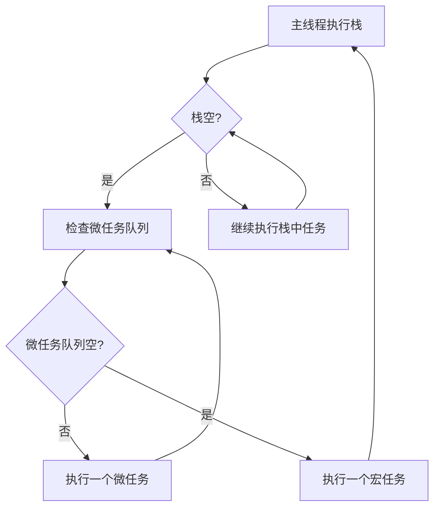

# JavaScript 宏任务微任务

在JavaScript的异步编程世界中，理解"宏任务"(Macrotask)和"微任务"(Microtask)的概念至关重要。这些概念帮助我们理解JavaScript引擎如何安排和执行各种异步操作，从而写出更高效、可预测的代码。

## 什么是事件循环

在深入宏任务和微任务之前，我们需要先了解JavaScript的事件循环机制。

JavaScript是单线程语言，所有代码都在一个主线程上执行。为了避免阻塞主线程，JavaScript使用事件循环来处理异步操作。



## 宏任务与微任务定义

### 宏任务 (Macrotask)

宏任务代表由宿主环境(浏览器、Node.js等)提供的异步API所产生的任务。

常见的宏任务包括：
- `setTimeout`
- `setInterval`
- `setImmediate` (Node.js环境)
- I/O操作
- UI渲染
- `requestAnimationFrame`

### 微任务 (Microtask)

微任务通常是由JavaScript引擎本身产生的异步任务。

常见的微任务包括：
- `Promise.then/catch/finally`
- `queueMicrotask()`
- `MutationObserver`
- `process.nextTick` (Node.js环境)

## 执行顺序规则

JavaScript引擎遵循以下规则处理任务：

1. 执行当前的同步代码（主线程上的代码）
2. 检查微任务队列，执行所有微任务直至队列清空
3. 执行一个宏任务
4. 返回步骤2，如此循环往复

:::tip 重要规则
微任务总是在下一个宏任务之前执行完毕！即使在微任务执行过程中又产生了新的微任务，也会一并执行完毕。
:::

## 代码示例详解

### 基础示例

让我们通过一个简单的例子来理解执行顺序：

```javascript
console.log('1 - 同步代码开始');

setTimeout(() => {
  console.log('2 - 这是一个宏任务');
}, 0);

Promise.resolve().then(() => {
  console.log('3 - 这是一个微任务');
});

console.log('4 - 同步代码结束');
```

输出结果：
```
1 - 同步代码开始
4 - 同步代码结束
3 - 这是一个微任务
2 - 这是一个宏任务
```

**解释**：
1. 首先执行同步代码，输出"1 - 同步代码开始"
2. 遇到`setTimeout`，将回调函数放入宏任务队列
3. 遇到`Promise.then`，将回调函数放入微任务队列
4. 继续执行同步代码，输出"4 - 同步代码结束"
5. 同步代码执行完毕，检查微任务队列，执行所有微任务，输出"3 - 这是一个微任务"
6. 微任务队列清空后，执行宏任务队列中的一个任务，输出"2 - 这是一个宏任务"

### 复杂示例

来看一个更复杂的例子，特别是当微任务产生新的微任务时：

```javascript
console.log('1 - 脚本开始');

setTimeout(() => {
  console.log('2 - 宏任务1开始');
  Promise.resolve().then(() => {
    console.log('3 - 宏任务1中的微任务');
  });
  console.log('4 - 宏任务1结束');
}, 0);

Promise.resolve().then(() => {
  console.log('5 - 微任务1');
  Promise.resolve().then(() => {
    console.log('6 - 微任务1中的微任务');
  });
});

setTimeout(() => {
  console.log('7 - 宏任务2');
}, 0);

console.log('8 - 脚本结束');
```

输出结果：
```
1 - 脚本开始
8 - 脚本结束
5 - 微任务1
6 - 微任务1中的微任务
2 - 宏任务1开始
4 - 宏任务1结束
3 - 宏任务1中的微任务
7 - 宏任务2
```

**详细解释**：
1. 执行同步代码，输出"1 - 脚本开始"
2. 遇到第一个`setTimeout`，将其回调放入宏任务队列（宏任务1）
3. 遇到`Promise.then`，将其回调放入微任务队列（微任务1）
4. 遇到第二个`setTimeout`，将其回调放入宏任务队列（宏任务2）
5. 输出"8 - 脚本结束"
6. 同步代码执行完毕，检查微任务队列
7. 执行微任务1，输出"5 - 微任务1"
8. 微任务1中产生新的微任务（微任务1.1）
9. 执行微任务1.1，输出"6 - 微任务1中的微任务"
10. 微任务队列清空，执行第一个宏任务（宏任务1）
11. 输出"2 - 宏任务1开始"
12. 宏任务1中产生新的微任务
13. 输出"4 - 宏任务1结束"
14. 宏任务1执行完毕，检查微任务队列
15. 执行宏任务1产生的微任务，输出"3 - 宏任务1中的微任务"
16. 执行下一个宏任务（宏任务2），输出"7 - 宏任务2"

## 实际应用场景

### 场景1：UI更新优化

在Web开发中，我们常常需要在DOM操作后执行一些后续工作。使用微任务可以确保在浏览器重新渲染之前完成这些操作。

```javascript
// 不推荐的方式：可能导致多次重排重绘
function updateUI() {
  // 修改DOM
  document.getElementById('output').textContent = 'Loading...';
  
  // 添加更多DOM修改
  document.getElementById('status').style.display = 'block';
}

// 推荐的方式：批量DOM操作
function updateUIOptimized() {
  // 使用微任务批量处理DOM操作
  queueMicrotask(() => {
    document.getElementById('output').textContent = 'Loading...';
    document.getElementById('status').style.display = 'block';
    // 所有DOM修改都会在下一次渲染前一起应用
  });
}
```

### 场景2：异步操作的顺序控制

理解宏任务和微任务可以帮助我们控制异步操作的执行时机：

```javascript
function loadData() {
  console.log('1. 开始加载数据');
  
  // 使用宏任务模拟网络请求
  setTimeout(() => {
    console.log('3. 数据加载完成');
    processData();
  }, 1000);
  
  // 使用微任务准备数据处理环境
  Promise.resolve().then(() => {
    console.log('2. 准备数据处理环境');
  });
}

function processData() {
  console.log('4. 处理数据');
}

loadData();
```

输出结果：
```
1. 开始加载数据
2. 准备数据处理环境
// 等待约1000ms
3. 数据加载完成
4. 处理数据
```

这种模式确保了数据处理环境在实际数据到达之前就已经准备就绪。

## 常见问题与陷阱

### 嵌套的setTimeout

```javascript
console.log('开始');

setTimeout(() => {
  console.log('宏任务1');
  setTimeout(() => {
    console.log('宏任务2');
  }, 0);
}, 0);

Promise.resolve().then(() => {
  console.log('微任务1');
});

console.log('结束');
```

输出结果：
```
开始
结束
微任务1
宏任务1
宏任务2
```

嵌套的`setTimeout`即使延时为0，也会在下一个事件循环中执行，因为它是一个新的宏任务。

### Promise链与微任务队列

```javascript
console.log('开始');

Promise.resolve()
  .then(() => {
    console.log('微任务1');
    return Promise.resolve('嵌套Promise');
  })
  .then(value => {
    console.log('微任务2', value);
  });

setTimeout(() => {
  console.log('宏任务');
}, 0);

console.log('结束');
```

输出结果：
```
开始
结束
微任务1
微任务2 嵌套Promise
宏任务
```

Promise链中的每个`.then`都会创建一个新的微任务，但它们会按顺序执行，且所有微任务都会在下一个宏任务之前执行完毕。

## 实践建议

1. **理解执行顺序**：总是先执行所有微任务，再执行宏任务。

2. **选择合适的任务类型**：
   - 使用微任务进行DOM操作之后的后续处理
   - 使用宏任务来延迟执行或分散CPU密集型任务

3. **调试技巧**：使用`console.log`标记代码执行顺序，帮助理解异步流程。

4. **避免过度嵌套**：复杂的异步嵌套会导致代码难以维护和理解。

## 总结

宏任务和微任务是JavaScript事件循环中的核心概念：

- **宏任务**是由宿主环境提供的任务（如setTimeout、I/O操作）
- **微任务**是由JavaScript引擎提供的任务（如Promise回调、queueMicrotask）
- 执行顺序是：同步代码 → 微任务 → 宏任务 → 微任务 → 宏任务...
- 理解这一机制可以帮助你写出更可预测、高效的异步代码

掌握宏任务和微任务的概念是成为JavaScript高级开发者的关键一步。通过这些知识，你可以更好地控制代码的执行时机，优化应用性能，并避免常见的异步编程陷阱。

## 练习题

1. 写出以下代码的输出顺序：
```javascript
console.log('start');
setTimeout(() => console.log('setTimeout'), 0);
Promise.resolve().then(() => console.log('promise1'));
Promise.resolve().then(() => {
  console.log('promise2');
  Promise.resolve().then(() => console.log('promise3'));
});
console.log('end');
```

2. 修改下面的代码，使输出顺序为：'start', 'end', 'promise', 'setTimeout'
```javascript
console.log('start');
setTimeout(() => console.log('setTimeout'), 0);
// 在这里添加代码
console.log('end');
```

## 延伸阅读

- [MDN Web Docs: 并发模型与事件循环](https://developer.mozilla.org/zh-CN/docs/Web/JavaScript/EventLoop)
- [Jake Archibald: 深入理解JavaScript事件循环](https://jakearchibald.com/2015/tasks-microtasks-queues-and-schedules/)
- [Node.js官方文档: 事件循环、定时器和process.nextTick()](https://nodejs.org/zh-cn/docs/guides/event-loop-timers-and-nexttick)

:::tip 思考
试着在浏览器控制台中运行本文中的示例，观察实际输出。再尝试修改代码，预测输出结果，然后验证你的理解是否正确。理解宏任务微任务的执行顺序会让你在处理复杂异步场景时游刃有余。
:::