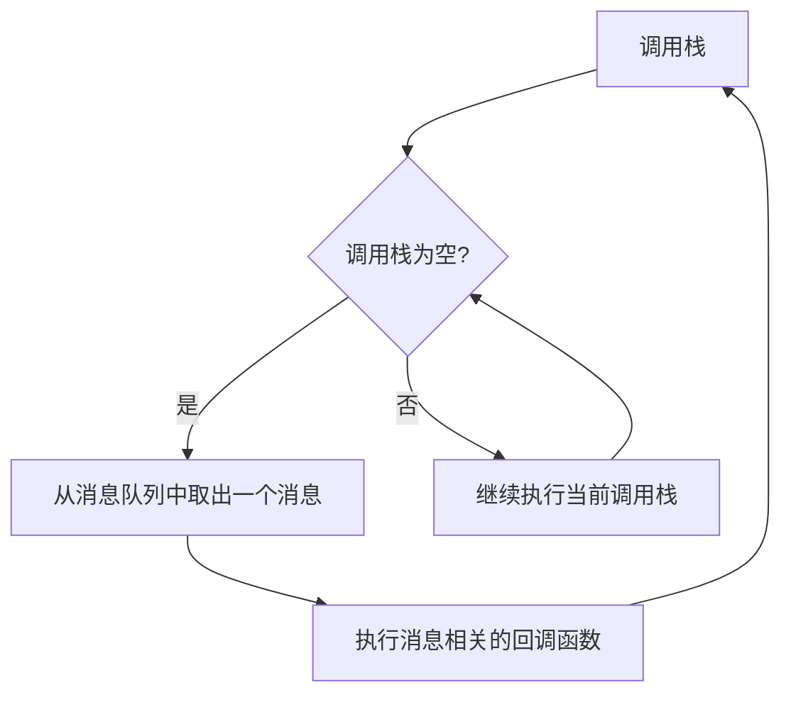

# JavaScript 并发模型

## 引言

JavaScript是一门**单线程**的语言，这意味着一次只能执行一个操作。但在现代Web应用中，我们常常需要处理多个任务，如用户交互、网络请求、计时器等。那么JavaScript是如何在单线程环境下处理这些并发操作的呢？答案就在于它的**并发模型**和**事件循环**机制。

在本教程中，我们将探索JavaScript的并发模型及其核心组件，理解它如何在不阻塞主线程的情况下处理异步操作，以及这一模型如何影响我们的编程方式。

## JavaScript 的单线程特性

JavaScript被设计为单线程语言，主要是因为它的主要应用场景是处理用户交互和DOM操作。如果JavaScript是多线程的，那么可能会出现多个线程同时修改DOM的情况，导致复杂的并发问题。

```javascript
console.log("我是第一行");
console.log("我是第二行");
console.log("我是第三行");
```

上面的代码会按顺序执行，输出结果为：

```
我是第一行
我是第二行
我是第三行
```

单线程意味着JavaScript代码的执行是**按顺序**进行的，一次只能执行一个操作。如果某个操作需要花费较长时间，后续的操作就必须等待。

## JavaScript 的并发模型

尽管JavaScript是单线程的，但它通过**事件循环**（Event Loop）和**非阻塞I/O**模型实现了并发。

### 事件循环

事件循环是JavaScript并发模型的核心，它允许JavaScript在执行异步操作时不会被阻塞。

:::note
事件循环负责收集和处理事件，并在适当的时候执行回调函数。
:::

下面是事件循环的简化图示：



### 调用栈（Call Stack）

调用栈是JavaScript引擎跟踪正在执行的函数的机制。当函数被调用时，它会被添加到调用栈的顶部；当函数执行完毕时，会从调用栈中移除。

```javascript
function multiply(a, b) {
    return a * b;
}

function square(n) {
    return multiply(n, n);
}

function printSquare(n) {
    const result = square(n);
    console.log(result);
}

printSquare(5);  // 输出: 25
```

当执行上面的代码时，调用栈的变化如下：

1. 首先，`printSquare(5)` 被调用，加入调用栈
2. `printSquare` 内部调用 `square(5)`，加入调用栈
3. `square` 内部调用 `multiply(5, 5)`，加入调用栈
4. `multiply` 计算结果并返回 25，从调用栈移除
5. `square` 接收返回值并返回 25，从调用栈移除
6. `printSquare` 调用 `console.log(25)`，加入调用栈
7. `console.log` 执行完毕，从调用栈移除
8. `printSquare` 执行完毕，从调用栈移除

### 消息队列（Message Queue）和任务队列

JavaScript的并发模型还包括消息队列（或事件队列），它存储待处理的消息（如事件、回调函数等）。当调用栈为空时，事件循环会从消息队列中取出第一个消息，并将其处理。

JavaScript区分两种类型的任务队列：

1. **宏任务队列（Macrotask Queue）**：包含诸如 `setTimeout`, `setInterval`, I/O, UI渲染等任务
2. **微任务队列（Microtask Queue）**：包含诸如 Promise 回调, `process.nextTick()` 等任务

:::tip
微任务总是在当前宏任务完成后、下一个宏任务开始前执行。
:::

## 异步操作

理解了JavaScript的并发模型，接下来我们来看几种常见的异步操作机制：

### 回调函数（Callbacks）

回调函数是最基础的异步处理方式。它是一个作为参数传入另一个函数，并在适当的时机被调用的函数。

```javascript
console.log("开始");

setTimeout(() => {
    console.log("两秒后执行");
}, 2000);

console.log("结束");
```

输出结果：
```
开始
结束
两秒后执行
```

### Promise

Promise 是ES6引入的更强大的异步处理机制，用于处理异步操作的最终结果（完成或失败）。

```javascript
console.log("开始");

const myPromise = new Promise((resolve, reject) => {
    setTimeout(() => {
        resolve("操作成功!");
    }, 2000);
});

myPromise.then(result => {
    console.log(result);
}).catch(error => {
    console.error(error);
});

console.log("结束");
```

输出结果：
```
开始
结束
操作成功!
```

### Async/Await

Async/Await 是基于Promise的语法糖，使异步代码看起来更像同步代码，更容易理解和维护。

```javascript
function delay(ms) {
    return new Promise(resolve => setTimeout(resolve, ms));
}

async function example() {
    console.log("开始");
    await delay(2000);
    console.log("两秒后执行");
    console.log("结束");
}

example();
```

输出结果：
```
开始
两秒后执行
结束
```

## JavaScript 并发模型实际案例

### 案例1: UI更新与数据获取

在Web应用中，我们常常需要从服务器获取数据并更新UI。如果这是同步操作，界面会在数据获取期间冻结。

```javascript
// 不推荐的同步方式（仅作示例）
function getFetchDataSync() {
    // 假设这是一个同步HTTP请求
    // 在真实情况下，这会阻塞UI线程
    const response = someSyncHttpRequest('https://api.example.com/data');
    return response.data;
}

// 使用异步方式
async function fetchDataAsync() {
    try {
        // 显示加载指示器
        document.getElementById('loading').style.display = 'block';
        
        // 发起异步请求
        const response = await fetch('https://api.example.com/data');
        const data = await response.json();
        
        // 更新UI
        document.getElementById('result').textContent = JSON.stringify(data);
    } catch (error) {
        console.error('获取数据失败:', error);
        document.getElementById('error').textContent = '获取数据失败';
    } finally {
        // 隐藏加载指示器
        document.getElementById('loading').style.display = 'none';
    }
}

// 添加按钮点击事件
document.getElementById('fetchButton').addEventListener('click', fetchDataAsync);
```

### 案例2: 并行任务处理

有时我们需要同时执行多个异步任务，并等待所有任务完成。

```javascript
async function loadAllResources() {
    try {
        console.log("开始加载所有资源");
        
        // 并行发起多个请求
        const [userData, productData, settingsData] = await Promise.all([
            fetch('/api/user').then(res => res.json()),
            fetch('/api/products').then(res => res.json()),
            fetch('/api/settings').then(res => res.json())
        ]);
        
        console.log("所有资源加载完成");
        
        // 使用获取到的数据
        updateUserInterface(userData, productData, settingsData);
    } catch (error) {
        console.error("加载资源时出错:", error);
    }
}

function updateUserInterface(user, products, settings) {
    // 更新UI代码
    document.getElementById('username').textContent = user.name;
    // ...更多UI更新
}
```

## 总结

JavaScript的并发模型是基于单线程、事件循环和非阻塞I/O设计的。通过这种设计，即使是单线程的JavaScript也能处理多种并发操作，如网络请求、用户交互和计时器事件等。

关键概念回顾：

1. JavaScript是**单线程**语言，代码按序执行
2. **事件循环**是JavaScript处理异步操作的核心机制
3. **调用栈**跟踪正在执行的函数
4. **消息队列**存储待处理的事件和回调
5. **宏任务**和**微任务**按特定顺序执行
6. **回调函数**、**Promise**和**Async/Await**是处理异步操作的工具

理解JavaScript的并发模型对于编写高效、响应迅速的Web应用至关重要。它能帮助你避免常见的错误，如阻塞主线程导致界面卡顿，或者没有正确处理异步操作的结果等。

## 练习与资源

### 练习

1. 编写一个程序，使用`setTimeout`模拟多个异步操作，并观察它们的执行顺序
2. 使用Promise实现一个简单的数据获取功能，包括加载状态和错误处理
3. 将回调式API转换为基于Promise的API
4. 实现一个函数，同时请求多个API并合并结果

### 进一步学习资源

- [MDN Web Docs: 并发模型与事件循环](https://developer.mozilla.org/zh-CN/docs/Web/JavaScript/EventLoop)
- [JavaScript.info: 事件循环：微任务和宏任务](https://zh.javascript.info/event-loop)
- [Jake Archibald: 详解事件循环](https://jakearchibald.com/2015/tasks-microtasks-queues-and-schedules/)

掌握JavaScript的并发模型不仅能帮助你理解代码的执行顺序，还能让你写出更高效、更可靠的异步代码。继续学习和实践，你会发现JavaScript的异步编程是一个强大而灵活的工具！