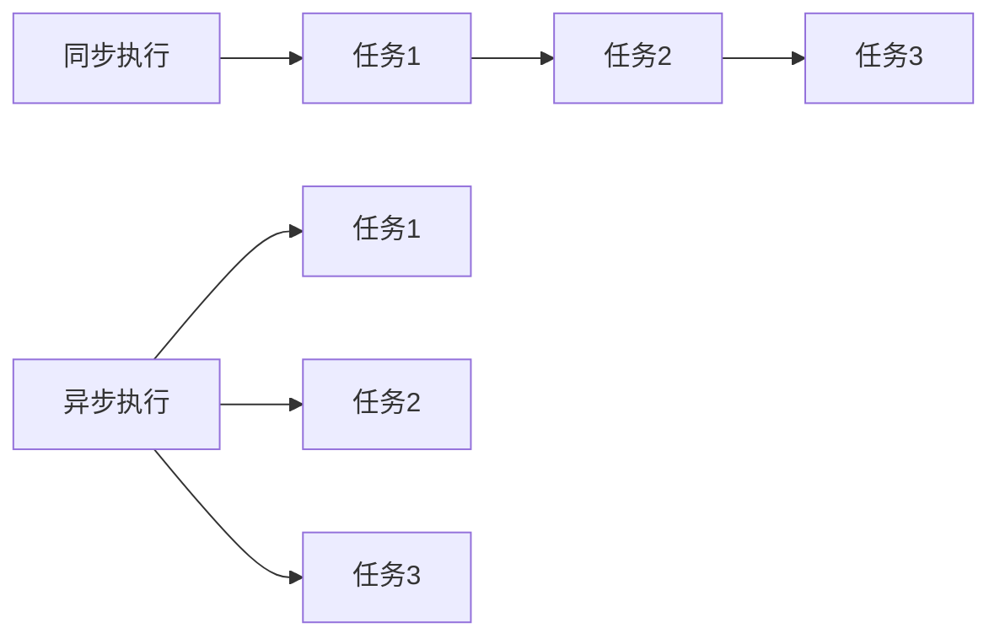

# JavaScript 异步模式

JavaScript作为一种单线程语言，异步编程是其处理耗时操作的核心机制。本文将带你全面了解JavaScript中的异步模式，从基本概念到实际应用，帮助你掌握这一关键技能。

## 什么是异步编程？

在传统的同步编程模式中，代码按照编写的顺序一步步执行，每一步操作完成后才执行下一步。而在异步编程模式中，某些操作可以在后台进行，不会阻塞主线程的执行。



异步编程的主要应用场景包括：

- 网络请求（如API调用）
- 文件读写操作
- 定时器和延迟执行
- 用户交互处理

## JavaScript 中的异步模式演进

### 1. 回调函数（Callbacks）

回调函数是JavaScript中最基本的异步处理方式，通过将函数作为参数传递给另一个函数，在特定事件发生或操作完成后执行。

```javascript
// 基本回调示例
function fetchData(callback) {
  setTimeout(() => {
    const data = { name: "JavaScript", type: "语言" };
    callback(data);
  }, 1000);
}

// 使用回调
fetchData((data) => {
  console.log("数据获取成功:", data);
});

console.log("请求已发送，等待数据...");

// 输出：
// 请求已发送，等待数据...
// (1秒后) 数据获取成功: { name: 'JavaScript', type: '语言' }
```

:::caution 回调地狱
使用嵌套回调处理多个连续异步操作时，会导致代码可读性差、难以维护的问题，这被称为"回调地狱"(Callback Hell)。
:::

```javascript
// 回调地狱示例
getData(function(a) {
  getMoreData(a, function(b) {
    getMoreData(b, function(c) {
      getMoreData(c, function(d) {
        // 代码嵌套层级过深，难以维护
      });
    });
  });
});
```

### 2. Promise

Promise是ES6引入的异步编程解决方案，它代表一个异步操作的最终完成（或失败）及其结果值。

Promise有三种状态：
- **pending**：初始状态，既没有成功也没有失败
- **fulfilled**：操作成功完成
- **rejected**：操作失败

```javascript
// 创建Promise
const myPromise = new Promise((resolve, reject) => {
  // 异步操作
  setTimeout(() => {
    const success = true;
    if (success) {
      resolve("操作成功！");  // 成功
    } else {
      reject("出错了！");     // 失败
    }
  }, 1000);
});

// 使用Promise
myPromise
  .then((result) => {
    console.log(result);
  })
  .catch((error) => {
    console.error(error);
  });

// 输出：
// (1秒后) 操作成功！
```

#### Promise链式调用

Promise允许链式调用，简化多个连续异步操作的处理：

```javascript
fetchUserData()
  .then(user => {
    return fetchUserPosts(user.id);
  })
  .then(posts => {
    return fetchPostComments(posts[0].id);
  })
  .then(comments => {
    console.log(comments);
  })
  .catch(error => {
    console.error("发生错误:", error);
  });
```

#### Promise.all 和 Promise.race

处理多个并行Promise的常用方法：

```javascript
// 并行执行多个Promise，等待所有Promise完成
Promise.all([fetchUser(), fetchProducts(), fetchOrders()])
  .then(([user, products, orders]) => {
    console.log("所有数据均已加载:", user, products, orders);
  })
  .catch(error => {
    console.error("至少一个请求失败:", error);
  });

// 接收第一个完成的Promise结果
Promise.race([fetchData1(), fetchData2()])
  .then(result => {
    console.log("最快的请求完成:", result);
  });
```

### 3. Async/Await

Async/Await是ES2017引入的语法糖，建立在Promise之上，让异步代码看起来更像同步代码，提高可读性。

```javascript
// 定义异步函数
async function fetchUserData() {
  try {
    // await暂停执行，直到Promise解决
    const response = await fetch('https://api.example.com/users');
    const userData = await response.json();
    return userData;
  } catch (error) {
    console.error("获取用户数据失败:", error);
  }
}

// 调用异步函数
async function displayUserInfo() {
  console.log("开始获取用户数据...");
  const user = await fetchUserData();
  console.log("用户数据:", user);
}

displayUserInfo();

// 输出：
// 开始获取用户数据...
// (请求完成后) 用户数据: {...}
```

:::tip 提示
`async`函数总是返回一个Promise，即使函数体内没有显式使用Promise。
:::

#### 并行执行多个异步操作

```javascript
async function fetchAllData() {
  // 并行启动所有请求
  const userPromise = fetchUser();
  const postsPromise = fetchPosts();
  const commentsPromise = fetchComments();
  
  // 等待所有请求完成
  const user = await userPromise;
  const posts = await postsPromise;
  const comments = await commentsPromise;
  
  return { user, posts, comments };
}

// 使用Promise.all的另一种方式
async function fetchAllDataAlternative() {
  const [user, posts, comments] = await Promise.all([
    fetchUser(),
    fetchPosts(),
    fetchComments()
  ]);
  
  return { user, posts, comments };
}
```

### 4. 事件监听器（Event Listeners）

事件监听器是浏览器环境中常用的异步处理方式，用于响应用户交互和其他事件。

```javascript
// 添加事件监听器
document.getElementById('myButton').addEventListener('click', function() {
  console.log('按钮被点击了');
});

// 自定义事件
const myEmitter = new EventEmitter();
myEmitter.on('dataReceived', function(data) {
  console.log('接收到数据:', data);
});

// 触发事件
myEmitter.emit('dataReceived', { id: 123, name: '测试数据' });
```

## 实际案例：数据加载应用

下面是一个结合实际开发场景的案例，展示如何使用异步模式构建一个简单的数据加载应用：

```javascript
// 数据服务
class DataService {
  // 模拟API请求
  static async fetchCategories() {
    return new Promise(resolve => {
      setTimeout(() => {
        resolve(['电子产品', '服装', '图书', '家居']);
      }, 500);
    });
  }
  
  static async fetchProductsByCategory(category) {
    return new Promise(resolve => {
      setTimeout(() => {
        resolve([
          { id: 1, name: `${category} 商品1`, price: 99.99 },
          { id: 2, name: `${category} 商品2`, price: 149.99 },
          { id: 3, name: `${category} 商品3`, price: 199.99 }
        ]);
      }, 700);
    });
  }
  
  static async fetchProductDetails(productId) {
    return new Promise(resolve => {
      setTimeout(() => {
        resolve({
          id: productId,
          description: '这是产品的详细描述...',
          rating: 4.5,
          reviews: 123
        });
      }, 300);
    });
  }
}

// 应用组件
class ShopApp {
  constructor() {
    this.categories = [];
    this.selectedCategory = null;
    this.products = [];
    this.selectedProduct = null;
    this.productDetails = null;
    this.isLoading = false;
    this.error = null;
  }
  
  // 初始化应用
  async init() {
    try {
      this.isLoading = true;
      console.log('加载商店数据...');
      
      // 加载分类
      this.categories = await DataService.fetchCategories();
      console.log('可用分类:', this.categories);
      
      // 选择第一个分类
      if (this.categories.length > 0) {
        await this.selectCategory(this.categories[0]);
      }
      
    } catch (error) {
      this.error = '初始化失败: ' + error.message;
      console.error(this.error);
    } finally {
      this.isLoading = false;
    }
  }
  
  // 选择分类
  async selectCategory(category) {
    try {
      this.isLoading = true;
      this.selectedCategory = category;
      console.log(`选择分类: ${category}`);
      
      // 加载该分类下的产品
      this.products = await DataService.fetchProductsByCategory(category);
      console.log(`${category} 分类下的产品:`, this.products);
      
      // 选择第一个产品
      if (this.products.length > 0) {
        await this.selectProduct(this.products[0]);
      }
      
    } catch (error) {
      this.error = '加载分类产品失败: ' + error.message;
      console.error(this.error);
    } finally {
      this.isLoading = false;
    }
  }
  
  // 选择产品
  async selectProduct(product) {
    try {
      this.isLoading = true;
      this.selectedProduct = product;
      console.log(`选择产品: ${product.name}`);
      
      // 加载产品详情
      this.productDetails = await DataService.fetchProductDetails(product.id);
      console.log('产品详情:', this.productDetails);
      
    } catch (error) {
      this.error = '加载产品详情失败: ' + error.message;
      console.error(this.error);
    } finally {
      this.isLoading = false;
    }
  }
}

// 使用应用
const app = new ShopApp();
app.init().then(() => {
  console.log('应用初始化完成!');
});
```

这个例子展示了如何在实际应用中组合使用Promise和async/await处理多层次的异步数据加载，包括错误处理和加载状态管理。

## 异步模式的最佳实践

1. **避免回调地狱**：尽量使用Promise或async/await代替多层嵌套回调。

2. **适当的错误处理**：
   ```javascript
   async function safeOperation() {
     try {
       const result = await riskyOperation();
       return result;
     } catch (error) {
       console.error('操作失败:', error);
       // 错误恢复逻辑
     }
   }
   ```

3. **避免过度串行化**：可并行的操作应该并行执行，以提高性能。

4. **合理使用异步**：不是所有操作都需要异步，简单快速的操作可以保持同步。

5. **使用async/await时保持一致性**：一旦在函数中使用了await，就应该将整个函数标记为async。

## 总结

JavaScript的异步编程模式是应对单线程环境下复杂操作的强大工具，通过以下几种方式实现：

- **回调函数**：最基本的异步处理方式，但易导致回调地狱
- **Promise**：提供更结构化的异步处理方式，支持链式调用
- **Async/Await**：基于Promise的语法糖，使异步代码更易读
- **事件监听器**：处理用户交互和其他事件的常用方式

无论哪种模式，掌握它们对于编写高效、可维护的JavaScript代码至关重要。随着你的经验增长，你将能够根据不同场景选择最合适的异步处理方式。

## 练习与资源

### 练习题

1. 使用Promise重写下面的回调代码：
   ```javascript
   function getData(callback) {
     setTimeout(() => {
       callback('数据');
     }, 1000);
   }
   ```

2. 实现一个函数，同时请求多个URL并返回最先完成的请求结果。

3. 使用async/await实现一个函数，按顺序读取并处理一个URL数组中的内容。

### 进阶资源

- [MDN Web Docs: 使用Promise](https://developer.mozilla.org/zh-CN/docs/Web/JavaScript/Guide/Using_promises)
- [MDN Web Docs: async函数](https://developer.mozilla.org/zh-CN/docs/Web/JavaScript/Reference/Statements/async_function)
- [Jake Archibald: 深入理解JavaScript异步](https://jakearchibald.com/2015/tasks-microtasks-queues-and-schedules/)
- [JavaScript.info: Promise链](https://javascript.info/promise-chaining)

通过持续实践和学习，你将逐渐熟练掌握JavaScript异步编程，为构建响应迅速、用户友好的Web应用打下坚实基础。