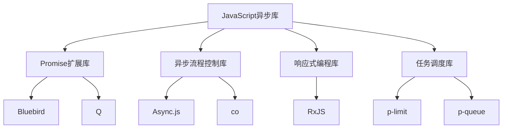

# JavaScript 异步库

在现代JavaScript开发中，异步编程已经成为必不可少的技能。为了更好地处理异步操作，社区开发了许多优秀的异步库，这些库帮助开发者更高效地管理异步代码，避免回调地狱，提高代码可读性和可维护性。

## 为什么需要异步库？

原生JavaScript提供了基础的异步处理能力（Promise、async/await），但在复杂应用场景下，这些原生功能可能不足以应付所有情况：

1. 处理复杂的异步流程控制
2. 管理并发任务
3. 简化错误处理
4. 提供更多便捷功能

本文将介绍几类重要的JavaScript异步库及其使用场景。

## 主要异步库分类

JavaScript异步库大致可分为以下几类：



## Promise扩展库

### Bluebird

Bluebird是一个功能全面的Promise库，提供了比原生Promise更多的功能和更好的性能。

#### 安装

```bash
npm install bluebird
```

#### 基本用法

```javascript
const Promise = require('bluebird');

// 将回调函数风格的API转换为Promise风格
const fs = Promise.promisifyAll(require('fs'));

// 现在可以使用Promise风格调用fs的方法
fs.readFileAsync('file.txt', 'utf8')
  .then(content => {
    console.log(content);
    return fs.writeFileAsync('output.txt', content.toUpperCase());
  })
  .then(() => {
    console.log('文件写入成功');
  })
  .catch(err => {
    console.error('出错了:', err);
  });
```

#### Bluebird的主要特点

1. **promisification**：自动将基于回调的API转换为基于Promise的API
2. **并发控制**：使用`Promise.map`、`Promise.reduce`等方法控制并发
3. **强大的错误处理**：提供`catch`过滤和其他高级错误处理功能

### Q

Q是另一个流行的Promise库，虽然随着原生Promise的普及使用减少，但仍有其特色功能。

```javascript
const Q = require('q');

// 创建延迟对象
const deferred = Q.defer();

// 模拟异步操作
setTimeout(() => {
  deferred.resolve('操作完成');
}, 1000);

// 使用Promise
deferred.promise
  .then(result => {
    console.log(result); // 输出: 操作完成
  })
  .catch(err => {
    console.error('出错了:', err);
  });
```

## 异步流程控制库

### Async.js

Async.js是一个功能丰富的异步工具库，提供了多种处理异步操作的模式。

#### 安装

```bash
npm install async
```

#### 基本用法

```javascript
const async = require('async');

// 并行执行多个任务
async.parallel([
  callback => {
    setTimeout(() => {
      console.log('任务1完成');
      callback(null, '任务1结果');
    }, 1000);
  },
  callback => {
    setTimeout(() => {
      console.log('任务2完成');
      callback(null, '任务2结果');
    }, 500);
  }
], (err, results) => {
  if (err) {
    console.error('出错了:', err);
    return;
  }
  console.log('所有任务完成，结果:', results);
  // 输出: 所有任务完成，结果: ['任务1结果', '任务2结果']
});
```

#### Async.js主要功能

1. **流程控制**：`series`（串行）、`parallel`（并行）、`waterfall`（瀑布流）等
2. **集合处理**：`each`、`map`、`filter`等
3. **并发控制**：`queue`、`priorityQueue`等

### co

co库主要用于基于生成器函数的异步流程控制，是async/await出现前的一种解决方案。

```javascript
const co = require('co');
const fs = require('fs').promises;

co(function* () {
  try {
    const file1 = yield fs.readFile('file1.txt', 'utf8');
    const file2 = yield fs.readFile('file2.txt', 'utf8');
    return file1 + file2;
  } catch (err) {
    console.error('读取文件出错:', err);
  }
}).then(result => {
  console.log('合并后的内容:', result);
});
```

:::note
现在有了async/await，co库的使用场景减少了，但了解它有助于理解异步编程的发展历程。
:::

## 响应式编程库

### RxJS

RxJS是一个使用可观察序列组合异步和基于事件的程序的库。

#### 安装

```bash
npm install rxjs
```

#### 基本用法

```javascript
const { from } = require('rxjs');
const { map, filter } = require('rxjs/operators');

// 创建一个可观察序列
from([1, 2, 3, 4, 5])
  .pipe(
    filter(n => n % 2 === 1), // 筛选奇数
    map(n => n * 10) // 将奇数乘以10
  )
  .subscribe(
    x => console.log(`下一个值: ${x}`), // 输出: 10, 30, 50
    err => console.error('出错了:', err),
    () => console.log('完成')
  );
```

#### RxJS的关键概念

1. **Observable**：表示一个可调用的未来值或事件的集合
2. **Observer**：一组回调函数，用于监听Observable传递的值
3. **Subscription**：表示Observable的执行，主要用于取消执行
4. **Operators**：纯函数，支持以函数式编程方式处理集合

## 任务调度和并发控制库

### p-limit 和 p-queue

这些库帮助控制Promise的并发执行。

#### 安装

```bash
npm install p-limit p-queue
```

#### 使用p-limit控制并发

```javascript
const pLimit = require('p-limit');

async function fetchData(id) {
  // 模拟API请求
  return new Promise(resolve => {
    setTimeout(() => {
      console.log(`获取数据 ${id}`);
      resolve(`数据 ${id}`);
    }, 1000);
  });
}

// 一次最多执行2个并发请求
const limit = pLimit(2);

async function main() {
  const ids = [1, 2, 3, 4, 5];
  const promises = ids.map(id => {
    return limit(() => fetchData(id));
  });

  const results = await Promise.all(promises);
  console.log('所有结果:', results);
}

main().catch(console.error);
```

#### 使用p-queue管理任务队列

```javascript
const PQueue = require('p-queue');

async function expensiveTask(name) {
  return new Promise(resolve => {
    console.log(`开始任务: ${name}`);
    setTimeout(() => {
      console.log(`完成任务: ${name}`);
      resolve(`${name} 结果`);
    }, 1000);
  });
}

const queue = new PQueue({concurrency: 2});

// 添加任务到队列
async function addTasks() {
  // 添加多个任务到队列
  const tasks = ['A', 'B', 'C', 'D', 'E'].map(name => {
    return queue.add(() => expensiveTask(name));
  });
  
  // 等待所有任务完成
  const results = await Promise.all(tasks);
  console.log('所有任务结果:', results);
}

addTasks().catch(console.error);
```

## 实际案例：构建数据处理管道

让我们使用异步库构建一个简单的数据处理管道，模拟从多个源获取数据、处理数据并保存结果的过程。

```javascript
const async = require('async');
const pLimit = require('p-limit');

// 模拟API客户端
const api = {
  fetchUsers: () => mockAsyncCall([
    {id: 1, name: 'Alice'}, 
    {id: 2, name: 'Bob'},
    {id: 3, name: 'Charlie'}
  ]),
  fetchPosts: (userId) => mockAsyncCall([
    {id: `${userId}-1`, title: `Post 1 by user ${userId}`},
    {id: `${userId}-2`, title: `Post 2 by user ${userId}`}
  ]),
  saveResults: (data) => mockAsyncCall({success: true, count: data.length})
};

// 模拟异步调用
function mockAsyncCall(result) {
  return new Promise(resolve => {
    setTimeout(() => resolve(result), 500);
  });
}

// 构建数据处理管道
async function processingPipeline() {
  try {
    // 1. 获取所有用户
    console.log('获取所有用户...');
    const users = await api.fetchUsers();
    
    // 2. 为每个用户获取帖子，但限制并发请求数
    console.log('获取用户帖子...');
    const limit = pLimit(2); // 最多同时处理2个用户
    const userPostsPromises = users.map(user => {
      return limit(async () => {
        const posts = await api.fetchPosts(user.id);
        return {
          user,
          posts
        };
      });
    });
    
    const usersWithPosts = await Promise.all(userPostsPromises);
    
    // 3. 处理数据，提取所需信息
    console.log('处理数据...');
    const processedData = [];
    
    async.eachSeries(usersWithPosts, (userData, callback) => {
      const { user, posts } = userData;
      
      posts.forEach(post => {
        processedData.push({
          userName: user.name,
          userId: user.id,
          postTitle: post.title,
          postId: post.id
        });
      });
      
      // 模拟一些处理时间
      setTimeout(callback, 200);
    }, async (err) => {
      if (err) {
        console.error('处理数据出错:', err);
        return;
      }
      
      // 4. 保存结果
      console.log('保存处理后的数据...');
      const saveResult = await api.saveResults(processedData);
      console.log(`保存完成! 共处理 ${saveResult.count} 条记录`);
      console.log('处理后的数据:', processedData);
    });
  } catch (error) {
    console.error('管道执行出错:', error);
  }
}

// 执行处理管道
processingPipeline();
```

:::tip
在实际应用中，选择哪个库取决于你的具体需求和偏好。如果你的项目已经使用了现代JavaScript（ES6+），可能原生Promise和async/await就足够了。但对于更复杂的异步流程控制，这些库会提供很大帮助。
:::

## 如何选择合适的异步库

选择异步库时，可以考虑以下因素：

1. **项目复杂度**：简单项目可能只需要原生Promise和async/await
2. **特定需求**：如需要精细控制并发，可选择p-limit等库
3. **团队熟悉度**：选择团队成员熟悉的库可以提高开发效率
4. **库的维护状态**：选择活跃维护的库，避免使用废弃的库
5. **包大小**：在前端应用中，考虑库的大小对页面加载的影响

## 总结

JavaScript异步库极大地简化了异步编程的复杂性，帮助开发者写出更清晰、更易维护的代码：

1. **Promise扩展库**（Bluebird、Q等）提供了比原生Promise更多的功能
2. **异步流程控制库**（Async.js、co等）提供了多种模式处理异步操作
3. **响应式编程库**（RxJS）提供了处理异步数据流的强大工具
4. **任务调度库**（p-limit、p-queue等）帮助控制并发执行

随着JavaScript语言本身的发展，很多异步库的功能已经被原生语言特性所覆盖，但在特定场景下，这些库仍然提供了很大的价值。选择合适的异步库可以让你的代码更简洁、更强大、更易于维护。

## 练习

1. 使用Bluebird将Node.js的fs模块API转换为Promise风格，并读取一个文件。
2. 使用Async.js实现三个异步任务的瀑布流（waterfall）执行。
3. 使用RxJS创建一个简单的数据流，对数组进行过滤和转换。
4. 使用p-limit控制API请求的并发数，同时请求多个API但限制并发数为3。

## 附加资源

- [Bluebird文档](http://bluebirdjs.com/docs/getting-started.html)
- [Async.js文档](https://caolan.github.io/async/)
- [RxJS官方教程](https://rxjs.dev/guide/overview)
- [JavaScript异步编程指南](https://developer.mozilla.org/en-US/docs/Learn/JavaScript/Asynchronous)

学习这些异步库不仅能帮助你解决实际问题，还能加深你对JavaScript异步编程模型的理解。从长远来看，这将使你成为一个更全面的JavaScript开发者。