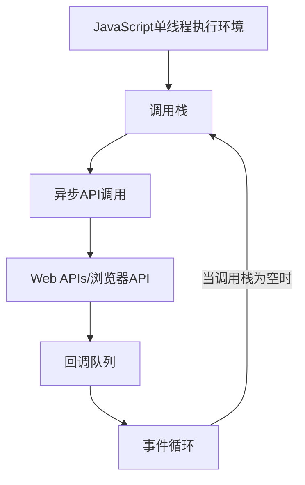

# JavaScript 异步性能优化

## 引言

在现代Web应用程序中，性能是用户体验的关键因素。JavaScript作为Web前端的主要编程语言，其异步执行模型对应用性能有着重要影响。优化JavaScript的异步操作不仅能提高应用响应速度，还能减少资源消耗，提升整体用户体验。

本文将探讨JavaScript异步编程中的性能优化技巧，从基础概念出发，通过实际案例和代码示例，帮助你理解并应用这些优化策略。

## JavaScript 异步模型概述

在深入优化之前，让我们先简要回顾JavaScript的异步模型：

JavaScript是单线程语言，使用事件循环(Event Loop)处理异步操作。异步任务主要通过以下机制执行：

1. 回调函数(Callbacks)
2. Promise
3. async/await
4. Web Workers (用于真正的并行处理)



## 常见性能问题及优化策略

### 1. 减少不必要的异步操作

**问题**：过多的异步操作会增加调度开销。

**优化方法**：合并多个异步操作，减少总体调用次数。

**示例**：使用Promise.all合并多个请求

```javascript
// 未优化：顺序发送多个请求
const fetchData = async () => {
  const userData = await fetch('/api/user');
  const orderData = await fetch('/api/orders');
  const productData = await fetch('/api/products');
  
  return {
    user: await userData.json(),
    orders: await orderData.json(),
    products: await productData.json()
  };
};

// 优化后：并行发送请求
const fetchDataOptimized = async () => {
  const [userData, orderData, productData] = await Promise.all([
    fetch('/api/user'),
    fetch('/api/orders'),
    fetch('/api/products')
  ]);
  
  return {
    user: await userData.json(),
    orders: await orderData.json(),
    products: await productData.json()
  };
};
```

**执行效果对比**：
- 未优化版本：请求按顺序执行，总耗时是三个请求耗时之和
- 优化后版本：请求并行执行，总耗时接近单个最长请求的耗时

### 2. 避免Promise链过长

**问题**：长Promise链会增加内存占用和复杂性。

**优化方法**：使用async/await简化代码，或者合理设计Promise处理流程。

**示例**：重构Promise链

```javascript
// 未优化：长Promise链
function processData(inputData) {
  return fetchData(inputData)
    .then(result => filterData(result))
    .then(filteredData => sortData(filteredData))
    .then(sortedData => formatData(sortedData))
    .then(formattedData => {
      return {
        processed: true,
        data: formattedData
      };
    })
    .catch(error => {
      console.error('处理失败:', error);
      return { processed: false, error };
    });
}

// 优化后：使用async/await
async function processDataOptimized(inputData) {
  try {
    const result = await fetchData(inputData);
    const filteredData = filterData(result);
    const sortedData = sortData(filteredData);
    const formattedData = formatData(sortedData);
    
    return {
      processed: true,
      data: formattedData
    };
  } catch (error) {
    console.error('处理失败:', error);
    return { processed: false, error };
  }
}
```

### 3. 实现请求缓存和去重

**问题**：重复的异步请求浪费资源。

**优化方法**：添加缓存层和请求去重机制。

**示例**：缓存API请求

```javascript
// 简单的请求缓存实现
const requestCache = new Map();

async function cachedFetch(url, options = {}) {
  const cacheKey = `${url}-${JSON.stringify(options)}`;
  
  // 检查缓存
  if (requestCache.has(cacheKey)) {
    return requestCache.get(cacheKey);
  }
  
  // 不存在缓存，发起实际请求
  const promise = fetch(url, options)
    .then(response => response.json());
  
  // 存入缓存
  requestCache.set(cacheKey, promise);
  
  return promise;
}

// 使用方法
async function getUserData(userId) {
  return cachedFetch(`/api/users/${userId}`);
}
```

### 4. 使用防抖(Debounce)和节流(Throttle)

**问题**：高频触发的异步事件会导致性能下降。

**优化方法**：实现防抖和节流功能控制执行频率。

**示例**：实现搜索框防抖

```javascript
// 防抖函数
function debounce(func, delay) {
  let timer = null;
  
  return function(...args) {
    const context = this;
    
    // 清除之前的定时器
    if (timer) clearTimeout(timer);
    
    // 设置新的定时器
    timer = setTimeout(() => {
      func.apply(context, args);
    }, delay);
  };
}

// 使用防抖优化搜索
const searchInput = document.getElementById('search-input');
const performSearch = async (query) => {
  try {
    const results = await fetch(`/api/search?q=${query}`);
    updateSearchResults(await results.json());
  } catch (error) {
    console.error('搜索失败:', error);
  }
};

// 添加防抖，300ms内只执行最后一次
searchInput.addEventListener('input', debounce((e) => {
  performSearch(e.target.value);
}, 300));
```

### 5. 优化async/await使用

**问题**：不当使用async/await会导致性能问题。

**优化方法**：避免不必要的await，合理设计并行操作。

**示例**：优化async/await使用方式

```javascript
// 未优化：串行执行不相关操作
async function loadDashboard() {
  const user = await fetchUserProfile();    // 等待1秒
  const posts = await fetchUserPosts();     // 等待2秒
  const notifications = await fetchNotifications(); // 等待1秒
  
  return { user, posts, notifications };    // 总计需要4秒
}

// 优化后：并行执行不相关操作
async function loadDashboardOptimized() {
  // 同时发起所有请求
  const userPromise = fetchUserProfile();
  const postsPromise = fetchUserPosts();
  const notificationsPromise = fetchNotifications();
  
  // 等待所有结果
  const user = await userPromise;
  const posts = await postsPromise;
  const notifications = await notificationsPromise;
  
  return { user, posts, notifications };    // 总计约2秒(取决于最慢的请求)
}
```

### 6. 使用Web Workers处理复杂计算

**问题**：复杂计算会阻塞主线程，导致界面卡顿。

**优化方法**：使用Web Workers将计算任务移至后台线程。

**示例**：用Web Worker处理复杂计算

```javascript
// main.js
function startCalculation(data) {
  // 创建Worker
  const worker = new Worker('calculator.js');
  
  // 设置接收结果的处理器
  worker.onmessage = function(e) {
    console.log('计算结果:', e.data.result);
    // 使用计算结果更新UI
    updateUI(e.data.result);
    
    // 计算完成后终止Worker
    worker.terminate();
  };
  
  // 发送数据给Worker
  worker.postMessage({ data: data });
}

// calculator.js (Worker文件)
self.onmessage = function(e) {
  const data = e.data.data;
  
  // 执行复杂计算
  const result = performComplexCalculation(data);
  
  // 返回结果
  self.postMessage({ result: result });
};
```

:::tip 提示
Web Workers无法直接访问DOM，但适合处理纯数据计算。如果需要操作DOM，需要将结果传回主线程处理。
:::

## 实际案例：优化图片加载器

下面是一个实际案例，展示如何优化一个加载多张图片的功能：

```javascript
// 优化前：简单图片加载器
class SimpleImageLoader {
  constructor(imageUrls) {
    this.imageUrls = imageUrls;
    this.images = [];
  }
  
  async loadImages() {
    for (const url of this.imageUrls) {
      const img = await this.loadImage(url);
      this.images.push(img);
    }
    return this.images;
  }
  
  loadImage(url) {
    return new Promise((resolve, reject) => {
      const img = new Image();
      img.onload = () => resolve(img);
      img.onerror = () => reject(new Error(`加载失败: ${url}`));
      img.src = url;
    });
  }
}

// 优化后：高性能图片加载器
class OptimizedImageLoader {
  constructor(imageUrls, options = {}) {
    this.imageUrls = imageUrls;
    this.images = [];
    this.cache = new Map();
    this.concurrency = options.concurrency || 4; // 并发数
    this.retries = options.retries || 2;         // 重试次数
  }
  
  async loadImages() {
    // 创建任务队列
    const tasks = this.imageUrls.map(url => async () => {
      return this.loadImageWithRetry(url);
    });
    
    // 并发执行任务
    return this.runConcurrent(tasks);
  }
  
  async loadImageWithRetry(url, attempt = 0) {
    try {
      // 检查缓存
      if (this.cache.has(url)) {
        return this.cache.get(url);
      }
      
      const img = await this.loadImage(url);
      this.cache.set(url, img);
      return img;
    } catch (error) {
      if (attempt < this.retries) {
        console.log(`重试加载图片: ${url}, 尝试次数: ${attempt + 1}`);
        return this.loadImageWithRetry(url, attempt + 1);
      }
      console.error(`图片加载失败: ${url}`);
      // 返回一个占位图
      return this.getPlaceholderImage();
    }
  }
  
  loadImage(url) {
    return new Promise((resolve, reject) => {
      const img = new Image();
      img.onload = () => resolve(img);
      img.onerror = () => reject(new Error(`加载失败: ${url}`));
      img.src = url;
    });
  }
  
  getPlaceholderImage() {
    // 创建占位图
    const img = new Image();
    img.src = 'data:image/svg+xml;base64,...'; // 占位图base64
    return img;
  }
  
  async runConcurrent(tasks) {
    const results = [];
    let currentIndex = 0;
    
    async function runTask(taskIndex) {
      if (taskIndex >= tasks.length) return;
      
      const task = tasks[taskIndex];
      const result = await task();
      results[taskIndex] = result;
      
      // 递归执行下一个任务
      await runTask(currentIndex++);
    }
    
    // 启动初始的并发任务
    const initialPromises = [];
    for (let i = 0; i < Math.min(this.concurrency, tasks.length); i++) {
      initialPromises.push(runTask(currentIndex++));
    }
    
    // 等待所有任务完成
    await Promise.all(initialPromises);
    return results;
  }
}

// 使用示例
const urls = [
  'https://example.com/image1.jpg',
  'https://example.com/image2.jpg',
  // ... 更多图片URL
];

// 使用优化后的加载器
async function loadGallery() {
  const loader = new OptimizedImageLoader(urls, { concurrency: 3 });
  const images = await loader.loadImages();
  
  // 将图片添加到DOM
  const gallery = document.getElementById('image-gallery');
  images.forEach(img => {
    if (img) {
      gallery.appendChild(img);
    }
  });
}
```

这个优化版本的图片加载器实现了以下性能优化：

1. **并发控制**：限制同时加载的图片数量，避免过多请求
2. **缓存机制**：避免重复加载相同图片
3. **错误处理与重试**：自动重试失败的请求，提高成功率
4. **降级显示**：加载失败时提供占位图，提升用户体验

## 性能监控与测量

优化异步操作后，我们需要测量优化效果：

```javascript
// 测量异步操作执行时间
async function measureAsyncPerformance(asyncFn, ...args) {
  console.time('执行时间');
  try {
    const result = await asyncFn(...args);
    console.timeEnd('执行时间');
    return result;
  } catch (error) {
    console.timeEnd('执行时间');
    throw error;
  }
}

// 使用方法
measureAsyncPerformance(loadGallery)
  .then(() => console.log('图库加载完成'))
  .catch(err => console.error('加载失败', err));
```

:::note 进阶监控
在生产环境中，可以使用Web Performance API、Chrome DevTools或第三方监控工具(如New Relic、Datadog)进行更详细的性能分析。
:::

## 总结与最佳实践

通过本文的学习，我们掌握了多种JavaScript异步性能优化技巧：

1. **合并请求**：使用Promise.all并行处理独立的异步操作
2. **优化Promise链**：使用async/await简化代码并提高可读性
3. **实现缓存**：避免重复请求，提高响应速度
4. **控制执行频率**：使用防抖和节流限制高频事件
5. **优化async/await**：避免串行执行不相关的异步操作
6. **使用Web Workers**：将计算密集型任务移至后台线程
7. **并发控制**：限制同时执行的异步操作数量
8. **错误处理**：实现重试机制和优雅降级

### 最佳实践总结：

- **适当并行化**：找到能并行执行的异步操作
- **避免阻塞**：不要让长时间运行的操作阻塞主线程
- **控制并发量**：设置合理的并发限制，避免过载
- **优雅错误处理**：实现重试机制和用户友好的错误提示
- **延迟加载**：根据用户行为和优先级加载资源
- **定期性能审计**：使用工具测量并持续优化性能

## 练习

为了巩固所学知识，尝试完成以下练习：

1. 实现一个带缓存和并发控制的数据加载器
2. 使用防抖优化搜索输入框
3. 改进一个使用回调函数的旧代码，使用Promise和async/await重构它
4. 创建一个Web Worker来处理大数据排序或过滤操作

## 扩展资源

要进一步学习JavaScript异步性能优化，可以参考以下资源：

- MDN Web Docs: [使用Promise](https://developer.mozilla.org/zh-CN/docs/Web/JavaScript/Guide/Using_promises)
- MDN Web Docs: [使用Web Workers](https://developer.mozilla.org/zh-CN/docs/Web/API/Web_Workers_API/Using_web_workers)
- Jake Archibald: [Tasks, microtasks, queues and schedules](https://jakearchibald.com/2015/tasks-microtasks-queues-and-schedules/)
- 《You Don't Know JS》系列中的异步编程章节

通过系统学习这些优化技术，你将能够编写出更高效、响应更快的JavaScript应用程序，提供更好的用户体验。