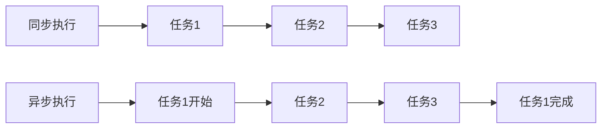

# JavaScript 异步最佳实践

在现代Web开发中，异步编程已经成为JavaScript开发者必须掌握的核心技能。无论是处理API请求、文件操作还是定时任务，良好的异步编程习惯可以让你的代码更加高效、可读和健壮。本文将介绍JavaScript异步编程的最佳实践，帮助你避开常见陷阱，编写出更优质的代码。

## 为什么需要异步编程？

JavaScript是单线程语言，这意味着它一次只能执行一项任务。如果某些操作需要较长时间（如网络请求、大文件读取），直接执行会导致页面冻结。异步编程允许JavaScript在等待这些操作完成的同时继续执行其他代码，从而提高应用的响应性。



## 异步编程的演进

### 1. 回调函数（Callbacks）

回调是最早的异步处理方式，但容易导致"回调地狱"：

```javascript
// 回调地狱示例
getUser(userId, function(user) {
  getPosts(user.id, function(posts) {
    getComments(posts[0].id, function(comments) {
      displayComments(comments, function() {
        // 更多嵌套...
        console.log("终于完成了！");
      });
    });
  });
});
```

### 2. Promise

Promise提供了更优雅的异步处理方式：

```javascript
// 使用Promise链式调用
getUser(userId)
  .then(user => getPosts(user.id))
  .then(posts => getComments(posts[0].id))
  .then(comments => displayComments(comments))
  .then(() => console.log("完成了！"))
  .catch(error => console.error("出错了:", error));
```

### 3. Async/Await

Async/Await是基于Promise的语法糖，让异步代码看起来更像同步代码：

```javascript
// 使用async/await
async function showComments(userId) {
  try {
    const user = await getUser(userId);
    const posts = await getPosts(user.id);
    const comments = await getComments(posts[0].id);
    await displayComments(comments);
    console.log("完成了！");
  } catch (error) {
    console.error("出错了:", error);
  }
}

// 调用函数
showComments(123);
```

## 异步编程最佳实践

### 1. 优先使用Async/Await而非纯Promise

Async/Await使代码更易读、更接近同步思维，同时保留了Promise的所有优点。

:::tip 最佳实践
将复杂的Promise链改写为Async/Await，提高代码可读性。
:::

```javascript
// 不推荐
function fetchUserData() {
  return fetch('/user')
    .then(response => {
      if (!response.ok) throw new Error('网络响应不正常');
      return response.json();
    })
    .then(data => {
      console.log(data);
      return data;
    });
}

// 推荐
async function fetchUserData() {
  const response = await fetch('/user');
  if (!response.ok) throw new Error('网络响应不正常');
  const data = await response.json();
  console.log(data);
  return data;
}
```

### 2. 始终进行错误处理

异步操作更容易出现错误，因此错误处理至关重要。

:::caution 注意
永远不要忽略Promise的错误处理，可以使用catch或try/catch捕获错误。
:::

```javascript
// Promise方式的错误处理
fetchData()
  .then(processData)
  .catch(error => {
    console.error('数据获取失败:', error);
    notifyUser('无法加载数据，请稍后再试');
  });

// Async/Await方式的错误处理
async function getData() {
  try {
    const data = await fetchData();
    return processData(data);
  } catch (error) {
    console.error('数据获取失败:', error);
    notifyUser('无法加载数据，请稍后再试');
    return null; // 提供默认返回值
  }
}
```

### 3. 避免嵌套Promise和async函数

嵌套会增加代码复杂度，应当保持扁平化结构。

```javascript
// 不推荐
async function processUserData() {
  const user = await getUser();
  await (async () => { // 不必要的嵌套
    const settings = await getUserSettings(user.id);
    await updateSettings(settings);
  })();
}

// 推荐
async function processUserData() {
  const user = await getUser();
  const settings = await getUserSettings(user.id);
  await updateSettings(settings);
}
```

### 4. 合理使用Promise.all处理并行请求

当多个异步操作之间没有依赖关系时，可以并行执行以提高效率。

```javascript
// 串行执行 - 速度较慢
async function getDataSequentially() {
  const start = Date.now();
  
  const users = await fetchUsers();
  const products = await fetchProducts();
  const orders = await fetchOrders();
  
  console.log(`总耗时: ${Date.now() - start}ms`);
  return { users, products, orders };
}

// 并行执行 - 速度更快
async function getDataInParallel() {
  const start = Date.now();
  
  const [users, products, orders] = await Promise.all([
    fetchUsers(),
    fetchProducts(),
    fetchOrders()
  ]);
  
  console.log(`总耗时: ${Date.now() - start}ms`);
  return { users, products, orders };
}
```

:::note 性能比较
假设每个请求耗时500ms：
- 串行执行: 约1500ms
- 并行执行: 约500ms (取决于最长的那个请求)
:::

### 5. 使用Promise.allSettled处理多个可能失败的请求

当你需要执行多个异步操作，并且允许其中一些失败而不影响其他操作时，使用`Promise.allSettled`。

```javascript
async function fetchMultipleAPIs() {
  const results = await Promise.allSettled([
    fetch('/api/users').then(r => r.json()),
    fetch('/api/products').then(r => r.json()),
    fetch('/api/orders').then(r => r.json())
  ]);
  
  // 处理结果
  results.forEach((result, index) => {
    if (result.status === 'fulfilled') {
      console.log(`API ${index + 1} 成功:`, result.value);
    } else {
      console.error(`API ${index + 1} 失败:`, result.reason);
    }
  });
}
```

### 6. 避免在循环中使用await

在循环中连续使用await会导致串行执行，可能效率低下。

```javascript
// 不推荐 - 串行处理
async function processItems(items) {
  for (const item of items) {
    await processItem(item); // 每次循环都会等待前一个完成
  }
}

// 推荐 - 并行处理后等待所有结果
async function processItems(items) {
  const promises = items.map(item => processItem(item));
  await Promise.all(promises);
}
```

### 7. 合理使用Promise超时机制

避免异步操作无限期等待，可以设置超时机制：

```javascript
function fetchWithTimeout(url, timeout = 5000) {
  return Promise.race([
    fetch(url),
    new Promise((_, reject) => 
      setTimeout(() => reject(new Error('请求超时')), timeout)
    )
  ]);
}

// 使用
async function getData() {
  try {
    const response = await fetchWithTimeout('/api/data', 3000);
    return response.json();
  } catch (error) {
    if (error.message === '请求超时') {
      console.log('API请求超时，正在重试...');
      // 执行重试逻辑
    }
    throw error;
  }
}
```

### 8. 使用finally进行清理操作

无论Promise成功还是失败，finally都会执行，适合用于清理操作。

```javascript
async function fetchData() {
  showLoadingSpinner();
  
  try {
    const data = await fetch('/api/data').then(r => r.json());
    updateUI(data);
  } catch (error) {
    showError('无法获取数据');
    console.error(error);
  } finally {
    hideLoadingSpinner(); // 无论成功还是失败都会执行
  }
}
```

### 9. 避免不必要的异步函数

不是所有函数都需要标记为async。只有当函数内部使用await或需要返回Promise时才使用async。

```javascript
// 不必要的async
async function add(a, b) {
  return a + b; // 这里不需要async
}

// 正确使用
function add(a, b) {
  return a + b;
}

// 必要的async
async function fetchAndProcess() {
  const data = await fetch('/api/data').then(r => r.json());
  return process(data);
}
```

### 10. 在适当的位置异步化

将异步操作封装到函数内部，避免异步逻辑泄露到整个应用程序。

```javascript
// 不推荐
async function processUserInput(input) {
  // 业务逻辑与异步操作混合
  validateInput(input);
  const response = await sendToServer(input);
  return formatResponse(response);
}

// 推荐
function processUserInput(input) {
  // 业务逻辑保持同步
  validateInput(input);
  return sendToServerAndFormat(input); // 异步操作封装在函数内
}

async function sendToServerAndFormat(data) {
  const response = await sendToServer(data);
  return formatResponse(response);
}
```

## 实际案例：异步数据加载组件

下面是一个实际的React组件示例，展示了如何应用这些最佳实践：

```jsx
import React, { useState, useEffect } from 'react';

function DataDashboard() {
  const [data, setData] = useState(null);
  const [loading, setLoading] = useState(true);
  const [error, setError] = useState(null);
  
  useEffect(() => {
    // 使用IIFE (Immediately Invoked Function Expression)
    (async function loadDashboardData() {
      try {
        setLoading(true);
        
        // 并行请求数据
        const [userResponse, statsResponse] = await Promise.all([
          fetch('/api/user').then(r => r.json()),
          fetch('/api/stats').then(r => r.json())
        ]);
        
        // 处理依赖于第一批数据的第二批数据
        const detailsResponse = await fetch(`/api/details/${userResponse.id}`).then(r => r.json());
        
        // 组合所有数据
        setData({
          user: userResponse,
          stats: statsResponse,
          details: detailsResponse
        });
      } catch (err) {
        console.error('数据加载失败:', err);
        setError('无法加载仪表板数据。请刷新页面或稍后再试。');
      } finally {
        setLoading(false);
      }
    })();
    
    // 清理函数
    return () => {
      // 如果需要，可以在这里取消请求
    };
  }, []); // 空依赖数组意味着这个效果只运行一次
  
  if (loading) return <LoadingSpinner />;
  if (error) return <ErrorMessage message={error} />;
  if (!data) return null;
  
  return (
    <div className="dashboard">
      <UserProfile user={data.user} />
      <Statistics stats={data.stats} />
      <DetailPanel details={data.details} />
    </div>
  );
}
```

## 总结

异步编程是现代JavaScript的核心部分，掌握这些最佳实践将帮助你编写更加高效、可维护和健壮的代码：

1. 优先使用Async/Await语法
2. 始终进行错误处理
3. 避免不必要的嵌套
4. 合理使用Promise.all处理并行请求
5. 使用Promise.allSettled处理多个可能失败的请求
6. 避免在循环中使用await
7. 设置合理的超时机制
8. 使用finally进行清理
9. 避免不必要的异步函数
10. 在适当的位置异步化

## 练习与挑战

为巩固所学内容，尝试以下练习：

1. 重构一个使用回调函数的旧代码，改用Promise和Async/Await。
2. 编写一个函数，并行获取多个API数据，并在所有请求完成后组合结果。
3. 为异步操作实现完整的错误处理和重试机制。
4. 创建一个简单的文件上传组件，包括进度显示和超时处理。

## 额外学习资源

- [MDN Web Docs: 使用 Promises](https://developer.mozilla.org/zh-CN/docs/Web/JavaScript/Guide/Using_promises)
- [MDN Web Docs: Async/Await](https://developer.mozilla.org/zh-CN/docs/Web/JavaScript/Reference/Statements/async_function)
- [JavaScript.info: Promises, async/await](https://javascript.info/async)
- [Web Dev: JavaScript Promises: An introduction](https://web.dev/promises/)