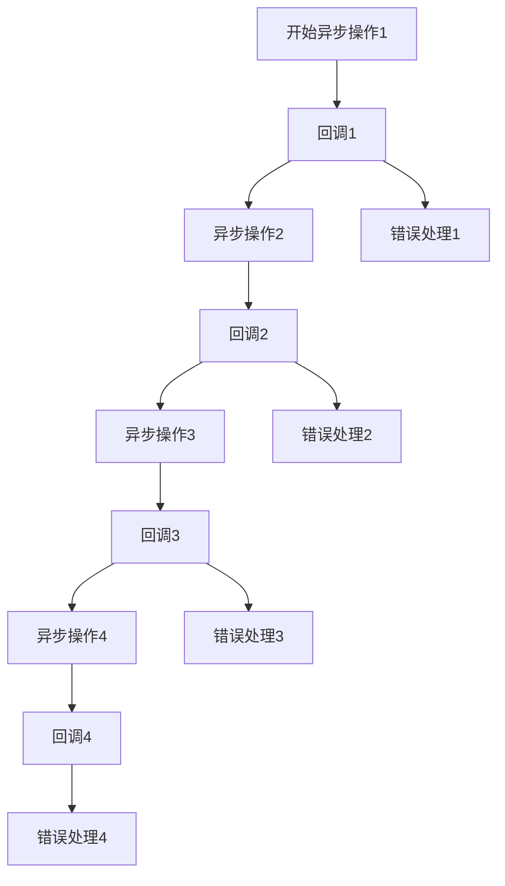
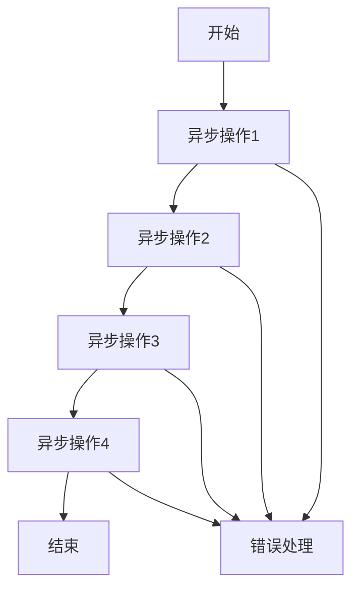

# JavaScript 回调地狱

## 什么是回调地狱

在JavaScript中，回调地狱(Callback Hell)是指由于过度嵌套的回调函数而导致的代码难以阅读、难以维护的现象。这种代码结构通常出现在处理多个异步操作时，特别是当这些操作需要按特定顺序执行时。

回调地狱也被称为"厄运金字塔"(Pyramid of Doom)，因为代码的缩进会形成一个向右延伸的三角形结构，看起来像是一座金字塔。

:::note 回调函数基础
回调函数是一个作为参数传递给另一个函数的函数，在某个操作完成后被调用。在JavaScript中，它们常用于处理异步操作的结果。
:::

## 回调地狱示例

让我们通过一个简单的示例来理解回调地狱：

```javascript
// 假设我们需要完成以下操作：
// 1. 从服务器获取用户数据
// 2. 根据用户ID获取用户权限
// 3. 根据权限获取可访问的资源
// 4. 加载资源

getUserData(function(user) {
  console.log("Got user data:", user);
  
  getUserPermissions(user.id, function(permissions) {
    console.log("Got permissions:", permissions);
    
    getAccessibleResources(permissions, function(resources) {
      console.log("Got resources:", resources);
      
      loadResources(resources, function(loadedResources) {
        console.log("Resources loaded:", loadedResources);
        
        // 可能还有更多嵌套...
      }, function(error) {
        console.error("Failed to load resources:", error);
      });
      
    }, function(error) {
      console.error("Failed to get resources:", error);
    });
    
  }, function(error) {
    console.error("Failed to get permissions:", error);
  });
  
}, function(error) {
  console.error("Failed to get user data:", error);
});
```

在上面的代码中，我们可以看到：

1. 代码向右偏移，形成了"厄运金字塔"结构
2. 错误处理散布在多个回调中，重复且不一致
3. 代码可读性差，难以理解整体流程
4. 维护困难，如需要更改执行顺序，可能需要重构大量代码

## 回调地狱的问题

回调地狱带来的主要问题包括：

1. **可读性差**：深度嵌套的代码难以阅读和理解
2. **错误处理复杂**：每个嵌套层级都可能需要单独的错误处理逻辑
3. **维护困难**：修改或增加功能时，需要在复杂的嵌套结构中导航
4. **调试挑战**：堆栈跟踪可能很难解读，因为错误可能跨越多个回调
5. **代码结构不清晰**：业务逻辑被回调机制所掩盖

## 避免回调地狱的方法

### 1. 函数命名与拆分

将回调函数分离出来，使用有意义的函数名：

```javascript
function handleUserData(user) {
  console.log("Got user data:", user);
  getUserPermissions(user.id, handlePermissions, handlePermissionsError);
}

function handlePermissions(permissions) {
  console.log("Got permissions:", permissions);
  getAccessibleResources(permissions, handleResources, handleResourcesError);
}

function handleResources(resources) {
  console.log("Got resources:", resources);
  loadResources(resources, handleLoadedResources, handleLoadResourcesError);
}

function handleLoadedResources(loadedResources) {
  console.log("Resources loaded:", loadedResources);
}

// 错误处理函数
function handleUserDataError(error) {
  console.error("Failed to get user data:", error);
}

function handlePermissionsError(error) {
  console.error("Failed to get permissions:", error);
}

function handleResourcesError(error) {
  console.error("Failed to get resources:", error);
}

function handleLoadResourcesError(error) {
  console.error("Failed to load resources:", error);
}

// 启动流程
getUserData(handleUserData, handleUserDataError);
```

### 2. 使用Promise

Promise是JavaScript中处理异步操作的强大工具，它可以显著改善代码结构：

```javascript
function getUserData() {
  return new Promise((resolve, reject) => {
    // 异步获取用户数据
    setTimeout(() => {
      const user = { id: 123, name: "Alice" };
      resolve(user);
    }, 1000);
  });
}

function getUserPermissions(userId) {
  return new Promise((resolve, reject) => {
    // 异步获取权限
    setTimeout(() => {
      const permissions = ["read", "write"];
      resolve(permissions);
    }, 1000);
  });
}

function getAccessibleResources(permissions) {
  return new Promise((resolve, reject) => {
    // 异步获取资源
    setTimeout(() => {
      const resources = ["resource1", "resource2"];
      resolve(resources);
    }, 1000);
  });
}

function loadResources(resources) {
  return new Promise((resolve, reject) => {
    // 异步加载资源
    setTimeout(() => {
      const loadedResources = { resource1: "data1", resource2: "data2" };
      resolve(loadedResources);
    }, 1000);
  });
}

// 使用Promise链
getUserData()
  .then(user => {
    console.log("Got user data:", user);
    return getUserPermissions(user.id);
  })
  .then(permissions => {
    console.log("Got permissions:", permissions);
    return getAccessibleResources(permissions);
  })
  .then(resources => {
    console.log("Got resources:", resources);
    return loadResources(resources);
  })
  .then(loadedResources => {
    console.log("Resources loaded:", loadedResources);
  })
  .catch(error => {
    console.error("Error in the process:", error);
  });
```

### 3. 使用async/await

async/await是现代JavaScript中处理异步代码的最优雅方式：

```javascript
async function loadUserResourcesProcess() {
  try {
    const user = await getUserData();
    console.log("Got user data:", user);
    
    const permissions = await getUserPermissions(user.id);
    console.log("Got permissions:", permissions);
    
    const resources = await getAccessibleResources(permissions);
    console.log("Got resources:", resources);
    
    const loadedResources = await loadResources(resources);
    console.log("Resources loaded:", loadedResources);
    
    return loadedResources;
  } catch (error) {
    console.error("Error in the process:", error);
    throw error;
  }
}

// 调用函数
loadUserResourcesProcess()
  .then(result => {
    console.log("Process completed successfully:", result);
  })
  .catch(error => {
    console.error("Process failed:", error);
  });
```

:::tip
async/await本质上是基于Promise的语法糖，它让异步代码看起来更像同步代码，提高了可读性和可维护性。
:::

## 回调地狱的实际案例

### 前端文件上传流程

假设我们需要实现一个文件上传功能，包括以下步骤：
1. 检查文件有效性
2. 获取上传URL
3. 上传文件
4. 处理上传结果

#### 使用回调的实现（回调地狱）：

```javascript
function uploadFile(file) {
  validateFile(file, (validFile) => {
    console.log("File validated");
    
    getUploadUrl(validFile, (uploadUrl) => {
      console.log("Got upload URL:", uploadUrl);
      
      performUpload(validFile, uploadUrl, (uploadResult) => {
        console.log("Upload completed");
        
        processUploadResult(uploadResult, (finalResult) => {
          console.log("Processing completed:", finalResult);
          displaySuccess(finalResult);
        }, (error) => {
          console.error("Processing failed:", error);
          displayError(error);
        });
        
      }, (error) => {
        console.error("Upload failed:", error);
        displayError(error);
      });
      
    }, (error) => {
      console.error("Failed to get upload URL:", error);
      displayError(error);
    });
    
  }, (error) => {
    console.error("File validation failed:", error);
    displayError(error);
  });
}
```

#### 使用async/await的实现：

```javascript
async function uploadFile(file) {
  try {
    const validFile = await validateFile(file);
    console.log("File validated");
    
    const uploadUrl = await getUploadUrl(validFile);
    console.log("Got upload URL:", uploadUrl);
    
    const uploadResult = await performUpload(validFile, uploadUrl);
    console.log("Upload completed");
    
    const finalResult = await processUploadResult(uploadResult);
    console.log("Processing completed:", finalResult);
    
    displaySuccess(finalResult);
    return finalResult;
  } catch (error) {
    console.error("Upload process failed:", error);
    displayError(error);
    throw error;
  }
}

// 使用方法
document.getElementById('uploadButton').addEventListener('click', async () => {
  const fileInput = document.getElementById('fileInput');
  const file = fileInput.files[0];
  
  if (file) {
    try {
      const result = await uploadFile(file);
      console.log("File successfully uploaded and processed:", result);
    } catch (error) {
      console.error("File upload process encountered an error");
    }
  } else {
    alert("Please select a file first");
  }
});
```

## 回调地狱的可视化

回调地狱的代码结构可以通过以下流程图来理解：



而使用Promise或async/await后的流程则更为线性：



## 总结

回调地狱是JavaScript异步编程中的一个常见问题，表现为深度嵌套的回调函数，导致代码难以阅读和维护。

解决方案包括：
- 函数命名与拆分，提高代码可读性
- 使用Promise，将嵌套回调转换为链式调用
- 使用async/await，使异步代码看起来更像同步代码

现代JavaScript开发中，推荐使用Promise和async/await来避免回调地狱，编写更清晰、更易于维护的异步代码。

## 练习

1. 将以下回调式代码重构为使用Promise：
```javascript
function getData(callback) {
  setTimeout(() => {
    callback("Data received");
  }, 1000);
}

function processData(data, callback) {
  setTimeout(() => {
    callback(data + " and processed");
  }, 1000);
}

function displayData(data, callback) {
  setTimeout(() => {
    callback(data + " and displayed");
  }, 1000);
}

getData(function(data) {
  processData(data, function(processed) {
    displayData(processed, function(result) {
      console.log(result);
    });
  });
});
```

2. 进一步将上面的Promise代码重构为使用async/await的形式。

## 扩展资源

- [MDN: Promise](https://developer.mozilla.org/zh-CN/docs/Web/JavaScript/Reference/Global_Objects/Promise)
- [MDN: async function](https://developer.mozilla.org/zh-CN/docs/Web/JavaScript/Reference/Statements/async_function)
- [MDN: await](https://developer.mozilla.org/zh-CN/docs/Web/JavaScript/Reference/Operators/await)
- [JavaScript.info: Promises, async/await](https://javascript.info/async)

:::caution
虽然现代JavaScript提供了更好的异步处理方案，但理解回调机制仍然很重要，因为它是JavaScript异步编程的基础，并且在许多旧代码或第三方库中仍然广泛使用。
:::