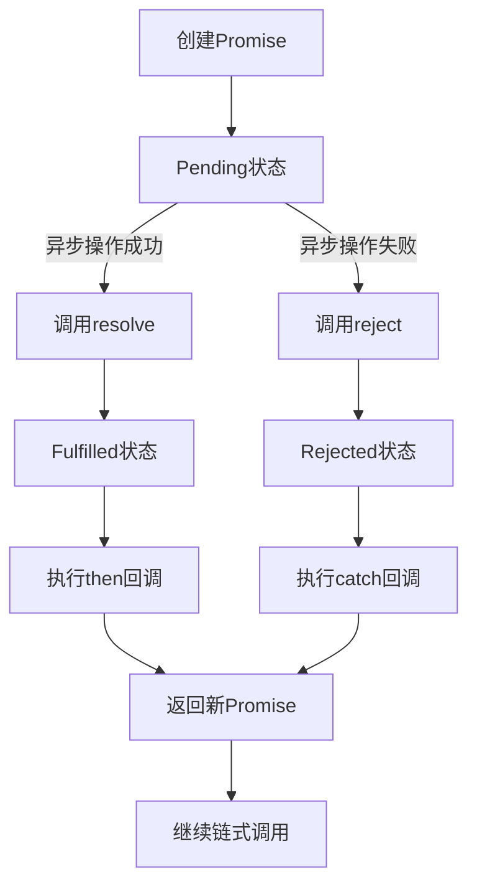

# JavaScript Promise基础

## 什么是Promise？

Promise是JavaScript中用于处理异步操作的对象，它代表了一个异步操作的最终完成（或失败）及其结果值。Promise让我们可以用一种更优雅的方式处理异步代码，避免了传统回调函数可能导致的"回调地狱"问题。

Promise有三种状态：
- **待定（Pending）**：初始状态，既没有被兑现，也没有被拒绝
- **已兑现（Fulfilled）**：操作成功完成
- **已拒绝（Rejected）**：操作失败

:::note
Promise一旦状态改变（从pending变为fulfilled或rejected），就会保持这个状态，不会再变化。这也是Promise名字的由来—它"承诺"未来会有一个确定的结果。
:::

## 创建Promise

让我们来看看如何创建一个Promise：

```javascript
const myPromise = new Promise((resolve, reject) => {
  // 异步操作
  const success = true; // 假设这是异步操作的结果
  
  if (success) {
    // 操作成功
    resolve("操作成功完成！");
  } else {
    // 操作失败
    reject("操作失败！");
  }
});
```

Promise构造函数接收一个executor函数，这个函数接受两个参数：`resolve`和`reject`。执行器函数会立即执行，当异步操作成功时调用`resolve`，失败时调用`reject`。

## 使用Promise

Promise创建后，我们可以使用`.then()`、`.catch()`和`.finally()`方法来处理Promise的结果。

### then方法

`.then()`方法用于指定Promise状态变为fulfilled（已兑现）时的回调函数。

```javascript
myPromise.then((result) => {
  console.log(result); // 输出: "操作成功完成！"
});
```

### catch方法

`.catch()`方法用于指定Promise状态变为rejected（已拒绝）时的回调函数。

```javascript
myPromise.catch((error) => {
  console.error(error); // 如果Promise被拒绝，输出: "操作失败！"
});
```

### finally方法

`.finally()`方法用于指定无论Promise的最终状态如何都会执行的回调函数。

```javascript
myPromise
  .then((result) => {
    console.log(result);
  })
  .catch((error) => {
    console.error(error);
  })
  .finally(() => {
    console.log("Promise已完成，无论成功还是失败");
  });
```

## Promise链式调用

Promise的一个强大特性是可以进行链式调用，这样可以让多个异步操作按顺序执行。

```javascript
function fetchUserData(userId) {
  return new Promise((resolve, reject) => {
    // 模拟API请求
    setTimeout(() => {
      resolve({ id: userId, name: "用户" + userId });
    }, 1000);
  });
}

function fetchUserPosts(user) {
  return new Promise((resolve, reject) => {
    // 模拟API请求
    setTimeout(() => {
      resolve({
        user: user,
        posts: [
          { id: 1, title: 第一篇文章 },
          { id: 2, title: 第二篇文章 }
        ]
      });
    }, 1000);
  });
}

// 链式调用
fetchUserData(123)
  .then(user => {
    console.log("获取到用户:", user);
    return fetchUserPosts(user);
  })
  .then(data => {
    console.log("获取到用户的文章:", data.posts);
  })
  .catch(error => {
    console.error("出错了:", error);
  });
```

输出：
```
获取到用户: {id: 123, name: "用户123"}
获取到用户的文章: [{id: 1, title: 第一篇文章}, {id: 2, title: 第二篇文章}]
```

## Promise并行执行

有时我们需要同时执行多个异步操作，并等待所有操作完成。Promise提供了几个静态方法来处理这种情况。

### Promise.all()

`Promise.all()`方法接收一个Promise数组，当所有Promise都成功时返回一个包含所有结果的数组。如果任何一个Promise失败，则整个`Promise.all()`立即失败。

```javascript
const promise1 = Promise.resolve(3);
const promise2 = new Promise((resolve) => setTimeout(() => resolve("foo"), 100));
const promise3 = fetch("https://jsonplaceholder.typicode.com/todos/1")
                 .then(response => response.json());

Promise.all([promise1, promise2, promise3])
  .then(values => {
    console.log(values); // [3, "foo", {userId: 1, id: 1, title: ..., completed: false}]
  })
  .catch(error => {
    console.error("有一个请求失败:", error);
  });
```

### Promise.race()

`Promise.race()`方法也接收一个Promise数组，但它只返回第一个完成（无论成功或失败）的Promise的结果。

```javascript
const promise1 = new Promise((resolve) => setTimeout(() => resolve("快"), 100));
const promise2 = new Promise((resolve) => setTimeout(() => resolve("慢"), 500));

Promise.race([promise1, promise2])
  .then(result => {
    console.log(result); // "快"
  });
```

### Promise.allSettled()

`Promise.allSettled()`方法等待所有Promise完成（无论是成功还是失败），然后返回一个对象数组，描述每个Promise的结果。

```javascript
const promise1 = Promise.resolve(42);
const promise2 = Promise.reject("出错了");

Promise.allSettled([promise1, promise2])
  .then(results => {
    console.log(results);
    // [
    //   { status: "fulfilled", value: 42 },
    //   { status: "rejected", reason: "出错了" }
    // ]
  });
```

## 实际应用案例

### 案例1: 用户登录与数据获取

```javascript
function login(username, password) {
  return new Promise((resolve, reject) => {
    // 模拟API请求
    setTimeout(() => {
      if (username === "admin" && password === "password") {
        resolve({ token: "abc123", userId: 1 });
      } else {
        reject("用户名或密码不正确");
      }
    }, 1000);
  });
}

function getUserData(token, userId) {
  return new Promise((resolve, reject) => {
    // 模拟API请求
    setTimeout(() => {
      if (token) {
        resolve({
          id: userId,
          name: "管理员",
          email: "admin@example.com",
          permissions: ["read", "write", "delete"]
        });
      } else {
        reject("无效的令牌");
      }
    }, 1000);
  });
}

// 使用Promise进行登录流程
login("admin", "password")
  .then(authData => {
    console.log("登录成功:", authData);
    return getUserData(authData.token, authData.userId);
  })
  .then(userData => {
    console.log("获取用户数据成功:", userData);
    // 做一些有用的事情，比如更新UI
  })
  .catch(error => {
    console.error("错误:", error);
    // 显示错误消息给用户
  })
  .finally(() => {
    console.log("无论成功还是失败，都会隐藏加载指示器");
  });
```

### 案例2: 图片预加载

```javascript
function preloadImage(url) {
  return new Promise((resolve, reject) => {
    const img = new Image();
    img.onload = () => resolve(img);
    img.onerror = () => reject(new Error(`加载图片失败: ${url}`));
    img.src = url;
  });
}

// 预加载多个图片
const urls = [
  'https://example.com/image1.jpg',
  'https://example.com/image2.jpg',
  'https://example.com/image3.jpg'
];

Promise.all(urls.map(url => preloadImage(url)))
  .then(images => {
    console.log("所有图片加载完成");
    // 将图片添加到DOM
    images.forEach(img => document.body.appendChild(img));
  })
  .catch(error => {
    console.error("图片加载失败:", error);
  });
```

## Promise的异步操作流程图

下面的流程图展示了Promise的基本工作原理：



## 总结

Promise是JavaScript异步编程的核心概念，它提供了一种更清晰、更强大的方式来处理异步操作。通过使用Promise，我们可以：

- 避免回调地狱，代码更易读
- 链式处理多个异步操作
- 优雅地处理错误
- 并行执行多个异步任务并等待它们完成

掌握Promise是成为现代JavaScript开发者的必备技能，也是理解更高级异步概念（如async/await）的基础。

## 练习

1. 创建一个函数`delay(ms)`，接受毫秒作为参数，返回一个Promise，在指定时间后resolve。
2. 使用`fetch` API和Promise链接获取一个JSON API的数据，处理结果并显示。
3. 实现一个简单的图片幻灯片，使用Promise.all预加载所有图片，然后显示它们。
4. 创建三个Promise，分别在不同时间完成，使用Promise.race获取最先完成的结果。

## 进一步学习资源

- MDN Web文档: [Promise](https://developer.mozilla.org/zh-CN/docs/Web/JavaScript/Reference/Global_Objects/Promise)
- JavaScript.info: [Promise](https://zh.javascript.info/promise-basics)
- 下一课: JavaScript的async/await语法

:::tip
记住：Promise是处理异步操作的强大工具，但它并不总是最简单的方案。对于简单的情况，传统回调可能更直接；而对于复杂的情况，async/await可能提供更直观的语法。选择正确的工具取决于具体情况！
:::