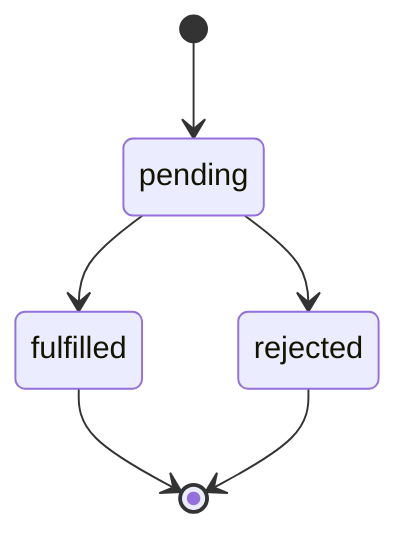

# JavaScript Promise方法

在JavaScript的异步编程中，Promise是一个非常重要的概念，它提供了一种更加优雅的方式来处理异步操作。Promise可以让我们摆脱回调地狱，使代码更加可读、可维护。本文将全面介绍JavaScript中的Promise及其方法。

## 什么是Promise？

Promise是JavaScript中用于处理异步操作的对象，它代表了一个尚未完成但预期将来会完成的操作的结果。简单来说，Promise是一个对未来结果的"承诺"。

Promise有三种状态：
1. **pending（进行中）**：初始状态，既没有被兑现，也没有被拒绝。
2. **fulfilled（已兑现）**：操作成功完成。
3. **rejected（已拒绝）**：操作失败。

一旦Promise的状态改变，就不会再变。状态只能从pending变为fulfilled或者rejected。



## 创建Promise

使用`Promise`构造函数可以创建一个新的Promise对象。构造函数接收一个执行函数，该函数有两个参数：`resolve`和`reject`。

```javascript
const myPromise = new Promise((resolve, reject) => {
  // 异步操作
  const success = true;
  
  if (success) {
    resolve('操作成功');  // 操作成功，Promise状态变为fulfilled
  } else {
    reject('操作失败');  // 操作失败，Promise状态变为rejected
  }
});
```

## Promise的基本方法

### then()

`then()`方法用于指定当Promise状态改变时的回调函数。它接收两个参数：Promise成功时的回调函数和Promise失败时的回调函数（可选）。

```javascript
myPromise.then(
  (value) => {
    console.log('成功:', value);
  },
  (error) => {
    console.log('失败:', error);
  }
);
```

### catch()

`catch()`方法用于指定当Promise被拒绝（rejected）时的回调函数，相当于`.then(null, rejection)`。

```javascript
myPromise.catch((error) => {
  console.log('捕获到错误:', error);
});
```

### finally()

`finally()`方法用于指定无论Promise的状态如何都会执行的回调函数。

```javascript
myPromise
  .then((value) => {
    console.log('成功:', value);
  })
  .catch((error) => {
    console.log('失败:', error);
  })
  .finally(() => {
    console.log('无论成功还是失败，这里都会执行');
  });
```

## Promise链式调用

Promise的一个强大特性是可以进行链式调用，使异步操作的流程更加清晰。每个`then()`方法都返回一个新的Promise对象。

```javascript
new Promise((resolve, reject) => {
  setTimeout(() => resolve(1), 1000);
})
  .then((result) => {
    console.log(result); // 1
    return result * 2;
  })
  .then((result) => {
    console.log(result); // 2
    return result * 2;
  })
  .then((result) => {
    console.log(result); // 4
  });
```

输出：
```
1
2
4
```

## 错误处理

在Promise链中，可以使用`.catch()`来捕获整个链中发生的错误。

```javascript
new Promise((resolve, reject) => {
  throw new Error('出错了！');  // 或者使用 reject(new Error('出错了！'))
})
  .then((result) => {
    // 这里不会执行
    console.log('成功:', result);
  })
  .catch((error) => {
    console.log('捕获到错误:', error.message);
  });
```

输出：
```
捕获到错误: 出错了！
```

:::caution
如果没有使用`.catch()`或在`.then()`中提供错误处理回调，Promise中的错误会被"吞掉"，不会在控制台输出。这可能导致难以调试的问题。
:::

## Promise静态方法

### Promise.resolve()

`Promise.resolve()`方法返回一个以给定值解析后的Promise对象。

```javascript
const resolvedPromise = Promise.resolve('已解决');

resolvedPromise.then((value) => {
  console.log(value);  // 输出: 已解决
});
```

### Promise.reject()

`Promise.reject()`方法返回一个已拒绝（rejected）的Promise对象。

```javascript
const rejectedPromise = Promise.reject('已拒绝');

rejectedPromise.catch((reason) => {
  console.log(reason);  // 输出: 已拒绝
});
```

### Promise.all()

`Promise.all()`方法接收一个Promise对象的数组作为参数，当所有Promise都成功时，返回一个新的Promise，包含所有Promise的结果数组；如果有任何一个Promise失败，则立即返回失败的Promise。

```javascript
const promise1 = Promise.resolve(3);
const promise2 = new Promise((resolve) => setTimeout(() => resolve('foo'), 1000));
const promise3 = Promise.resolve(42);

Promise.all([promise1, promise2, promise3]).then((values) => {
  console.log(values);  // 输出: [3, "foo", 42]
});
```

### Promise.race()

`Promise.race()`方法接收一个Promise对象的数组作为参数，返回一个新的Promise，一旦数组中的任意一个Promise解决或拒绝，返回的Promise就会解决或拒绝。

```javascript
const promise1 = new Promise((resolve) => setTimeout(() => resolve('one'), 1000));
const promise2 = new Promise((resolve) => setTimeout(() => resolve('two'), 500));

Promise.race([promise1, promise2])
  .then((value) => {
    console.log(value);  // 输出: two（因为promise2更快）
  });
```

### Promise.allSettled()

`Promise.allSettled()`方法接收一个Promise对象的数组作为参数，返回一个新的Promise，该Promise在所有输入的Promise都已经fulfilled或rejected后才会resolve，并且它的解决值是一个对象数组，每个对象表示对应的Promise的结果。

```javascript
const promise1 = Promise.resolve(3);
const promise2 = new Promise((resolve, reject) => setTimeout(() => reject('error'), 1000));

Promise.allSettled([promise1, promise2])
  .then((results) => {
    console.log(results);
    // 输出:
    // [
    //   {status: "fulfilled", value: 3},
    //   {status: "rejected", reason: "error"}
    // ]
  });
```

### Promise.any()

`Promise.any()`方法接收一个Promise对象的数组作为参数，返回一个新的Promise。一旦数组中的任意一个Promise成功，返回的Promise就会成功；如果所有的Promise都失败，则返回的Promise会失败。

```javascript
const promise1 = Promise.reject('错误1');
const promise2 = new Promise((resolve) => setTimeout(() => resolve('成功'), 1000));
const promise3 = Promise.reject('错误3');

Promise.any([promise1, promise2, promise3])
  .then((value) => {
    console.log(value);  // 输出: 成功
  })
  .catch((error) => {
    console.log(error);  // 如果所有Promise都失败，会执行这里
  });
```

## 实际应用案例

### 1. 网络请求

使用Promise处理AJAX请求：

```javascript
function fetchData(url) {
  return new Promise((resolve, reject) => {
    const xhr = new XMLHttpRequest();
    xhr.open('GET', url);
    xhr.onload = () => {
      if (xhr.status === 200) {
        resolve(JSON.parse(xhr.responseText));
      } else {
        reject(`Error: ${xhr.status}`);
      }
    };
    xhr.onerror = () => reject('Network Error');
    xhr.send();
  });
}

// 使用
fetchData('https://api.example.com/data')
  .then((data) => {
    console.log('获取的数据:', data);
  })
  .catch((error) => {
    console.error('获取数据失败:', error);
  });
```

### 2. 图片加载

使用Promise来处理图片加载：

```javascript
function loadImage(url) {
  return new Promise((resolve, reject) => {
    const image = new Image();
    image.onload = () => resolve(image);
    image.onerror = () => reject(new Error(`Failed to load image at ${url}`));
    image.src = url;
  });
}

// 使用
loadImage('example.jpg')
  .then((image) => {
    document.body.appendChild(image);
    console.log('Image loaded successfully');
  })
  .catch((error) => {
    console.error(error);
  });
```

### 3. 延时执行

使用Promise来创建延时执行的函数：

```javascript
function delay(ms) {
  return new Promise((resolve) => setTimeout(resolve, ms));
}

// 使用
console.log('开始');
delay(2000)
  .then(() => {
    console.log('2秒后执行');
    return delay(1000);
  })
  .then(() => {
    console.log('再1秒后执行');
  });
```

输出：
```
开始
（2秒后）
2秒后执行
（1秒后）
再1秒后执行
```

### 4. 并行请求数据

使用`Promise.all()`同时请求多个数据：

```javascript
// 假设我们有三个API端点
const fetchUser = () => fetch('https://api.example.com/user').then(res => res.json());
const fetchPosts = () => fetch('https://api.example.com/posts').then(res => res.json());
const fetchComments = () => fetch('https://api.example.com/comments').then(res => res.json());

// 并行请求所有数据
Promise.all([fetchUser(), fetchPosts(), fetchComments()])
  .then(([user, posts, comments]) => {
    console.log('用户:', user);
    console.log('文章:', posts);
    console.log('评论:', comments);
    // 现在我们可以一次性处理所有数据
  })
  .catch((error) => {
    console.error('至少有一个请求失败:', error);
  });
```

## Promise的限制和最佳实践

### 限制

1. **一旦状态改变，就不能再变**：Promise状态从pending变为fulfilled或rejected后，就不能再改变。
2. **无法取消**：一旦创建Promise，就无法取消。
3. **无法获取进度**：Promise只能表示"完成"或"失败"，无法获取异步操作的进度。

### 最佳实践

1. **总是返回Promise**：在Promise链中的每个函数都应该返回Promise，以便继续链式调用。
2. **捕获错误**：确保在Promise链的末尾加上`.catch()`，以捕获可能出现的错误。
3. **避免嵌套Promise**：尽量使用链式调用而不是嵌套Promise，以避免类似回调地狱的问题。
4. **使用更简洁的语法**：如果可能，使用`async/await`语法，它构建在Promise之上，使异步代码更易读。

## 总结

Promise是JavaScript中处理异步操作的一种强大机制，它提供了一种清晰、可组合的方式来处理异步操作的结果。本文介绍了Promise的基本概念、创建方式、方法（如`then`、`catch`、`finally`）以及静态方法（如`Promise.all`、`Promise.race`等），并通过实际案例展示了Promise在网络请求、图片加载等场景下的应用。

掌握Promise不仅可以帮助你编写更加清晰、可维护的异步代码，还为学习更高级的异步编程技术（如`async/await`）打下基础。

## 练习

1. 创建一个函数，使用Promise实现一个简单的延时计时器。
2. 使用`Promise.all()`实现同时加载多张图片，并在所有图片加载完成后显示。
3. 尝试使用`Promise.race()`实现请求超时处理：如果请求时间超过预定的时间，就返回超时错误。
4. 尝试实现一个简单的Promise链，包含至少三个连续的异步操作，并处理可能出现的错误。

## 更多资源

- [MDN Web Docs: Promise](https://developer.mozilla.org/zh-CN/docs/Web/JavaScript/Reference/Global_Objects/Promise)
- [JavaScript Promise 对象](https://www.runoob.com/js/js-promise.html)
- [Promise/A+规范](https://promisesaplus.com/)

:::tip
深入理解Promise的工作原理和使用方法，将大大提高你处理JavaScript异步编程的能力。随着实践经验的积累，你会发现Promise是处理复杂异步流程的强大工具。
:::