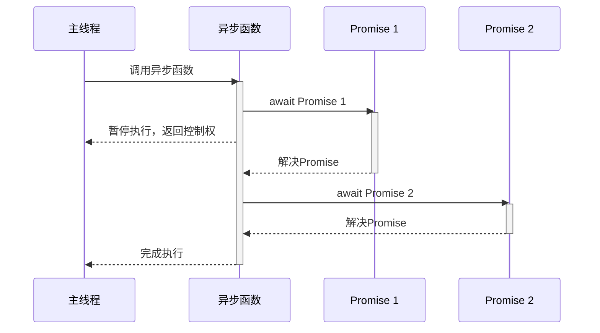
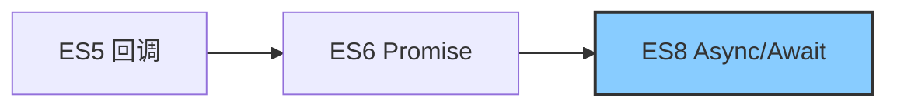

# JavaScript Async Await

## 什么是Async/Await？

Async/Await是JavaScript中处理异步操作的现代语法，它建立在Promise之上，让异步代码看起来和执行起来更像是同步代码。这种语法糖使得编写和理解异步逻辑变得更加简单和直观。

:::note 简单理解
Async/Await = 异步编程 + 同步写法 = 优雅处理异步操作
:::

## 基础知识

### Async关键字

当我们在函数前面加上`async`关键字，这个函数就会自动返回一个Promise。函数内部的返回值会被Promise.resolve()包装，而抛出的错误会被Promise.reject()捕获。

```javascript
// 普通函数
function normalFunction() {
  return "Hello";
}

// 异步函数
async function asyncFunction() {
  return "Hello";
}

console.log(normalFunction()); // 输出: Hello
console.log(asyncFunction()); // 输出: Promise { 'Hello' }

// 使用异步函数返回的Promise
asyncFunction().then(result => {
  console.log(result); // 输出: Hello
});
```

### Await关键字

`await`关键字只能在`async`函数内部使用。它会暂停当前`async`函数的执行，等待Promise解决，然后继续执行函数并返回解决的结果。

```javascript
function fetchData() {
  return new Promise((resolve) => {
    setTimeout(() => {
      resolve("数据获取成功！");
    }, 2000);
  });
}

async function getData() {
  console.log("开始获取数据...");
  const result = await fetchData(); // 等待Promise完成
  console.log(result);
  console.log("数据处理完毕!");
}

getData();
// 输出:
// 开始获取数据...
// (等待2秒)
// 数据获取成功！
// 数据处理完毕!
```

## 错误处理

在使用Async/Await时，我们可以使用传统的try/catch语句来捕获错误，这比Promise的.catch()方法更加直观。

```javascript
function fetchData() {
  return new Promise((resolve, reject) => {
    setTimeout(() => {
      reject(new Error("网络错误!"));
    }, 1000);
  });
}

async function getData() {
  try {
    console.log("开始获取数据...");
    const result = await fetchData();
    console.log(result);
  } catch (error) {
    console.error("捕获到错误:", error.message);
  } finally {
    console.log("无论成功还是失败，这里都会执行");
  }
}

getData();
// 输出:
// 开始获取数据...
// (等待1秒)
// 捕获到错误: 网络错误!
// 无论成功还是失败，这里都会执行
```

## 串行与并行执行

### 串行执行

当多个await语句按顺序排列时，它们会串行执行，即一个操作完成后才会开始下一个：

```javascript
async function serialExecution() {
  console.time("串行执行");
  
  const result1 = await new Promise(resolve => 
    setTimeout(() => resolve("第一个结果"), 1000)
  );
  console.log(result1);
  
  const result2 = await new Promise(resolve => 
    setTimeout(() => resolve("第二个结果"), 1000)
  );
  console.log(result2);
  
  console.timeEnd("串行执行");
}

serialExecution();
// 输出:
// 第一个结果
// 第二个结果
// 串行执行: 约2000ms
```

### 并行执行

如果我们希望异步操作并行执行以提高效率，可以使用`Promise.all()`：

```javascript
async function parallelExecution() {
  console.time("并行执行");
  
  const [result1, result2] = await Promise.all([
    new Promise(resolve => setTimeout(() => resolve("第一个结果"), 1000)),
    new Promise(resolve => setTimeout(() => resolve("第二个结果"), 1000))
  ]);
  
  console.log(result1);
  console.log(result2);
  
  console.timeEnd("并行执行");
}

parallelExecution();
// 输出:
// 第一个结果
// 第二个结果
// 并行执行: 约1000ms
```

## 异步函数过程可视化

下面的图表展示了一个异步函数的执行流程：



## 实际应用案例

### 案例1：API数据获取与处理

```javascript
async function fetchUserData(userId) {
  try {
    // 获取用户信息
    const userResponse = await fetch(`https://api.example.com/users/${userId}`);
    
    if (!userResponse.ok) {
      throw new Error(`HTTP错误: ${userResponse.status}`);
    }
    
    const userData = await userResponse.json();
    
    // 获取用户的帖子
    const postsResponse = await fetch(`https://api.example.com/users/${userId}/posts`);
    
    if (!postsResponse.ok) {
      throw new Error(`HTTP错误: ${postsResponse.status}`);
    }
    
    const postsData = await postsResponse.json();
    
    // 组合数据
    return {
      user: userData,
      posts: postsData
    };
  } catch (error) {
    console.error("获取用户数据失败:", error.message);
    throw error; // 可以选择重新抛出错误
  }
}

// 使用这个函数
async function displayUserProfile() {
  try {
    const userData = await fetchUserData(123);
    console.log("用户名:", userData.user.name);
    console.log(`用户发表了${userData.posts.length}篇文章`);
  } catch (error) {
    console.error("显示用户资料失败");
  }
}
```

### 案例2：加载和处理图片

```javascript
function loadImage(url) {
  return new Promise((resolve, reject) => {
    const img = new Image();
    img.onload = () => resolve(img);
    img.onerror = () => reject(new Error(`加载图片失败: ${url}`));
    img.src = url;
  });
}

async function processGallery(imageUrls) {
  const gallery = document.querySelector('#gallery');
  
  for (const url of imageUrls) {
    try {
      // 加载单个图片
      const img = await loadImage(url);
      
      // 创建缩略图并添加到画廊
      const thumbnail = document.createElement('div');
      thumbnail.className = 'thumbnail';
      thumbnail.appendChild(img);
      gallery.appendChild(thumbnail);
      
      console.log(`图片已加载: ${url}`);
    } catch (error) {
      console.error(error.message);
      // 创建错误占位符
      const errorPlaceholder = document.createElement('div');
      errorPlaceholder.className = 'error-placeholder';
      errorPlaceholder.textContent = '图片加载失败';
      gallery.appendChild(errorPlaceholder);
    }
  }
  
  console.log('所有图片处理完毕');
}
```

### 案例3：动画序列控制

```javascript
function delay(ms) {
  return new Promise(resolve => setTimeout(resolve, ms));
}

async function animateElement() {
  const element = document.querySelector('#animated-box');
  
  // 序列动画
  try {
    // 淡入
    element.style.opacity = '0';
    element.style.display = 'block';
    
    for (let i = 0; i <= 10; i++) {
      element.style.opacity = i / 10;
      await delay(50);
    }
    
    // 移动
    for (let i = 0; i <= 100; i++) {
      element.style.transform = `translateX(${i}px)`;
      await delay(10);
    }
    
    // 改变颜色
    element.style.backgroundColor = 'red';
    await delay(500);
    element.style.backgroundColor = 'blue';
    await delay(500);
    
    // 淡出
    for (let i = 10; i >= 0; i--) {
      element.style.opacity = i / 10;
      await delay(50);
    }
    
    element.style.display = 'none';
  } catch (error) {
    console.error("动画执行出错:", error);
  }
}
```

## 高级技巧

### 避免常见陷阱

1. **忘记使用await**：

```javascript
async function fetchData() {
  try {
    // 错误: 没有使用await
    const response = fetch('https://api.example.com/data');
    const data = response.json(); // 这里会出错，因为response是Promise
    
    // 正确: 使用await
    const response = await fetch('https://api.example.com/data');
    const data = await response.json();
    return data;
  } catch (error) {
    console.error(error);
  }
}
```

2. **在顶层代码中使用await**：

```javascript
// 错误: 在非async函数中使用await
const data = await fetchData(); // 这会导致语法错误

// 正确: 使用立即执行的异步函数
(async () => {
  const data = await fetchData();
  console.log(data);
})();
```

3. **处理循环中的异步操作**：

```javascript
// 不推荐: 在forEach中使用异步操作
async function processItems(items) {
  items.forEach(async (item) => {
    // forEach不会等待这些Promise完成
    const result = await processItem(item);
    console.log(result);
  });
  console.log("所有项目已处理"); // 这会在所有异步操作开始前就执行
}

// 推荐: 使用for...of循环
async function processItems(items) {
  for (const item of items) {
    const result = await processItem(item);
    console.log(result);
  }
  console.log("所有项目已处理"); // 这会在所有异步操作完成后执行
}
```

### 同步与异步执行的比较

:::tip 使用场景对比
- **setTimeout/回调** - 简单的延迟执行
- **Promise** - 中等复杂度的异步操作
- **Async/Await** - 复杂的异步操作流程，需要良好可读性
:::

```javascript
// 1. 回调方式
function fetchDataCallback(callback) {
  setTimeout(() => {
    callback(null, "数据");
  }, 1000);
}

// 2. Promise方式
function fetchDataPromise() {
  return new Promise((resolve) => {
    setTimeout(() => {
      resolve("数据");
    }, 1000);
  });
}

// 3. Async/Await方式
async function fetchDataAsyncAwait() {
  return new Promise((resolve) => {
    setTimeout(() => {
      resolve("数据");
    }, 1000);
  });
}

// 使用回调
fetchDataCallback((error, data) => {
  console.log(data);
});

// 使用Promise
fetchDataPromise()
  .then(data => {
    console.log(data);
  });

// 使用Async/Await
async function getData() {
  const data = await fetchDataAsyncAwait();
  console.log(data);
}
```

## 浏览器兼容性

Async/Await是ECMAScript 2017 (ES8) 标准的一部分，大多数现代浏览器都支持这一特性。对于旧版浏览器，可以使用Babel等工具进行转译。



## 总结

Async/Await是JavaScript异步编程的一次重大进步，它提供了以下优势：

1. **简洁可读性**：使异步代码看起来像同步代码
2. **错误处理**：使用try/catch处理异步错误
3. **调试友好**：可以在异步函数中正常使用断点和步进
4. **链式操作**：轻松处理依赖于前一个结果的多个异步操作

记住，虽然Async/Await使异步代码看起来像同步代码，但它并不会阻塞主线程，JavaScript仍然保持其事件驱动的非阻塞特性。

## 练习与挑战

1. 创建一个异步函数，使用`fetch` API从公共API获取数据并显示结果
2. 实现一个加载指示器，在异步操作进行时显示，完成后隐藏
3. 使用Async/Await重构使用Promise的现有代码
4. 创建一个同时并行处理多个异步操作的函数

## 进一步学习资源

- MDN Web文档: [async function](https://developer.mozilla.org/zh-CN/docs/Web/JavaScript/Reference/Statements/async_function)
- MDN Web文档: [await](https://developer.mozilla.org/zh-CN/docs/Web/JavaScript/Reference/Operators/await)
- JavaScript.Info: [Async/await](https://zh.javascript.info/async-await)

:::caution 注意
Async/Await 虽然让异步代码看起来像同步代码，但底层仍然是异步执行的。不要混淆这一点，特别是在性能关键型应用程序中。
:::