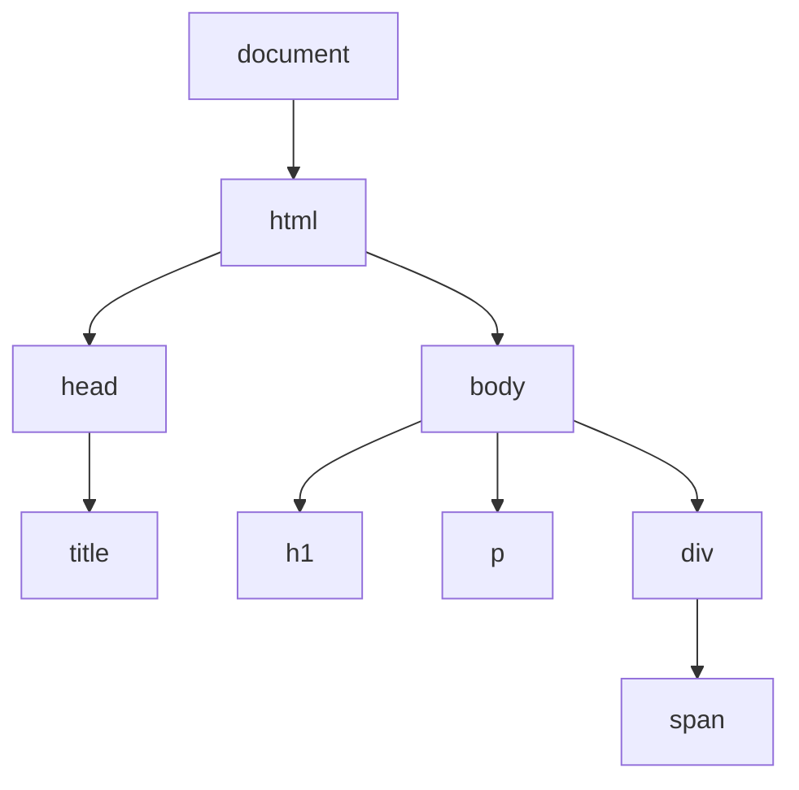

# JavaScript DOM基础

## 什么是DOM？

DOM(Document Object Model，文档对象模型)是HTML和XML文档的编程接口。它将网页表示为一个树状结构，其中每个节点都是文档的一部分，如元素、属性和文本等。通过JavaScript，我们可以访问和操作DOM，从而动态地更改网页的内容、结构和样式。



## DOM的重要性

DOM是JavaScript与HTML页面交互的桥梁。通过DOM，你可以：
- 动态修改HTML元素内容
- 改变元素的CSS样式
- 对用户事件做出反应
- 创建新的HTML元素
- 移除现有元素

## 访问DOM元素

要操作DOM元素，首先需要访问它们。JavaScript提供了多种方法来获取DOM元素：

### 通过ID获取元素

```javascript
const element = document.getElementById('myId');
```

### 通过类名获取元素

```javascript
const elements = document.getElementsByClassName('myClass');
```

### 通过标签名获取元素

```javascript
const elements = document.getElementsByTagName('p');
```

### 使用CSS选择器获取元素

```javascript
// 获取第一个匹配的元素
const element = document.querySelector('.myClass');

// 获取所有匹配的元素
const elements = document.querySelectorAll('p.intro');
```

:::tip
`querySelector`和`querySelectorAll`在现代Web开发中使用更为广泛，因为它们支持复杂的CSS选择器。
:::

## 修改DOM元素

一旦获取了DOM元素，就可以对其进行各种操作：

### 修改元素内容

```javascript
// 修改元素的文本内容
element.textContent = '新文本内容';

// 修改元素的HTML内容
element.innerHTML = '<span>新的HTML内容</span>';
```

### 修改元素属性

```javascript
// 获取属性
const src = element.getAttribute('src');

// 设置属性
element.setAttribute('href', 'https://example.com');

// 直接通过属性名设置
element.id = 'newId';
element.className = 'newClass';
```

### 修改元素样式

```javascript
// 直接修改样式
element.style.color = 'red';
element.style.fontSize = '20px';
element.style.display = 'none';

// 添加或移除CSS类
element.classList.add('highlight');
element.classList.remove('old-class');
element.classList.toggle('active');
element.classList.contains('active'); // 检查是否包含某个类
```

## 创建和删除元素

### 创建新元素

```javascript
// 创建新元素
const newElement = document.createElement('div');

// 设置元素内容和属性
newElement.textContent = '这是一个新创建的div元素';
newElement.className = 'new-class';

// 将新元素添加到DOM树
document.body.appendChild(newElement);
```

### 插入元素

```javascript
// 在指定元素之前插入
parentElement.insertBefore(newElement, referenceElement);

// 使用更现代的方法
parentElement.prepend(newElement); // 在开头插入
parentElement.append(newElement);  // 在末尾插入
referenceElement.before(newElement); // 在参考元素之前插入
referenceElement.after(newElement);  // 在参考元素之后插入
```

### 删除元素

```javascript
// 移除元素
element.remove();

// 旧方法：通过父元素移除
parentElement.removeChild(element);
```

## DOM事件

DOM事件允许JavaScript对HTML元素的各种事件作出反应，如点击、鼠标移动、键盘输入等。

### 添加事件监听器

```javascript
const button = document.getElementById('myButton');

// 方法1：使用addEventListener
button.addEventListener('click', function() {
  alert('按钮被点击了！');
});

// 方法2：使用on-event属性
button.onclick = function() {
  alert('按钮被点击了！');
};
```

### 常见事件类型

- **鼠标事件**: `click`, `dblclick`, `mousedown`, `mouseup`, `mousemove`, `mouseover`, `mouseout`
- **键盘事件**: `keydown`, `keyup`, `keypress`
- **表单事件**: `submit`, `change`, `focus`, `blur`
- **窗口事件**: `load`, `resize`, `scroll`, `unload`

### 事件对象

当事件被触发时，浏览器会创建一个事件对象，包含有关事件的信息：

```javascript
button.addEventListener('click', function(event) {
  // 阻止默认行为
  event.preventDefault();
  
  // 阻止事件冒泡
  event.stopPropagation();
  
  // 获取触发事件的元素
  console.log(event.target);
  
  // 获取鼠标坐标
  console.log(event.clientX, event.clientY);
});
```

## 实际应用案例

### 案例1：动态表单验证

```javascript
const form = document.getElementById('registrationForm');
const usernameInput = document.getElementById('username');
const usernameError = document.getElementById('usernameError');

usernameInput.addEventListener('blur', function() {
  if (usernameInput.value.length < 5) {
    usernameError.textContent = '用户名长度必须至少为5个字符';
    usernameInput.classList.add('error');
  } else {
    usernameError.textContent = '';
    usernameInput.classList.remove('error');
  }
});

form.addEventListener('submit', function(event) {
  if (usernameInput.value.length < 5) {
    event.preventDefault();
    alert('请修正表单错误后再提交');
  }
});
```

### 案例2：创建动态导航菜单

```javascript
const menuItems = [
  { text: '首页', url: 'index.html' },
  { text: '关于我们', url: 'about.html' },
  { text: '服务', url: 'services.html' },
  { text: '联系我们', url: 'contact.html' }
];

const navElement = document.getElementById('mainNav');
const ul = document.createElement('ul');

menuItems.forEach(item => {
  const li = document.createElement('li');
  const a = document.createElement('a');
  
  a.textContent = item.text;
  a.href = item.url;
  
  // 检查当前页面是否为活动页面
  if (window.location.href.includes(item.url)) {
    a.classList.add('active');
  }
  
  li.appendChild(a);
  ul.appendChild(li);
});

navElement.appendChild(ul);
```

### 案例3：实现图片轮播

```javascript
const images = ['image1.jpg', 'image2.jpg', 'image3.jpg'];
const sliderImage = document.getElementById('sliderImage');
const prevBtn = document.getElementById('prevBtn');
const nextBtn = document.getElementById('nextBtn');
let currentIndex = 0;

// 显示当前图片
function showImage(index) {
  sliderImage.src = images[index];
}

// 下一张图片
nextBtn.addEventListener('click', function() {
  currentIndex = (currentIndex + 1) % images.length;
  showImage(currentIndex);
});

// 上一张图片
prevBtn.addEventListener('click', function() {
  currentIndex = (currentIndex - 1 + images.length) % images.length;
  showImage(currentIndex);
});

// 初始显示第一张图片
showImage(currentIndex);

// 自动轮播
setInterval(function() {
  currentIndex = (currentIndex + 1) % images.length;
  showImage(currentIndex);
}, 3000);
```

## DOM操作的性能考虑

当进行大量DOM操作时，需要注意性能问题：

1. **减少重排和重绘**：每次修改DOM可能导致浏览器重新计算页面布局，影响性能。
   
2. **使用文档片段**：当需要添加多个元素时，使用`DocumentFragment`可以减少页面重绘次数：

```javascript
const fragment = document.createDocumentFragment();
for (let i = 0; i < 1000; i++) {
  const newElement = document.createElement('div');
  newElement.textContent = `Item ${i}`;
  fragment.appendChild(newElement);
}
document.body.appendChild(fragment);
```

3. **事件委托**：利用事件冒泡，在父元素上设置一个事件处理函数，而不是为每个子元素单独设置：

```javascript
// 不好的做法：为每个按钮添加点击事件
document.querySelectorAll('.button').forEach(button => {
  button.addEventListener('click', handleClick);
});

// 好的做法：利用事件委托
document.querySelector('.button-container').addEventListener('click', function(event) {
  if (event.target.classList.contains('button')) {
    handleClick(event);
  }
});
```

## 总结

JavaScript DOM是前端开发的基础，通过它我们可以：

- 访问HTML元素
- 修改元素内容和属性
- 添加和删除元素
- 响应用户事件
- 动态改变网页内容和样式

掌握DOM操作技能是成为一名高效前端开发者的关键。随着你的技能提升，还可以探索更高级的DOM操作技术和框架，如React、Vue等。

## 练习

为了巩固所学知识，尝试完成以下练习：

1. 创建一个简单的待办事项列表，允许用户添加新项目、标记项目为已完成和删除项目。
2. 实现一个简单的表单验证，验证电子邮件格式是否正确。
3. 创建一个图片库，点击缩略图时在主视图中显示大图。
4. 实现一个简单的手风琴菜单，点击标题时展开或折叠内容。

## 其他资源

要深入学习DOM，可以参考以下资源：

- [MDN Web Docs上的DOM文档](https://developer.mozilla.org/zh-CN/docs/Web/API/Document_Object_Model)
- [JavaScript.info上的DOM操作教程](https://javascript.info/document)
- [W3Schools的DOM教程](https://www.w3schools.com/js/js_htmldom.asp)

:::caution
在操作DOM时，始终记得考虑跨浏览器兼容性问题，尤其是当你需要支持旧版浏览器时。
:::