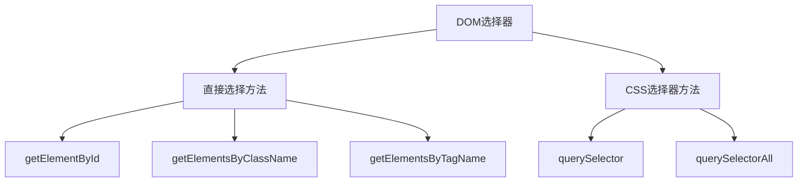

# JavaScript DOM选择器

## 什么是DOM选择器？

DOM（Document Object Model，文档对象模型）选择器是JavaScript提供的一种方式，用于在网页中查找和选择HTML元素。通过DOM选择器，我们可以轻松地获取页面中的元素，并对其进行修改、添加事件监听器或者执行其他操作。

在学习DOM选择器之前，我们需要理解一个基本概念：当浏览器加载HTML文档时，会将其解析成一个树状结构，这就是DOM树。DOM树中的每个节点代表文档中的一个元素、属性或文本。

:::note
DOM选择器是前端开发中最基础也是最常用的技能之一，掌握它们对于任何JavaScript开发者来说都是必不可少的。
:::

## 基本DOM选择器

JavaScript提供了多种方法来选择DOM元素。以下是最常用的几种：

### 1. getElementById

`getElementById`方法是最直接的选择器之一，它通过元素的ID属性来获取元素。

```javascript
// HTML: <div id="myDiv">Hello World!</div>
const element = document.getElementById("myDiv");
console.log(element.innerHTML); // 输出: Hello World!
```

### 2. getElementsByClassName

`getElementsByClassName`方法返回具有指定类名的所有元素的集合（HTMLCollection）。

```javascript
// HTML: 
// <div class="info">Info 1</div>
// <div class="info">Info 2</div>
const elements = document.getElementsByClassName("info");
console.log(elements.length); // 输出: 2
console.log(elements[0].innerHTML); // 输出: Info 1
```

### 3. getElementsByTagName

`getElementsByTagName`方法返回具有指定标签名的所有元素的集合。

```javascript
// HTML: 
// <p>第一段</p>
// <p>第二段</p>
const paragraphs = document.getElementsByTagName("p");
console.log(paragraphs.length); // 输出: 2
console.log(paragraphs[1].innerHTML); // 输出: 第二段
```

### 4. querySelector

`querySelector`方法返回匹配指定CSS选择器的第一个元素。

```javascript
// HTML:
// <div class="container">
//   <p class="text">Hello</p>
//   <p class="text">World</p>
// </div>
const element = document.querySelector(".container .text");
console.log(element.innerHTML); // 输出: Hello
```

### 5. querySelectorAll

`querySelectorAll`方法返回匹配指定CSS选择器的所有元素的列表（NodeList）。

```javascript
// HTML: 同上
const elements = document.querySelectorAll(".container .text");
console.log(elements.length); // 输出: 2
elements.forEach(element => {
  console.log(element.innerHTML);
});
// 输出:
// Hello
// World
```

## 选择器的对比与选择

各种选择器方法有其优缺点和适用场景：



| 选择器方法 | 返回值类型 | 实时更新 | 性能 | 灵活性 |
|------------|------------|---------|------|-------|
| getElementById | 单个元素 | 不适用 | 最快 | 仅限ID |
| getElementsByClassName | HTMLCollection | ✓ | 快 | 仅限类名 |
| getElementsByTagName | HTMLCollection | ✓ | 快 | 仅限标签名 |
| querySelector | 单个元素 | ✗ | 较慢 | 高（支持CSS选择器） |
| querySelectorAll | NodeList | ✗ | 较慢 | 高（支持CSS选择器） |

:::tip
在进行DOM操作时，优先考虑`getElementById`（如果您知道元素ID）以获得最佳性能。如果需要更复杂的选择，再使用`querySelector`或`querySelectorAll`。
:::

## 在选择器基础上操作DOM

选择元素后，我们可以对它们进行各种操作：

### 修改内容

```javascript
const heading = document.getElementById("title");
heading.innerHTML = "新标题"; // 修改元素的HTML内容
heading.textContent = "纯文本标题"; // 修改元素的文本内容
```

### 修改样式

```javascript
const box = document.querySelector(".box");
box.style.backgroundColor = "blue";
box.style.width = "200px";
box.style.padding = "20px";
```

### 修改属性

```javascript
const link = document.getElementById("myLink");
link.setAttribute("href", "https://www.example.com");
link.setAttribute("target", "_blank");
```

### 添加/删除类

```javascript
const element = document.querySelector(".item");
element.classList.add("active"); // 添加类
element.classList.remove("hidden"); // 删除类
element.classList.toggle("selected"); // 切换类
```

## 实际应用案例

### 案例1：动态切换样式

```javascript
// HTML:
// <button id="themeToggle">切换主题</button>
// <div id="content" class="light-theme">内容区域</div>

document.getElementById("themeToggle").addEventListener("click", function() {
  const content = document.getElementById("content");
  if (content.classList.contains("light-theme")) {
    content.classList.remove("light-theme");
    content.classList.add("dark-theme");
  } else {
    content.classList.remove("dark-theme");
    content.classList.add("light-theme");
  }
});
```

### 案例2：表单验证

```javascript
// HTML:
// <form id="myForm">
//   <input type="text" id="username" placeholder="用户名">
//   <span id="error" class="error-message"></span>
//   <button type="submit">提交</button>
// </form>

document.getElementById("myForm").addEventListener("submit", function(e) {
  const username = document.getElementById("username").value;
  const error = document.getElementById("error");
  
  if (username.length < 3) {
    e.preventDefault();
    error.textContent = "用户名至少需要3个字符";
  } else {
    error.textContent = "";
  }
});
```

### 案例3：动态创建元素列表

```javascript
// HTML:
// <button id="addItem">添加项目</button>
// <ul id="itemList"></ul>

let counter = 1;
document.getElementById("addItem").addEventListener("click", function() {
  const list = document.getElementById("itemList");
  const newItem = document.createElement("li");
  newItem.textContent = `项目 ${counter}`;
  counter++;
  list.appendChild(newItem);
});
```

## 高级选择技巧

### 组合选择器

使用`querySelectorAll`时，我们可以组合多个选择器：

```javascript
// 选择所有带有class="important"的段落
const elements = document.querySelectorAll("p.important");

// 选择id为"main"的元素内的所有链接
const mainLinks = document.querySelectorAll("#main a");

// 选择直接子元素
const directChildren = document.querySelectorAll("#parent > .child");
```

### 使用属性选择器

```javascript
// 选择所有带有data-role="button"属性的元素
const buttons = document.querySelectorAll("[data-role='button']");

// 选择所有href属性以https开头的链接
const secureLinks = document.querySelectorAll("a[href^='https']");
```

### 通过DOM遍历关系选择元素

除了选择器外，我们还可以通过元素之间的关系来访问元素：

```javascript
const parent = document.getElementById("parent");
const firstChild = parent.firstElementChild; // 第一个子元素
const allChildren = parent.children; // 所有子元素
const nextSibling = parent.nextElementSibling; // 下一个兄弟元素
```

:::caution
注意区分`children`（只包含元素节点）和`childNodes`（包含所有类型的节点，包括文本节点和注释节点）。
:::

## 性能考虑

在选择DOM元素时，性能是一个重要因素：

1. **缓存DOM引用**：如果需要多次使用同一元素，将其保存在变量中。

```javascript
// 低效方式
document.getElementById("myButton").addEventListener("click", function() {
  document.getElementById("myButton").classList.add("clicked");
});

// 更高效方式
const myButton = document.getElementById("myButton");
myButton.addEventListener("click", function() {
  myButton.classList.add("clicked");
});
```

2. **使用更具体的选择器**：尽量使用ID选择器，因为它们更快。

3. **限制选择范围**：如果只需要在特定容器内选择元素，先选择容器，然后在容器内查找。

```javascript
// 低效方式
const items = document.querySelectorAll(".item");

// 更高效方式（如果项目都在container内）
const container = document.getElementById("container");
const items = container.querySelectorAll(".item");
```

## 总结

DOM选择器是JavaScript操作网页的基础工具。通过不同的选择器方法，我们可以精确地找到需要操作的HTML元素。

主要的选择器方法包括：
- `getElementById`：通过ID快速选择单个元素
- `getElementsByClassName`：选择具有特定类名的所有元素
- `getElementsByTagName`：选择特定标签的所有元素
- `querySelector`：使用CSS选择器语法选择第一个匹配元素
- `querySelectorAll`：使用CSS选择器语法选择所有匹配元素

在实际应用中，选择合适的选择器方法取决于你的具体需求、性能考虑以及代码可读性。

## 练习任务

1. 创建一个HTML页面，包含不同类型的元素（带有ID、类和不同的标签），尝试使用不同的选择器方法选择它们。
2. 编写一个脚本，当用户点击按钮时，找到页面上所有带有特定类名的段落，并更改它们的文本颜色。
3. 创建一个简单的待办事项列表，允许用户添加新项目、标记完成的项目和删除项目。使用DOM选择器来操作列表元素。

## 额外资源

- [MDN Web Docs: Document.querySelector()](https://developer.mozilla.org/zh-CN/docs/Web/API/Document/querySelector)
- [MDN Web Docs: Document.querySelectorAll()](https://developer.mozilla.org/zh-CN/docs/Web/API/Document/querySelectorAll)
- [MDN Web Docs: Document.getElementById()](https://developer.mozilla.org/zh-CN/docs/Web/API/Document/getElementById)
- [W3Schools: JavaScript HTML DOM](https://www.w3schools.com/js/js_htmldom.asp)

通过掌握这些DOM选择器技巧，你将能够更有效地创建动态和交互式的网页应用！