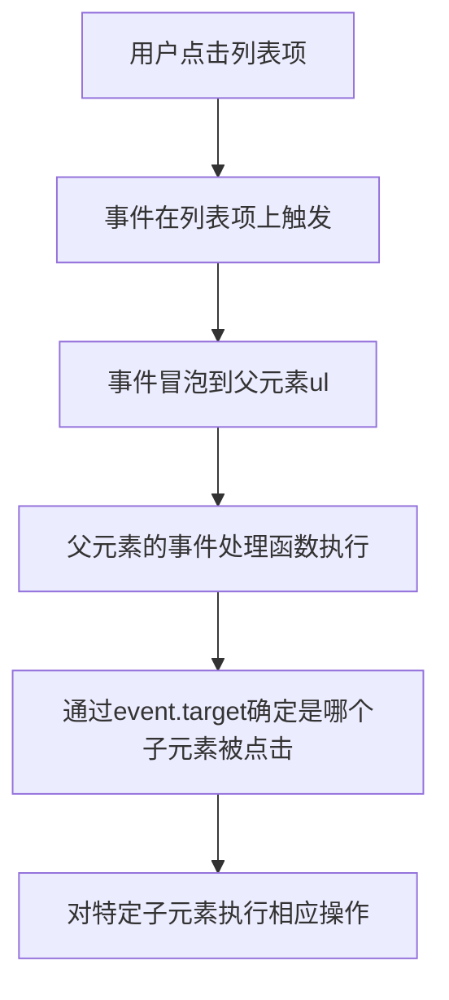

# JavaScript 事件委托

## 什么是事件委托？

事件委托（Event Delegation）是一种利用事件冒泡原理来管理事件的技术。它的核心思想是：**不再为每个子元素单独设置事件监听器，而是在它们的父元素上设置一个事件监听器**，通过事件冒泡原理捕获并处理所有子元素的事件。

:::tip
事件委托可以显著减少事件处理程序的数量，提高性能，并能处理动态添加的元素。
:::

## 事件委托的工作原理

事件委托基于两个核心概念：

1. **事件冒泡**：当一个事件在DOM元素上触发后，如果该元素有父元素，事件会一直向上"冒泡"到这些父元素。

2. **Event对象的target属性**：指向最初触发事件的元素，而currentTarget指向事件当前所在的元素（即绑定处理函数的元素）。



## 为什么需要事件委托？

事件委托有以下几个重要优势：

1. **提高性能**：减少事件处理程序的数量，特别是对于大列表。
2. **动态元素处理**：可以处理未来添加到DOM的元素。
3. **减少内存消耗**：减少了绑定的事件处理函数。
4. **代码简洁**：避免在循环中为多个元素添加相同的事件监听器。

## 基本事件委托实现

下面是一个简单的事件委托示例，点击列表项会显示其文本内容：

```html
<!DOCTYPE html>
<html>
<head>
    <title>事件委托示例</title>
</head>
<body>
    <ul id="itemList">
        <li>项目1</li>
        <li>项目2</li>
        <li>项目3</li>
        <li>项目4</li>
        <li>项目5</li>
    </ul>

    <div id="result">点击一个项目</div>

    <script>
        // 获取父元素
        const list = document.getElementById('itemList');
        const result = document.getElementById('result');
        
        // 在父元素上添加单个事件监听器
        list.addEventListener('click', function(event) {
            // 检查点击的是否是li元素
            if (event.target.tagName === 'LI') {
                result.textContent = '你点击了: ' + event.target.textContent;
            }
        });
    </script>
</body>
</html>
```

在上面的代码中：
- 我们只在`ul`元素上添加了一个事件监听器
- 当点击发生时，我们检查`event.target`（实际被点击的元素）是否为`li`元素
- 如果是，我们就处理这个点击事件

## 事件委托的进阶用法

### 使用matches方法匹配元素

`Element.matches()` 方法可以用来检查元素是否匹配特定的CSS选择器：

```javascript
list.addEventListener('click', function(event) {
    // 使用matches检查元素是否匹配选择器
    if (event.target.matches('li')) {
        result.textContent = '你点击了: ' + event.target.textContent;
    }
});
```

### 处理嵌套元素

有时子元素内部还有其他元素，这时需要找到真正的目标元素：

```html
<ul id="itemList">
    <li><span>项目1</span></li>
    <li><span>项目2</span></li>
</ul>
```

```javascript
list.addEventListener('click', function(event) {
    // 找到最近的li元素
    const li = event.target.closest('li');
    
    if (li && this.contains(li)) {
        result.textContent = '你点击了: ' + li.textContent;
    }
});
```

`closest()` 方法可以帮助我们找到匹配选择器的最近的祖先元素（包括自身）。

## 实际应用案例

### 案例1：动态添加的元素

事件委托的一大优势是可以处理动态添加的元素：

```html
<!DOCTYPE html>
<html>
<head>
    <title>动态元素事件委托</title>
</head>
<body>
    <button id="addItem">添加新项目</button>
    <ul id="itemList">
        <li>初始项目</li>
    </ul>

    <script>
        const list = document.getElementById('itemList');
        const addButton = document.getElementById('addItem');
        let count = 1;
        
        // 添加新项目的功能
        addButton.addEventListener('click', function() {
            const newItem = document.createElement('li');
            newItem.textContent = `新项目 ${count++}`;
            list.appendChild(newItem);
        });
        
        // 为所有项目（现有和未来的）设置点击处理
        list.addEventListener('click', function(event) {
            if (event.target.tagName === 'LI') {
                alert(`你点击了: ${event.target.textContent}`);
            }
        });
    </script>
</body>
</html>
```

即使我们添加了新的`li`元素，它们也会自动具有点击功能，无需额外绑定事件监听器。

### 案例2：复杂的TODO列表

这个例子展示了在TODO应用中使用事件委托处理多种操作：

```html
<!DOCTYPE html>
<html>
<head>
    <title>TODO列表</title>
    <style>
        .completed { text-decoration: line-through; color: #999; }
        .delete-btn { margin-left: 10px; color: red; cursor: pointer; }
    </style>
</head>
<body>
    <h2>我的TODO列表</h2>
    <input id="newTask" type="text" placeholder="添加新任务">
    <button id="addTask">添加</button>
    
    <ul id="taskList">
        <li>
            <span class="task-text">完成JavaScript事件委托教程</span>
            <span class="delete-btn">[删除]</span>
        </li>
    </ul>

    <script>
        const taskInput = document.getElementById('newTask');
        const addButton = document.getElementById('addTask');
        const taskList = document.getElementById('taskList');
        
        // 添加新任务
        addButton.addEventListener('click', function() {
            if (taskInput.value.trim() === '') return;
            
            const li = document.createElement('li');
            li.innerHTML = `
                <span class="task-text">${taskInput.value}</span>
                <span class="delete-btn">[删除]</span>
            `;
            
            taskList.appendChild(li);
            taskInput.value = '';
        });
        
        // 使用事件委托管理所有任务的点击事件
        taskList.addEventListener('click', function(event) {
            const target = event.target;
            
            // 处理删除按钮点击
            if (target.classList.contains('delete-btn')) {
                const li = target.parentElement;
                taskList.removeChild(li);
            }
            // 处理任务文本点击 (切换完成状态)
            else if (target.classList.contains('task-text')) {
                target.classList.toggle('completed');
            }
        });
    </script>
</body>
</html>
```

在这个TODO应用中，我们使用一个事件监听器处理了两种不同的操作：
1. 点击删除按钮删除任务
2. 点击任务文本标记为完成/未完成

## 事件委托的注意事项

在使用事件委托时，有一些需要注意的地方：

1. **不是所有事件都会冒泡**：某些事件（如`focus`、`blur`）不会冒泡，不适合使用事件委托。

:::caution
不冒泡的常见事件：focus、blur、mouseenter、mouseleave、load、unload、resize
:::

2. **性能考量**：虽然事件委托通常提高性能，但在极大型的DOM结构中，过滤匹配元素可能会有性能开销。

3. **stopPropagation()的影响**：如果在子元素上调用`event.stopPropagation()`，事件将无法冒泡到委托的父元素。

4. **定位精确元素**：在复杂嵌套结构中，确定正确的目标元素可能需要额外工作。

## 事件委托的最佳实践

1. **合适的委托层级**：将事件委托放在尽可能靠近目标元素的公共父元素上，而不是直接放在`document`上。

2. **使用匹配方法**：使用`matches()`或`closest()`方法精确匹配目标元素。

3. **明确委托范围**：检查`event.target`是否在预期的父元素范围内（使用`contains()`方法）。

4. **注意委托过程中的性能**：如果委托处理程序执行频率高，确保优化内部代码的性能。

## 总结

事件委托是JavaScript中处理事件的一种强大模式，它基于事件冒泡原理，能够：

- 提高性能和内存使用效率
- 简化代码和事件管理
- 自动处理动态添加的元素
- 减少事件处理程序的数量

掌握事件委托可以让你写出更高效、更简洁的JavaScript代码，特别是在处理列表、表格或复杂交互界面时。

## 练习和进一步学习

### 练习任务

1. 创建一个包含多个按钮的导航菜单，使用事件委托处理所有按钮的点击事件。
2. 实现一个可折叠的手风琴(accordion)组件，使用事件委托处理面板的打开和关闭。
3. 设计一个带有排序功能的表格，使用事件委托处理表头的点击排序事件。

### 进一步学习资源

- MDN Web文档：[事件参考](https://developer.mozilla.org/zh-CN/docs/Web/Events)
- 学习如何使用`matches()`和`closest()`这两个有用的DOM API
- 探索事件委托与框架（如React、Vue）中的事件处理机制的结合使用

通过练习和不断实践，你将更加熟练地应用事件委托技术，创建更高效的交互式网页应用。