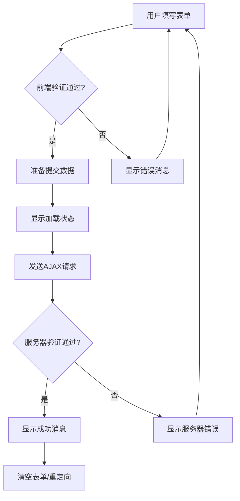

# JavaScript 表单提交

---
slug: javascript-form-submit
title: JavaScript 表单提交
description: 学习如何使用JavaScript处理HTML表单提交、验证表单数据以及通过AJAX发送表单数据，适合初学者的完整指南。
---

## 表单提交简介

表单是网页中收集用户输入信息的重要组件。无论是登录界面、注册表单、搜索框还是联系表格，表单在Web应用中都扮演着关键角色。JavaScript可以对表单进行操作、验证和控制提交行为，使得表单处理变得更加灵活和用户友好。

在本教程中，我们将学习如何使用JavaScript处理HTML表单，包括表单提交、数据验证和通过AJAX发送表单数据等常见操作。

## HTML表单基础

在我们深入JavaScript表单处理之前，让我们先回顾一下HTML表单的基础知识：

```html
<form id="myForm" action="/submit" method="post">
  <div>
    <label for="username">用户名：</label>
    <input type="text" id="username" name="username" required />
  </div>
  
  <div>
    <label for="email">邮箱：</label>
    <input type="email" id="email" name="email" required />
  </div>
  
  <div>
    <label for="password">密码：</label>
    <input type="password" id="password" name="password" required />
  </div>
  
  <button type="submit">提交</button>
</form>
```

在上面的代码中：
- `action` 属性指定表单提交的URL
- `method` 属性指定HTTP请求方法（GET或POST）
- `type="submit"` 按钮用于提交表单
- `name` 属性用于标识表单数据

## 使用JavaScript处理表单提交

### 1. 监听表单提交事件

要使用JavaScript控制表单提交，首先需要监听表单的 `submit` 事件：

```javascript
// 获取表单元素
const form = document.getElementById('myForm');

// 添加提交事件监听器
form.addEventListener('submit', function(event) {
  // 阻止表单默认提交行为
  event.preventDefault();
  
  // 在此处理表单数据
  console.log('表单提交被JavaScript拦截');
});
```

:::tip
使用 `event.preventDefault()` 可以阻止表单的默认提交行为，这样我们可以用JavaScript来控制接下来的操作。
:::

### 2. 获取表单数据

有多种方式可以获取表单中的数据：

#### 方法一：通过DOM元素获取

```javascript
form.addEventListener('submit', function(event) {
  event.preventDefault();
  
  // 通过ID获取表单元素的值
  const username = document.getElementById('username').value;
  const email = document.getElementById('email').value;
  const password = document.getElementById('password').value;
  
  console.log('用户名:', username);
  console.log('邮箱:', email);
  console.log('密码:', password);
});
```

#### 方法二：使用FormData对象

FormData对象提供了一种更便捷的方式来收集表单数据：

```javascript
form.addEventListener('submit', function(event) {
  event.preventDefault();
  
  // 创建FormData对象
  const formData = new FormData(this);
  
  // 遍历FormData获取所有数据
  for (const [key, value] of formData.entries()) {
    console.log(`${key}: ${value}`);
  }
  
  // 获取特定字段的值
  console.log('用户名:', formData.get('username'));
});
```

## 表单数据验证

表单验证是确保用户输入数据符合预期的重要步骤。虽然HTML5提供了基本的验证属性（如required、pattern等），但JavaScript可以实现更复杂的自定义验证。

### 基本验证示例

```javascript
form.addEventListener('submit', function(event) {
  event.preventDefault();
  
  const username = document.getElementById('username').value;
  const email = document.getElementById('email').value;
  const password = document.getElementById('password').value;
  
  // 验证用户名长度
  if (username.length < 3) {
    alert('用户名至少需要3个字符');
    return;
  }
  
  // 验证密码长度
  if (password.length < 6) {
    alert('密码至少需要6个字符');
    return;
  }
  
  // 验证邮箱格式
  const emailRegex = /^[^\s@]+@[^\s@]+\.[^\s@]+$/;
  if (!emailRegex.test(email)) {
    alert('请输入有效的邮箱地址');
    return;
  }
  
  // 如果所有验证通过，提交表单
  alert('验证通过，表单将被提交');
  this.submit(); // 手动提交表单
});
```

### 实时验证

为了提供更好的用户体验，我们可以在用户输入时实时验证数据，而不是等到提交表单时：

```javascript
const usernameInput = document.getElementById('username');
const usernameError = document.createElement('div');
usernameError.className = 'error';
usernameInput.parentNode.appendChild(usernameError);

usernameInput.addEventListener('input', function() {
  if (this.value.length < 3) {
    usernameError.textContent = '用户名至少需要3个字符';
    this.classList.add('invalid');
  } else {
    usernameError.textContent = '';
    this.classList.remove('invalid');
  }
});
```

## 使用AJAX提交表单

传统的表单提交会导致页面刷新。使用AJAX（Asynchronous JavaScript and XML）可以在不刷新页面的情况下提交表单数据。

### 使用Fetch API提交表单

```javascript
form.addEventListener('submit', function(event) {
  event.preventDefault();
  
  // 创建FormData对象
  const formData = new FormData(this);
  
  // 使用Fetch API发送表单数据
  fetch('/submit', {
    method: 'POST',
    body: formData
  })
  .then(response => {
    if (!response.ok) {
      throw new Error('网络响应不正常');
    }
    return response.json();
  })
  .then(data => {
    console.log('提交成功:', data);
    // 显示成功消息
    alert('表单提交成功!');
  })
  .catch(error => {
    console.error('提交错误:', error);
    // 显示错误消息
    alert('表单提交失败，请稍后重试');
  });
});
```

### 使用XMLHttpRequest提交表单

对于需要支持较旧浏览器的情况，可以使用XMLHttpRequest：

```javascript
form.addEventListener('submit', function(event) {
  event.preventDefault();
  
  const formData = new FormData(this);
  const xhr = new XMLHttpRequest();
  
  xhr.open('POST', '/submit', true);
  
  xhr.onload = function() {
    if (xhr.status === 200) {
      const response = JSON.parse(xhr.responseText);
      console.log('提交成功:', response);
      alert('表单提交成功!');
    } else {
      console.error('提交错误:', xhr.statusText);
      alert('表单提交失败，请稍后重试');
    }
  };
  
  xhr.onerror = function() {
    console.error('网络错误');
    alert('网络错误，请检查您的连接');
  };
  
  xhr.send(formData);
});
```

## 实际应用案例

### 案例：注册表单

下面是一个完整的注册表单示例，包含前端验证和AJAX提交：

```html
<form id="registrationForm" class="registration-form">
  <div class="form-group">
    <label for="fullname">姓名:</label>
    <input type="text" id="fullname" name="fullname" required />
    <div class="error-message" id="fullname-error"></div>
  </div>
  
  <div class="form-group">
    <label for="email">邮箱:</label>
    <input type="email" id="email" name="email" required />
    <div class="error-message" id="email-error"></div>
  </div>
  
  <div class="form-group">
    <label for="password">密码:</label>
    <input type="password" id="password" name="password" required />
    <div class="error-message" id="password-error"></div>
  </div>
  
  <div class="form-group">
    <label for="confirm-password">确认密码:</label>
    <input type="password" id="confirm-password" name="confirm-password" required />
    <div class="error-message" id="confirm-password-error"></div>
  </div>
  
  <div class="form-group">
    <button type="submit" id="submit-btn">注册</button>
  </div>
  
  <div id="form-message"></div>
</form>
```

```javascript
document.addEventListener('DOMContentLoaded', function() {
  const form = document.getElementById('registrationForm');
  const formMessage = document.getElementById('form-message');
  
  // 实时验证功能
  const inputs = form.querySelectorAll('input');
  
  inputs.forEach(input => {
    const errorElement = document.getElementById(`${input.id}-error`);
    
    input.addEventListener('input', function() {
      validateInput(input, errorElement);
    });
    
    input.addEventListener('blur', function() {
      validateInput(input, errorElement);
    });
  });
  
  // 表单提交处理
  form.addEventListener('submit', function(event) {
    event.preventDefault();
    
    // 再次验证所有输入
    let isValid = true;
    inputs.forEach(input => {
      const errorElement = document.getElementById(`${input.id}-error`);
      if (!validateInput(input, errorElement)) {
        isValid = false;
      }
    });
    
    if (!isValid) {
      formMessage.textContent = '请修正表单中的错误';
      formMessage.className = 'error-message';
      return;
    }
    
    // 禁用提交按钮，防止重复提交
    const submitButton = document.getElementById('submit-btn');
    submitButton.disabled = true;
    submitButton.textContent = '提交中...';
    
    // 使用AJAX提交表单
    const formData = new FormData(form);
    
    fetch('/api/register', {
      method: 'POST',
      body: formData
    })
    .then(response => response.json())
    .then(data => {
      if (data.success) {
        formMessage.textContent = '注册成功！正在跳转到登录页面...';
        formMessage.className = 'success-message';
        
        // 清空表单
        form.reset();
        
        // 模拟跳转到登录页面
        setTimeout(() => {
          window.location.href = '/login';
        }, 2000);
      } else {
        formMessage.textContent = data.message || '注册失败，请稍后再试';
        formMessage.className = 'error-message';
        
        // 重新启用提交按钮
        submitButton.disabled = false;
        submitButton.textContent = '注册';
      }
    })
    .catch(error => {
      console.error('Error:', error);
      formMessage.textContent = '发生错误，请稍后再试';
      formMessage.className = 'error-message';
      
      // 重新启用提交按钮
      submitButton.disabled = false;
      submitButton.textContent = '注册';
    });
  });
  
  // 验证函数
  function validateInput(input, errorElement) {
    const value = input.value.trim();
    let error = '';
    
    switch(input.id) {
      case 'fullname':
        if (value.length < 2) {
          error = '姓名至少需要2个字符';
        }
        break;
      case 'email':
        const emailRegex = /^[^\s@]+@[^\s@]+\.[^\s@]+$/;
        if (!emailRegex.test(value)) {
          error = '请输入有效的邮箱地址';
        }
        break;
      case 'password':
        if (value.length < 8) {
          error = '密码至少需要8个字符';
        } else if (!/[A-Z]/.test(value)) {
          error = '密码至少需要一个大写字母';
        } else if (!/[a-z]/.test(value)) {
          error = '密码至少需要一个小写字母';
        } else if (!/[0-9]/.test(value)) {
          error = '密码至少需要一个数字';
        }
        break;
      case 'confirm-password':
        const password = document.getElementById('password').value;
        if (value !== password) {
          error = '两次密码输入不一致';
        }
        break;
    }
    
    if (error) {
      errorElement.textContent = error;
      input.classList.add('invalid');
      return false;
    } else {
      errorElement.textContent = '';
      input.classList.remove('invalid');
      return true;
    }
  }
});
```

## 表单提交状态和反馈

良好的用户体验需要向用户提供表单提交的状态反馈：

```javascript
form.addEventListener('submit', function(event) {
  event.preventDefault();
  
  // 显示加载状态
  const submitBtn = this.querySelector('button[type="submit"]');
  const originalBtnText = submitBtn.textContent;
  submitBtn.disabled = true;
  submitBtn.innerHTML = '<span class="spinner"></span> 提交中...';
  
  // 创建状态消息区域
  let statusMessage = document.getElementById('status-message');
  if (!statusMessage) {
    statusMessage = document.createElement('div');
    statusMessage.id = 'status-message';
    this.appendChild(statusMessage);
  }
  
  // 提交表单
  const formData = new FormData(this);
  
  fetch('/submit', {
    method: 'POST',
    body: formData
  })
  .then(response => response.json())
  .then(data => {
    if (data.success) {
      statusMessage.textContent = '提交成功！';
      statusMessage.className = 'success';
      
      // 可能需要的额外操作，如重定向
      // window.location.href = data.redirectUrl;
    } else {
      statusMessage.textContent = data.message || '提交失败，请重试';
      statusMessage.className = 'error';
    }
  })
  .catch(error => {
    statusMessage.textContent = '发生错误，请稍后重试';
    statusMessage.className = 'error';
    console.error('Error:', error);
  })
  .finally(() => {
    // 恢复按钮状态
    submitBtn.disabled = false;
    submitBtn.textContent = originalBtnText;
  });
});
```

## 表单提交流程图

以下是一个典型的表单提交流程图：



## 总结

在本教程中，我们学习了：

1. 如何使用JavaScript监听和处理表单提交事件
2. 如何获取表单数据的多种方法
3. 如何实现表单验证（静态验证和实时验证）
4. 如何使用AJAX技术提交表单，避免页面刷新
5. 如何提供良好的用户反馈和状态提示
6. 一个完整的表单实际应用案例

表单提交是Web开发中的基本功能，掌握这些技术可以让你创建出更加用户友好的Web应用。

## 练习

1. 创建一个联系表单，包含姓名、邮箱和消息字段，并使用JavaScript进行验证和提交。
2. 为表单添加一个文件上传字段，并处理文件上传过程。
3. 添加一个进度条，在AJAX提交过程中显示上传进度。
4. 实现一个多步骤表单，用户可以在多个页面间切换填写表单。

## 补充资源

- [MDN Web Docs: HTML表单指南](https://developer.mozilla.org/zh-CN/docs/Learn/Forms)
- [MDN Web Docs: FormData API](https://developer.mozilla.org/zh-CN/docs/Web/API/FormData)
- [MDN Web Docs: Fetch API](https://developer.mozilla.org/zh-CN/docs/Web/API/Fetch_API)
- [MDN Web Docs: XMLHttpRequest](https://developer.mozilla.org/zh-CN/docs/Web/API/XMLHttpRequest)

通过这些技术，你可以创建出功能丰富、用户友好的表单交互体验！