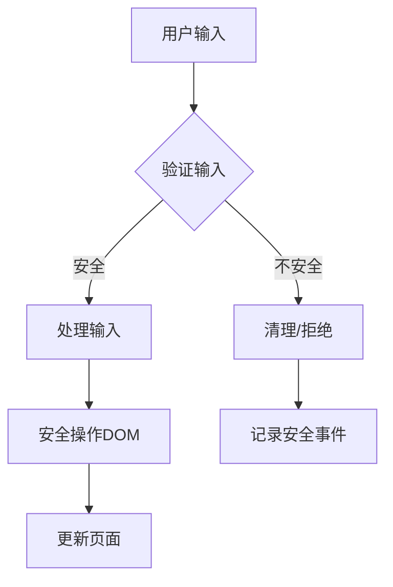

# JavaScript DOM安全

前端安全是Web开发中不可忽视的一环，尤其是在处理DOM操作时。当我们使用JavaScript与网页进行交互时，如果不注意安全问题，可能会为攻击者提供可乘之机。本文将带领初学者了解JavaScript DOM安全的基础知识，识别常见威胁，并掌握防护技巧。

## DOM安全基础知识

DOM（文档对象模型）是HTML和XML文档的编程接口。当JavaScript操作DOM时，如果处理不当，会引发各种安全问题。

### 什么是DOM安全？

DOM安全是指保护网页DOM结构免受恶意攻击的一系列措施和最佳实践。这些攻击通常利用JavaScript执行未经授权的代码，窃取数据，或者修改页面内容。

## 常见的DOM安全威胁

### 1. 跨站脚本攻击（XSS）

XSS是最常见的Web安全漏洞之一，攻击者通过在网页中注入恶意脚本来执行。

#### 反射型XSS示例

```javascript
// 不安全的代码
const userInput = new URLSearchParams(window.location.search).get('name');
document.getElementById('greeting').innerHTML = 'Hello, ' + userInput;

// 如果URL是: example.com/?name=<script>alert('XSS')</script>
// 将会执行恶意脚本
```

#### 存储型XSS示例

```javascript
// 用户提交的评论（可能包含恶意代码）被存储在数据库中
const comment = getCommentFromDatabase(); // 假设返回: "<script>stealCookies()</script>"
document.getElementById('comments').innerHTML = comment; // 恶意脚本被执行
```

### 2. DOM型XSS

这种XSS特别依赖于DOM操作，攻击完全在客户端执行。

```javascript
// 危险代码
document.getElementById('search').innerHTML = 
    '<a href="' + document.location.hash.substring(1) + '">点击这里</a>';

// 如果URL hash是: #' onclick='alert("XSS")
// 将生成: <a href='' onclick='alert("XSS")'>点击这里</a>
```

### 3. 跨站请求伪造（CSRF）

CSRF攻击强制已登录用户执行不需要的操作。

```html
<!-- 恶意网站的HTML -->

<!-- 当用户访问恶意网站时，如果已登录banking.example，将自动发送转账请求 -->
```

## DOM安全防护措施

### 1. 防止XSS攻击

#### 输入验证与转义

```javascript
// 不安全方式
element.innerHTML = userInput;

// 安全方式 - 创建文本节点
element.textContent = userInput;
```

如果确实需要innerHTML，请使用专门的HTML转义函数：

```javascript
function escapeHTML(str) {
    return str.replace(/[&<>'"]/g, 
        tag => ({
            '&': '&amp;',
            '<': '&lt;',
            '>': '&gt;',
            "'": '&#39;',
            '"': '&quot;'
        }[tag]));
}

element.innerHTML = escapeHTML(userInput);
```

#### 使用安全的DOM API

```javascript
// 不安全
el.innerHTML = '<div>' + userContent + '</div>';

// 安全
const div = document.createElement('div');
div.textContent = userContent;
el.appendChild(div);
```

### 2. 内容安全策略（CSP）

CSP是一种额外的安全层，用于检测并减轻某些类型的攻击，包括XSS和数据注入攻击。

```html
<!-- 在HTML头部添加CSP -->
<meta http-equiv="Content-Security-Policy" content="default-src 'self'; script-src 'self'">
```

这会限制页面只能加载来自同源的资源，并禁止内联JavaScript。

### 3. 处理URL和链接

```javascript
// 验证URL是否安全
function isSafeURL(url) {
    try {
        const parsedUrl = new URL(url);
        return ["http:", "https:"].includes(parsedUrl.protocol);
    } catch (e) {
        return false;
    }
}

// 使用
const userProvidedURL = getUserInput();
if (isSafeURL(userProvidedURL)) {
    window.location.href = userProvidedURL;
} else {
    console.error("不安全的URL");
}
```

### 4. 安全地使用innerHTML与outerHTML

当需要解析HTML时，可以考虑使用DOMPurify等库进行净化：

```javascript
// 使用DOMPurify库
const clean = DOMPurify.sanitize(dirtyInput);
element.innerHTML = clean;
```

## 实际案例分析

### 案例1：评论系统安全问题

假设你正在为博客开发评论功能：

```javascript
// 不安全实现
function addComment(comment) {
    const commentList = document.getElementById('comments');
    commentList.innerHTML += `<div class="comment">${comment}</div>`;
}

// 安全实现
function addComment(comment) {
    const commentList = document.getElementById('comments');
    const commentDiv = document.createElement('div');
    commentDiv.className = 'comment';
    commentDiv.textContent = comment;
    commentList.appendChild(commentDiv);
}
```

### 案例2：动态加载脚本

```javascript
// 不安全方式
function loadScript(url) {
    document.write(`<script src="${url}"></script>`);
}

// 安全方式
function loadScript(url) {
    if (!isSafeURL(url)) return; // 验证URL
    
    const script = document.createElement('script');
    script.src = url;
    document.head.appendChild(script);
}
```

## DOM安全最佳实践

1. **始终验证和清理用户输入**：不信任任何用户提供的数据。
2. **使用textContent代替innerHTML**：避免直接将未验证内容插入DOM。
3. **实施内容安全策略（CSP）**：限制可执行代码的来源。
4. **限制JavaScript权限**：使用沙箱和最小权限原则。
5. **定期更新依赖库**：确保使用最新的安全补丁。
6. **使用HTTPS**：加密所有数据传输。
7. **添加验证令牌**：防止CSRF攻击。

:::warning
永远不要执行来自不受信任来源的JavaScript代码，这包括使用eval()、new Function()、setTimeout()/setInterval()接收字符串参数的情况。
:::

## 常见的DOM安全问题检测工具

1. **浏览器开发者工具**：监控网络请求和控制台错误
2. **OWASP ZAP**：开源Web应用安全扫描器
3. **ESLint安全规则**：代码静态分析
4. **Lighthouse**：检查一些基本的Web安全问题



## 总结

DOM安全是前端开发中至关重要的一环。通过理解潜在威胁，采取适当的防护措施，你可以显著提高Web应用的安全性。关键点包括：

- 避免直接将不可信数据插入DOM
- 使用适当的API和转义函数处理用户输入
- 实施内容安全策略限制可执行的代码
- 遵循安全最佳实践

保持警惕，定期更新你的安全知识和工具，因为Web安全领域不断发展，新威胁也在不断出现。

## 练习

1. 找出以下代码的安全问题并修复：
   ```javascript
   function showProfile(username) {
     document.getElementById('profile').innerHTML = 
       `<h2>Welcome ${username}!</h2>`;
   }
   ```

2. 编写一个函数，安全地从URL参数中获取值并显示在页面上。

3. 分析一个简单评论系统，识别潜在的XSS漏洞并提出修复方案。

## 进一步学习资源

- OWASP (Open Web Application Security Project) 指南
- MDN Web安全文档
- "Web应用安全权威指南" 书籍

通过掌握DOM安全基础知识，你已经迈出了构建更安全Web应用的重要一步！