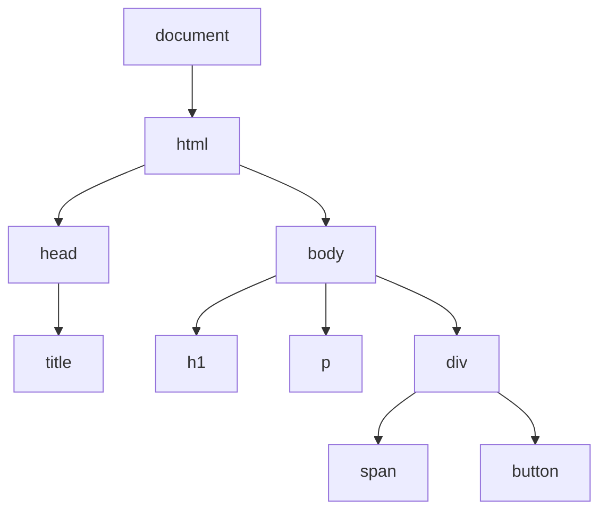

# JavaScript DOM操作

## 什么是DOM？

DOM (Document Object Model) 是HTML和XML文档的编程接口。它将网页表示为一个树状结构，其中每个节点代表文档的一部分（元素、属性、文本等）。JavaScript可以通过DOM API访问和操作这些节点，从而动态地更改网页的内容、结构和样式。



## DOM选择器

在操作DOM之前，我们需要先选择要操作的元素。JavaScript提供了多种方法来选择元素：

### 基础选择器

```javascript
// 通过ID选择元素
const elementById = document.getElementById('myId');

// 通过类名选择元素（返回HTMLCollection）
const elementsByClass = document.getElementsByClassName('myClass');

// 通过标签名选择元素（返回HTMLCollection）
const elementsByTag = document.getElementsByTagName('div');

// 通过CSS选择器选择第一个匹配的元素
const elementBySelector = document.querySelector('.myClass');

// 通过CSS选择器选择所有匹配的元素（返回NodeList）
const elementsBySelectorAll = document.querySelectorAll('div.myClass');
```

:::tip
`querySelector()`和`querySelectorAll()`是较新的API，支持更复杂的CSS选择器，使用更灵活。推荐优先使用它们。
:::

## 操作DOM内容

选择元素后，我们可以修改它的内容：

### 修改文本和HTML

```javascript
// 获取或设置元素的文本内容
element.textContent = '新的文本内容';

// 获取或设置元素的HTML内容
element.innerHTML = '<span>新的HTML内容</span>';

// 获取或设置元素的HTML（包括元素自身）
element.outerHTML = '<div>完全替换元素</div>';
```

:::caution
使用`innerHTML`插入用户提供的内容可能导致XSS（跨站脚本）攻击。处理用户输入时应始终进行适当的验证和转义。
:::

### 示例：更新文本内容

```html
<div id="content">原始内容</div>

<script>
  const contentDiv = document.getElementById('content');
  contentDiv.textContent = '已更新的内容';
  // 页面上的div现在显示"已更新的内容"
</script>
```

## 创建和操作DOM元素

### 创建新元素

```javascript
// 创建新元素
const newElement = document.createElement('div');

// 设置新元素的属性
newElement.id = 'newDiv';
newElement.className = 'container';
newElement.textContent = '这是一个新创建的div';

// 将新元素添加到页面
document.body.appendChild(newElement);
```

### 插入和移除元素

```javascript
// 在父元素末尾添加子元素
parent.appendChild(child);

// 在参考元素之前插入新元素
parent.insertBefore(newElement, referenceElement);

// 使用较新的API更灵活地插入元素
parent.append(element1, element2, 'text');  // 末尾添加多个节点/文本
parent.prepend(element);                    // 开头添加
referenceElement.before(element);           // 之前插入
referenceElement.after(element);            // 之后插入

// 移除元素
element.remove();                           // 较新的API
// 或者使用父元素移除
parent.removeChild(child);
```

### 示例：动态创建列表

```html
<ul id="myList"></ul>

<script>
  const fruits = ['苹果', '香蕉', '橙子', '葡萄'];
  const list = document.getElementById('myList');
  
  fruits.forEach(fruit => {
    const item = document.createElement('li');
    item.textContent = fruit;
    list.appendChild(item);
  });
</script>
```

## 修改样式和类

### 直接修改样式

```javascript
// 修改单个样式属性
element.style.color = 'blue';
element.style.backgroundColor = 'yellow';
element.style.fontSize = '20px';

// 注意：CSS属性名需要转换为驼峰命名法
// 例如：background-color -> backgroundColor
```

### 操作CSS类

```javascript
// 添加类
element.classList.add('active');

// 移除类
element.classList.remove('inactive');

// 切换类（如果存在则移除，不存在则添加）
element.classList.toggle('highlight');

// 检查是否包含某个类
const hasClass = element.classList.contains('active');
```

### 示例：切换元素样式

```html
<style>
  .highlighted {
    background-color: yellow;
    font-weight: bold;
  }
</style>

<p id="paragraph">点击我切换高亮效果</p>

<script>
  const paragraph = document.getElementById('paragraph');
  paragraph.addEventListener('click', function() {
    this.classList.toggle('highlighted');
  });
</script>
```

## 处理属性

```javascript
// 获取属性值
const href = element.getAttribute('href');

// 设置属性
element.setAttribute('title', '提示文本');

// 检查属性是否存在
const hasAttr = element.hasAttribute('disabled');

// 删除属性
element.removeAttribute('disabled');

// 对于一些常用属性，可以直接通过属性访问
element.id = 'newId';
element.href = 'https://example.com';
```

## 事件处理

DOM事件允许JavaScript对用户操作或其他事件做出反应。

### 添加事件监听器

```javascript
// 方法1：使用addEventListener（推荐）
element.addEventListener('click', function(event) {
  console.log('元素被点击了');
  console.log(event); // 事件对象
});

// 方法2：直接设置on属性（不推荐，不能添加多个处理函数）
element.onclick = function(event) {
  console.log('元素被点击了');
};
```

### 常用事件类型

- **鼠标事件**：`click`, `dblclick`, `mouseover`, `mouseout`, `mousedown`, `mouseup`, `mousemove`
- **键盘事件**：`keydown`, `keyup`, `keypress`
- **表单事件**：`submit`, `change`, `focus`, `blur`
- **文档/窗口事件**：`load`, `resize`, `scroll`, `unload`

### 事件对象

当事件发生时，事件处理函数会接收一个事件对象，包含有关事件的信息。

```javascript
element.addEventListener('click', function(event) {
  // 获取触发事件的元素
  console.log(event.target);
  
  // 获取鼠标坐标
  console.log('鼠标位置:', event.clientX, event.clientY);
  
  // 阻止默认行为（如链接跳转）
  event.preventDefault();
  
  // 阻止事件冒泡
  event.stopPropagation();
});
```

### 事件委托

事件委托是一种利用事件冒泡的技术，通过将事件监听器添加到父元素上，来处理子元素上的事件，特别适用于动态添加的元素。

```javascript
// 不使用事件委托，为每个li添加事件处理程序
const items = document.querySelectorAll('#list li');
items.forEach(item => {
  item.addEventListener('click', function() {
    console.log(this.textContent + ' 被点击了');
  });
});

// 使用事件委托，只为父元素添加一个处理程序
document.getElementById('list').addEventListener('click', function(event) {
  if (event.target.tagName === 'LI') {
    console.log(event.target.textContent + ' 被点击了');
  }
});
```

## 实际案例：待办事项列表

下面是一个简单的待办事项列表应用，展示了DOM操作的实际应用：

```html
<!DOCTYPE html>
<html lang="zh-CN">
<head>
  <meta charset="UTF-8">
  <title>待办事项列表</title>
  <style>
    .completed {
      text-decoration: line-through;
      color: gray;
    }
    .list-item {
      margin: 10px 0;
      padding: 5px;
      border-bottom: 1px solid #eee;
    }
    .delete-btn {
      margin-left: 10px;
      color: red;
      cursor: pointer;
    }
  </style>
</head>
<body>
  <h1>我的待办事项</h1>
  
  <div>
    <input type="text" id="newTask" placeholder="添加新任务...">
    <button id="addBtn">添加</button>
  </div>
  
  <ul id="taskList"></ul>

  <script>
    // 获取DOM元素
    const newTaskInput = document.getElementById('newTask');
    const addBtn = document.getElementById('addBtn');
    const taskList = document.getElementById('taskList');
    
    // 添加任务函数
    function addTask() {
      const taskText = newTaskInput.value.trim();
      if (!taskText) return; // 如果输入为空，则返回
      
      // 创建新的列表项
      const li = document.createElement('li');
      li.className = 'list-item';
      
      // 创建复选框
      const checkbox = document.createElement('input');
      checkbox.type = 'checkbox';
      checkbox.addEventListener('change', function() {
        if (this.checked) {
          taskSpan.classList.add('completed');
        } else {
          taskSpan.classList.remove('completed');
        }
      });
      
      // 创建任务文本
      const taskSpan = document.createElement('span');
      taskSpan.textContent = taskText;
      
      // 创建删除按钮
      const deleteBtn = document.createElement('span');
      deleteBtn.textContent = '删除';
      deleteBtn.className = 'delete-btn';
      deleteBtn.addEventListener('click', function() {
        li.remove();
      });
      
      // 组装列表项
      li.appendChild(checkbox);
      li.appendChild(taskSpan);
      li.appendChild(deleteBtn);
      
      // 添加到列表中
      taskList.appendChild(li);
      
      // 清空输入框
      newTaskInput.value = '';
    }
    
    // 注册事件监听器
    addBtn.addEventListener('click', addTask);
    
    newTaskInput.addEventListener('keypress', function(event) {
      // 按下回车键也可以添加任务
      if (event.key === 'Enter') {
        addTask();
      }
    });
  </script>
</body>
</html>
```

这个例子涵盖了：
- 创建和添加元素
- 设置元素属性和样式
- 事件处理
- 类的添加和删除
- 元素删除

## DOM操作性能优化

处理大量DOM操作时，需要注意性能问题：

1. **减少DOM访问次数**：将DOM引用存储在变量中，减少重复查询。

2. **批量添加元素**：使用文档片段(`DocumentFragment`)批量添加多个元素。

```javascript
// 低效方式：多次直接操作DOM
for (let i = 0; i < 1000; i++) {
  const item = document.createElement('li');
  item.textContent = `项目 ${i}`;
  list.appendChild(item); // 每次都会重新计算布局
}

// 高效方式：使用文档片段
const fragment = document.createDocumentFragment();
for (let i = 0; i < 1000; i++) {
  const item = document.createElement('li');
  item.textContent = `项目 ${i}`;
  fragment.appendChild(item);
}
list.appendChild(fragment); // 只有一次DOM操作
```

3. **使用CSS类而不是直接操作样式**：修改类比修改多个样式属性更高效。

4. **避免频繁布局重计算**：批量读取，然后批量写入。

```javascript
// 低效：交替读写导致多次重排
const height = element.offsetHeight; // 读取
element.style.height = height + 100 + 'px'; // 写入
const width = element.offsetWidth; // 读取
element.style.width = width + 100 + 'px'; // 写入

// 高效：先读后写，减少重排
const height = element.offsetHeight; // 读取
const width = element.offsetWidth; // 读取
element.style.height = height + 100 + 'px'; // 写入
element.style.width = width + 100 + 'px'; // 写入
```

## 总结

DOM操作是前端开发中非常重要的一部分。通过JavaScript访问和操作DOM，我们可以：

- 选择页面上的元素
- 创建新元素并添加到页面
- 修改元素的内容、属性和样式
- 响应用户交互和其他事件
- 动态更新页面内容

熟练掌握DOM操作技能能够帮助你创建更具交互性和动态性的网页应用。记住要注意性能，避免过度操作DOM，特别是在处理大型应用程序时。

## 练习建议

1. 创建一个简单的图片轮播器，使用DOM操作来切换图片。
2. 实现一个表单验证器，检查用户输入并显示错误消息。
3. 构建一个拖放界面，允许用户拖动元素到不同的容器中。
4. 扩展上面的待办事项示例，添加本地存储功能，使任务在页面刷新后仍然存在。

## 延伸阅读

- [MDN Web Docs: Document Object Model (DOM)](https://developer.mozilla.org/zh-CN/docs/Web/API/Document_Object_Model)
- [MDN Web Docs: 事件介绍](https://developer.mozilla.org/zh-CN/docs/Learn/JavaScript/Building_blocks/Events)
- [DOM 操作性能优化](https://developers.google.com/web/fundamentals/performance/rendering/avoid-large-complex-layouts-and-layout-thrashing)

通过不断实践和探索，你会逐渐掌握DOM操作的各种技巧，能够创建出更加丰富和交互性强的网页应用。