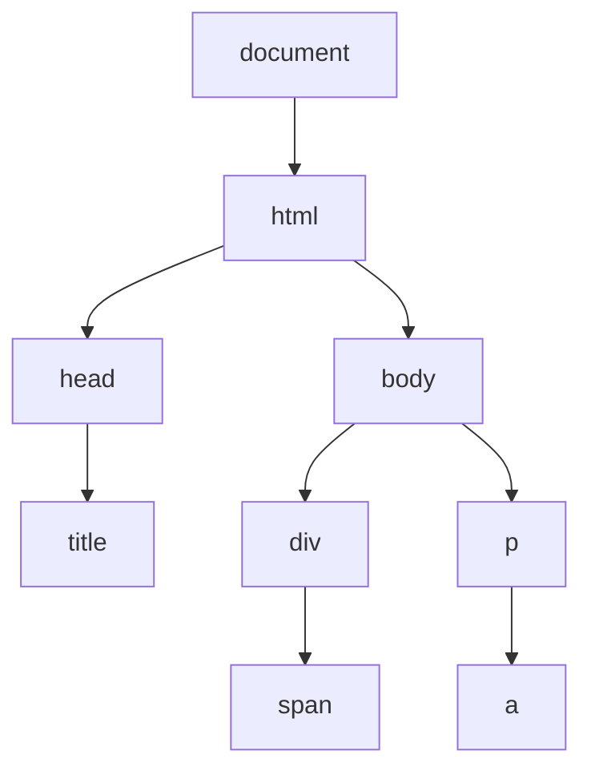

# JavaScript DOM遍历

DOM遍历是指使用JavaScript在文档对象模型(DOM)树结构中移动和访问各个节点的过程。掌握DOM遍历技术对于网页交互和动态内容操作至关重要，它让开发者能够轻松地查找、修改和操作网页中的元素。

## DOM树结构基础

在学习DOM遍历前，让我们先了解DOM树的基本结构。



在DOM树中，每个节点都有特定的关系：
- **父节点**：直接包含当前节点的节点
- **子节点**：被当前节点直接包含的节点
- **兄弟节点**：共享同一个父节点的节点
- **后代节点**：当前节点所包含的所有节点（子节点、孙节点等）
- **祖先节点**：包含当前节点的所有节点（父节点、祖父节点等）

## DOM节点类型

DOM中主要有以下几种节点类型：

1. **元素节点**：HTML标签（如`<div>`、`<p>`等）
2. **文本节点**：标签之间的文本内容
3. **属性节点**：元素的属性（如id、class等）
4. **注释节点**：HTML注释
5. **文档节点**：整个文档（document）

## 父节点遍历

通过`parentNode`和`parentElement`属性可以访问当前节点的父节点。

```javascript
// 获取元素
const child = document.getElementById("child");

// 访问父节点
const parent = child.parentNode;
// 或
const parentEl = child.parentElement;

console.log(parent); // 输出父节点
```

:::note
`parentNode`可以返回任何类型的父节点，而`parentElement`只返回元素类型的父节点。如果父节点不是元素节点，`parentElement`返回null。
:::

## 子节点遍历

### 获取所有子节点

```javascript
const parent = document.getElementById("parent");

// 获取所有子节点（包括文本节点、注释节点等）
const childNodes = parent.childNodes;
console.log(childNodes); // 输出NodeList对象

// 获取子元素节点（只包含元素节点）
const children = parent.children;
console.log(children); // 输出HTMLCollection对象
```

### 获取第一个和最后一个子节点

```javascript
// 获取第一个子节点（可能是文本节点）
const firstChild = parent.firstChild;

// 获取最后一个子节点（可能是文本节点）
const lastChild = parent.lastChild;

// 获取第一个子元素节点
const firstElementChild = parent.firstElementChild;

// 获取最后一个子元素节点
const lastElementChild = parent.lastElementChild;
```

## 兄弟节点遍历

```javascript
const element = document.getElementById("middle");

// 获取前一个兄弟节点（可能是文本节点）
const prevSibling = element.previousSibling;

// 获取下一个兄弟节点（可能是文本节点）
const nextSibling = element.nextSibling;

// 获取前一个兄弟元素节点
const prevElementSibling = element.previousElementSibling;

// 获取下一个兄弟元素节点
const nextElementSibling = element.nextElementSibling;
```

## 实际案例：折叠树菜单

以下是一个使用DOM遍历创建折叠树菜单的示例：

```html
<ul id="tree">
  <li>水果
    <ul>
      <li>苹果</li>
      <li>香蕉</li>
      <li>橙子</li>
    </ul>
  </li>
  <li>蔬菜
    <ul>
      <li>土豆</li>
      <li>番茄</li>
      <li>黄瓜</li>
    </ul>
  </li>
</ul>
```

```javascript
// 为所有包含子菜单的项添加点击事件
document.addEventListener('DOMContentLoaded', function() {
  const tree = document.getElementById('tree');
  
  tree.addEventListener('click', function(event) {
    if (event.target.tagName === 'LI') {
      // 检查点击的LI是否有子UL
      const childUl = Array.from(event.target.children)
                           .find(child => child.tagName === 'UL');
                           
      if (childUl) {
        // 切换子菜单的显示/隐藏状态
        childUl.style.display = 
          childUl.style.display === 'none' ? 'block' : 'none';
      }
    }
  });
  
  // 初始隐藏所有子菜单
  const subMenus = tree.querySelectorAll('li > ul');
  subMenus.forEach(menu => {
    menu.style.display = 'none';
  });
});
```

这个例子展示了如何使用DOM遍历来：
1. 找到所有子菜单
2. 检测点击元素是否包含子菜单
3. 基于用户交互动态切换子菜单的显示状态

## 高级遍历方法：TreeWalker和NodeIterator

对于复杂的DOM遍历需求，JavaScript提供了两个强大的API：

### NodeIterator

```javascript
// 创建一个NodeIterator，只遍历元素节点
const iterator = document.createNodeIterator(
  document.body,           // 根节点
  NodeFilter.SHOW_ELEMENT, // 只显示元素节点
  null,                    // 无过滤函数
  false                    // 不包括实体引用
);

// 遍历所有元素节点
let node;
while (node = iterator.nextNode()) {
  console.log(node.nodeName);
}
```

### TreeWalker

TreeWalker比NodeIterator更灵活，可以在DOM树中任意方向移动：

```javascript
// 创建一个TreeWalker
const walker = document.createTreeWalker(
  document.body,           // 根节点
  NodeFilter.SHOW_ELEMENT, // 只显示元素节点
  {
    acceptNode: function(node) {
      // 只接受div元素
      return node.tagName === 'DIV' 
        ? NodeFilter.FILTER_ACCEPT 
        : NodeFilter.FILTER_SKIP;
    }
  },
  false                    // 不包括实体引用
);

// 遍历所有符合条件的节点
let node;
while (node = walker.nextNode()) {
  console.log(node.nodeName); // 只输出DIV节点
}
```

## 性能考虑

DOM操作是昂贵的，多次遍历可能导致性能问题。以下是一些优化技巧：

1. **缓存DOM引用**：重复使用的元素应存储在变量中
2. **批量操作**：将多次DOM操作合并为一次
3. **使用文档片段**：使用`DocumentFragment`进行离线DOM操作
4. **选择合适的遍历方法**：根据需求选择最高效的方法

```javascript
// 低效方式
for (let i = 0; i < 1000; i++) {
  document.getElementById("container").innerHTML += "<div>" + i + "</div>";
}

// 高效方式
const fragment = document.createDocumentFragment();
const container = document.getElementById("container");
for (let i = 0; i < 1000; i++) {
  const div = document.createElement("div");
  div.textContent = i;
  fragment.appendChild(div);
}
container.appendChild(fragment);
```

## 实战应用：网页导航器

下面是一个使用DOM遍历创建简单网页导航器的例子，它可以显示页面的标题大纲：

```javascript
function generateOutline() {
  // 获取所有标题元素
  const headings = document.querySelectorAll('h1, h2, h3, h4, h5, h6');
  const outline = document.createElement('ul');
  outline.className = 'page-outline';
  
  // 遍历所有标题
  headings.forEach(heading => {
    // 创建导航项
    const item = document.createElement('li');
    item.className = `level-${heading.tagName.charAt(1)}`;
    
    // 创建链接
    const link = document.createElement('a');
    
    // 如果标题没有id，为其生成一个
    if (!heading.id) {
      heading.id = 'heading-' + Math.random().toString(36).substr(2, 9);
    }
    
    link.href = '#' + heading.id;
    link.textContent = heading.textContent;
    
    // 添加点击事件
    link.addEventListener('click', function(e) {
      e.preventDefault();
      heading.scrollIntoView({ behavior: 'smooth' });
    });
    
    item.appendChild(link);
    outline.appendChild(item);
  });
  
  // 将导航添加到页面
  const nav = document.createElement('nav');
  nav.className = 'page-navigation';
  nav.appendChild(outline);
  document.body.insertBefore(nav, document.body.firstChild);
}

// 页面加载完成后生成导航
document.addEventListener('DOMContentLoaded', generateOutline);
```

这个实例展示了如何：
1. 使用`querySelectorAll`遍历所有标题元素
2. 为每个标题创建导航链接
3. 处理元素属性和事件
4. 动态在页面中添加生成的导航

## 总结

DOM遍历是前端开发中的基础技能，它允许我们：

- 在DOM树中导航和查找元素
- 访问节点的父节点、子节点和兄弟节点
- 创建交互式的网页组件
- 动态修改和操作页面内容

掌握DOM遍历技术能让你开发更复杂、更交互的网页应用，同时理解底层的DOM结构有助于编写更高效的JavaScript代码。

## 练习

1. 创建一个函数，遍历一个表格的所有行和单元格，并将其内容输出到控制台。
2. 实现一个简单的手风琴菜单，点击标题时展开或折叠内容。
3. 编写一个函数，找出页面中嵌套最深的DOM元素，并返回其嵌套深度。
4. 创建一个简单的DOM树可视化工具，以树状结构显示页面的HTML结构。

## 扩展资源

- [MDN Web Docs: 遍历 DOM](https://developer.mozilla.org/zh-CN/docs/Web/API/Document_Object_Model/Traversing_an_HTML_table_with_JavaScript_and_DOM_Interfaces)
- [JavaScript.info: DOM节点导航](https://zh.javascript.info/dom-navigation)
- [W3Schools: HTML DOM 导航](https://www.w3schools.com/js/js_htmldom_navigation.asp)

通过不断实践和探索，你会逐渐掌握DOM遍历的各种技术，成为更熟练的前端开发者！