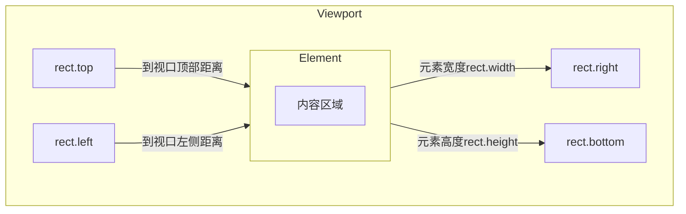

# JavaScript DOM 尺寸位置

## 介绍

在网页开发中，精确地获取和操作DOM元素的尺寸与位置是非常重要的技能。无论是创建响应式布局、实现拖拽功能，还是制作动画效果，都需要了解元素在页面中的准确位置和大小。本文将详细介绍JavaScript中用于获取和操作DOM元素尺寸与位置的主要属性和方法。

## 元素尺寸属性

### 内容区域尺寸

获取元素内容区域的尺寸（不包括内边距、边框和外边距）：

```javascript
// 获取元素内容区域的宽高
const width = element.clientWidth;  // 内容宽度 + padding
const height = element.clientHeight; // 内容高度 + padding
```

### 元素完整尺寸

获取元素的完整尺寸（包括内边距和边框，但不包括外边距）：

```javascript
// 获取元素的完整尺寸
const fullWidth = element.offsetWidth;  // 内容宽度 + padding + border
const fullHeight = element.offsetHeight; // 内容高度 + padding + border
```

### 滚动区域尺寸

获取元素内容的实际大小，包括不可见的滚动部分：

```javascript
// 获取元素内容的实际大小（包括溢出的部分）
const scrollWidth = element.scrollWidth;
const scrollHeight = element.scrollHeight;
```

下面是一个实例，展示如何获取不同的尺寸：

```javascript
function showElementDimensions() {
  const box = document.getElementById('myBox');
  
  console.log('Client dimensions:', box.clientWidth, box.clientHeight);
  console.log('Offset dimensions:', box.offsetWidth, box.offsetHeight);
  console.log('Scroll dimensions:', box.scrollWidth, box.scrollHeight);
}

// HTML: <div id="myBox" style="width: 200px; height: 100px; padding: 20px; border: 5px solid black; overflow: auto;">
//       <div style="width: 400px; height: 200px;">Content</div>
//       </div>
```

输出结果：
```
Client dimensions: 240 140
Offset dimensions: 250 150
Scroll dimensions: 400 200
```

## 元素位置属性

### 相对于偏移父元素的位置

获取元素相对于其偏移父元素（offsetParent）的位置：

```javascript
// 获取元素相对于offsetParent的位置
const offsetLeft = element.offsetLeft;
const offsetTop = element.offsetTop;
```

:::note
offsetParent是指最近的具有定位属性（position值为absolute、relative或fixed）的父元素，如果没有这样的父元素，则为body元素。
:::

### 滚动位置

获取或设置元素的滚动位置：

```javascript
// 获取元素的滚动位置
const scrollLeft = element.scrollLeft;
const scrollTop = element.scrollTop;

// 设置元素的滚动位置
element.scrollLeft = 100;
element.scrollTop = 200;
```

## 获取元素在视口中的位置

### getBoundingClientRect()

这个方法返回一个DOMRect对象，包含元素相对于视口的位置和尺寸信息：

```javascript
const rect = element.getBoundingClientRect();

console.log('Left:', rect.left);     // 元素左边缘距离视口左边缘的距离
console.log('Top:', rect.top);       // 元素顶部距离视口顶部的距离
console.log('Right:', rect.right);   // 元素右边缘距离视口左边缘的距离
console.log('Bottom:', rect.bottom); // 元素底部距离视口顶部的距离
console.log('Width:', rect.width);   // 元素宽度
console.log('Height:', rect.height); // 元素高度
```

下面是一个可视化的示意图，说明getBoundingClientRect()返回的各个值：



## 获取元素在文档中的绝对位置

要获取元素在整个文档（而不仅仅是在当前可见视口）中的绝对位置，需要结合滚动偏移量：

```javascript
function getAbsolutePosition(element) {
  const rect = element.getBoundingClientRect();
  
  return {
    top: rect.top + window.scrollY,
    left: rect.left + window.scrollX,
    bottom: rect.bottom + window.scrollY,
    right: rect.right + window.scrollX
  };
}

const position = getAbsolutePosition(document.getElementById('myElement'));
console.log('Absolute position:', position);
```

## 实际应用案例

### 案例1：检测元素是否在视口内

这个函数可以用来检测一个元素是否在视口内，对于实现"懒加载"功能很有用：

```javascript
function isElementInViewport(el) {
  const rect = el.getBoundingClientRect();
  
  return (
    rect.top >= 0 &&
    rect.left >= 0 &&
    rect.bottom <= (window.innerHeight || document.documentElement.clientHeight) &&
    rect.right <= (window.innerWidth || document.documentElement.clientWidth)
  );
}

// 使用示例
const element = document.getElementById('myElement');
if (isElementInViewport(element)) {
  console.log('Element is in the viewport!');
} else {
  console.log('Element is not in the viewport');
}
```

### 案例2：实现简单的拖拽功能

下面是一个简单的拖拽功能实现，利用了位置属性：

```javascript
function makeDraggable(element) {
  let isDragging = false;
  let offsetX, offsetY;
  
  element.addEventListener('mousedown', (e) => {
    isDragging = true;
    offsetX = e.clientX - element.getBoundingClientRect().left;
    offsetY = e.clientY - element.getBoundingClientRect().top;
    
    // 添加临时样式
    element.style.cursor = 'grabbing';
  });
  
  document.addEventListener('mousemove', (e) => {
    if (!isDragging) return;
    
    // 计算新位置
    const x = e.clientX - offsetX;
    const y = e.clientY - offsetY;
    
    // 设置元素新位置
    element.style.position = 'absolute';
    element.style.left = x + 'px';
    element.style.top = y + 'px';
  });
  
  document.addEventListener('mouseup', () => {
    isDragging = false;
    element.style.cursor = 'grab';
  });
}

// 使用示例
makeDraggable(document.getElementById('draggable-element'));
```

### 案例3：滚动到特定元素

实现平滑滚动到页面中的特定元素：

```javascript
function scrollToElement(elementId) {
  const element = document.getElementById(elementId);
  if (!element) return;
  
  const rect = element.getBoundingClientRect();
  const absoluteTop = rect.top + window.scrollY;
  
  window.scrollTo({
    top: absoluteTop,
    behavior: 'smooth'
  });
}

// 使用示例
document.getElementById('scrollButton').addEventListener('click', () => {
  scrollToElement('targetSection');
});
```

## 窗口和文档尺寸

获取浏览器窗口和文档的尺寸：

```javascript
// 窗口视口尺寸
const viewportWidth = window.innerWidth;
const viewportHeight = window.innerHeight;

// 文档尺寸
const documentWidth = Math.max(
  document.body.scrollWidth,
  document.body.offsetWidth,
  document.documentElement.clientWidth,
  document.documentElement.scrollWidth,
  document.documentElement.offsetWidth
);

const documentHeight = Math.max(
  document.body.scrollHeight,
  document.body.offsetHeight,
  document.documentElement.clientHeight,
  document.documentElement.scrollHeight,
  document.documentElement.offsetHeight
);
```

## 总结

DOM元素的尺寸和位置操作是前端开发中的基础技能，掌握这些属性和方法可以帮助你：

- 准确获取元素的大小和位置信息
- 实现交互功能，如拖拽、滚动效果
- 开发响应式界面和动态布局
- 实现"懒加载"等性能优化技术

记住以下关键点：

1. `clientWidth/clientHeight`：内容区域宽高 + padding
2. `offsetWidth/offsetHeight`：内容区域宽高 + padding + border
3. `scrollWidth/scrollHeight`：实际内容的完整尺寸（包括溢出部分）
4. `getBoundingClientRect()`：获取元素相对于视口的完整位置信息
5. 计算绝对位置时需要加上页面滚动偏移量（`window.scrollX/scrollY`）

## 练习

1. 创建一个页面，在页面上放置几个不同大小和位置的彩色盒子，然后编写JavaScript代码，当点击某个盒子时，显示它的尺寸和位置信息。

2. 实现一个简单的图片轮播器，当图片滚动到视口中时自动显示，滚出视口时暂停显示。

3. 创建一个"返回顶部"按钮，当页面滚动超过一定距离时显示，点击后平滑滚动到页面顶部。

## 延伸阅读

- [MDN文档: Element.getBoundingClientRect()](https://developer.mozilla.org/zh-CN/docs/Web/API/Element/getBoundingClientRect)
- [MDN文档: 确定元素的尺寸和位置](https://developer.mozilla.org/zh-CN/docs/Web/API/CSS_Object_Model/Determining_the_dimensions_of_elements)
- [MDN文档: Window.scrollTo()](https://developer.mozilla.org/zh-CN/docs/Web/API/Window/scrollTo)