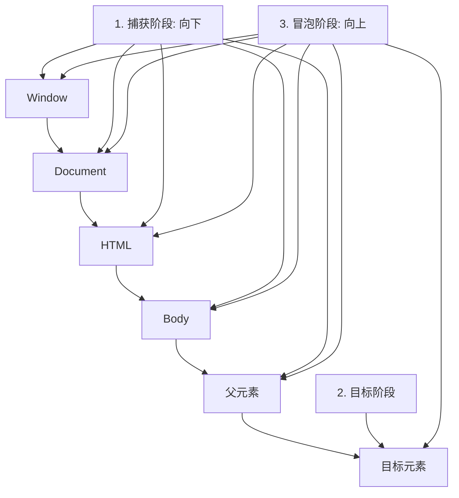

# JavaScript DOM事件

## 什么是DOM事件？

DOM事件是网页与用户交互的重要机制，它们是在HTML元素上发生的"事情"，JavaScript可以对这些事件作出反应。简单来说，事件就是用户或浏览器执行的某种动作，比如点击按钮、调整窗口大小、提交表单等。

:::note 事件的作用
通过事件，我们可以让网页对用户的操作做出响应，从而实现动态交互效果。
:::

## 常见的DOM事件类型

JavaScript中的DOM事件可以分为多种类型：

### 鼠标事件

- `click` - 当元素被点击时触发
- `dblclick` - 当元素被双击时触发
- `mousedown` - 当鼠标按钮被按下时触发
- `mouseup` - 当鼠标按钮被释放时触发
- `mousemove` - 当鼠标指针在元素上移动时触发
- `mouseover` - 当鼠标指针移入元素时触发
- `mouseout` - 当鼠标指针移出元素时触发

### 键盘事件

- `keydown` - 当键盘按键被按下时触发
- `keyup` - 当键盘按键被释放时触发
- `keypress` - 当键盘按键被按下并释放时触发（不推荐使用，已被弃用）

### 表单事件

- `submit` - 当表单被提交时触发
- `reset` - 当表单被重置时触发
- `change` - 当表单元素的值发生变化时触发
- `focus` - 当元素获得焦点时触发
- `blur` - 当元素失去焦点时触发

### 文档/窗口事件

- `load` - 当页面加载完成时触发
- `resize` - 当窗口大小改变时触发
- `scroll` - 当文档被滚动时触发
- `DOMContentLoaded` - 当HTML文档被完全加载和解析时触发

## 如何使用DOM事件

### 1. HTML属性中添加事件（不推荐）

最简单但不是最佳实践的方法是直接在HTML标签中添加事件属性：

```html
<button onclick="alert('按钮被点击了!')">点击我</button>
```

### 2. 使用DOM属性分配事件处理程序

通过JavaScript给元素的事件属性赋值：

```javascript
const button = document.querySelector('button');
button.onclick = function() {
  alert('按钮被点击了!');
};
```

:::caution 注意
使用这种方式，同一事件只能指定一个处理函数。如果多次分配，新的会覆盖旧的。
:::

### 3. 使用事件监听器（推荐）

事件监听器是最现代和灵活的方法：

```javascript
const button = document.querySelector('button');
button.addEventListener('click', function() {
  alert('按钮被点击了!');
});

// 使用箭头函数
button.addEventListener('click', () => {
  alert('使用箭头函数!');
});
```

移除事件监听器：

```javascript
function clickHandler() {
  alert('按钮被点击了!');
}

button.addEventListener('click', clickHandler);
// 稍后移除
button.removeEventListener('click', clickHandler);
```

## 事件对象

当事件触发时，浏览器会创建一个事件对象，包含有关事件的详细信息，例如鼠标的位置、按下的键等：

```javascript
button.addEventListener('click', function(event) {
  // event 是事件对象
  console.log('事件类型:', event.type);
  console.log('目标元素:', event.target);
  console.log('点击位置:', event.clientX, event.clientY);
});
```

常用的事件对象属性和方法：

- `event.type`: 事件类型
- `event.target`: 触发事件的元素
- `event.preventDefault()`: 阻止默认行为
- `event.stopPropagation()`: 阻止事件冒泡

## 事件冒泡和事件捕获

当一个事件发生在一个元素上，它会首先在该元素上运行处理函数，然后在其父元素上运行，接着在其他祖先上运行。这个过程称为事件冒泡。

```html
<div id="outer">
  外层
  <div id="inner">内层</div>
</div>
```

```javascript
document.getElementById('outer').addEventListener('click', function() {
  alert('外层 div 被点击');
});

document.getElementById('inner').addEventListener('click', function(event) {
  alert('内层 div 被点击');
  // 阻止冒泡
  // event.stopPropagation();
});
```

如果你点击内层div，会先显示"内层 div 被点击"，然后是"外层 div 被点击"。

事件捕获则是与冒泡相反的过程，从外向内：

```javascript
document.getElementById('outer').addEventListener('click', function() {
  alert('捕获阶段: 外层 div');
}, true); // 第三个参数为true表示在捕获阶段处理

document.getElementById('inner').addEventListener('click', function() {
  alert('捕获阶段: 内层 div');
}, true);
```

:::tip
事件传播的三个阶段：
1. 捕获阶段 - 事件从顶层文档向下传递
2. 目标阶段 - 事件到达目标元素
3. 冒泡阶段 - 事件从目标向上冒泡
:::



## 事件委托

事件委托是一种事件处理模式，基于事件冒泡机制。它允许我们将事件监听器添加到父元素上，而不是为每个子元素单独添加。

**好处**：
- 减少内存消耗
- 动态添加的元素也能响应事件

**示例**：为列表项添加点击事件

```html
<ul id="fruit-list">
  <li>苹果</li>
  <li>香蕉</li>
  <li>橙子</li>
</ul>
```

```javascript
// 不使用事件委托（每个li都要添加事件）
const items = document.querySelectorAll('#fruit-list li');
items.forEach(item => {
  item.addEventListener('click', function() {
    alert('你点击了: ' + this.textContent);
  });
});

// 使用事件委托（只在ul上添加一个事件）
document.getElementById('fruit-list').addEventListener('click', function(event) {
  if (event.target.tagName === 'LI') {
    alert('你点击了: ' + event.target.textContent);
  }
});
```

## 实际案例

### 案例1: 简单的表单验证

```html
<form id="register-form">
  <div>
    <label for="username">用户名:</label>
    <input type="text" id="username" name="username">
    <span class="error" id="username-error"></span>
  </div>
  <div>
    <label for="password">密码:</label>
    <input type="password" id="password" name="password">
    <span class="error" id="password-error"></span>
  </div>
  <button type="submit">注册</button>
</form>
```

```javascript
document.getElementById('register-form').addEventListener('submit', function(event) {
  // 阻止表单默认提交行为
  event.preventDefault();
  
  let isValid = true;
  
  // 验证用户名
  const username = document.getElementById('username').value;
  if (username.length < 3) {
    document.getElementById('username-error').textContent = '用户名至少需要3个字符';
    isValid = false;
  } else {
    document.getElementById('username-error').textContent = '';
  }
  
  // 验证密码
  const password = document.getElementById('password').value;
  if (password.length < 6) {
    document.getElementById('password-error').textContent = '密码至少需要6个字符';
    isValid = false;
  } else {
    document.getElementById('password-error').textContent = '';
  }
  
  // 如果验证通过，则提交表单
  if (isValid) {
    alert('表单验证通过，准备提交!');
    // this.submit(); // 实际提交表单
  }
});
```

### 案例2: 图片轮播器

```html
<div class="slider">
  <div class="slide-container">
    
    
    
  </div>
  <button id="prev">上一张</button>
  <button id="next">下一张</button>
</div>
```

```javascript
// 获取按钮和轮播图元素
const prevBtn = document.getElementById('prev');
const nextBtn = document.getElementById('next');
const slides = document.querySelectorAll('.slide');

let currentSlide = 0;

// 显示特定幻灯片
function showSlide(n) {
  // 隐藏所有幻灯片
  slides.forEach(slide => {
    slide.classList.remove('active');
  });
  
  // 计算要显示的幻灯片索引
  currentSlide = (n + slides.length) % slides.length;
  
  // 显示当前幻灯片
  slides[currentSlide].classList.add('active');
}

// 添加按钮事件
prevBtn.addEventListener('click', () => {
  showSlide(currentSlide - 1);
});

nextBtn.addEventListener('click', () => {
  showSlide(currentSlide + 1);
});

// 自动播放
setInterval(() => {
  showSlide(currentSlide + 1);
}, 3000);
```

## 总结

DOM事件是实现网页交互功能的重要机制。通过事件，我们可以：

- 响应用户的操作（如点击、输入）
- 触发页面上的动态变化
- 验证用户输入的数据
- 创建复杂的用户界面组件

理解事件的工作原理、事件冒泡和捕获、事件委托等概念，对于开发交互性强的网页应用至关重要。

## 练习

1. 创建一个简单的待办事项列表，用户可以添加新项目，并通过点击将项目标记为已完成。
2. 实现一个简单的图片查看器，点击缩略图时显示大图。
3. 为表单字段添加实时验证，当用户输入时立即显示反馈。
4. 创建一个可拖拽的元素，使用鼠标事件实现拖拽功能。

## 进阶资源

- MDN Web Docs: [事件参考](https://developer.mozilla.org/zh-CN/docs/Web/Events)
- JavaScript.info: [浏览器事件简介](https://javascript.info/introduction-browser-events)
- w3schools: [JavaScript 事件](https://www.w3schools.com/js/js_events.asp)

随着你对事件的理解和掌握，你将能够构建更加交互式和响应式的网页应用程序！