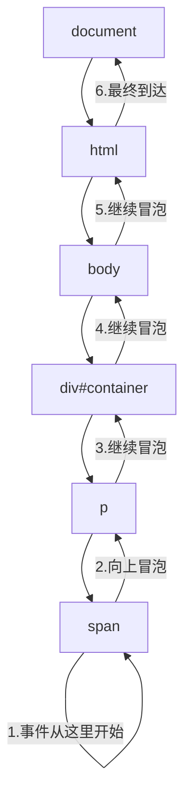
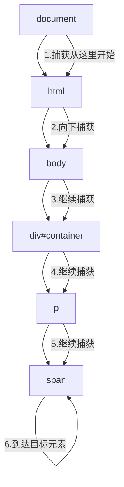

# JavaScript 事件冒泡

## 什么是事件冒泡？

在JavaScript中，事件冒泡是一种事件传播机制，当一个元素上的事件被触发后，这个事件会首先在该元素上执行，然后沿着DOM树向上传播到父元素，直到达到文档根节点。

想象一下，当你向一个池塘扔石头时，涟漪会从石头落下的地方向外扩散。事件冒泡的概念与之类似，只不过事件是从最具体的元素（触发事件的元素）开始，然后"冒泡"到较不具体的元素（父元素）。



## 事件冒泡的工作原理

当你点击一个元素时，事件处理的过程如下：

1. 事件首先在被点击的元素上触发
2. 然后在该元素的父元素上触发
3. 继续向上冒泡，直到抵达文档对象（document）

来看一个基本的例子：

```html
<!DOCTYPE html>
<html>
<head>
    <title>事件冒泡示例</title>
    <style>
        div { padding: 20px; margin: 10px; background-color: lightblue; }
        p { padding: 20px; background-color: lightgreen; }
        span { background-color: lightyellow; padding: 10px; }
    </style>
</head>
<body>
    <div id="parent">
        父元素
        <p id="middle">
            中间元素
            <span id="child">子元素</span>
        </p>
    </div>

    <script>
        document.getElementById('parent').addEventListener('click', function() {
            console.log('父元素被点击');
        });
        
        document.getElementById('middle').addEventListener('click', function() {
            console.log('中间元素被点击');
        });
        
        document.getElementById('child').addEventListener('click', function() {
            console.log('子元素被点击');
        });
    </script>
</body>
</html>
```

当点击"子元素"时，控制台输出会是：

```
子元素被点击
中间元素被点击
父元素被点击
```

这清楚地展示了事件冒泡的过程，从最内层的元素开始，逐级向上传播。

## 阻止事件冒泡

在某些情况下，你可能想要阻止事件继续冒泡。可以使用`event.stopPropagation()`方法来实现：

```javascript
document.getElementById('middle').addEventListener('click', function(event) {
    console.log('中间元素被点击');
    event.stopPropagation(); // 阻止事件继续冒泡到父元素
});
```

如果使用上述代码，当点击"子元素"时，控制台将只显示：

```
子元素被点击
中间元素被点击
```

因为在中间元素的事件处理程序中，我们阻止了事件继续向上冒泡到父元素。

:::caution 注意
`event.stopPropagation()` 只会阻止事件继续冒泡，但不会阻止当前元素上的其他事件处理程序执行。如果你想同时阻止这两种情况，可以使用 `event.stopImmediatePropagation()`。
:::

## 事件委托（Event Delegation）

事件冒泡的一个重要应用是事件委托。这是一种通过将事件监听器添加到父元素而不是每个子元素来处理事件的技术。

### 事件委托的优势：

1. **减少内存消耗**：不需要为每个子元素添加事件监听器
2. **动态元素处理**：自动处理动态添加的元素
3. **代码更简洁**：集中管理事件处理逻辑

### 事件委托示例

假设我们有一个列表，点击任何项目时需要显示其文本内容：

```html
<ul id="task-list">
    <li>任务1</li>
    <li>任务2</li>
    <li>任务3</li>
    <li>任务4</li>
</ul>

<script>
    // 不使用事件委托（为每个li添加监听器）
    const items = document.querySelectorAll('#task-list li');
    items.forEach(item => {
        item.addEventListener('click', function() {
            console.log('点击的是:', this.textContent);
        });
    });
    
    // 使用事件委托（只在ul上添加一个监听器）
    document.getElementById('task-list').addEventListener('click', function(event) {
        // 检查点击的是否为li元素
        if (event.target.tagName === 'LI') {
            console.log('点击的是:', event.target.textContent);
        }
    });
</script>
```

使用事件委托的最大好处是，即使后续动态添加的`<li>`元素也能自动获得点击功能，而不需要再次添加事件监听器。

## 实际应用场景

### 场景1：动态表格行的操作按钮

假设你有一个表格，其中每行都有"编辑"和"删除"按钮，而且表格的行数可能会动态变化：

```html
<table id="data-table">
    <thead>
        <tr>
            <th>姓名</th>
            <th>年龄</th>
            <th>操作</th>
        </tr>
    </thead>
    <tbody>
        <tr data-id="1">
            <td>张三</td>
            <td>25</td>
            <td>
                <button class="edit-btn">编辑</button>
                <button class="delete-btn">删除</button>
            </td>
        </tr>
        <!-- 更多行... -->
    </tbody>
</table>

<script>
    document.querySelector('#data-table tbody').addEventListener('click', function(event) {
        const target = event.target;
        const row = target.closest('tr');
        const id = row.dataset.id;
        
        if (target.classList.contains('edit-btn')) {
            console.log(`编辑ID为${id}的行`);
            // 编辑行的逻辑
        } else if (target.classList.contains('delete-btn')) {
            console.log(`删除ID为${id}的行`);
            // 删除行的逻辑
        }
    });
</script>
```

### 场景2：菜单导航系统

使用事件委托可以轻松处理多级菜单导航：

```html
<nav id="main-nav">
    <ul>
        <li class="menu-item"><a href="#home">首页</a></li>
        <li class="menu-item">
            <a href="#products">产品</a>
            <ul class="submenu">
                <li><a href="#product1">产品1</a></li>
                <li><a href="#product2">产品2</a></li>
            </ul>
        </li>
        <li class="menu-item"><a href="#about">关于我们</a></li>
    </ul>
</nav>

<script>
    document.getElementById('main-nav').addEventListener('click', function(event) {
        if (event.target.tagName === 'A') {
            event.preventDefault();
            
            // 获取链接的href值
            const href = event.target.getAttribute('href');
            console.log(`导航到: ${href}`);
            
            // 实现导航逻辑...
        }
    });
</script>
```

## 事件冒泡 vs 事件捕获

除了事件冒泡，JavaScript还支持另一种事件传播机制：事件捕获。事件捕获与事件冒泡的方向相反，从最外层的元素开始，向内传播到触发事件的元素。



默认情况下，事件处理程序在冒泡阶段触发。但你可以通过设置`addEventListener`的第三个参数为`true`，让事件在捕获阶段触发：

```javascript
element.addEventListener('click', handler, true); // 捕获阶段
element.addEventListener('click', handler, false); // 冒泡阶段（默认）
```

## 总结

事件冒泡是JavaScript事件处理系统的一个核心特性，它允许事件从触发元素向上传播到父元素，直至文档根节点。理解事件冒泡对于高效处理DOM事件至关重要，特别是在实现事件委托模式时。通过事件委托，我们可以：

- 减少事件监听器的数量，提高性能
- 自动处理动态添加的元素
- 编写更简洁、更易于维护的代码

当你需要阻止事件继续冒泡时，可以使用`event.stopPropagation()`方法。在实际应用中，事件冒泡和事件委托被广泛用于表单处理、菜单系统、表格操作等场景。

## 练习

1. 创建一个嵌套的三层div结构，为每层添加不同的背景颜色，并为每层添加点击事件。观察点击最内层div时，事件如何冒泡。
2. 修改上面的练习，在中间层div的事件处理程序中，使用`stopPropagation()`方法阻止事件冒泡。
3. 创建一个无序列表(ul)，包含多个列表项(li)。使用事件委托，实现点击任何列表项时高亮显示该项的功能。
4. 进阶：创建一个简单的待办事项应用，用户可以添加新的待办项，并通过事件委托实现对每个待办项的标记完成和删除功能。

## 扩展阅读

- [MDN Web Docs: Event Bubbling and Capture](https://developer.mozilla.org/zh-CN/docs/Learn/JavaScript/Building_blocks/Events#事件冒泡和捕获)
- [JavaScript.info: Bubbling and Capturing](https://zh.javascript.info/bubbling-and-capturing)
- [MDN Web Docs: Event.stopPropagation()](https://developer.mozilla.org/zh-CN/docs/Web/API/Event/stopPropagation)

通过理解和应用事件冒泡机制，你将能够编写更高效、更优雅的JavaScript代码来处理用户交互。