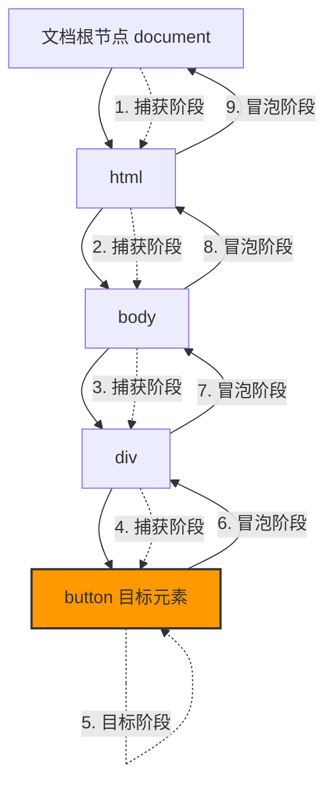

# JavaScript 事件捕获

## 什么是事件捕获？

在JavaScript中，当你点击一个元素时，这个点击事件不仅仅会在你点击的元素上触发，还会在DOM树上沿着特定的路径传播。这个传播过程被称为**事件流**，而**事件捕获**是事件流的一个阶段。

整个事件流包含三个阶段：
1. **捕获阶段**（Capturing Phase）：事件从文档根节点向下传播到目标元素
2. **目标阶段**（Target Phase）：事件到达目标元素
3. **冒泡阶段**（Bubbling Phase）：事件从目标元素向上冒泡到文档根节点



## 事件捕获的工作原理

默认情况下，大多数事件处理程序在**冒泡阶段**被触发。但通过设置特定参数，我们可以让事件处理程序在**捕获阶段**触发。

### addEventListener方法与捕获阶段

`addEventListener`方法接收三个参数：
1. 事件类型（如'click'、'mouseover'）
2. 事件处理函数
3. 布尔值或对象（指定事件是否在捕获阶段触发）

当第三个参数为`true`时，事件处理程序将在**捕获阶段**被触发：

```javascript
element.addEventListener('click', function() {
  console.log('事件捕获阶段被触发');
}, true); // true表示在捕获阶段触发
```

当第三个参数为`false`或省略时，事件处理程序将在**冒泡阶段**被触发：

```javascript
element.addEventListener('click', function() {
  console.log('事件冒泡阶段被触发');
}, false); // false表示在冒泡阶段触发（默认行为）
```

## 事件捕获的实际演示

让我们通过一个简单的例子来理解事件捕获：

```html
<div id="outer">
  <div id="middle">
    <div id="inner">点击我</div>
  </div>
</div>

<script>
  const outer = document.getElementById('outer');
  const middle = document.getElementById('middle');
  const inner = document.getElementById('inner');
  
  // 捕获阶段
  outer.addEventListener('click', function() {
    console.log('外层div - 捕获阶段');
  }, true);
  
  middle.addEventListener('click', function() {
    console.log('中层div - 捕获阶段');
  }, true);
  
  inner.addEventListener('click', function() {
    console.log('内层div - 捕获阶段');
  }, true);
  
  // 冒泡阶段
  outer.addEventListener('click', function() {
    console.log('外层div - 冒泡阶段');
  }, false);
  
  middle.addEventListener('click', function() {
    console.log('中层div - 冒泡阶段');
  }, false);
  
  inner.addEventListener('click', function() {
    console.log('内层div - 冒泡阶段');
  }, false);
</script>
```

当你点击最内层的div时，控制台输出顺序为：

```
外层div - 捕获阶段
中层div - 捕获阶段
内层div - 捕获阶段
内层div - 冒泡阶段
中层div - 冒泡阶段
外层div - 冒泡阶段
```

这清晰地展示了事件如何从外向内捕获，然后从内向外冒泡。

## 为什么需要事件捕获？

事件捕获在某些情况下非常有用：

1. **事件委托的高级应用**：在某些复杂场景中，你可能需要在事件到达目标元素之前就进行拦截
2. **特定功能实现**：例如实现一个模态框，在用户点击页面任何区域前，先判断点击是否在模态框外
3. **预处理或数据验证**：在事件到达目标元素前进行一些预处理

## 事件捕获的实际应用案例

### 案例1：阻止特定区域的点击事件传播

假设我们有一个弹出菜单，我们希望在用户点击菜单以外的区域时关闭菜单：

```javascript
const menu = document.getElementById('dropdown-menu');
const button = document.getElementById('menu-button');

// 打开菜单
button.addEventListener('click', function(event) {
  menu.style.display = 'block';
  event.stopPropagation(); // 阻止事件冒泡
});

// 在捕获阶段监听document的点击事件
document.addEventListener('click', function() {
  // 当点击发生在document上（而非菜单内部）时关闭菜单
  menu.style.display = 'none';
}, true);
```

### 案例2：自定义事件传播控制系统

在复杂的Web应用中，我们可能需要更精细地控制事件传播：

```javascript
// 自定义事件管理器
class EventController {
  constructor(rootElement) {
    this.rootElement = rootElement;
    this.isBlocked = false;
    
    // 在捕获阶段拦截所有点击事件
    document.addEventListener('click', (event) => {
      if (this.isBlocked && !this.rootElement.contains(event.target)) {
        event.stopPropagation();
        console.log('事件被阻断');
      }
    }, true);
  }
  
  blockOutsideEvents() {
    this.isBlocked = true;
  }
  
  allowEvents() {
    this.isBlocked = false;
  }
}

// 使用示例
const appContainer = document.getElementById('app');
const controller = new EventController(appContainer);

// 当打开重要对话框时
function openImportantDialog() {
  controller.blockOutsideEvents(); // 阻止应用区域外的点击事件
}

// 当关闭对话框时
function closeImportantDialog() {
  controller.allowEvents(); // 恢复正常事件流
}
```

## 捕获阶段与冒泡阶段的区别

:::tip 关键区别
**捕获阶段**：事件从祖先元素向目标元素传播（由外向内）<br />
**冒泡阶段**：事件从目标元素向祖先元素传播（由内向外）
:::

了解这两个阶段的差异对于正确处理复杂的事件交互至关重要：

1. **执行顺序不同**：捕获先于冒泡
2. **默认行为不同**：大多数事件处理默认在冒泡阶段触发
3. **使用场景不同**：
   - 捕获常用于拦截或预处理事件
   - 冒泡常用于事件委托

## 阻止事件传播

在某些情况下，我们需要阻止事件继续传播：

```javascript
element.addEventListener('click', function(event) {
  // 阻止事件继续捕获或冒泡
  event.stopPropagation();
  
  // 如果需要更强力的阻止（包括同一元素上的其他事件处理器）
  event.stopImmediatePropagation();
}, true); // 捕获阶段
```

:::caution 注意事项
过度使用`stopPropagation()`可能会干扰其他事件处理程序的正常工作，尤其是在使用第三方库时。请谨慎使用。
:::

## 事件委托与事件捕获

事件委托（Event Delegation）是一种常见的事件处理模式，通常利用事件冒泡在父元素上统一处理多个子元素的事件。

但在某些特殊情况下，我们也可以利用事件捕获来实现更特殊的委托模式：

```javascript
// 传统的事件委托（利用冒泡）
document.getElementById('todo-list').addEventListener('click', function(event) {
  if (event.target.matches('.delete-button')) {
    // 处理删除按钮点击
  }
});

// 使用捕获阶段的事件委托
document.addEventListener('focus', function(event) {
  // 在任何表单元素获得焦点前执行验证
  if (event.target.matches('input[data-validate]')) {
    validateInput(event.target);
  }
}, true); // 捕获阶段
```

## 总结

事件捕获是JavaScript事件流的重要组成部分，与冒泡阶段一起构成了完整的事件传播机制：

1. 事件捕获从文档根节点开始，向下传播到目标元素
2. 默认情况下，事件处理程序在冒泡阶段触发，但可以通过`addEventListener`的第三个参数设置为在捕获阶段触发
3. 事件捕获在特定场景下非常有用，如拦截事件、实现特殊UI控制等
4. 通过`event.stopPropagation()`可以阻止事件继续传播

掌握事件捕获的工作原理，将使你能够实现更复杂、更高级的交互功能，并更好地控制应用中的事件流。

## 练习

1. 创建一个嵌套的HTML结构（至少三层），并为每一层添加捕获和冒泡阶段的事件监听器。观察点击时的执行顺序。
2. 编写一个程序，利用事件捕获在用户点击按钮前进行验证，如果验证失败则阻止事件继续传播。
3. 实现一个模态对话框，当用户点击对话框外部区域时关闭对话框（使用捕获阶段监听）。

## 进一步学习资源

- MDN文档：[DOM事件介绍](https://developer.mozilla.org/zh-CN/docs/Learn/JavaScript/Building_blocks/Events)
- 深入理解：[JavaScript中的事件循环](https://developer.mozilla.org/zh-CN/docs/Web/JavaScript/EventLoop)
- 进阶技巧：[JavaScript事件处理的最佳实践](https://developer.mozilla.org/zh-CN/docs/Web/API/EventTarget/addEventListener)

通过深入理解事件捕获机制，你将能够更精确地控制Web应用中的用户交互，实现更复杂的功能需求。