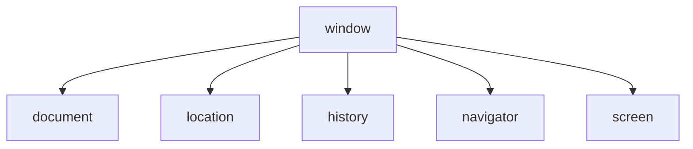

# JavaScript BOM基础

## 什么是BOM？

BOM（Browser Object Model，浏览器对象模型）是JavaScript提供的与浏览器交互的接口，允许JavaScript代码与浏览器窗口进行交互，而不是与页面内容（DOM）交互。

通过BOM，开发者可以：
- 控制浏览器窗口
- 操作浏览器历史
- 获取浏览器和屏幕信息
- 管理定时器
- 实现客户端存储
- 与用户进行交互

:::note
BOM不像DOM那样有标准规范，不同浏览器的实现可能略有差异。但随着Web标准的发展，主要BOM功能已趋于一致。
:::

## BOM的核心对象

BOM的核心是`window`对象，它代表浏览器窗口，也是JavaScript在浏览器中的全局对象。以下是`window`对象的主要子对象：



下面我们将详细介绍这些对象。

## Window 对象

`window`对象是BOM的核心，表示浏览器的窗口。它同时也是JavaScript的全局对象，全局变量和函数都是`window`对象的属性和方法。

### 常用属性和方法

#### 窗口尺寸

```javascript
// 获取窗口的内部宽高（不包括工具栏和滚动条）
let innerWidth = window.innerWidth;
let innerHeight = window.innerHeight;

// 获取整个浏览器窗口的外部宽高
let outerWidth = window.outerWidth;
let outerHeight = window.outerHeight;

console.log(`窗口内部尺寸: ${innerWidth} x ${innerHeight}`);
console.log(`窗口外部尺寸: ${outerWidth} x ${outerHeight}`);
```

#### 打开新窗口

```javascript
// 语法: window.open(URL, name, specs, replace)
let newWindow = window.open("https://www.example.com", "_blank", "width=500,height=400");

// 关闭窗口
// newWindow.close();
```

#### 定时器

```javascript
// setTimeout - 延迟执行（一次）
let timeoutId = setTimeout(() => {
  console.log("这条消息会在3秒后显示");
}, 3000);

// 清除setTimeout
// clearTimeout(timeoutId);

// setInterval - 定时重复执行
let intervalId = setInterval(() => {
  console.log("这条消息每2秒显示一次");
}, 2000);

// 清除setInterval
// clearInterval(intervalId);
```

:::tip 实用提示
使用`clearTimeout()`和`clearInterval()`可以取消尚未执行的定时任务，这在用户交互切换场景时非常有用。
:::

## Location 对象

`location`对象提供了当前窗口中加载的文档的URL信息，并提供了一些导航功能。

```javascript
// 完整URL
console.log("完整URL:", window.location.href);

// URL的各个部分
console.log("协议:", window.location.protocol); // "https:"
console.log("主机名:", window.location.hostname); // "www.example.com"
console.log("端口:", window.location.port); // "443"
console.log("路径:", window.location.pathname); // "/path"
console.log("查询字符串:", window.location.search); // "?param=value"
console.log("锚点:", window.location.hash); // "#section"
```

### 页面导航

```javascript
// 跳转到新页面
// window.location.href = "https://www.example.com";

// 刷新当前页面
// window.location.reload();

// 替换当前页面（不保留历史记录）
// window.location.replace("https://www.example.com");
```

## History 对象

`history`对象包含用户（在浏览器窗口中）访问过的URL历史记录，并提供了在这些记录之间导航的方法。

```javascript
// 后退一页
// window.history.back();

// 前进一页
// window.history.forward();

// 移动指定的页数（正数为前进，负数为后退）
// window.history.go(-2); // 后退两页
```

:::caution 注意
出于安全考虑，`history`对象不允许访问具体的URL历史，只能进行相对导航。
:::

## Navigator 对象

`navigator`对象包含有关访问者浏览器的信息。

```javascript
// 浏览器信息
console.log("浏览器名称:", navigator.appName);
console.log("浏览器版本:", navigator.appVersion);
console.log("用户代理字符串:", navigator.userAgent);

// 系统平台
console.log("操作系统:", navigator.platform);

// 浏览器语言
console.log("浏览器语言:", navigator.language);

// 检查浏览器是否在线
console.log("是否在线:", navigator.onLine);

// 地理位置信息（需要用户许可）
if (navigator.geolocation) {
  navigator.geolocation.getCurrentPosition(
    position => {
      console.log("纬度:", position.coords.latitude);
      console.log("经度:", position.coords.longitude);
    },
    error => {
      console.error("无法获取位置信息:", error.message);
    }
  );
}
```

## Screen 对象

`screen`对象包含有关用户屏幕的信息。

```javascript
// 屏幕尺寸
console.log("屏幕宽度:", screen.width);
console.log("屏幕高度:", screen.height);

// 可用尺寸（不包括任务栏等系统UI）
console.log("可用宽度:", screen.availWidth);
console.log("可用高度:", screen.availHeight);

// 颜色深度
console.log("颜色深度:", screen.colorDepth);
```

## BOM在实际中的应用

### 响应式设计

利用`window`对象检测窗口大小，实现响应式设计：

```javascript
function checkScreenSize() {
  const width = window.innerWidth;
  
  if (width < 600) {
    document.body.className = "small-screen";
  } else if (width < 1024) {
    document.body.className = "medium-screen";
  } else {
    document.body.className = "large-screen";
  }
  
  console.log(`当前屏幕类别: ${document.body.className}`);
}

// 初始检查
checkScreenSize();

// 窗口大小改变时再次检查
window.addEventListener("resize", checkScreenSize);
```

### URL参数解析

使用`location`对象解析URL查询参数：

```javascript
function getUrlParams() {
  const params = {};
  const queryString = window.location.search.substring(1);
  const pairs = queryString.split('&');
  
  for (let pair of pairs) {
    const [key, value] = pair.split('=');
    if (key) {
      params[decodeURIComponent(key)] = decodeURIComponent(value || '');
    }
  }
  
  return params;
}

// 假设URL为: "https://example.com?name=John&age=30"
const urlParams = getUrlParams();
console.log("URL参数:", urlParams); // {name: "John", age: "30"}
```

### 检测浏览器和设备

使用`navigator`对象进行浏览器和设备检测：

```javascript
function detectBrowser() {
  const userAgent = navigator.userAgent;
  let browserName;
  
  if (userAgent.match(/chrome|chromium|crios/i)) {
    browserName = "Chrome";
  } else if (userAgent.match(/firefox|fxios/i)) {
    browserName = "Firefox";
  } else if (userAgent.match(/safari/i)) {
    browserName = "Safari";
  } else if (userAgent.match(/opr\//i)) {
    browserName = "Opera";
  } else if (userAgent.match(/edg/i)) {
    browserName = "Edge";
  } else if (userAgent.match(/msie|trident/i)) {
    browserName = "Internet Explorer";
  } else {
    browserName = "Unknown browser";
  }
  
  return browserName;
}

const isMobile = /iPhone|iPad|iPod|Android/i.test(navigator.userAgent);
console.log(`当前浏览器: ${detectBrowser()}`);
console.log(`是否移动设备: ${isMobile}`);
```

:::warning
用户代理字符串检测不总是可靠的，因为浏览器可能会伪装自己。在生产环境中，应考虑使用特征检测而非浏览器检测。
:::

### 简单的页面加载计时器

```javascript
// 页面加载开始时记录时间
const startTime = new Date().getTime();

// 页面完全加载后计算时间
window.addEventListener('load', () => {
  const endTime = new Date().getTime();
  const loadTime = (endTime - startTime) / 1000;
  console.log(`页面加载时间: ${loadTime.toFixed(2)}秒`);
});
```

## 总结

BOM（浏览器对象模型）为JavaScript提供了与浏览器交互的能力，使开发者可以操控浏览器窗口、获取用户和环境信息、实现导航功能等。通过`window`对象及其子对象如`document`、`location`、`history`、`navigator`和`screen`，我们可以开发出具有丰富交互体验的Web应用。

理解BOM对于Web开发至关重要，它是构建现代交互式应用的基础。随着Web技术的发展，BOM的功能也在不断扩展，但核心概念仍然保持不变。

## 练习任务

1. 创建一个简单网页，显示用户的浏览器信息、屏幕尺寸和当前页面URL。
2. 实现一个按钮，点击后打开一个新窗口，并在5秒后自动关闭。
3. 创建一个基于`setTimeout`和`setInterval`的简单倒计时器。
4. 使用`location`对象解析当前URL的查询参数，并在页面上显示。
5. 实现一个简单的浏览历史导航器，包含前进、后退按钮。

## 额外资源

- [MDN Web Docs: Window](https://developer.mozilla.org/zh-CN/docs/Web/API/Window)
- [MDN Web Docs: Location](https://developer.mozilla.org/zh-CN/docs/Web/API/Location)
- [MDN Web Docs: History API](https://developer.mozilla.org/zh-CN/docs/Web/API/History_API)
- [MDN Web Docs: Navigator](https://developer.mozilla.org/zh-CN/docs/Web/API/Navigator)