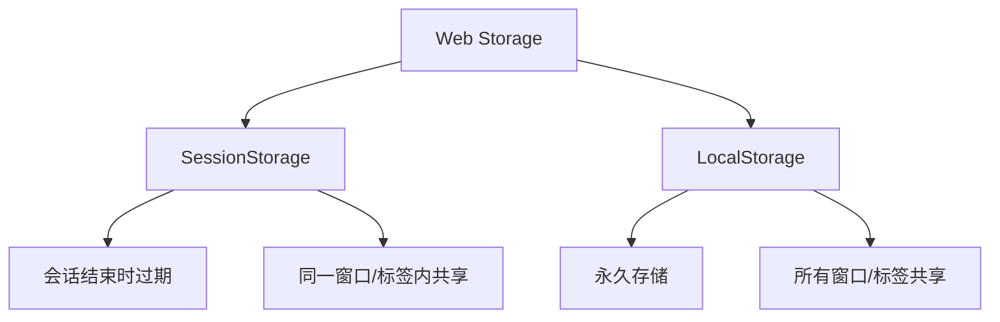

# JavaScript SessionStorage

## 什么是 SessionStorage？

SessionStorage 是 Web Storage API 的一部分，它为网页提供了在会话期间存储键值对数据的机制。与 LocalStorage 不同，SessionStorage 中的数据仅在页面会话期间可用，这意味着当用户关闭特定的浏览器标签或窗口时，数据会被清除。

:::note
SessionStorage 是一种客户端存储技术，数据存储在用户的浏览器中，而不是服务器上。
:::

## SessionStorage 的特点

SessionStorage 具有以下几个重要特点：

1. **会话期间有效** - 数据只在页面会话期间存在，关闭标签/窗口后数据会被清除
2. **域名隔离** - 只能访问同一域名下的 SessionStorage 数据
3. **标签/窗口隔离** - 即使是同一个域名，不同的标签/窗口也拥有各自独立的 SessionStorage
4. **容量限制** - 通常为 5MB 左右（因浏览器而异）
5. **仅存储字符串** - 所有数据都会被转换为字符串格式存储

## 基本使用方法

### 存储数据

要在 SessionStorage 中存储数据，使用 `setItem()` 方法：

```javascript
// 语法：sessionStorage.setItem(key, value);
sessionStorage.setItem('username', 'John');
sessionStorage.setItem('isLoggedIn', true);  // 注意：这会被转换为字符串 "true"
```

### 获取数据

使用 `getItem()` 方法从 SessionStorage 中检索数据：

```javascript
// 语法：sessionStorage.getItem(key);
const username = sessionStorage.getItem('username');
console.log(username);  // 输出: "John"

const isLoggedIn = sessionStorage.getItem('isLoggedIn');
console.log(isLoggedIn);  // 输出: "true" (字符串，而不是布尔值)
console.log(typeof isLoggedIn);  // 输出: "string"
```

### 移除数据

使用 `removeItem()` 方法移除特定的数据项：

```javascript
// 语法：sessionStorage.removeItem(key);
sessionStorage.removeItem('username');
console.log(sessionStorage.getItem('username'));  // 输出: null
```

### 清空所有数据

使用 `clear()` 方法可以移除当前域名下该标签/窗口中的所有 SessionStorage 数据：

```javascript
// 语法：sessionStorage.clear();
sessionStorage.clear();
```

### 获取所有键

使用 `key()` 方法可以获取特定索引位置的键名：

```javascript
sessionStorage.setItem('name', 'John');
sessionStorage.setItem('age', '25');

for (let i = 0; i < sessionStorage.length; i++) {
  const key = sessionStorage.key(i);
  const value = sessionStorage.getItem(key);
  console.log(`${key}: ${value}`);
}
// 输出:
// name: John
// age: 25
```

## 存储复杂数据类型

SessionStorage 只能存储字符串，但我们可以使用 JSON 来存储和检索复杂数据类型：

```javascript
// 存储对象
const user = {
  name: 'John',
  age: 25,
  preferences: ['music', 'sports']
};

sessionStorage.setItem('user', JSON.stringify(user));

// 检索对象
const retrievedUser = JSON.parse(sessionStorage.getItem('user'));
console.log(retrievedUser);
// 输出: {name: "John", age: 25, preferences: Array(2)}
```

## SessionStorage 与 LocalStorage 的比较

下面是 SessionStorage 和 LocalStorage 的主要区别：



| 特性 | SessionStorage | LocalStorage |
|------|----------------|--------------|
| 生命周期 | 会话期间（关闭标签/窗口后清除） | 永久（除非手动清除） |
| 数据共享 | 只在同一标签/窗口中共享 | 同域名下所有标签/窗口共享 |
| 容量 | 约 5MB | 约 5MB |
| 数据格式 | 字符串 | 字符串 |

## 实际应用场景

### 1. 表单数据临时保存

用户在填写复杂表单时，可能会不小心刷新页面或临时离开。使用 SessionStorage 可以临时保存表单数据，避免用户重新填写：

```javascript
// 保存表单数据
const saveFormData = () => {
  const formData = {
    name: document.getElementById('name').value,
    email: document.getElementById('email').value,
    message: document.getElementById('message').value
  };
  
  sessionStorage.setItem('formData', JSON.stringify(formData));
};

// 恢复表单数据
const loadFormData = () => {
  const savedData = sessionStorage.getItem('formData');
  
  if (savedData) {
    const formData = JSON.parse(savedData);
    document.getElementById('name').value = formData.name || '';
    document.getElementById('email').value = formData.email || '';
    document.getElementById('message').value = formData.message || '';
  }
};

// 页面加载时恢复数据
window.addEventListener('load', loadFormData);

// 表单输入变化时保存数据
document.querySelectorAll('input, textarea').forEach(element => {
  element.addEventListener('input', saveFormData);
});
```

### 2. 单页面应用中的页面状态管理

在单页面应用（SPA）中，用户可能在不同视图间切换。SessionStorage 可以帮助记住特定页面的状态：

```javascript
// 用户切换到产品列表页
function navigateToProductList() {
  // 保存当前筛选条件和分页信息
  const filters = {
    category: document.querySelector('#category-filter').value,
    priceRange: document.querySelector('#price-range').value,
    page: currentPage
  };
  
  sessionStorage.setItem('productListState', JSON.stringify(filters));
  
  // 切换页面逻辑...
}

// 加载产品列表页时恢复状态
function loadProductListPage() {
  const savedState = sessionStorage.getItem('productListState');
  
  if (savedState) {
    const filters = JSON.parse(savedState);
    document.querySelector('#category-filter').value = filters.category;
    document.querySelector('#price-range').value = filters.priceRange;
    currentPage = filters.page;
    
    // 应用筛选器和加载产品...
  }
}
```

### 3. 多步骤操作的临时数据

在需要跨多个页面收集数据的流程中（如多步骤注册），SessionStorage 可以临时存储用户的选择和输入：

```javascript
// 第一步：基本信息
function saveStep1Data() {
  const step1Data = {
    firstName: document.getElementById('first-name').value,
    lastName: document.getElementById('last-name').value,
    email: document.getElementById('email').value
  };
  
  sessionStorage.setItem('registration_step1', JSON.stringify(step1Data));
  window.location.href = 'registration-step2.html';
}

// 第二步：加载第一步数据并保存新数据
function saveStep2Data() {
  const step2Data = {
    address: document.getElementById('address').value,
    city: document.getElementById('city').value,
    zipCode: document.getElementById('zip-code').value
  };
  
  sessionStorage.setItem('registration_step2', JSON.stringify(step2Data));
  window.location.href = 'registration-step3.html';
}

// 最后步骤：汇总所有数据并提交
function submitAllData() {
  const step1Data = JSON.parse(sessionStorage.getItem('registration_step1') || '{}');
  const step2Data = JSON.parse(sessionStorage.getItem('registration_step2') || '{}');
  
  const finalData = {
    ...step1Data,
    ...step2Data,
    // 第三步数据
    password: document.getElementById('password').value
  };
  
  // 发送数据到服务器
  fetch('/api/register', {
    method: 'POST',
    headers: {'Content-Type': 'application/json'},
    body: JSON.stringify(finalData)
  })
  .then(response => {
    if (response.ok) {
      // 注册成功后清除临时数据
      sessionStorage.removeItem('registration_step1');
      sessionStorage.removeItem('registration_step2');
    }
  });
}
```

## 安全考虑

虽然 SessionStorage 是临时的，但仍存在一些安全注意事项：

:::caution
永远不要在 SessionStorage 中存储敏感信息，如密码、信用卡信息或个人身份信息。
:::

- SessionStorage 在页面会话期间都是持久的，可能会被 XSS 攻击访问
- 虽然 JavaScript 可以访问 SessionStorage，但它不会随 HTTP 请求发送到服务器
- 不同于 Cookie，SessionStorage 不能被服务器访问或修改

## 浏览器兼容性

SessionStorage 在现代浏览器中得到广泛支持，包括：

- Chrome 4+
- Firefox 3.5+
- Safari 4+
- Internet Explorer 8+
- Edge 所有版本

在使用前，您可以这样检测浏览器是否支持 SessionStorage：

```javascript
if (typeof(Storage) !== "undefined") {
  // 支持 SessionStorage
  console.log("您的浏览器支持 SessionStorage");
} else {
  // 不支持 SessionStorage
  console.log("您的浏览器不支持 Web Storage");
}
```

## 总结

SessionStorage 是一种简单但强大的客户端存储机制，特别适用于需要在会话期间临时保存数据的场景。它具有以下关键特点：

- 数据仅在会话期间存在（关闭标签/窗口后清除）
- 提供简单的 API：`setItem()`, `getItem()`, `removeItem()` 和 `clear()`
- 每个标签/窗口都有独立的 SessionStorage
- 只能存储字符串，但可以通过 JSON 序列化/反序列化存储复杂数据类型

通过本教程，您已经了解了如何使用 SessionStorage 存储、检索和管理数据，以及几个实际应用场景。这些知识将帮助您在前端项目中更有效地管理临时客户端数据。

## 练习

1. 创建一个简单的待办事项应用程序，使用 SessionStorage 保存任务列表，允许用户添加、删除和标记完成的任务。
2. 开发一个多步骤表单，使用 SessionStorage 在步骤间保存用户输入的数据。
3. 实现一个页面，显示用户在 SessionStorage 中当前存储的所有项目，并允许编辑或删除它们。

## 进一步阅读

- 了解 Web Storage API 的其他部分，特别是 LocalStorage
- 探索更高级的客户端存储技术，如 IndexedDB
- 学习 Cookie 以及它与 Web Storage 的区别和用途

祝您编程愉快！