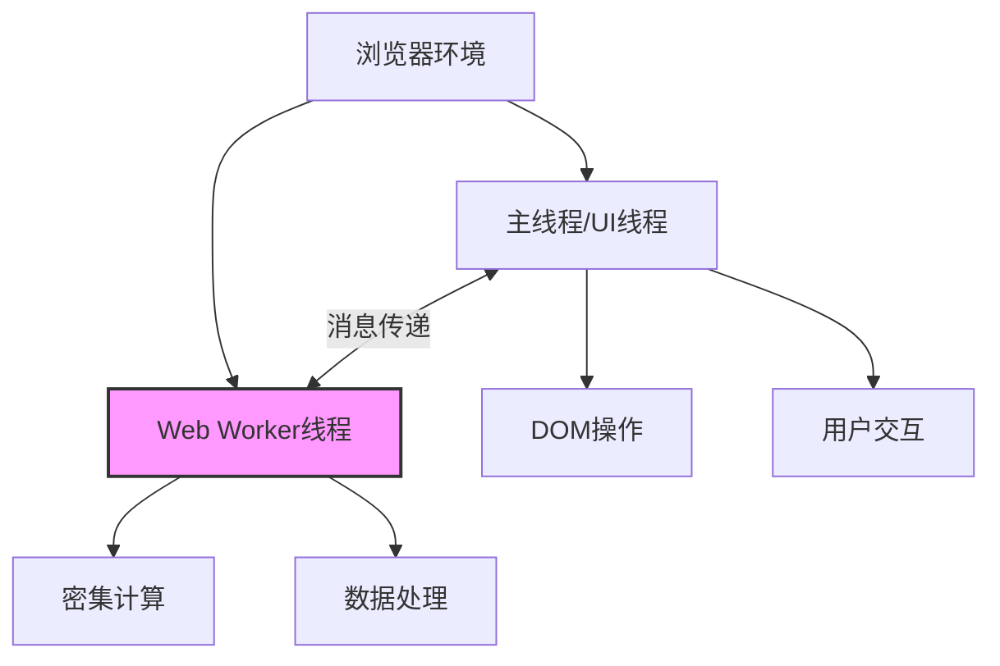

# JavaScript Web Worker

## 什么是 Web Worker？

Web Worker 是 HTML5 引入的一项技术，它允许 JavaScript 代码在主线程之外的后台线程中运行。在传统的 JavaScript 执行模型中，所有代码都在单一的主线程中运行，这意味着长时间运行的任务会阻塞用户界面，导致页面响应变慢。Web Worker 提供了一种在后台执行复杂计算而不影响页面性能的方法。

:::note
JavaScript 传统上是单线程语言，这意味着一次只能执行一个操作。Web Worker 是突破这一限制的官方解决方案。
:::



## Web Worker 的类型

JavaScript 提供了几种类型的 Web Worker：

1. **专用 Worker (Dedicated Worker)** - 仅能被创建它的脚本访问
2. **共享 Worker (Shared Worker)** - 可被多个脚本共享，即使这些脚本来自不同的窗口、iframe 或工作线程
3. **Service Worker** - 充当代理服务器的特殊类型 Worker，主要用于离线缓存和推送通知

本文将主要关注专用 Worker，这是最常用和最基本的 Worker 类型。

## Web Worker 的限制

在开始使用 Web Worker 之前，了解它的限制很重要：

- Worker 无法访问 DOM（无法直接操作页面元素）
- Worker 无法访问 `window`、`document` 对象
- Worker 无法访问父页面的全局变量和函数
- Worker 有自己独立的全局上下文（`WorkerGlobalScope`）
- 主线程和 Worker 之间只能通过消息传递进行通信

## 创建和使用 Web Worker

### 基本使用步骤

1. 创建一个单独的 JavaScript 文件作为 Worker 脚本
2. 在主脚本中使用 `Worker()` 构造函数创建 Worker 实例
3. 使用 `postMessage()` 方法从主线程向 Worker 发送消息
4. 在 Worker 中使用 `onmessage` 事件处理接收到的消息
5. 使用 `postMessage()` 从 Worker 向主线程发送处理结果
6. 在主线程中使用 `onmessage` 事件处理 Worker 返回的结果

### 创建 Web Worker 示例

假设我们想要执行一个计算密集型的任务：计算从 1 到给定数字的所有数字之和。

**1. 创建 Worker 文件 (worker.js)**

```javascript
// 监听来自主线程的消息
onmessage = function(e) {
  const num = e.data;
  
  // 执行计算密集型任务
  let sum = 0;
  for (let i = 1; i <= num; i++) {
    sum += i;
  }
  
  // 将结果发送回主线程
  postMessage({
    result: sum,
    originalNumber: num
  });
};
```

**2. 在主脚本中使用 Worker**

```javascript
// 创建一个新的 Worker，指定 Worker 脚本的路径
const myWorker = new Worker('worker.js');

// 监听 Worker 返回的消息
myWorker.onmessage = function(e) {
  const result = e.data;
  console.log(`从 1 到 ${result.originalNumber} 的和是: ${result.result}`);
  document.getElementById('result').textContent = result.result;
};

// 当用户点击按钮时，向 Worker 发送数据
document.getElementById('calcButton').addEventListener('click', function() {
  const number = document.getElementById('numberInput').value;
  myWorker.postMessage(Number(number));
});
```

**3. HTML 结构**

```html
<div>
  <input type="number" id="numberInput" value="100000000" />
  <button id="calcButton">计算和</button>
  <p>结果: <span id="result">等待计算...</span></p>
</div>
```

### 终止 Web Worker

当不再需要 Worker 时，应该将其终止以释放资源：

```javascript
// 终止 Worker
myWorker.terminate();

// Worker 内部也可以自行终止
// 在 worker.js 中:
// self.close();
```

## Worker 错误处理

Worker 运行中可能会发生错误，我们可以通过 `onerror` 事件来捕获这些错误：

```javascript
myWorker.onerror = function(error) {
  console.error('Worker 错误:', error.message);
  document.getElementById('result').textContent = '计算出错!';
};
```

## 数据传输优化

### 传输大数据

当需要在 Worker 和主线程之间传输大量数据时，可以使用 `Transferable Objects`：

```javascript
// 创建一个大型数组缓冲区
const hugeArrayBuffer = new ArrayBuffer(100 * 1024 * 1024); // 100MB

// 将缓冲区传输到 Worker (而非复制)
myWorker.postMessage(hugeArrayBuffer, [hugeArrayBuffer]);
```

使用 Transferable Objects 可以实现零复制传输，这对于处理大型数据集特别有用。

## 实际应用场景

Web Worker 在许多场景中非常有用，以下是一些常见应用：

### 1. 图像处理

当处理图像滤镜或效果时，可以将处理逻辑放在 Worker 中执行，避免主线程阻塞。

```javascript
// 在主线程中
const imageWorker = new Worker('image-processor.js');

imageWorker.onmessage = function(e) {
  const processedImageData = e.data;
  drawImageToCanvas(processedImageData);
};

// 当用户上传图片时
inputElement.addEventListener('change', function(e) {
  const file = e.target.files[0];
  const reader = new FileReader();
  
  reader.onload = function(event) {
    // 将图像数据发送到 Worker 进行处理
    imageWorker.postMessage(event.target.result);
  };
  
  reader.readAsArrayBuffer(file);
});
```

### 2. 实时数据分析

Web Worker 非常适合处理并分析实时数据流，同时保持界面响应性：

```javascript
// 实时监控数据 Worker
const analyticsWorker = new Worker('analytics-worker.js');

// 接收处理后的数据并更新图表
analyticsWorker.onmessage = function(e) {
  updateDashboard(e.data);
};

// 假设我们有一个 WebSocket 连接获取实时数据
dataSocket.onmessage = function(event) {
  const newDataPoint = JSON.parse(event.data);
  // 将新数据发送到 Worker 进行分析
  analyticsWorker.postMessage(newDataPoint);
};
```

### 3. 复杂计算或算法

对于需要大量计算的任务，如加密/解密、排序大型数据集或模拟：

```javascript
// 在 worker.js 中
onmessage = function(e) {
  const { algorithm, data } = e.data;
  
  let result;
  switch(algorithm) {
    case 'sort':
      result = complexSort(data);
      break;
    case 'encrypt':
      result = encryptData(data);
      break;
    // 更多算法...
  }
  
  postMessage(result);
};

function complexSort(array) {
  // 实现复杂排序逻辑
  return sortedArray;
}
```

## 注意事项和最佳实践

1. **不要过度使用**：创建 Worker 有一定开销，只对真正需要后台处理的重任务使用 Worker
2. **合理规划通信**：尽量减少主线程和 Worker 之间的通信频率，每次通信都会产生序列化开销
3. **考虑可用性**：并非所有浏览器都支持所有类型的 Worker，特别是在移动设备上
4. **注意安全限制**：Worker 脚本必须遵守同源策略
5. **正确处理终止**：不再需要 Worker 时，记得终止它以释放资源

## 浏览器兼容性

Web Worker 在所有现代浏览器中都得到了良好支持，包括：

- Chrome 4+
- Firefox 3.5+
- Safari 4+
- Edge 12+
- Opera 11.5+
- IE 10+

但某些特定功能（如 Shared Worker）的支持可能会有所不同。

## 总结

Web Worker 为 JavaScript 提供了多线程能力，使开发者能够执行耗时操作而不会阻塞用户界面。通过将计算密集型任务移至后台线程，Web Worker 显著提升了 Web 应用的性能和响应性。

关键要点：
- Web Worker 在独立线程中运行 JavaScript 代码
- 主线程和 Worker 通过消息传递进行通信
- Worker 无法直接访问 DOM 或主线程变量
- Worker 适用于计算密集型任务、数据处理和长时间运行的操作
- 使用 `postMessage()` 发送消息，使用 `onmessage` 事件接收消息

:::tip 实践建议
从小处开始，尝试将一个简单但耗时的计算任务移至 Worker 中，观察网页响应性的改进。随着经验积累，逐步将更复杂的后台逻辑迁移到 Worker 环境。
:::

## 练习与进一步学习

1. **基础练习**：创建一个 Web Worker 计算斐波那契数列中的大数
2. **中级练习**：使用 Web Worker 实现图像的模糊或灰度处理
3. **高级练习**：构建一个使用多个 Worker 的数据分析应用，每个 Worker 负责不同的分析任务

### 进一步学习资源

- [MDN Web Worker API](https://developer.mozilla.org/zh-CN/docs/Web/API/Web_Workers_API)
- [HTML5 Rocks: The Basics of Web Workers](https://www.html5rocks.com/en/tutorials/workers/basics/)
- [深入了解 Shared Workers 和 Service Workers](https://developers.google.com/web/fundamentals/primers/service-workers)

通过掌握 Web Worker，您将能够构建更高性能、响应更快的 Web 应用，提供更好的用户体验！