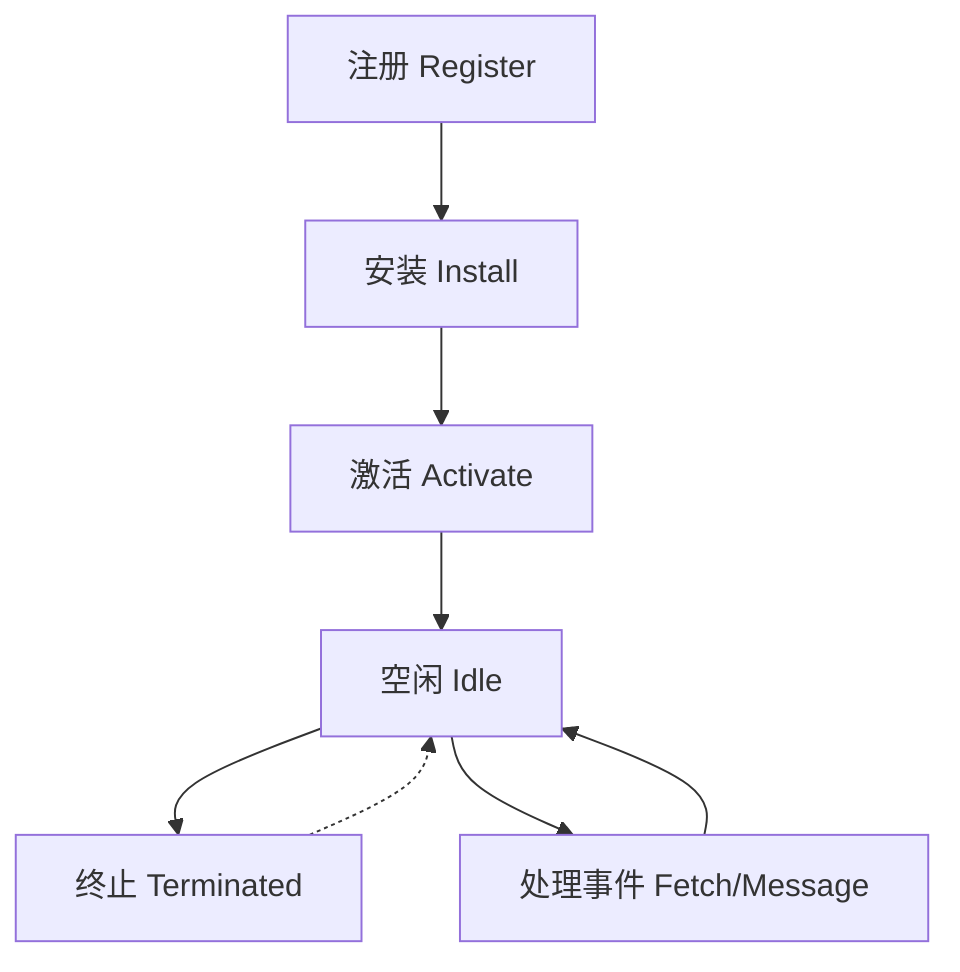

# JavaScript Service Worker

## 什么是 Service Worker？

Service Worker 是一种在浏览器后台运行的脚本，它独立于网页，为网页提供了可以在后台持续运行的能力，即使用户关闭了网页。它是 Progressive Web Apps（渐进式网络应用，简称 PWA）的核心技术之一。

Service Worker 能够拦截和处理网络请求，包括通过编程方式管理缓存，这使得开发者能够创建可在离线环境下运行的 Web 应用程序。

:::note
Service Worker 运行在一个与页面 JavaScript 主线程独立的线程中，因此它不能直接访问 DOM。Service Worker 与主线程通信需要使用 `postMessage` API。
:::

## Service Worker 的特点

- **独立于主线程**：在独立的线程中运行，不会阻塞主线程
- **不能直接操作 DOM**：必须通过 `postMessage` 与页面通信
- **完全异步**：同步 API 如 `localStorage` 无法在 Service Worker 中使用
- **可以终止和重启**：不使用时可被浏览器终止，需要时重启，因此不能依赖全局状态
- **支持离线体验**：通过缓存资源实现应用离线运行
- **网络代理**：可以拦截和修改网络请求

## Service Worker 生命周期



1. **注册阶段**：网页通过 `navigator.serviceWorker.register()` 注册 Service Worker
2. **安装阶段**：Service Worker 文件被下载、解析并执行，通常在此阶段缓存静态资源
3. **激活阶段**：新的 Service Worker 开始控制客户端，此时可以清理旧缓存
4. **运行阶段**：Service Worker 处于活动状态，可以拦截网络请求、接收推送通知等
5. **终止阶段**：浏览器可能终止空闲的 Service Worker 以节省内存

## 如何实现一个 Service Worker

### 1. 注册 Service Worker

首先，需要在网页中注册 Service Worker：

```javascript
// 确认浏览器支持 Service Worker
if ('serviceWorker' in navigator) {
  window.addEventListener('load', function() {
    // 注册 Service Worker
    navigator.serviceWorker.register('/sw.js').then(function(registration) {
      console.log('ServiceWorker 注册成功，作用域为：', registration.scope);
    }).catch(function(error) {
      console.log('ServiceWorker 注册失败：', error);
    });
  });
}
```

### 2. 创建 Service Worker 文件 (sw.js)

```javascript
// 缓存名称
const CACHE_NAME = 'my-site-cache-v1';
// 需要缓存的资源列表
const urlsToCache = [
  '/',
  '/styles/main.css',
  '/scripts/main.js',
  '/images/logo.png'
];

// 安装事件处理函数
self.addEventListener('install', function(event) {
  // 执行安装步骤
  event.waitUntil(
    caches.open(CACHE_NAME)
      .then(function(cache) {
        console.log('缓存已打开');
        return cache.addAll(urlsToCache);
      })
  );
});

// 请求拦截处理
self.addEventListener('fetch', function(event) {
  event.respondWith(
    caches.match(event.request)
      .then(function(response) {
        // 如果缓存中找到匹配的响应，则返回缓存的响应
        if (response) {
          return response;
        }
        // 否则发起网络请求
        return fetch(event.request).then(
          function(response) {
            // 检查响应是否有效
            if(!response || response.status !== 200 || response.type !== 'basic') {
              return response;
            }

            // 克隆响应以便既可以返回给浏览器也可以缓存
            var responseToCache = response.clone();

            caches.open(CACHE_NAME)
              .then(function(cache) {
                cache.put(event.request, responseToCache);
              });

            return response;
          }
        );
      })
  );
});

// 清理旧缓存
self.addEventListener('activate', function(event) {
  const cacheWhitelist = [CACHE_NAME];
  
  event.waitUntil(
    caches.keys().then(function(cacheNames) {
      return Promise.all(
        cacheNames.map(function(cacheName) {
          if (cacheWhitelist.indexOf(cacheName) === -1) {
            // 删除不在白名单中的旧缓存
            return caches.delete(cacheName);
          }
        })
      );
    })
  );
});
```

## 缓存策略

使用 Service Worker 可以实现多种缓存策略：

### 1. 缓存优先（Cache First）

先从缓存获取资源，如果缓存中没有，再从网络获取：

```javascript
self.addEventListener('fetch', function(event) {
  event.respondWith(
    caches.match(event.request)
      .then(function(response) {
        // 缓存中有数据就返回缓存数据
        return response || fetch(event.request);
      })
  );
});
```

### 2. 网络优先（Network First）

先尝试从网络获取资源，如果失败再从缓存获取：

```javascript
self.addEventListener('fetch', function(event) {
  event.respondWith(
    fetch(event.request).catch(function() {
      return caches.match(event.request);
    })
  );
});
```

### 3. 网络与缓存竞赛（Network Race）

同时从网络和缓存获取资源，谁先返回就用谁的：

```javascript
self.addEventListener('fetch', function(event) {
  event.respondWith(
    Promise.race([
      fetch(event.request),
      caches.match(event.request)
    ])
  );
});
```

## 实际应用场景

### 场景1：离线应用

创建一个离线应用，让用户在没有网络连接的情况下也能访问内容：

```javascript
// sw.js
const OFFLINE_CACHE = 'offline-cache-v1';
const OFFLINE_URL = '/offline.html';

// 安装时缓存离线页面
self.addEventListener('install', function(event) {
  event.waitUntil(
    caches.open(OFFLINE_CACHE)
      .then(function(cache) {
        return cache.addAll([
          OFFLINE_URL,
          '/css/offline.css',
          '/images/offline-logo.png'
        ]);
      })
  );
});

// 处理请求
self.addEventListener('fetch', function(event) {
  // 只处理导航请求
  if (event.request.mode === 'navigate') {
    event.respondWith(
      fetch(event.request).catch(function() {
        // 网络请求失败时返回离线页面
        return caches.match(OFFLINE_URL);
      })
    );
  } else {
    // 非导航请求使用缓存优先策略
    event.respondWith(
      caches.match(event.request)
        .then(function(response) {
          return response || fetch(event.request);
        })
    );
  }
});
```

### 场景2：后台同步

即使在用户离线时也能保证数据发送到服务器：

```javascript
// 注册同步任务
navigator.serviceWorker.ready.then(function(registration) {
  document.getElementById('submit-form').addEventListener('submit', function(event) {
    event.preventDefault();
    
    const data = {
      title: document.getElementById('title').value,
      content: document.getElementById('content').value
    };
    
    // 存储待同步数据
    saveDataForSync(data).then(function() {
      // 注册后台同步
      return registration.sync.register('sync-posts');
    }).then(function() {
      console.log('后台同步已注册');
    }).catch(function(err) {
      console.log('后台同步注册失败', err);
    });
  });
});

// service worker 中处理同步事件
self.addEventListener('sync', function(event) {
  if (event.tag === 'sync-posts') {
    event.waitUntil(
      // 获取所有待同步的数据
      getDataFromIndexedDB().then(function(dataList) {
        // 为每条数据创建一个同步请求
        return Promise.all(dataList.map(function(data) {
          return fetch('/api/posts', {
            method: 'POST',
            headers: {
              'Content-Type': 'application/json'
            },
            body: JSON.stringify(data)
          }).then(function(response) {
            if (response.ok) {
              // 同步成功，从待同步列表删除
              return removeDataFromSync(data.id);
            }
          });
        }));
      })
    );
  }
});
```

### 场景3：推送通知

接收服务器推送的通知，即使网页已关闭：

```javascript
// 请求推送消息权限并订阅
function subscribePush() {
  navigator.serviceWorker.ready.then(function(registration) {
    return registration.pushManager.subscribe({
      userVisibleOnly: true,
      applicationServerKey: urlBase64ToUint8Array('你的VAPID公钥')
    });
  }).then(function(subscription) {
    // 将订阅信息发送到服务器
    return fetch('/api/subscribe', {
      method: 'POST',
      headers: {
        'Content-Type': 'application/json'
      },
      body: JSON.stringify(subscription)
    });
  });
}

// service worker 中处理推送消息
self.addEventListener('push', function(event) {
  const data = event.data.json();
  
  event.waitUntil(
    self.registration.showNotification(data.title, {
      body: data.body,
      icon: '/images/notification-icon.png',
      data: data.url
    })
  );
});

// 点击通知后的处理
self.addEventListener('notificationclick', function(event) {
  event.notification.close();
  
  event.waitUntil(
    clients.openWindow(event.notification.data)
  );
});
```

## 浏览器兼容性

Service Worker 目前在大多数现代浏览器中得到支持，包括：

- Chrome 40+
- Firefox 44+
- Safari 11.1+
- Edge 17+
- Opera 24+

在使用 Service Worker 前，应先检测浏览器是否支持：

```javascript
if ('serviceWorker' in navigator) {
  // 浏览器支持 Service Worker
} else {
  // 浏览器不支持 Service Worker，提供降级方案
}
```

## 调试 Service Worker

Chrome 提供了便捷的 Service Worker 调试工具：

1. 打开 Chrome DevTools
2. 切换到 "Application" 标签
3. 在侧边栏中查找 "Service Workers" 部分

这里可以查看 Service Worker 状态、强制更新、离线模式测试等。

:::tip
开发过程中，可以勾选 "Update on reload" 选项，这样每次页面刷新时 Service Worker 都会更新，方便调试。
:::

## 常见问题与解决方案

### 1. Service Worker 不更新

Service Worker 有缓存机制，可能不会立即更新。解决方案：

- 修改 Service Worker 文件名或添加版本号
- 在开发模式下使用 `{updateViaCache: 'none'}` 选项
- 手动调用 `registration.update()` 检查更新

```javascript
navigator.serviceWorker.register('/sw.js', {
  updateViaCache: 'none'  // 总是检查服务器上的最新版本
});
```

### 2. 处理 Service Worker 作用域

默认情况下，Service Worker 只能控制与其位置相同或更深的路径。如果要控制整个站点，需要：

```javascript
// 将 Service Worker 放在根目录
navigator.serviceWorker.register('/sw.js', {
  scope: '/'  // 明确指定作用域
});
```

### 3. 强制激活新 Service Worker

默认情况下，新的 Service Worker 会等待旧的 Service Worker 控制的页面全部关闭后才激活。如需立即激活：

```javascript
self.addEventListener('install', function(event) {
  event.waitUntil(
    caches.open('cache-v1').then(function(cache) {
      return cache.addAll([/* 缓存资源 */]);
    }).then(function() {
      // 强制跳过等待阶段，立即激活
      return self.skipWaiting();
    })
  );
});

// 在激活阶段接管所有客户端
self.addEventListener('activate', function(event) {
  event.waitUntil(
    // 接管所有未被控制的客户端
    self.clients.claim()
  );
});
```

## 总结

Service Worker 是现代 Web 应用中非常强大的工具，它能够显著提升用户体验，特别是在以下方面：

- **离线访问**：即使没有网络连接，用户也能访问您的应用
- **性能提升**：通过缓存策略减少网络请求，加快页面加载速度
- **用户体验增强**：通过后台同步和推送通知功能，提供类原生应用的体验
- **网络可靠**：在不稳定网络环境下提供更一致的体验

要掌握 Service Worker，关键是理解其生命周期和事件模型，以及如何根据不同场景选择适合的缓存策略。

## 练习与进阶学习

1. **基础练习**：创建一个简单网页并实现离线访问功能
2. **中级练习**：实现一个带有多种缓存策略的图片查看应用
3. **高级练习**：构建一个包含离线访问、后台同步和推送通知的完整 PWA

## 附加资源

- [MDN Web Docs: Service Worker API](https://developer.mozilla.org/zh-CN/docs/Web/API/Service_Worker_API)
- [Google Web Fundamentals: Service Workers](https://developers.google.com/web/fundamentals/primers/service-workers)
- [Workbox](https://developers.google.com/web/tools/workbox) - Google 提供的 Service Worker 库
- [PWA Builder](https://www.pwabuilder.com/) - 帮助构建 PWA 的在线工具

通过学习和应用 Service Worker，你将能够开发出更加强大、可靠且具有良好用户体验的 Web 应用程序。