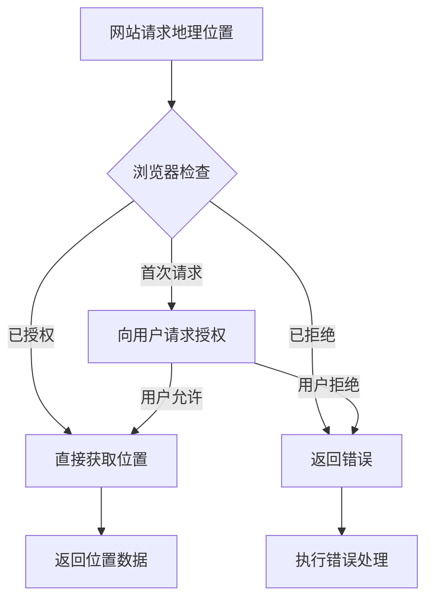

# JavaScript 地理位置

## 介绍

地理位置API (Geolocation API) 是JavaScript提供的一个强大功能，它允许网站或Web应用程序访问用户的地理位置信息。这个功能为开发者创造了许多可能性，如提供基于位置的服务、导航、天气预报等个性化体验。

Geolocation API是HTML5规范的一部分，现代浏览器对此有着良好的支持。通过这个API，开发者可以获取用户的经度、纬度、海拔高度、精确度等信息，从而打造更加智能的Web应用。

:::note
出于隐私和安全考虑，浏览器会在网站尝试获取位置信息时向用户请求授权。用户可以选择允许或拒绝这些请求。
:::

## Geolocation API基础

### 检查浏览器支持

在使用Geolocation API之前，我们需要先检查浏览器是否支持此功能：

```javascript
if ("geolocation" in navigator) {
  // 浏览器支持Geolocation
  console.log("地理位置API可用");
} else {
  // 浏览器不支持Geolocation
  console.log("您的浏览器不支持地理位置API");
}
```

### 获取当前位置

Geolocation API的核心方法是`getCurrentPosition()`，它用于获取用户的当前位置：

```javascript
navigator.geolocation.getCurrentPosition(
  // 成功回调函数
  function(position) {
    console.log("获取位置成功!");
    console.log("纬度:", position.coords.latitude);
    console.log("经度:", position.coords.longitude);
  },
  // 错误回调函数
  function(error) {
    console.error("获取位置失败:", error.message);
  }
);
```

#### Position对象

当位置获取成功时，回调函数会接收一个Position对象，其中包含以下主要属性：

- `coords.latitude` - 纬度（十进制度数）
- `coords.longitude` - 经度（十进制度数）
- `coords.accuracy` - 位置精确度（米）
- `coords.altitude` - 海拔高度（米，可能为null）
- `coords.altitudeAccuracy` - 海拔精确度（米，可能为null）
- `coords.heading` - 行进方向（度数，可能为null）
- `coords.speed` - 速度（米/秒，可能为null）
- `timestamp` - 获取位置的时间戳

#### 错误处理

当获取位置失败时，错误回调函数会接收一个`PositionError`对象，其中包含：

- `code` - 错误码（1=PERMISSION_DENIED, 2=POSITION_UNAVAILABLE, 3=TIMEOUT）
- `message` - 错误信息描述

```javascript
navigator.geolocation.getCurrentPosition(
  successCallback, 
  function(error) {
    switch(error.code) {
      case error.PERMISSION_DENIED:
        console.error("用户拒绝了地理位置请求");
        break;
      case error.POSITION_UNAVAILABLE:
        console.error("位置信息不可用");
        break;
      case error.TIMEOUT:
        console.error("获取用户位置超时");
        break;
      case error.UNKNOWN_ERROR:
        console.error("发生未知错误");
        break;
    }
  }
);
```

### 配置选项

`getCurrentPosition()`方法接受第三个可选参数，用于配置地理位置请求：

```javascript
const options = {
  enableHighAccuracy: true,  // 尝试获取更高精确度的位置
  timeout: 5000,             // 请求超时时间（毫秒）
  maximumAge: 0              // 缓存有效期（毫秒）
};

navigator.geolocation.getCurrentPosition(
  successCallback, 
  errorCallback, 
  options
);
```

选项说明：
- `enableHighAccuracy`: 当设为`true`时，设备将尝试提供更准确的位置（可能会增加响应时间和耗电量）
- `timeout`: 允许设备返回位置的最长时间
- `maximumAge`: 指定可以返回的缓存位置的最大时间（0表示必须获取当前位置）

## 持续监控位置

除了获取当前位置，Geolocation API还允许持续监控用户位置的变化：

```javascript
// 开始监控位置变化
const watchId = navigator.geolocation.watchPosition(
  function(position) {
    console.log("位置已更新:");
    console.log("新纬度:", position.coords.latitude);
    console.log("新经度:", position.coords.longitude);
  },
  function(error) {
    console.error("监控位置失败:", error.message);
  },
  { enableHighAccuracy: true }
);

// 停止监控
// navigator.geolocation.clearWatch(watchId);
```

`watchPosition()`方法会返回一个ID，可以使用该ID和`clearWatch()`方法来停止位置监控。

## 实际应用案例

### 案例1: 显示用户位置的地图

下面是一个使用Google Maps API显示用户当前位置的简单示例：

```javascript
function initMap(latitude, longitude) {
  // 创建地图
  const map = new google.maps.Map(document.getElementById("map"), {
    center: { lat: latitude, lng: longitude },
    zoom: 15
  });
  
  // 添加标记
  new google.maps.Marker({
    position: { lat: latitude, lng: longitude },
    map: map,
    title: 您的位置
  });
}

// 获取用户位置并初始化地图
if ("geolocation" in navigator) {
  navigator.geolocation.getCurrentPosition(
    function(position) {
      const latitude = position.coords.latitude;
      const longitude = position.coords.longitude;
      
      // 初始化地图
      initMap(latitude, longitude);
    },
    function(error) {
      console.error("获取位置失败:", error.message);
      // 默认位置（例如，纽约）
      initMap(40.7128, -74.0060);
    }
  );
} else {
  console.log("浏览器不支持地理位置");
  // 默认位置
  initMap(40.7128, -74.0060);
}
```

:::caution
使用Google Maps API需要API密钥，这里的代码仅作演示，实际使用需要在Google Cloud Platform上注册并获取密钥。
:::

### 案例2: 基于位置的天气应用

```javascript
function getWeather(latitude, longitude) {
  const apiKey = "YOUR_WEATHER_API_KEY";
  const url = `https://api.openweathermap.org/data/2.5/weather?lat=${latitude}&lon=${longitude}&units=metric&appid=${apiKey}`;
  
  fetch(url)
    .then(response => response.json())
    .then(data => {
      document.getElementById("location").textContent = data.name;
      document.getElementById("temperature").textContent = `${data.main.temp}°C`;
      document.getElementById("description").textContent = data.weather[0].description;
      document.getElementById("humidity").textContent = `湿度: ${data.main.humidity}%`;
    })
    .catch(error => {
      console.error("获取天气信息失败:", error);
    });
}

if ("geolocation" in navigator) {
  navigator.geolocation.getCurrentPosition(
    function(position) {
      getWeather(position.coords.latitude, position.coords.longitude);
    },
    function(error) {
      console.error("获取位置失败:", error.message);
      document.getElementById("weather").textContent = "无法获取天气信息";
    }
  );
} else {
  document.getElementById("weather").textContent = "您的浏览器不支持地理位置";
}
```

### 案例3: 距离计算

下面是一个计算用户与特定地点之间距离的函数示例：

```javascript
// 使用Haversine公式计算两点之间的距离（单位：公里）
function calculateDistance(lat1, lon1, lat2, lon2) {
  const R = 6371; // 地球半径（公里）
  
  const dLat = (lat2 - lat1) * Math.PI / 180;
  const dLon = (lon2 - lon1) * Math.PI / 180;
  
  const a = 
    Math.sin(dLat/2) * Math.sin(dLat/2) +
    Math.cos(lat1 * Math.PI / 180) * Math.cos(lat2 * Math.PI / 180) * 
    Math.sin(dLon/2) * Math.sin(dLon/2);
  
  const c = 2 * Math.atan2(Math.sqrt(a), Math.sqrt(1-a));
  const distance = R * c;
  
  return distance;
}

// 目标位置（例如，埃菲尔铁塔）
const targetLat = 48.8584;
const targetLon = 2.2945;

// 获取用户位置并计算距离
if ("geolocation" in navigator) {
  navigator.geolocation.getCurrentPosition(
    function(position) {
      const userLat = position.coords.latitude;
      const userLon = position.coords.longitude;
      
      const distance = calculateDistance(userLat, userLon, targetLat, targetLon);
      
      document.getElementById("distance").textContent = 
        `您与埃菲尔铁塔的距离约为${distance.toFixed(2)}公里`;
    },
    function(error) {
      console.error("获取位置失败:", error.message);
    }
  );
}
```

## 地理位置API的隐私和安全考虑

使用地理位置API时，需要考虑以下几点：

1. **仅在HTTPS环境中使用** - 现代浏览器要求地理位置API必须在安全上下文（HTTPS）中使用
2. **尊重用户隐私** - 明确告知用户为什么需要获取位置信息
3. **优雅降级** - 处理用户拒绝授权或浏览器不支持的情况
4. **谨慎使用高精度选项** - 高精度模式会增加电池消耗



## 浏览器兼容性

Geolocation API在现代浏览器中得到了广泛支持：

| 浏览器 | 支持版本 |
|-------|--------|
| Chrome | 5+ |
| Firefox | 3.5+ |
| Safari | 5+ |
| Edge | 12+ |
| Opera | 10.6+ |
| iOS Safari | 3.2+ |
| Android Browser | 2.1+ |

但在旧版浏览器可能存在兼容性问题，因此在使用前进行特性检测是很重要的。

## 总结与进阶练习

JavaScript的Geolocation API为网页应用提供了访问用户地理位置的能力，使开发者能够构建位置感知的应用程序。我们学习了如何：

- 检查浏览器是否支持地理位置API
- 获取用户的当前位置
- 处理位置请求的成功和失败情况
- 配置位置请求的选项
- 持续监控用户位置的变化
- 在实际应用中使用位置信息

### 进阶练习

1. 创建一个"附近的餐厅"应用，根据用户位置显示周边的餐厅列表。
2. 实现一个健身追踪应用，记录用户跑步或骑行的路线和距离。
3. 开发一个位置分享功能，允许用户生成一个链接来分享自己的当前位置。
4. 构建一个基于地理围栏的提醒应用，当用户进入或离开特定区域时发送通知。

### 额外资源

- [MDN Web Docs: Geolocation API](https://developer.mozilla.org/zh-CN/docs/Web/API/Geolocation_API)
- [W3C Geolocation API 规范](https://www.w3.org/TR/geolocation-API/)
- [Google Maps JavaScript API](https://developers.google.com/maps/documentation/javascript)
- [OpenStreetMap](https://www.openstreetmap.org/) - 免费的地图数据服务

通过掌握地理位置API，你可以为用户提供更加个性化和情境化的Web体验，创建真正有用的位置相关应用程序。