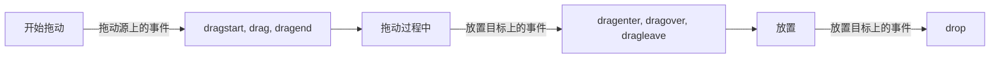

# JavaScript 拖放API

在现代Web应用中，拖放功能已经成为提升用户体验的重要交互方式。无论是文件上传、列表排序还是看板应用，拖放API都为我们提供了直观且高效的用户交互方式。本文将带你深入了解JavaScript拖放API的基础知识和应用技巧。

## 什么是拖放API？

拖放API(Drag and Drop API)是HTML5引入的标准API，允许用户使用鼠标点击并拖动元素到不同位置。这个API简化了复杂交互的实现，增强了网页的可用性和直观性。

:::note 基本概念
拖放操作涉及两个主要角色：
- **拖动源(drag source)** - 被拖动的元素
- **放置目标(drop target)** - 接收被拖动元素的区域
:::

## 启用拖放功能

默认情况下，HTML元素不可拖动。要使元素可拖动，我们需要将`draggable`属性设置为`true`：

```html
<div id="draggable" draggable="true">拖动我！</div>
```

图片和链接在大多数浏览器中默认是可拖动的，不需要额外设置。

## 拖放事件流程

拖放操作涉及一系列事件，按照发生顺序可分为三个阶段：



### 拖动源事件

拖动源元素会触发以下事件：

1. **dragstart** - 开始拖动元素时触发
2. **drag** - 拖动过程中持续触发
3. **dragend** - 拖动操作完成时触发

### 放置目标事件

放置目标可以监听以下事件：

1. **dragenter** - 拖动元素进入放置目标区域时触发
2. **dragover** - 拖动元素在放置目标区域内移动时持续触发
3. **dragleave** - 拖动元素离开放置目标区域时触发
4. **drop** - 在放置目标区域释放被拖动元素时触发

## 实现基本拖放功能

下面是一个基本拖放功能的实现示例：

```html
<div id="draggable" draggable="true">拖动我</div>
<div id="droptarget">放置区域</div>

<style>
  #draggable {
    width: 100px;
    height: 100px;
    background-color: #ff6b6b;
    color: white;
    text-align: center;
    line-height: 100px;
    cursor: move;
  }
  
  #droptarget {
    width: 200px;
    height: 200px;
    background-color: #4ecdc4;
    margin-top: 20px;
    color: white;
    text-align: center;
    line-height: 200px;
  }
</style>
```

```javascript
// 获取元素引用
const draggable = document.getElementById('draggable');
const dropTarget = document.getElementById('droptarget');

// 拖动源事件处理
draggable.addEventListener('dragstart', (event) => {
  // 设置拖动数据
  event.dataTransfer.setData('text/plain', event.target.id);
  // 设置拖动效果
  event.dataTransfer.effectAllowed = 'move';
  
  // 添加拖动样式
  setTimeout(() => {
    event.target.style.opacity = '0.5';
  }, 0);
});

draggable.addEventListener('dragend', (event) => {
  // 恢复原始样式
  event.target.style.opacity = '1';
});

// 放置目标事件处理
dropTarget.addEventListener('dragenter', (event) => {
  event.preventDefault();
  dropTarget.style.backgroundColor = '#1a535c';
});

dropTarget.addEventListener('dragover', (event) => {
  // 阻止默认行为以允许放置
  event.preventDefault();
  // 指定放置效果
  event.dataTransfer.dropEffect = 'move';
});

dropTarget.addEventListener('dragleave', (event) => {
  dropTarget.style.backgroundColor = '#4ecdc4';
});

dropTarget.addEventListener('drop', (event) => {
  event.preventDefault();
  
  // 获取拖动的数据
  const id = event.dataTransfer.getData('text/plain');
  const draggableElement = document.getElementById(id);
  
  // 将拖动的元素添加到放置区域
  dropTarget.appendChild(draggableElement);
  
  // 重置放置区域样式
  dropTarget.style.backgroundColor = '#4ecdc4';
  dropTarget.textContent = '';
});
```

执行上述代码后，你可以将"拖动我"方块拖动到蓝色放置区域中。

:::tip 注意事项
要使拖放功能正常工作，必须在 `dragover` 事件处理程序中调用 `event.preventDefault()`，这告诉浏览器我们允许在此区域放置元素。
:::

## DataTransfer对象

`dataTransfer`对象是拖放操作的核心，它用于存储拖放操作期间传输的数据。主要方法包括：

- **setData(format, data)** - 设置指定格式的数据
- **getData(format)** - 获取指定格式的数据
- **clearData([format])** - 清除数据
- **setDragImage(element, x, y)** - 自定义拖动时的图像

```javascript
// 设置拖动数据
event.dataTransfer.setData('text/plain', 'some text data');
event.dataTransfer.setData('application/json', JSON.stringify({id: 123, name: 'Example'}));

// 获取拖动数据
const text = event.dataTransfer.getData('text/plain');
const jsonData = JSON.parse(event.dataTransfer.getData('application/json'));
```

## 自定义拖动图像

默认情况下，浏览器会根据被拖动元素创建一个半透明的拖动图像。我们可以使用`setDragImage`方法自定义这个图像：

```javascript
draggable.addEventListener('dragstart', (event) => {
  // 创建自定义拖动图像
  const img = new Image();
  img.src = 'custom-drag-image.png';
  
  // 参数：图像元素，相对于鼠标指针的x偏移量，y偏移量
  event.dataTransfer.setDragImage(img, 0, 0);
  
  event.dataTransfer.setData('text/plain', event.target.id);
});
```

## 文件拖放

HTML5拖放API的一个强大功能是支持文件拖放，这使得实现文件上传变得更加直观：

```javascript
const dropZone = document.getElementById('drop-zone');

dropZone.addEventListener('dragover', (event) => {
  event.preventDefault();
  dropZone.classList.add('drag-over');
});

dropZone.addEventListener('dragleave', (event) => {
  dropZone.classList.remove('drag-over');
});

dropZone.addEventListener('drop', (event) => {
  event.preventDefault();
  dropZone.classList.remove('drag-over');
  
  // 获取拖放的文件
  const files = event.dataTransfer.files;
  
  if (files.length > 0) {
    // 处理文件
    handleFiles(files);
  }
});

function handleFiles(files) {
  for (let i = 0; i < files.length; i++) {
    const file = files[i];
    console.log(`文件名: ${file.name}, 类型: ${file.type}, 大小: ${file.size} 字节`);
    
    // 这里可以进行文件上传或处理
    // 例如使用FileReader读取文件内容
    if (file.type.match('image.*')) {
      const reader = new FileReader();
      
      reader.onload = (e) => {
        const img = document.createElement('img');
        img.src = e.target.result;
        document.body.appendChild(img);
      };
      
      reader.readAsDataURL(file);
    }
  }
}
```

## 实际应用案例

### 案例1：可排序列表

下面是一个可通过拖放排序的列表实现：

```html
<ul id="sortable-list">
  <li draggable="true" data-id="1">项目 1</li>
  <li draggable="true" data-id="2">项目 2</li>
  <li draggable="true" data-id="3">项目 3</li>
  <li draggable="true" data-id="4">项目 4</li>
  <li draggable="true" data-id="5">项目 5</li>
</ul>

<style>
  #sortable-list {
    list-style: none;
    padding: 0;
    width: 300px;
  }
  
  #sortable-list li {
    padding: 10px;
    background-color: #f4f4f4;
    border: 1px solid #ddd;
    margin-bottom: 5px;
    cursor: move;
  }
  
  .drag-over {
    border: 2px dashed #000 !important;
  }
</style>
```

```javascript
document.addEventListener('DOMContentLoaded', () => {
  const list = document.getElementById('sortable-list');
  let draggedItem = null;
  
  // 为所有列表项添加拖放事件监听器
  list.querySelectorAll('li').forEach(item => {
    // 拖动开始
    item.addEventListener('dragstart', (e) => {
      draggedItem = item;
      setTimeout(() => {
        item.classList.add('dragging');
      }, 0);
      e.dataTransfer.setData('text/plain', item.dataset.id);
    });
    
    // 拖动结束
    item.addEventListener('dragend', () => {
      draggedItem.classList.remove('dragging');
      draggedItem = null;
    });
    
    // 拖动进入其他列表项
    item.addEventListener('dragenter', (e) => {
      e.preventDefault();
      if (item !== draggedItem) {
        item.classList.add('drag-over');
      }
    });
    
    // 拖动经过其他列表项
    item.addEventListener('dragover', (e) => {
      e.preventDefault();
    });
    
    // 拖动离开其他列表项
    item.addEventListener('dragleave', () => {
      item.classList.remove('drag-over');
    });
    
    // 放置在其他列表项
    item.addEventListener('drop', (e) => {
      e.preventDefault();
      if (item !== draggedItem) {
        // 确定放置位置（前面或后面）
        const rect = item.getBoundingClientRect();
        const y = e.clientY - rect.top;
        const isBelow = y > rect.height / 2;
        
        // 重新排序
        if (isBelow) {
          if (item.nextSibling) {
            list.insertBefore(draggedItem, item.nextSibling);
          } else {
            list.appendChild(draggedItem);
          }
        } else {
          list.insertBefore(draggedItem, item);
        }
      }
      item.classList.remove('drag-over');
    });
  });
});
```

### 案例2：看板任务管理

这是一个简化的看板任务管理系统，允许在不同状态列之间拖放任务卡片：

```html
<div class="kanban">
  <div class="column" id="todo">
    <h2>待办</h2>
    <div class="task" draggable="true" data-id="task1">完成报告</div>
    <div class="task" draggable="true" data-id="task2">准备演讲</div>
  </div>
  
  <div class="column" id="inprogress">
    <h2>进行中</h2>
    <div class="task" draggable="true" data-id="task3">编写代码</div>
  </div>
  
  <div class="column" id="done">
    <h2>已完成</h2>
    <div class="task" draggable="true" data-id="task4">项目规划</div>
  </div>
</div>

<style>
  .kanban {
    display: flex;
    gap: 20px;
  }
  
  .column {
    background-color: #f4f4f4;
    border-radius: 5px;
    width: 250px;
    min-height: 300px;
    padding: 10px;
  }
  
  .task {
    background-color: white;
    border-radius: 3px;
    padding: 10px;
    margin-bottom: 10px;
    box-shadow: 0 1px 3px rgba(0,0,0,0.12);
    cursor: move;
  }
  
  .column.drag-over {
    background-color: #e0e0e0;
  }
</style>
```

```javascript
document.addEventListener('DOMContentLoaded', () => {
  const tasks = document.querySelectorAll('.task');
  const columns = document.querySelectorAll('.column');
  let draggedTask = null;
  
  // 添加任务的拖放事件
  tasks.forEach(task => {
    task.addEventListener('dragstart', (e) => {
      draggedTask = task;
      e.dataTransfer.setData('text/plain', task.dataset.id);
      setTimeout(() => {
        task.style.opacity = '0.5';
      }, 0);
    });
    
    task.addEventListener('dragend', () => {
      draggedTask.style.opacity = '1';
      draggedTask = null;
    });
  });
  
  // 添加列的拖放事件
  columns.forEach(column => {
    column.addEventListener('dragover', (e) => {
      e.preventDefault();
      column.classList.add('drag-over');
    });
    
    column.addEventListener('dragleave', () => {
      column.classList.remove('drag-over');
    });
    
    column.addEventListener('drop', (e) => {
      e.preventDefault();
      column.classList.remove('drag-over');
      
      // 只有当放置在列上而不是任务上时才追加
      if (e.target.classList.contains('column') || e.target.tagName === 'H2') {
        column.appendChild(draggedTask);
        
        // 在实际应用中，你可能希望在此保存任务的新状态
        console.log(`任务 ${draggedTask.dataset.id} 移动到 ${column.id}`);
      }
    });
  });
});
```

## 浏览器兼容性注意事项

HTML5拖放API在现代浏览器中得到了广泛支持，但仍有一些注意事项：

1. 移动设备上的触摸操作不会自动触发拖放事件，需要额外的库来处理触摸事件
2. 不同浏览器对拖放操作的视觉反馈可能会有所不同
3. IE11及更早版本的浏览器对拖放API的支持可能有限制

对于需要在移动设备上实现拖放功能的应用，你可以使用如[SortableJS](https://sortablejs.github.io/Sortable/)或[interact.js](https://interactjs.io/)等库，它们提供了更一致的跨平台拖放体验。

## 总结

JavaScript拖放API为Web应用提供了强大的交互能力：

1. 使用`draggable="true"`属性使HTML元素可拖动
2. 拖放操作涉及一系列事件，包括`dragstart`、`dragover`、`drop`等
3. `dataTransfer`对象用于在拖放操作期间传输数据
4. 拖放API可以实现文件上传、列表排序、看板应用等功能

通过掌握拖放API，你可以为用户创建更直观、交互性更强的Web应用。拖放操作是一种自然且高效的交互方式，适用于各种复杂的用户界面需求。

## 练习与挑战

为了巩固所学知识，尝试完成以下练习：

1. 创建一个简单的拖放游戏，将图形按正确顺序拖入指定区域
2. 实现一个拖放文件上传组件，显示上传进度和预览
3. 制作一个可拖放的购物车，允许用户将商品拖入购物车
4. 构建一个简单的拼图游戏，通过拖放拼图块完成图片

## 扩展资源

- [MDN Web文档：HTML拖放API](https://developer.mozilla.org/zh-CN/docs/Web/API/HTML_Drag_and_Drop_API)
- [W3C拖放规范](https://html.spec.whatwg.org/multipage/dnd.html#dnd)
- [SortableJS库](https://sortablejs.github.io/Sortable/)
- [interact.js库](https://interactjs.io/)

通过这些资源，你可以进一步深入学习拖放API的高级用法和最佳实践。