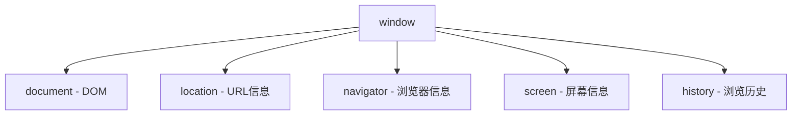

# JavaScript BOM最佳实践

## 什么是BOM？

浏览器对象模型(Browser Object Model，BOM)提供了与浏览器窗口交互的对象，允许JavaScript代码与浏览器进行"对话"。与DOM(文档对象模型)不同，BOM处理的是浏览器窗口和框架，而不仅仅是页面内容。

BOM的核心对象是`window`对象，它代表浏览器的窗口，同时也是全局对象，所有全局变量和函数都是它的属性和方法。

:::note 提示
BOM没有标准，但现代浏览器已经实现了许多共同的API，这使得我们可以编写跨浏览器的代码。
:::

## BOM的主要组成部分



## BOM最佳实践

### 1. 窗口操作

#### 避免频繁调整窗口大小

**不推荐**:

```javascript
window.onresize = function() {
  // 执行复杂计算
  performHeavyCalculations();
};
```

**推荐**:

```javascript
// 使用防抖技术限制事件触发频率
let resizeTimer;
window.onresize = function() {
  clearTimeout(resizeTimer);
  resizeTimer = setTimeout(function() {
    performHeavyCalculations();
  }, 250);
};
```

通过使用防抖技术，我们可以确保resize事件处理程序只在用户停止调整窗口大小后执行，提高性能。

#### 谨慎使用弹窗

弹窗可能被浏览器拦截，并且会影响用户体验。

**不推荐**:

```javascript
function openMultiplePopups() {
  window.open('page1.html');
  window.open('page2.html');
  window.open('page3.html');
}
```

**推荐**:

```javascript
function openPopupAfterUserAction() {
  const userConfirmed = confirm('是否打开新窗口查看详情？');
  if (userConfirmed) {
    const newWindow = window.open('details.html', '_blank');
    if (!newWindow || newWindow.closed) {
      alert('弹窗被阻止，请允许此站点的弹窗或使用内页链接查看详情');
    }
  }
}
```

### 2. 有效使用location对象

location对象提供了当前URL的信息和操作方法。

#### 安全地修改URL

**不推荐**:

```javascript
// 直接修改可能导致意外刷新
window.location = 'https://example.com';
```

**推荐**:

```javascript
// 更安全地修改URL
function navigateTo(url) {
  if (url) {
    window.location.href = url;
  }
}
```

#### 优雅地解析URL参数

**不推荐**:

```javascript
function getParam(name) {
  const queryString = window.location.search;
  const start = queryString.indexOf(name + '=');
  if (start === -1) return null;
  
  let value = queryString.substring(start + name.length + 1);
  const end = value.indexOf('&');
  if (end !== -1) {
    value = value.substring(0, end);
  }
  return decodeURIComponent(value);
}
```

**推荐**:

```javascript
function getUrlParameter(name) {
  const urlParams = new URLSearchParams(window.location.search);
  return urlParams.get(name);
}

// 使用示例
const productId = getUrlParameter('id');
if (productId) {
  console.log(`正在查看产品ID: ${productId}`);
}
```

使用现代的`URLSearchParams` API可以更简洁地处理URL参数。

### 3. 高效使用navigator对象

navigator对象包含了浏览器的信息。

#### 特性检测而不是浏览器检测

**不推荐**:

```javascript
if (navigator.userAgent.indexOf('Chrome') !== -1) {
  // Chrome特定的代码
} else if (navigator.userAgent.indexOf('Firefox') !== -1) {
  // Firefox特定的代码
}
```

**推荐**:

```javascript
// 检测功能而不是浏览器
if ('geolocation' in navigator) {
  // 使用地理位置API
  navigator.geolocation.getCurrentPosition(position => {
    console.log(`纬度: ${position.coords.latitude}, 经度: ${position.coords.longitude}`);
  });
} else {
  console.log('此浏览器不支持地理位置API');
}
```

特性检测比浏览器检测更可靠，因为它直接测试需要使用的功能是否存在。

### 4. 优化history操作

history对象允许JavaScript访问浏览器的历史记录。

#### 使用History API创建更好的单页应用

**基础示例**:

```javascript
// 无刷新更新URL和状态
function navigateToPage(pageUrl, pageTitle, pageContent) {
  document.getElementById('content').innerHTML = pageContent;
  document.title = pageTitle;
  history.pushState({ page: pageUrl }, pageTitle, pageUrl);
}

// 处理浏览器的后退/前进
window.onpopstate = function(event) {
  if (event.state) {
    loadPage(event.state.page);
  }
};
```

这使得用户可以使用浏览器的后退和前进按钮，同时保持单页应用的体验。

### 5. 屏幕和设备信息

screen对象包含有关用户屏幕的信息。

#### 响应式设计中使用屏幕信息

```javascript
function optimizeForScreen() {
  const width = window.screen.width;
  const height = window.screen.height;
  
  if (width < 768) {
    // 适配手机视图
    document.body.classList.add('mobile-view');
  } else if (width < 1024) {
    // 适配平板视图
    document.body.classList.add('tablet-view');
  } else {
    // 适配桌面视图
    document.body.classList.add('desktop-view');
  }
  
  console.log(`屏幕分辨率: ${width} x ${height}`);
}

// 页面加载时调用
window.onload = optimizeForScreen;
```

:::caution 注意
仅依靠屏幕尺寸来确定设备类型是不完全可靠的。结合CSS媒体查询可能是更好的解决方案。
:::

### 6. 存储管理

#### 高效使用localStorage和sessionStorage

**不推荐**:

```javascript
// 存储大量或频繁变化的数据
localStorage.setItem('userActivityLog', JSON.stringify(hugeLogObject));
```

**推荐**:

```javascript
// 为存储的数据设置有效期
const storageHelper = {
  setWithExpiry: function(key, value, ttl) {
    const now = new Date();
    const item = {
      value: value,
      expiry: now.getTime() + ttl
    };
    localStorage.setItem(key, JSON.stringify(item));
  },
  
  getWithExpiry: function(key) {
    const itemStr = localStorage.getItem(key);
    if (!itemStr) return null;
    
    const item = JSON.parse(itemStr);
    const now = new Date();
    
    if (now.getTime() > item.expiry) {
      localStorage.removeItem(key);
      return null;
    }
    return item.value;
  }
};

// 使用示例 - 数据在24小时后过期
storageHelper.setWithExpiry('userPreferences', { theme: 'dark' }, 24 * 60 * 60 * 1000);
```

### 7. 高效的定时器

#### 清理不需要的定时器

**不推荐**:

```javascript
setInterval(function() {
  updateLiveData();
}, 1000);
```

**推荐**:

```javascript
let dataUpdateTimer;

function startDataUpdates() {
  dataUpdateTimer = setInterval(function() {
    updateLiveData();
  }, 1000);
}

function stopDataUpdates() {
  clearInterval(dataUpdateTimer);
}

// 当组件挂载时启动
startDataUpdates();

// 当组件卸载时停止
window.addEventListener('beforeunload', stopDataUpdates);
```

#### 使用requestAnimationFrame代替动画定时器

**不推荐**:

```javascript
let position = 0;
const element = document.getElementById('animated');

setInterval(function() {
  position += 2;
  element.style.left = position + 'px';
}, 16); // 约60fps
```

**推荐**:

```javascript
let position = 0;
const element = document.getElementById('animated');

function animate() {
  position += 2;
  element.style.left = position + 'px';
  
  if (position < 500) { // 动画结束条件
    requestAnimationFrame(animate);
  }
}

requestAnimationFrame(animate);
```

`requestAnimationFrame`会自动与浏览器的重绘周期同步，提供更平滑的动画效果并节省资源。

## 实际案例：构建响应式导航与主题切换

以下是一个结合BOM最佳实践的实际案例，展示了如何创建一个响应式的网站导航栏，并添加主题切换功能。

```javascript
// 主题管理器
const themeManager = {
  init: function() {
    // 检查localStorage中的主题偏好
    const savedTheme = localStorage.getItem('theme');
    if (savedTheme) {
      document.documentElement.setAttribute('data-theme', savedTheme);
    } else {
      // 检查系统偏好
      const prefersDark = window.matchMedia('(prefers-color-scheme: dark)').matches;
      document.documentElement.setAttribute('data-theme', prefersDark ? 'dark' : 'light');
    }
    
    // 监听主题切换按钮点击
    document.getElementById('theme-toggle').addEventListener('click', this.toggleTheme);
    
    // 监听系统主题变化
    window.matchMedia('(prefers-color-scheme: dark)').addEventListener('change', e => {
      if (!localStorage.getItem('theme')) { // 仅在用户未手动设置主题时响应
        document.documentElement.setAttribute('data-theme', e.matches ? 'dark' : 'light');
      }
    });
  },
  
  toggleTheme: function() {
    const currentTheme = document.documentElement.getAttribute('data-theme');
    const newTheme = currentTheme === 'dark' ? 'light' : 'dark';
    
    document.documentElement.setAttribute('data-theme', newTheme);
    localStorage.setItem('theme', newTheme);
    
    // 通知用户主题已更改
    const themeNotification = document.getElementById('theme-notification');
    themeNotification.textContent = `已切换至${newTheme === 'dark' ? '深色' : '浅色'}主题`;
    themeNotification.classList.add('visible');
    
    setTimeout(() => {
      themeNotification.classList.remove('visible');
    }, 2000);
  }
};

// 响应式导航
const responsiveNav = {
  init: function() {
    const menuToggle = document.getElementById('menu-toggle');
    const navMenu = document.getElementById('nav-menu');
    
    menuToggle.addEventListener('click', () => {
      navMenu.classList.toggle('active');
    });
    
    // 处理窗口大小变化
    let resizeTimer;
    window.addEventListener('resize', () => {
      clearTimeout(resizeTimer);
      resizeTimer = setTimeout(() => {
        if (window.innerWidth > 768) {
          navMenu.classList.remove('active');
        }
      }, 250);
    });
    
    // 添加滚动监听来调整导航栏样式
    let scrollTimer;
    window.addEventListener('scroll', () => {
      clearTimeout(scrollTimer);
      scrollTimer = setTimeout(() => {
        const header = document.querySelector('header');
        if (window.scrollY > 50) {
          header.classList.add('scrolled');
        } else {
          header.classList.remove('scrolled');
        }
      }, 100);
    });
  }
};

// 路由历史管理
const historyManager = {
  init: function() {
    document.querySelectorAll('.nav-link').forEach(link => {
      link.addEventListener('click', e => {
        e.preventDefault();
        const href = link.getAttribute('href');
        const title = link.getAttribute('data-title') || document.title;
        
        this.navigateTo(href, title);
      });
    });
    
    // 处理浏览器前进/后退
    window.addEventListener('popstate', e => {
      if (e.state) {
        this.loadContent(e.state.path);
      }
    });
  },
  
  navigateTo: function(path, title) {
    history.pushState({ path }, title, path);
    document.title = title;
    this.loadContent(path);
  },
  
  loadContent: function(path) {
    // 在实际应用中，这里会使用AJAX加载内容
    console.log(`加载页面内容: ${path}`);
    // 示例：简单显示当前路径
    document.getElementById('content').textContent = `当前页面: ${path}`;
  }
};

// 初始化应用
document.addEventListener('DOMContentLoaded', () => {
  themeManager.init();
  responsiveNav.init();
  historyManager.init();
});
```

这个案例结合了：

1. BOM中的localStorage来存储用户主题偏好
2. 使用window事件监听器处理调整大小和滚动
3. 使用History API实现无刷新页面导航
4. 防抖技术限制事件处理频率
5. 特性检测确保代码在不同浏览器工作

## 总结

BOM是JavaScript开发中不可缺少的一部分，熟练掌握并遵循最佳实践可以帮助你：

- 编写更高效、更可靠的浏览器交互代码
- 提供更好的用户体验
- 避免常见的性能陷阱和安全问题
- 创建响应式、动态的现代web应用

记住，BOM的最佳实践包括：

1. 谨慎管理窗口和弹窗操作
2. 高效使用URL操作和参数解析
3. 使用特性检测而非浏览器检测
4. 妥善管理历史记录和用户导航
5. 适当使用浏览器存储并设置过期时间
6. 优化定时器和动画性能
7. 结合实际场景应用多种BOM功能

## 练习

为了巩固所学的知识，尝试完成以下练习：

1. 创建一个记住用户偏好的设置面板，使用localStorage存储设置并在用户返回时恢复。
2. 构建一个简单的单页应用，使用History API进行页面导航。
3. 编写一个能检测浏览器屏幕尺寸并相应调整UI的响应式布局。
4. 实现一个具有防抖功能的窗口滚动效果。
5. 使用requestAnimationFrame创建一个平滑的动画效果。

## 额外资源

- [MDN Web Docs: Window](https://developer.mozilla.org/zh-CN/docs/Web/API/Window)
- [MDN Web Docs: History API](https://developer.mozilla.org/zh-CN/docs/Web/API/History_API)
- [MDN Web Docs: Web Storage API](https://developer.mozilla.org/zh-CN/docs/Web/API/Web_Storage_API)
- [JavaScript 防抖与节流](https://www.ruanyifeng.com/blog/2016/04/debounce-throttle.html)

通过掌握BOM及其最佳实践，你已经朝着成为熟练的前端开发者迈出了重要一步！