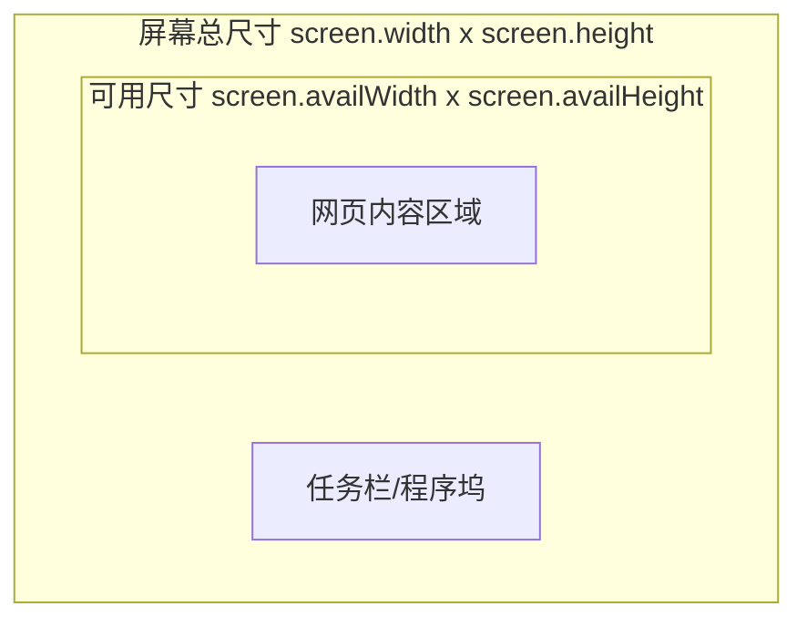

# JavaScript Screen对象

## 什么是Screen对象

Screen对象是JavaScript BOM（浏览器对象模型）的一部分，它包含有关用户屏幕的信息，如宽度、高度、颜色深度等。Screen对象不需要创建，可以直接通过`window.screen`或简单的`screen`来访问。

Screen对象的主要作用是获取用户显示器的相关信息，这对于创建响应式设计或根据屏幕特性优化网页显示非常有用。

## Screen对象的属性

Screen对象提供了多种属性，让我们可以获取关于用户显示器的各种信息：

### 常用属性

- `screen.width` - 返回屏幕的总宽度（以像素计）
- `screen.height` - 返回屏幕的总高度（以像素计）
- `screen.availWidth` - 返回屏幕的可用宽度（排除任务栏等系统界面）
- `screen.availHeight` - 返回屏幕的可用高度（排除任务栏等系统界面）
- `screen.colorDepth` - 返回屏幕的颜色深度（每像素的位数）
- `screen.pixelDepth` - 返回屏幕的像素深度

让我们看一个简单的示例，展示如何获取并显示这些属性：

```javascript
console.log("屏幕总宽度: " + screen.width + "px");
console.log("屏幕总高度: " + screen.height + "px");
console.log("屏幕可用宽度: " + screen.availWidth + "px");
console.log("屏幕可用高度: " + screen.availHeight + "px");
console.log("屏幕颜色深度: " + screen.colorDepth + "位");
console.log("屏幕像素深度: " + screen.pixelDepth + "位");
```

输出（结果会因用户设备而异）：
```
屏幕总宽度: 1920px
屏幕总高度: 1080px
屏幕可用宽度: 1920px
屏幕可用高度: 1040px
屏幕颜色深度: 24位
屏幕像素深度: 24位
```

:::note
`availWidth`和`availHeight`与`width`和`height`的差异在于，前者考虑了操作系统任务栏、程序坞等界面元素所占用的空间。
:::

## 理解可用尺寸与总尺寸

下面是一个示意图，帮助理解屏幕的总尺寸和可用尺寸的区别：



可用尺寸通常小于或等于总尺寸，因为操作系统通常会有任务栏或其他界面元素占用部分屏幕空间。

## 实际应用场景

### 1. 检测屏幕尺寸并调整布局

```javascript
function adjustLayout() {
    if (screen.width <= 768) {
        document.body.classList.add("mobile");
    } else {
        document.body.classList.add("desktop");
    }
    
    // 设置内容区域高度
    const contentDiv = document.getElementById("content");
    contentDiv.style.height = screen.availHeight + "px";
}

window.onload = adjustLayout;
```

### 2. 创建全屏应用

```javascript
function launchFullscreen() {
    const element = document.documentElement;
    
    if (element.requestFullscreen) {
        element.requestFullscreen();
    } else if (element.mozRequestFullScreen) { // Firefox
        element.mozRequestFullScreen();
    } else if (element.webkitRequestFullscreen) { // Chrome, Safari & Opera
        element.webkitRequestFullscreen();
    } else if (element.msRequestFullscreen) { // IE/Edge
        element.msRequestFullscreen();
    }
    
    // 检查当前是否为全屏状态
    const isFullScreen = screen.width === window.innerWidth && 
                          screen.height === window.innerHeight;
    
    console.log("是否全屏显示:", isFullScreen);
}
```

### 3. 网站访问统计

Screen对象的数据经常被用于分析用户的设备屏幕情况，以优化网站设计：

```javascript
function collectScreenInfo() {
    const screenData = {
        width: screen.width,
        height: screen.height,
        colorDepth: screen.colorDepth,
        orientation: screen.orientation ? screen.orientation.type : "未知"
    };
    
    // 将数据发送到服务器进行分析（示例）
    console.log("收集的屏幕数据:", screenData);
    // sendToAnalytics(screenData);
}
```

:::caution
由于Screen对象返回的是设备的物理像素，在高分辨率屏幕上可能与CSS像素不同。对于精确的响应式设计，可能需要结合`window.devicePixelRatio`属性使用。
:::

## 设备方向信息（现代浏览器）

在一些现代浏览器中，Screen对象还提供了`orientation`属性，可以用来获取设备的方向信息：

```javascript
if (screen.orientation) {
    console.log("当前设备方向:", screen.orientation.type);
    
    // 监听方向变化
    screen.orientation.addEventListener("change", function() {
        console.log("设备方向已变更为:", screen.orientation.type);
    });
}
```

## Screen对象与窗口大小的区别

初学者常常会混淆Screen对象的尺寸与浏览器窗口的尺寸。下面是它们之间的区别：

- `screen.width`/`screen.height`: 整个屏幕的物理尺寸
- `window.innerWidth`/`window.innerHeight`: 浏览器视口（viewport）的尺寸（包含滚动条）
- `document.documentElement.clientWidth`/`document.documentElement.clientHeight`: 视口的尺寸（不包含滚动条）

示例：

```javascript
console.log("屏幕宽度:", screen.width);
console.log("浏览器窗口宽度:", window.innerWidth);
console.log("文档视口宽度:", document.documentElement.clientWidth);
```

## 总结

JavaScript的Screen对象提供了访问用户显示器信息的途径，这些信息可以用于：

1. 创建响应式设计
2. 优化不同屏幕尺寸下的用户体验
3. 进行用户设备分析
4. 实现全屏应用

虽然Screen对象提供的信息有限，但在特定场景下非常有用，尤其是与其他BOM对象（如Window对象）结合使用时。

## 练习与挑战

1. 创建一个简单的网页，显示用户屏幕的所有可用属性。
2. 开发一个根据屏幕尺寸自动调整布局的简单应用。
3. 实现一个检测当前设备是台式机、平板还是手机的函数，基于screen属性。
4. 创建一个切换全屏模式的按钮，并在全屏和普通模式之间切换时显示当前的屏幕信息。

## 扩展阅读

- 窗口大小与屏幕分辨率的区别
- 像素密度和设备像素比（devicePixelRatio）
- 媒体查询（Media Queries）与Screen对象的结合使用
- 现代响应式设计中的视口概念

通过掌握Screen对象，你将能够更好地了解用户的显示环境，创建更加适应不同设备和屏幕的网页应用。