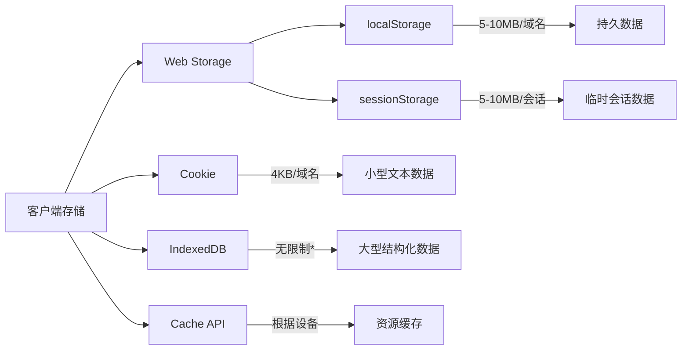

# JavaScript Cookie

## 什么是 Cookie？

Cookie 是存储在用户浏览器中的小型文本文件，它包含少量数据，在用户浏览网站时由服务器发送到用户浏览器。Cookie 主要用于以下几个方面：

- 会话管理（用户登录状态、购物车等）
- 个性化设置（用户首选项、主题等）
- 跟踪用户行为（分析用户如何与网站互动）

:::note 历史背景
Cookie 最初是由网景公司（Netscape）在 1994 年创建的，目的是为了解决 HTTP 协议无状态的问题，让网站能够"记住"用户的信息。
:::

## Cookie 的基本特性

Cookie 具有以下几个重要特性：

1. **大小限制**：每个 Cookie 通常限制在 4KB 左右
2. **数量限制**：每个域名下的 Cookie 数量有限（通常为 20-50 个）
3. **过期时间**：可以设置 Cookie 的有效期
4. **域名限制**：Cookie 默认只能被创建它的域名访问
5. **路径限制**：可以限制 Cookie 只在特定的路径下可用

## 创建和设置 Cookie

在 JavaScript 中，我们可以通过 `document.cookie` 属性来创建、读取和修改 Cookie。

### 创建基本的 Cookie

创建一个基本的 Cookie 非常简单：

```javascript
document.cookie = "username=John";
```

这将创建一个名为 `username`，值为 `John` 的 Cookie。但是，这个 Cookie 在浏览器关闭后会自动删除，因为我们没有设置过期时间。

### 设置 Cookie 的过期时间

要设置 Cookie 的过期时间，我们可以使用 `expires` 参数：

```javascript
// 设置 Cookie 在一天后过期
let date = new Date();
date.setTime(date.getTime() + (24 * 60 * 60 * 1000)); // 24小时后
let expires = "expires=" + date.toUTCString();
document.cookie = "username=John;" + expires + ";path=/";
```

或者使用 `max-age` 参数（以秒为单位）：

```javascript
// 设置 Cookie 在一天后过期
document.cookie = "username=John; max-age=86400; path=/";
```

### 设置其他 Cookie 参数

除了过期时间，我们还可以设置其他参数：

```javascript
document.cookie = "username=John; expires=Thu, 18 Dec 2023 12:00:00 UTC; path=/; domain=example.com; secure; samesite=strict";
```

各参数说明：
- `path=/`：Cookie 在整个网站可用
- `domain=example.com`：Cookie 在指定域名及其子域名可用
- `secure`：只通过 HTTPS 发送 Cookie
- `samesite=strict`：防止跨站请求伪造攻击（CSRF）

## 读取 Cookie

要读取 Cookie，我们可以直接访问 `document.cookie` 属性：

```javascript
let allCookies = document.cookie;
console.log(allCookies);
// 输出: "username=John; theme=dark; language=en"
```

但是 `document.cookie` 会返回所有可访问的 Cookie，因此我们需要编写一个函数来获取特定的 Cookie：

```javascript
function getCookie(name) {
  let cookieName = name + "=";
  let decodedCookie = decodeURIComponent(document.cookie);
  let cookieArray = decodedCookie.split(';');
  
  for(let i = 0; i < cookieArray.length; i++) {
    let cookie = cookieArray[i].trim();
    if (cookie.indexOf(cookieName) === 0) {
      return cookie.substring(cookieName.length, cookie.length);
    }
  }
  return "";
}

// 使用方法
let username = getCookie("username");
console.log(username); // 输出: "John"
```

## 修改 Cookie

修改 Cookie 实际上就是重新设置同名的 Cookie。例如，要修改之前创建的 `username` Cookie：

```javascript
document.cookie = "username=Jane; max-age=86400; path=/";
```

这将把 `username` 的值从 `John` 更改为 `Jane`。

## 删除 Cookie

要删除 Cookie，我们只需将其过期时间设置为过去的时间即可：

```javascript
document.cookie = "username=; expires=Thu, 01 Jan 1970 00:00:00 UTC; path=/;";
```

:::caution 注意
删除 Cookie 时，必须指定与创建 Cookie 时相同的路径和域名参数，否则删除操作可能不成功。
:::

## 实用函数

以下是一些处理 Cookie 的实用函数：

```javascript
// Cookie 操作工具类
const CookieUtil = {
  // 设置 Cookie
  setCookie: function(name, value, days, path = "/") {
    let expires = "";
    if (days) {
      let date = new Date();
      date.setTime(date.getTime() + (days * 24 * 60 * 60 * 1000));
      expires = "; expires=" + date.toUTCString();
    }
    document.cookie = name + "=" + encodeURIComponent(value) + expires + "; path=" + path;
  },
  
  // 获取 Cookie
  getCookie: function(name) {
    let nameEQ = name + "=";
    let ca = document.cookie.split(';');
    for(let i = 0; i < ca.length; i++) {
      let c = ca[i].trim();
      if (c.indexOf(nameEQ) === 0) {
        return decodeURIComponent(c.substring(nameEQ.length, c.length));
      }
    }
    return null;
  },
  
  // 删除 Cookie
  deleteCookie: function(name, path = "/") {
    this.setCookie(name, "", -1, path);
  }
};

// 使用示例
CookieUtil.setCookie("theme", "dark", 30); // 设置 Cookie，30天后过期
let theme = CookieUtil.getCookie("theme"); // 获取 Cookie
console.log(theme); // 输出: "dark"
CookieUtil.deleteCookie("theme"); // 删除 Cookie
```

## 实际应用场景

### 1. 记住用户登录状态

```javascript
// 用户登录成功后
function userLogin(username) {
  // 设置用户登录 Cookie，有效期7天
  CookieUtil.setCookie("loggedInUser", username, 7);
  CookieUtil.setCookie("isLoggedIn", "true", 7);
}

// 检查用户是否已登录
function checkLoginStatus() {
  const isLoggedIn = CookieUtil.getCookie("isLoggedIn");
  if (isLoggedIn === "true") {
    const username = CookieUtil.getCookie("loggedInUser");
    console.log(`欢迎回来，${username}!`);
    return true;
  }
  return false;
}

// 用户登出
function userLogout() {
  CookieUtil.deleteCookie("loggedInUser");
  CookieUtil.deleteCookie("isLoggedIn");
  console.log("您已成功登出!");
}
```

### 2. 保存用户偏好设置

```javascript
// 保存用户主题选择
function saveThemePreference(theme) {
  // 设置主题 Cookie，有效期365天（一年）
  CookieUtil.setCookie("userTheme", theme, 365);
  applyTheme(theme);
}

// 应用主题
function applyTheme(theme) {
  document.body.className = theme;
  console.log(`已应用${theme}主题`);
}

// 加载页面时检查主题偏好
function loadUserPreferences() {
  const savedTheme = CookieUtil.getCookie("userTheme");
  if (savedTheme) {
    applyTheme(savedTheme);
  } else {
    // 默认主题
    applyTheme("light");
  }
}

// 页面加载时调用
window.onload = loadUserPreferences;
```

### 3. 简单的购物车实现

```javascript
// 购物车功能
const ShoppingCart = {
  // 添加商品到购物车
  addItem: function(productId, productName, price) {
    let cart = this.getCart();
    
    // 检查商品是否已在购物车中
    let existingItem = cart.find(item => item.id === productId);
    
    if (existingItem) {
      existingItem.quantity += 1;
    } else {
      cart.push({
        id: productId,
        name: productName,
        price: price,
        quantity: 1
      });
    }
    
    // 保存购物车到 Cookie，7天有效
    CookieUtil.setCookie("shoppingCart", JSON.stringify(cart), 7);
    console.log(`已添加商品：${productName}`);
  },
  
  // 获取购物车内容
  getCart: function() {
    const cartJson = CookieUtil.getCookie("shoppingCart");
    return cartJson ? JSON.parse(cartJson) : [];
  },
  
  // 清空购物车
  clearCart: function() {
    CookieUtil.deleteCookie("shoppingCart");
    console.log("购物车已清空");
  }
};

// 使用示例
ShoppingCart.addItem("p001", "JavaScript高级程序设计", 99);
ShoppingCart.addItem("p002", "你不知道的JavaScript", 79);
console.log(ShoppingCart.getCart());
```

## Cookie 的局限性与替代方案

虽然 Cookie 很有用，但它也有一些局限性：

1. **大小限制**：每个 Cookie 通常限制在 4KB 左右
2. **安全问题**：Cookie 可能被拦截和篡改
3. **性能影响**：每个 HTTP 请求都会发送 Cookie，增加了数据传输量

现代 Web 应用程序通常会结合使用其他存储技术，如：

- **localStorage**：持久化存储，没有过期时间
- **sessionStorage**：会话级存储，关闭标签页后数据消失
- **IndexedDB**：客户端数据库，可存储大量结构化数据
- **Web SQL**：已不再推荐使用
- **Service Worker Cache**：用于离线应用



## 最佳实践

使用 Cookie 时，请遵循以下最佳实践：

1. **最小化**：只存储必要的信息
2. **加密敏感数据**：避免以明文形式存储敏感信息
3. **设置适当的过期时间**：不要无限期存储 Cookie
4. **使用安全标志**：为包含敏感信息的 Cookie 添加 `Secure` 和 `HttpOnly` 标志
5. **设置 SameSite 属性**：防止 CSRF 攻击
6. **遵循数据隐私法规**：如 GDPR、CCPA 等

:::tip 提示
现代网站通常需要征得用户同意才能设置非必要的 Cookie，这通常通过 Cookie 横幅或弹窗实现。
:::

## Cookie 与隐私

近年来，由于隐私问题，Cookie 的使用受到了更多限制：

- 第三方 Cookie 正在被各大浏览器逐步淘汰
- 用户可以轻松阻止或删除 Cookie
- 许多国家和地区有严格的法律规定网站必须告知用户 Cookie 的使用情况

## 总结

Cookie 是 Web 开发中一个基础但重要的概念，它帮助网站"记住"用户信息和偏好设置。虽然有一些局限性，但在适当的场景下，Cookie 仍然是一个很有价值的工具。

作为开发者，我们应该：
- 了解 Cookie 的工作原理和限制
- 遵循最佳实践和安全准则
- 在适当的情况下考虑替代存储技术
- 尊重用户隐私并遵守相关法规

## 练习

1. 创建一个网页，使用 Cookie 实现深色/浅色主题切换功能，并在用户下次访问时记住他们的选择。
2. 实现一个简单的记住用户名功能，让用户在登录表单中可以选择"记住我"选项。
3. 使用 Cookie 创建一个简单的网站公告系统，用户关闭公告后，在一定时间内不再显示。
4. 比较 Cookie、localStorage 和 sessionStorage 的使用场景，创建一个示例应用同时使用这三种技术。

## 延伸阅读

- [MDN Web Docs: HTTP cookies](https://developer.mozilla.org/en-US/docs/Web/HTTP/Cookies)
- [HTTP Cookie 规范 (RFC 6265)](https://tools.ietf.org/html/rfc6265)
- [Web Storage API](https://developer.mozilla.org/en-US/docs/Web/API/Web_Storage_API)
- [GDPR Cookie 合规指南](https://gdpr.eu/cookies/)