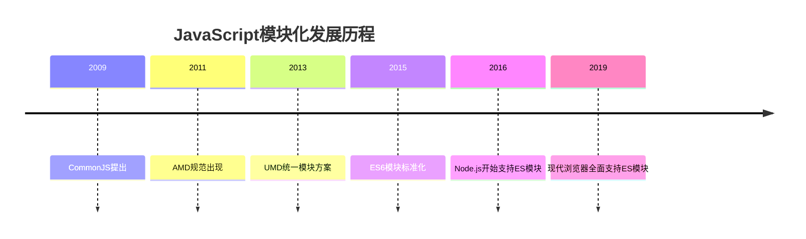

# JavaScript 模块基础

## 什么是JavaScript模块

模块是指将JavaScript代码按照特定的功能或逻辑划分为独立、可复用的代码单元。每个模块拥有自己的作用域，可以暴露（导出）特定的变量、函数或类供其他模块使用，同时也可以导入其他模块暴露的功能。

:::tip
模块化是现代JavaScript应用程序开发的基石，它帮助我们组织代码，提升可维护性和重用性。
:::

## 为什么需要模块化

在传统JavaScript开发中，所有代码都在全局作用域下运行，这会导致以下问题：

1. **命名冲突**：不同脚本中的同名变量会相互覆盖
2. **代码组织混乱**：随着项目规模增大，代码难以维护
3. **依赖关系不明确**：无法清晰地表达代码之间的依赖关系
4. **重用性差**：难以在不同项目间共享代码

模块化解决了这些问题，使JavaScript应用可以更加健壮和可维护。

## JavaScript 模块化的发展历程



### 1. 早期模块模式

最初，开发者使用函数作用域和闭包来模拟模块：

```javascript
// 模块模式：利用IIFE(立即执行函数表达式)创建私有作用域
var Calculator = (function() {
  // 私有变量
  var privateValue = 0;
  
  // 私有函数
  function add(a, b) {
    return a + b;
  }
  
  // 返回公开的API
  return {
    sum: function(a, b) {
      privateValue++;
      return add(a, b);
    },
    getCount: function() {
      return privateValue;
    }
  };
})();

// 使用模块
console.log(Calculator.sum(5, 3)); // 输出: 8
console.log(Calculator.getCount()); // 输出: 1
console.log(Calculator.privateValue); // 输出: undefined (无法访问私有变量)
```

### 2. CommonJS

Node.js采用的模块系统，主要用于服务器端：

```javascript
// math.js - 导出模块
function add(a, b) {
  return a + b;
}

function subtract(a, b) {
  return a - b;
}

module.exports = {
  add,
  subtract
};

// app.js - 导入模块
const math = require('./math');
console.log(math.add(5, 3)); // 输出: 8
```

### 3. AMD (Asynchronous Module Definition)

专为浏览器环境设计的异步模块加载方案，RequireJS是其主要实现：

```javascript
// 定义模块
define('math', [], function() {
  function add(a, b) {
    return a + b;
  }
  
  return {
    add: add
  };
});

// 使用模块
require(['math'], function(math) {
  console.log(math.add(5, 3)); // 输出: 8
});
```

### 4. ES6模块 (ESM)

JavaScript官方的模块系统，现已被现代浏览器和Node.js支持：

```javascript
// math.js - 导出
export function add(a, b) {
  return a + b;
}

export function subtract(a, b) {
  return a - b;
}

// 默认导出
export default function multiply(a, b) {
  return a * b;
}

// app.js - 导入
import multiply, { add, subtract } from './math.js';

console.log(add(5, 3));      // 输出: 8
console.log(subtract(5, 3)); // 输出: 2
console.log(multiply(5, 3)); // 输出: 15
```

## ES6模块详解

### 基本语法

#### 导出 (Export)

ES6模块提供了多种导出语法：

```javascript
// 命名导出
export const PI = 3.14159;
export function square(x) {
  return x * x;
}

// 在文件末尾一次性导出
const e = 2.71828;
function cube(x) {
  return x * x * x;
}

export { e, cube };

// 导出时重命名
export { cube as calculateCube };

// 默认导出
export default function(x) {
  return x * 2;
}
```

#### 导入 (Import)

导入其他模块的功能：

```javascript
// 导入命名导出
import { PI, square } from './math.js';

// 导入时重命名
import { square as calculateSquare } from './math.js';

// 导入默认导出
import doubleFunction from './math.js';

// 导入所有导出并命名为一个对象
import * as mathUtils from './math.js';
console.log(mathUtils.PI); // 3.14159
console.log(mathUtils.square(4)); // 16

// 同时导入默认导出和命名导出
import doubleFunction, { PI, square } from './math.js';
```

### ES6模块特性

1. **静态结构**：导入导出关系在编译时确定，而非运行时
2. **单例模式**：无论导入多少次，模块只执行一次
3. **严格模式**：ES6模块自动运行在严格模式下
4. **顶层this为undefined**：不同于全局脚本中的this指向window
5. **实时绑定**：导出值的更改会实时反映在导入模块中

```javascript
// counter.js
export let count = 0;
export function increment() {
  count++;
}

// app.js
import { count, increment } from './counter.js';
console.log(count); // 输出: 0
increment();
console.log(count); // 输出: 1
```

## 在浏览器中使用ES6模块

在HTML中使用`type="module"`属性来加载ES6模块：

```html
<!DOCTYPE html>
<html>
<head>
  <title>ES6模块示例</title>
</head>
<body>
  <h1>ES6模块示例</h1>
  
  <!-- 使用type="module"加载模块脚本 -->
  <script type="module">
    import { add } from './math.js';
    console.log(add(5, 3)); // 输出: 8
    
    // 模块脚本自动延迟执行，相当于设置了defer属性
    document.body.innerHTML += `<p>5 + 3 = ${add(5, 3)}</p>`;
  </script>
</body>
</html>
```

:::caution
使用ES6模块时，需要通过HTTP/HTTPS协议访问页面，直接打开本地HTML文件可能会因为CORS策略而失败。
:::

## 实际应用案例

### 案例1：构建计算器应用

让我们使用模块化方式构建一个简单的计算器应用。

```
/calculator/
  |-- index.html
  |-- main.js
  |-- modules/
      |-- calculator.js
      |-- ui.js
```

**模块定义**:

```javascript
// modules/calculator.js - 计算功能模块
export function add(a, b) {
  return a + b;
}

export function subtract(a, b) {
  return a - b;
}

export function multiply(a, b) {
  return a * b;
}

export function divide(a, b) {
  if (b === 0) {
    throw new Error("除数不能为0");
  }
  return a / b;
}
```

```javascript
// modules/ui.js - 用户界面模块
export function displayResult(result) {
  const resultElement = document.getElementById('result');
  resultElement.textContent = `计算结果: ${result}`;
}

export function getInputValues() {
  const num1 = parseFloat(document.getElementById('num1').value);
  const num2 = parseFloat(document.getElementById('num2').value);
  
  return { num1, num2 };
}

export function initUI() {
  const calculatorForm = document.getElementById('calculator-form');
  const operations = document.querySelectorAll('.operation');
  
  // 返回初始化好的UI事件监听器设置函数
  return function setupListeners(handleOperation) {
    operations.forEach(button => {
      button.addEventListener('click', () => {
        const operation = button.dataset.operation;
        handleOperation(operation);
      });
    });
  };
}
```

**主应用文件**:

```javascript
// main.js
import * as calc from './modules/calculator.js';
import { displayResult, getInputValues, initUI } from './modules/ui.js';

// 处理计算操作
function handleOperation(operation) {
  try {
    const { num1, num2 } = getInputValues();
    
    if (isNaN(num1) || isNaN(num2)) {
      throw new Error('请输入有效的数字');
    }
    
    let result;
    switch(operation) {
      case 'add':
        result = calc.add(num1, num2);
        break;
      case 'subtract':
        result = calc.subtract(num1, num2);
        break;
      case 'multiply':
        result = calc.multiply(num1, num2);
        break;
      case 'divide':
        result = calc.divide(num1, num2);
        break;
      default:
        throw new Error('不支持的操作');
    }
    
    displayResult(result);
  } catch (error) {
    displayResult(`错误: ${error.message}`);
  }
}

// 初始化应用
document.addEventListener('DOMContentLoaded', () => {
  const setupListeners = initUI();
  setupListeners(handleOperation);
});
```

**HTML文件**:

```html
<!DOCTYPE html>
<html>
<head>
  <title>模块化计算器</title>
  <style>
    .container { max-width: 400px; margin: 0 auto; padding: 20px; }
    .input-group { margin-bottom: 15px; }
    button { margin-right: 5px; }
  </style>
</head>
<body>
  <div class="container">
    <h1>模块化计算器</h1>
    <div id="calculator-form">
      <div class="input-group">
        <label for="num1">第一个数字:</label>
        <input type="number" id="num1">
      </div>
      <div class="input-group">
        <label for="num2">第二个数字:</label>
        <input type="number" id="num2">
      </div>
      <div class="buttons">
        <button class="operation" data-operation="add">加法</button>
        <button class="operation" data-operation="subtract">减法</button>
        <button class="operation" data-operation="multiply">乘法</button>
        <button class="operation" data-operation="divide">除法</button>
      </div>
      <div id="result" style="margin-top: 20px;">计算结果: </div>
    </div>
  </div>
  
  <script type="module" src="main.js"></script>
</body>
</html>
```

这个案例展示了如何使用ES6模块组织代码，将计算逻辑和UI逻辑分离到不同的模块中，使代码结构清晰且易于维护。

### 案例2：使用第三方模块

现代Web开发通常会使用第三方库。以下是通过ES模块导入和使用Lodash库的示例：

首先，通过CDN加载Lodash ES模块版本：

```html
<!DOCTYPE html>
<html>
<head>
  <title>Lodash模块示例</title>
</head>
<body>
  <div id="output"></div>
  
  <script type="module">
    // 从CDN导入Lodash模块
    import { 
      chunk, 
      capitalize,
      uniq 
    } from 'https://cdn.jsdelivr.net/npm/lodash-es@4.17.21/lodash.js';
    
    const output = document.getElementById('output');
    
    // 使用chunk函数将数组分组
    const numbers = [1, 2, 3, 4, 5, 6, 7, 8];
    const chunked = chunk(numbers, 3);
    
    // 使用capitalize函数首字母大写
    const name = "javascript";
    const capitalized = capitalize(name);
    
    // 使用uniq函数去除重复值
    const withDupes = [1, 1, 2, 3, 3, 4, 5, 5];
    const unique = uniq(withDupes);
    
    // 显示结果
    output.innerHTML = `
      <h3>Lodash函数示例:</h3>
      <p>原始数组: ${JSON.stringify(numbers)}</p>
      <p>分组后: ${JSON.stringify(chunked)}</p>
      <p>原始字符串: ${name}</p>
      <p>首字母大写: ${capitalized}</p>
      <p>带重复值的数组: ${JSON.stringify(withDupes)}</p>
      <p>去重后: ${JSON.stringify(unique)}</p>
    `;
  </script>
</body>
</html>
```

## 动态导入

ES2020引入了动态导入功能，允许按需加载模块：

```javascript
// 静态导入（在文件顶部）
import { add } from './math.js';

// 动态导入（可以在任何地方）
button.addEventListener('click', async () => {
  try {
    // 动态导入返回Promise
    const mathModule = await import('./math.js');
    console.log(mathModule.add(5, 3)); // 输出: 8
  } catch (error) {
    console.error('模块加载失败:', error);
  }
});
```

动态导入的主要优势：

1. **按需加载**：仅在需要时才加载模块
2. **条件加载**：根据不同条件加载不同模块
3. **提高性能**：实现代码分割，加速初始页面加载

## 模块打包工具

虽然现代浏览器支持ES6模块，但在生产环境中，我们通常使用打包工具来优化和转换模块代码。常见的打包工具包括：

- **Webpack**：最流行的模块打包器，功能全面
- **Rollup**：专注于ES模块的打包器，输出更精简
- **Parcel**：零配置的Web应用打包器
- **Vite**：基于ESM的快速开发工具，开发环境不打包

打包工具可以：
- 合并多个模块文件，减少HTTP请求
- 转换模块代码，确保兼容性
- 压缩代码，提高加载速度
- 实现代码分割，优化加载性能

## 总结

JavaScript模块化是现代Web应用开发的核心概念，它帮助开发者组织和管理代码，提高代码的可维护性和复用性。从早期的模块模式、CommonJS、AMD到现代的ES6模块，JavaScript模块化系统不断发展完善。

ES6模块作为JavaScript官方的模块系统，提供了强大而灵活的功能：
- 清晰的导入导出语法
- 静态分析能力
- 实时绑定特性
- 默认导出和命名导出
- 动态导入能力

掌握模块化开发是成为专业JavaScript开发者的必备技能。随着Web应用复杂度的不断提高，模块化的重要性也将持续增加。

## 练习与学习资源

### 练习题

1. 创建一个字符串工具模块，包含以下函数：反转字符串、计算字符串长度、转换为大写。然后在另一个模块中导入并使用这些函数。

2. 创建一个简单的TodoList应用，使用模块化结构：
   - 数据管理模块：处理任务的添加、删除和标记完成
   - UI模块：处理界面渲染和用户交互
   - 主模块：连接数据和UI模块

### 推荐资源

1. [MDN Web Docs: JavaScript 模块](https://developer.mozilla.org/zh-CN/docs/Web/JavaScript/Guide/Modules)
2. [JavaScript.info: 模块简介](https://zh.javascript.info/modules-intro)
3. [ES modules: A cartoon deep-dive](https://hacks.mozilla.org/2018/03/es-modules-a-cartoon-deep-dive/)
4. [Webpack 官方文档](https://webpack.js.org/)

继续深入学习模块化开发，将帮助你成为更高效、更专业的JavaScript开发者！