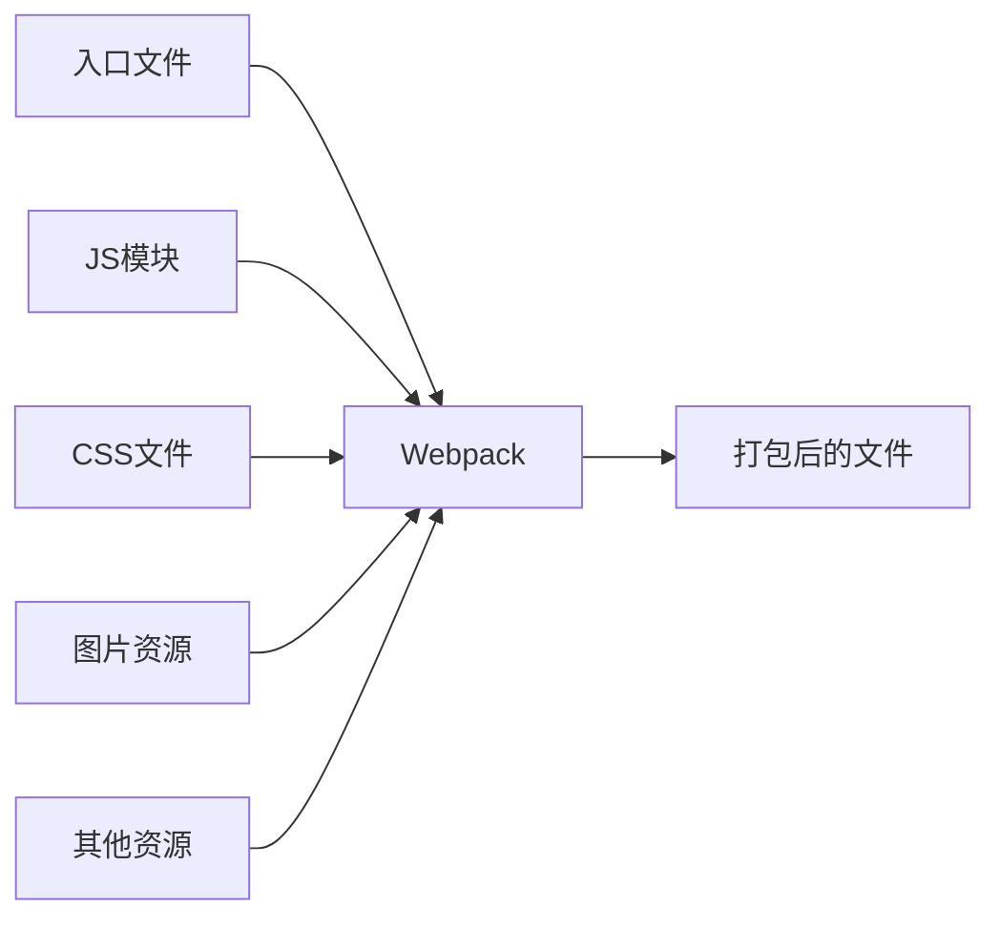
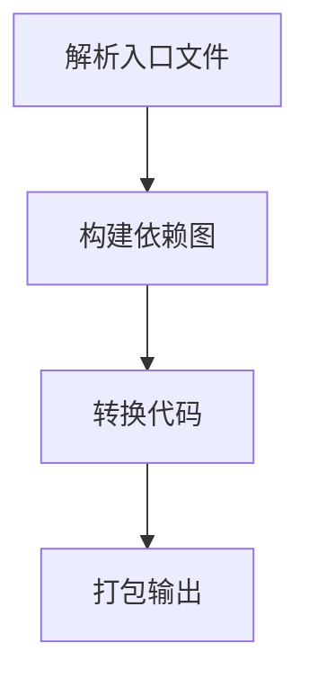

# JavaScript 模块打包工具

## 什么是模块打包工具？

在前端开发日益复杂的今天，我们的项目往往由数十甚至上百个JavaScript文件组成。如果直接在HTML中引入这么多的脚本文件，不仅会造成大量的HTTP请求，还会导致依赖管理混乱、代码冗余和全局变量污染等问题。

模块打包工具（Module Bundler）就是为了解决这些问题而诞生的。它可以：

- 将多个模块文件打包成一个或几个bundle文件
- 处理模块之间的依赖关系
- 优化代码，减少加载时间
- 转换代码，使其兼容不同环境
- 提供开发环境所需的工具支持

:::tip
模块打包工具是现代前端开发工作流中不可或缺的一部分，它让我们能够使用模块化的方式组织代码，同时保证代码能够高效地在浏览器中运行。
:::

## 主流的JavaScript模块打包工具

### Webpack

Webpack是目前最流行的模块打包工具，它不仅可以处理JavaScript文件，还可以处理CSS、图片等多种资源。



**基本概念：**

1. **Entry（入口）**：指定打包的起点
2. **Output（出口）**：指定打包后的文件存放位置
3. **Loader（加载器）**：处理非JavaScript文件
4. **Plugin（插件）**：执行更复杂的任务，如代码压缩
5. **Mode（模式）**：设置打包的环境（开发/生产）

**简单配置示例：**

```javascript
// webpack.config.js
const path = require('path');

module.exports = {
  entry: './src/index.js',
  output: {
    filename: 'bundle.js',
    path: path.resolve(__dirname, 'dist')
  },
  module: {
    rules: [
      {
        test: /\.css$/,
        use: ['style-loader', 'css-loader']
      }
    ]
  },
  mode: 'development'
};
```

### Rollup

Rollup更专注于JavaScript库的打包，它的特点是生成更小、更清洁的代码，特别是通过Tree-shaking技术（移除未使用的代码）。

**基本配置示例：**

```javascript
// rollup.config.js
export default {
  input: 'src/main.js',
  output: {
    file: 'bundle.js',
    format: 'iife'
  }
};
```

### Parcel

Parcel是一个零配置的打包工具，对初学者非常友好，无需复杂配置即可开始使用。

**使用示例：**

```bash
# 安装Parcel
npm install -g parcel-bundler

# 打包项目
parcel index.html
```

### Vite

Vite是一个相对较新但发展迅速的构建工具，它基于原生ES模块导入，提供极快的开发环境启动速度。

**基本使用：**

```bash
# 创建Vite项目
npm create vite@latest my-project -- --template vanilla

# 启动开发服务器
cd my-project
npm install
npm run dev
```

## 打包工具的工作原理

大多数打包工具的工作流程如下：

1. **解析入口文件**：分析代码，找出导入语句
2. **构建依赖图**：根据导入语句构建一个模块依赖图
3. **转换代码**：使用loader或插件转换不同类型的文件
4. **打包输出**：将所有模块打包成一个或多个文件



## 为什么需要模块打包工具？

### 1. 解决模块依赖问题

在没有打包工具之前，我们需要手动管理脚本的加载顺序，确保依赖的库先被加载。

**传统方式：**

```html
<script src="jquery.js"></script>
<script src="plugin1.js"></script>
<script src="plugin2.js"></script>
<script src="main.js"></script>
```

**使用打包工具后：**

```html
<script src="bundle.js"></script>
```

### 2. 代码优化和转换

打包工具可以：
- 压缩代码，减少文件大小
- 通过Tree-shaking移除未使用的代码
- 将ES6+代码转换为兼容旧浏览器的ES5代码
- 分割代码，实现按需加载

### 3. 处理各种资源

现代打包工具不仅处理JavaScript，还能处理：
- CSS和预处理器（SASS、LESS）
- 图片和其他媒体文件
- HTML模板
- JSON和其他数据格式

## 实际案例：使用Webpack打包一个简单项目

### 项目结构

```
my-project/
├── src/
│   ├── index.js
│   ├── math.js
│   └── styles.css
├── package.json
└── webpack.config.js
```

### 步骤1：初始化项目

```bash
mkdir my-project
cd my-project
npm init -y
npm install webpack webpack-cli --save-dev
```

### 步骤2：创建文件

**math.js:**
```javascript
export function add(a, b) {
  return a + b;
}

export function subtract(a, b) {
  return a - b;
}
```

**index.js:**
```javascript
import { add, subtract } from './math.js';
import './styles.css';

console.log('2 + 3 =', add(2, 3));
console.log('5 - 2 =', subtract(5, 2));

const app = document.createElement('div');
app.textContent = `计算结果：2 + 3 = ${add(2, 3)}, 5 - 2 = ${subtract(5, 2)}`;
document.body.appendChild(app);
```

**styles.css:**
```css
body {
  background-color: #f0f0f0;
  font-family: Arial, sans-serif;
}

div {
  margin: 20px;
  padding: 20px;
  border: 1px solid #ddd;
  border-radius: 5px;
}
```

### 步骤3：配置Webpack

**webpack.config.js:**
```javascript
const path = require('path');

module.exports = {
  entry: './src/index.js',
  output: {
    filename: 'bundle.js',
    path: path.resolve(__dirname, 'dist')
  },
  module: {
    rules: [
      {
        test: /\.css$/,
        use: ['style-loader', 'css-loader']
      }
    ]
  },
  mode: 'development',
  devServer: {
    static: './dist'
  }
};
```

**安装所需的loader:**
```bash
npm install style-loader css-loader --save-dev
npm install webpack-dev-server --save-dev
```

### 步骤4：创建HTML文件

**dist/index.html:**
```html
<!DOCTYPE html>
<html lang="zh-CN">
<head>
  <meta charset="UTF-8">
  <title>Webpack示例</title>
</head>
<body>
  <h1>Webpack模块打包示例</h1>
  <script src="bundle.js"></script>
</body>
</html>
```

### 步骤5：添加npm脚本

**package.json:**
```json
{
  "scripts": {
    "build": "webpack",
    "start": "webpack serve --open"
  }
}
```

### 步骤6：运行项目

```bash
npm run build  # 构建项目
npm start      # 启动开发服务器
```

打开浏览器，你会看到一个简单的页面，显示计算结果，并应用了CSS样式。

## 打包工具的选择建议

不同的打包工具有不同的优势，选择时可以考虑：

1. **项目复杂度**：
   - 简单项目或学习阶段：Parcel（零配置）
   - 中小型项目：Vite（快速开发体验）
   - 大型复杂项目：Webpack（生态丰富，功能强大）

2. **开发库或组件**：Rollup（生成干净的代码，适合发布）

3. **团队熟悉度**：选择团队成员熟悉的工具

:::caution
不要盲目追求最新的工具，稳定性和生态系统也很重要。新工具虽然有创新，但可能缺乏成熟的文档和社区支持。
:::

## 总结

模块打包工具是现代前端开发的重要组成部分，它们帮助我们：

- 管理复杂的代码依赖
- 优化前端资源
- 提高开发效率和用户体验
- 使用现代JavaScript特性，同时保持对旧浏览器的兼容性

作为初学者，建议先从简单的项目开始，逐步了解打包工具的核心概念。随着对打包工具理解的深入，你将能够更有效地使用它们来构建高质量的前端应用。

## 扩展学习资源

- 官方文档：
  - [Webpack](https://webpack.js.org/)
  - [Rollup](https://rollupjs.org/)
  - [Parcel](https://parceljs.org/)
  - [Vite](https://vitejs.dev/)

- 练习任务：
  1. 使用Webpack打包一个包含ES6模块的项目
  2. 尝试配置Babel转换器，使代码兼容旧浏览器
  3. 使用不同的打包工具（如Parcel和Vite）构建相同的项目，比较它们的差异
  4. 探索代码分割和懒加载技术，提高应用性能

随着你对这些工具的熟悉，你会发现它们不仅仅是简单的"打包工具"，更是能够极大提升开发效率和项目质量的强大助手。