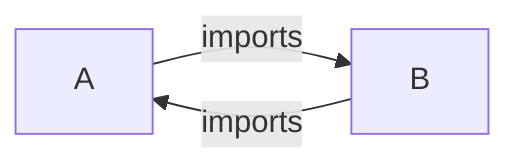
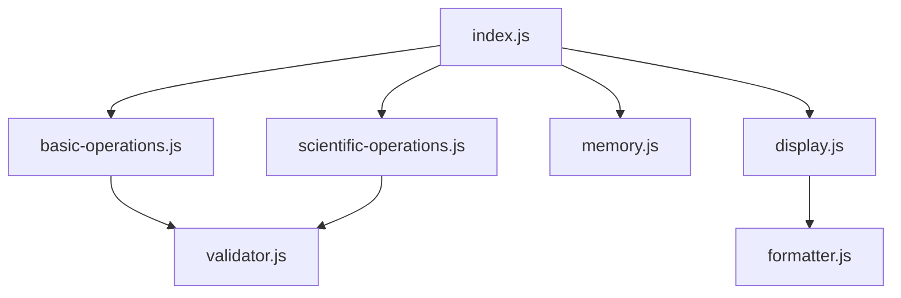

# JavaScript 模块依赖管理

在现代Web开发中，随着项目规模的增长，代码的组织和管理变得越来越重要。模块化编程提供了一种结构化方法来组织代码，而模块依赖管理则是模块化编程中的关键概念。本文将详细介绍JavaScript中的模块依赖管理，帮助你理解如何有效地组织和管理模块间的依赖关系。

## 什么是模块依赖管理？

模块依赖管理是指处理和维护模块之间相互依赖关系的过程。当一个模块需要使用另一个模块提供的功能时，就会产生依赖关系。良好的依赖管理可以确保：

- 模块按正确的顺序加载
- 避免循环依赖
- 减少代码冗余
- 提高应用性能
- 简化维护和更新

## JavaScript 中的模块系统和依赖管理

JavaScript有几种主要的模块系统，每种系统都有其特定的依赖管理方式：

### 1. CommonJS (CJS)

CommonJS是Node.js采用的模块系统，使用`require`和`module.exports`来管理依赖。

```javascript
// math.js - 导出模块
function add(a, b) {
  return a + b;
}

function subtract(a, b) {
  return a - b;
}

module.exports = {
  add,
  subtract
};

// app.js - 导入并使用模块
const math = require('./math.js');

console.log(math.add(5, 3));      // 输出: 8
console.log(math.subtract(10, 4)); // 输出: 6
```

CommonJS的依赖加载是**同步的**，这意味着模块会按顺序加载，适合服务器环境但在浏览器中可能导致性能问题。

### 2. ES模块 (ESM)

ES模块是JavaScript的官方标准模块系统，使用`import`和`export`语句：

```javascript
// math.js - 导出模块
export function add(a, b) {
  return a + b;
}

export function subtract(a, b) {
  return a - b;
}

// 或者使用默认导出
// export default { add, subtract };

// app.js - 导入并使用模块
import { add, subtract } from './math.js';
// 或者导入默认导出
// import math from './math.js';

console.log(add(5, 3));       // 输出: 8
console.log(subtract(10, 4)); // 输出: 6
```

ES模块的依赖加载是**静态的**，这意味着导入在编译时确定，有助于静态分析、树摇(tree-shaking)和代码优化。

### 3. AMD (Asynchronous Module Definition)

AMD专为浏览器环境设计，支持异步加载模块，常用的实现是RequireJS：

```javascript
// math.js - 定义模块
define([], function() {
  return {
    add: function(a, b) {
      return a + b;
    },
    subtract: function(a, b) {
      return a - b;
    }
  };
});

// app.js - 使用模块
require(['math'], function(math) {
  console.log(math.add(5, 3));      // 输出: 8
  console.log(math.subtract(10, 4)); // 输出: 6
});
```

AMD的异步加载特性使其适合浏览器环境，可以在不阻塞页面渲染的情况下加载模块。

### 4. UMD (Universal Module Definition)

UMD结合了CommonJS和AMD的特性，允许同一模块在不同环境中使用：

```javascript
(function(root, factory) {
  if (typeof define === 'function' && define.amd) {
    // AMD
    define(['dependency'], factory);
  } else if (typeof module === 'object' && module.exports) {
    // CommonJS
    module.exports = factory(require('dependency'));
  } else {
    // 浏览器全局变量
    root.myModule = factory(root.dependency);
  }
}(typeof self !== 'undefined' ? self : this, function(dependency) {
  // 模块代码
  return {
    // 公开的API
  };
}));
```

UMD提供了最大的兼容性，但其语法比其他模块系统更复杂。

## 依赖管理的关键概念

### 1. 显式依赖声明

好的模块系统会要求开发者显式声明依赖关系，这有助于：

- 清晰地了解模块间的关系
- 更好地组织代码
- 便于工具进行静态分析和优化

```javascript
// 显式声明依赖 - ES模块
import { Component } from './component.js';
import { Utility } from './utility.js';

// 使用依赖
const myComponent = new Component();
const result = Utility.process(myComponent);
```

### 2. 依赖解析策略

模块系统需要解析模块路径来找到实际的文件。常见的解析策略包括：

- **相对路径**：`import './relative/path'`
- **绝对路径**：`import '/absolute/path'`
- **包名称**：`import 'package-name'`

Node.js和打包工具如Webpack有详细的算法来解析这些路径，通常会查找:

1. node_modules目录
2. package.json中的main或module字段
3. 文件扩展名解析（.js, .json等）

### 3. 循环依赖

循环依赖是指两个或多个模块相互依赖的情况：



不同模块系统处理循环依赖的方式不同：

- **CommonJS** - 返回模块的未完成副本
- **ES模块** - 允许循环引用，但必须小心处理初始化顺序

:::caution
循环依赖通常是设计问题的征兆。尽量通过重构代码来避免循环依赖，例如引入中间模块或使用依赖注入模式。
:::

## 实际案例：构建模块化计算器应用

让我们通过一个实际项目来理解模块依赖管理的应用：

### 项目结构

```
calculator/
├── src/
│   ├── index.js
│   ├── modules/
│   │   ├── basic-operations.js
│   │   ├── scientific-operations.js
│   │   ├── memory.js
│   │   └── display.js
│   └── utils/
│       ├── formatter.js
│       └── validator.js
└── package.json
```

### 模块实现

**formatter.js**:
```javascript
// 工具函数，格式化数字输出
export function formatNumber(num) {
  return Number.isInteger(num) ? num.toString() : num.toFixed(2);
}

export function formatScientific(num) {
  return num.toExponential(2);
}
```

**validator.js**:
```javascript
// 验证输入
export function isValidNumber(input) {
  return !isNaN(parseFloat(input)) && isFinite(input);
}
```

**basic-operations.js**:
```javascript
import { isValidNumber } from '../utils/validator.js';

// 导出基本运算
export function add(a, b) {
  if (!isValidNumber(a) || !isValidNumber(b)) {
    throw new Error('Invalid input');
  }
  return a + b;
}

export function subtract(a, b) {
  if (!isValidNumber(a) || !isValidNumber(b)) {
    throw new Error('Invalid input');
  }
  return a - b;
}

// 其他基本运算...
```

**scientific-operations.js**:
```javascript
import { isValidNumber } from '../utils/validator.js';

// 导出科学计算
export function power(base, exponent) {
  if (!isValidNumber(base) || !isValidNumber(exponent)) {
    throw new Error('Invalid input');
  }
  return Math.pow(base, exponent);
}

export function squareRoot(num) {
  if (!isValidNumber(num) || num < 0) {
    throw new Error('Invalid input');
  }
  return Math.sqrt(num);
}

// 其他科学运算...
```

**memory.js**:
```javascript
// 计算器内存操作
let memoryValue = 0;

export function store(value) {
  memoryValue = value;
}

export function recall() {
  return memoryValue;
}

export function clear() {
  memoryValue = 0;
}
```

**display.js**:
```javascript
import { formatNumber, formatScientific } from '../utils/formatter.js';

// 处理显示逻辑
export function formatDisplay(value, isScientific = false) {
  return isScientific ? formatScientific(value) : formatNumber(value);
}
```

**index.js** (主模块):
```javascript
// 导入所有需要的依赖
import * as basic from './modules/basic-operations.js';
import * as scientific from './modules/scientific-operations.js';
import * as memory from './modules/memory.js';
import { formatDisplay } from './modules/display.js';

// 使用依赖构建计算器功能
export function calculate(a, b, operation, isScientific = false) {
  let result;
  
  switch (operation) {
    case 'add':
      result = basic.add(a, b);
      break;
    case 'subtract':
      result = basic.subtract(a, b);
      break;
    case 'power':
      result = scientific.power(a, b);
      break;
    // 其他运算...
    default:
      throw new Error('Unknown operation');
  }
  
  // 将结果存入内存
  memory.store(result);
  
  // 返回格式化的结果
  return formatDisplay(result, isScientific);
}

// 使用计算器
const result = calculate(5, 3, 'add');
console.log(`结果: ${result}`);  // 输出: 结果: 8

const powerResult = calculate(2, 3, 'power', true);
console.log(`幂运算结果: ${powerResult}`);  // 输出: 幂运算结果: 8.00e+0
```

### 依赖关系图



这个例子展示了如何使用模块依赖管理构建一个结构清晰的应用：

1. **分离关注点** - 每个模块都有特定的职责
2. **显式依赖** - 每个模块明确导入它所依赖的其他模块
3. **避免循环依赖** - 通过合理的设计，依赖关系形成有向无环图
4. **依赖注入** - 主模块协调各个子模块的工作

## 模块依赖管理的最佳实践

### 1. 最小化依赖

只导入你需要的内容，避免大量未使用的代码：

```javascript
// 好的做法: 只导入需要的函数
import { useState, useEffect } from 'react';

// 避免: 导入整个库
// import * as React from 'react';
```

### 2. 使用命名导出代替默认导出

命名导出提供更好的可重构性和静态分析：

```javascript
// 推荐: 使用命名导出
export function helper() { /* ... */ }
export class Service { /* ... */ }

// 使用时易于识别导入的内容
import { helper, Service } from './module';
```

### 3. 保持模块小而专注

每个模块应该只做一件事，且做好：

```javascript
// userAuth.js - 只处理用户认证
export function login() { /* ... */ }
export function logout() { /* ... */ }
export function validateToken() { /* ... */ }

// userProfile.js - 只处理用户资料
export function getProfile() { /* ... */ }
export function updateProfile() { /* ... */ }
```

### 4. 避免副作用

模块应该尽量避免在导入时执行有副作用的代码：

```javascript
// 不好的做法: 导入时执行副作用
console.log('Module loaded!');
document.title = 'New title';

// 好的做法: 导出函数，由导入方决定何时执行
export function updateTitle(newTitle) {
  document.title = newTitle;
}
```

### 5. 使用依赖管理工具

利用npm/yarn/pnpm等包管理器和打包工具(如webpack、Rollup、Vite)来简化依赖管理：

```bash
# 安装和管理依赖
npm install lodash-es

# 在package.json中维护依赖版本
```

```javascript
// 然后在代码中导入使用
import { debounce } from 'lodash-es';

const debouncedFunction = debounce(() => {
  // 函数实现
}, 300);
```

## 总结

模块依赖管理是构建可维护JavaScript应用程序的核心概念。通过掌握不同模块系统的依赖管理方式，你可以：

- 组织更清晰、更结构化的代码
- 减少全局命名空间污染
- 提高代码的可重用性和可测试性
- 更有效地管理大型项目

在实际开发中，选择适合项目需求的模块系统，并遵循良好的依赖管理实践，将帮助你构建更加健壮和可维护的应用程序。

## 练习与扩展学习

1. **练习**：尝试重构现有代码，将一个大文件拆分为多个模块，实践依赖管理概念。

2. **挑战**：将上面的计算器示例扩展，添加更多功能(如三角函数、统计功能)，并维护良好的模块结构。

3. **深入学习资源**：
   - [MDN Web Docs: JavaScript模块](https://developer.mozilla.org/zh-CN/docs/Web/JavaScript/Guide/Modules)
   - [深入理解ES模块](https://hacks.mozilla.org/2018/03/es-modules-a-cartoon-deep-dive/)
   - [CommonJS规范](http://www.commonjs.org/)

:::tip 小提示
模块化是一个渐进过程。在小项目中尝试运用这些概念，随着项目规模的增长，你会越来越欣赏良好模块依赖管理带来的好处。
:::