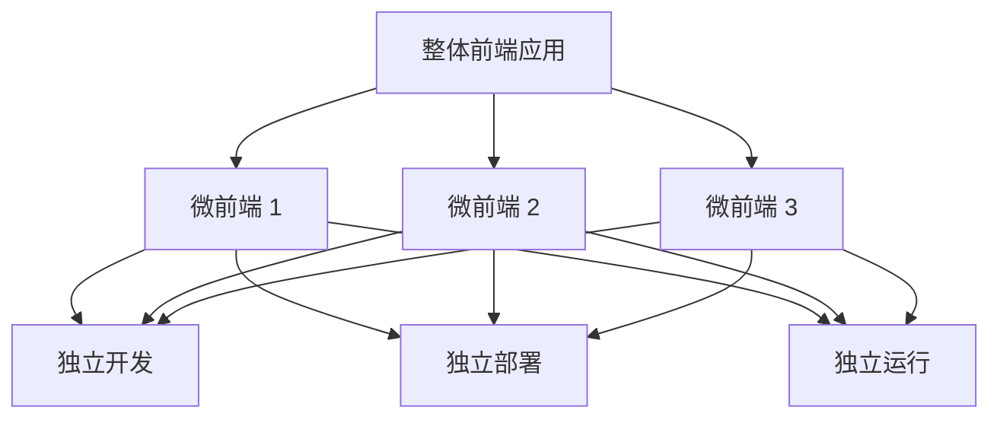
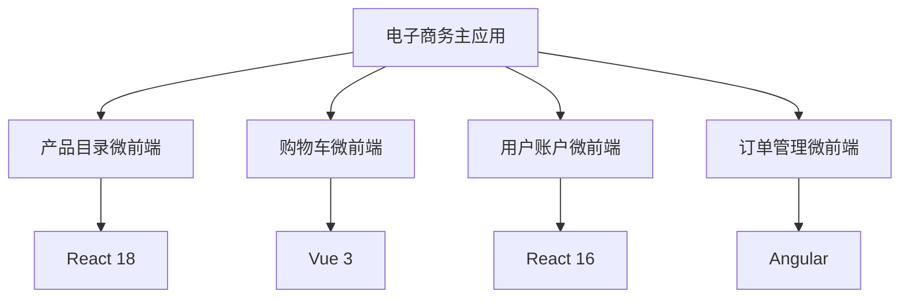

# JavaScript 微前端

## 什么是微前端？

微前端是一种前端架构模式，它将单体前端应用拆分成更小、更易于管理的部分，这些部分可以独立开发、测试和部署。微前端架构的核心理念是将前端应用视为多个团队共同开发的产品，而不是单一团队的成果。

:::note 定义
"微前端是一种将多个可独立交付的小型前端应用组合成一个整体的架构风格。"
—— Martin Fowler
:::



## 为什么需要微前端？

随着前端应用规模的增长，我们面临着一些挑战：

1. **代码库过大** - 单体应用变得难以维护
2. **团队协作困难** - 多团队协同开发时存在依赖和冲突
3. **技术栈限制** - 难以在同一应用中使用不同的框架或版本
4. **部署风险增加** - 小改动需要重新部署整个应用

微前端架构试图通过将应用分解为更小的、松耦合的部分来解决这些问题。

## 微前端的核心原则

要成功实现微前端架构，需要遵循以下核心原则：

1. **独立性** - 每个微前端可以独立开发、测试和部署
2. **技术无关性** - 各团队可以选择自己的技术栈
3. **团队自治** - 每个团队负责自己的微前端从开发到部署的全流程
4. **简单整合** - 微前端之间的整合应当简单直接

## 实现微前端的主要方式

### 1. 基于路由的微前端

最简单的微前端实现方式是基于路由进行拆分。每个微前端负责特定的路由路径。

```javascript
// 主应用中的路由配置
const routes = {
  '/app1/*': loadMicroFrontend('app1'),
  '/app2/*': loadMicroFrontend('app2'),
  '/app3/*': loadMicroFrontend('app3')
};

function loadMicroFrontend(name) {
  return () => {
    // 加载相应的微前端
    const container = document.getElementById('container');
    // 清空容器
    container.innerHTML = '';
    // 动态加载微前端脚本
    const script = document.createElement('script');
    script.src = `/${name}/bundle.js`;
    document.head.appendChild(script);
  };
}
```

### 2. 使用 Web Components

Web Components 是一种创建可重用自定义元素的技术，非常适合构建微前端。

```javascript
// 微前端 A 中定义一个自定义元素
class MicroFrontendA extends HTMLElement {
  connectedCallback() {
    this.innerHTML = `
      <h2>微前端 A</h2>
      <p>这是来自微前端 A 的内容</p>
      <button id="a-button">点击我</button>
    `;
    
    this.querySelector('#a-button').addEventListener('click', () => {
      console.log('来自微前端 A 的按钮被点击');
    });
  }
}

// 注册自定义元素
customElements.define('micro-frontend-a', MicroFrontendA);
```

主应用中使用该自定义元素：

```html
<div>
  <h1>主应用</h1>
  <micro-frontend-a></micro-frontend-a>
</div>
```

### 3. 使用框架如 Single-SPA

Single-SPA 是一个专为微前端设计的 JavaScript 框架，支持多个框架共存。

```javascript
// 在主应用中配置
import { registerApplication, start } from 'single-spa';

// 注册 React 微前端
registerApplication({
  name: 'react-app',
  app: () => import('./react-app.js'),
  activeWhen: '/react'
});

// 注册 Vue 微前端
registerApplication({
  name: 'vue-app',
  app: () => import('./vue-app.js'),
  activeWhen: '/vue'
});

// 启动应用
start();
```

### 4. 模块联邦 (Module Federation)

Webpack 5 引入的模块联邦是实现微前端的强大工具，它允许多个独立构建的应用共享代码。

```javascript
// webpack.config.js - 微前端 A
const { ModuleFederationPlugin } = require('webpack').container;

module.exports = {
  plugins: [
    new ModuleFederationPlugin({
      name: 'microFrontendA',
      filename: 'remoteEntry.js',
      exposes: {
        './Button': './src/components/Button'
      },
      shared: ['react', 'react-dom']
    })
  ]
};

// webpack.config.js - 主应用
const { ModuleFederationPlugin } = require('webpack').container;

module.exports = {
  plugins: [
    new ModuleFederationPlugin({
      name: 'host',
      remotes: {
        microFrontendA: 'microFrontendA@http://localhost:3001/remoteEntry.js'
      },
      shared: ['react', 'react-dom']
    })
  ]
};
```

在主应用中使用微前端 A 的组件：

```javascript
// 主应用中的组件
import React, { lazy, Suspense } from 'react';

// 懒加载远程组件
const RemoteButton = lazy(() => import('microFrontendA/Button'));

const App = () => (
  <div>
    <h1>主应用</h1>
    <Suspense fallback="加载中...">
      <RemoteButton />
    </Suspense>
  </div>
);
```

## 微前端通信

微前端之间需要通信，常见的方式有：

### 1. 通过自定义事件

```javascript
// 微前端 A 发送事件
const event = new CustomEvent('microFrontendEvent', { 
  detail: { message: 'Hello from Micro Frontend A' } 
});
window.dispatchEvent(event);

// 微前端 B 接收事件
window.addEventListener('microFrontendEvent', (event) => {
  console.log(event.detail.message); // 输出: Hello from Micro Frontend A
});
```

### 2. 通过共享状态库

```javascript
// 使用 Redux 或其它状态管理库
import { createStore } from 'redux';

// 创建一个全局 store
const sharedStore = createStore(reducer);

// 在微前端中使用
function microFrontendA() {
  // 分发操作
  sharedStore.dispatch({ 
    type: 'UPDATE_DATA', 
    payload: { value: 'new data' } 
  });
}

function microFrontendB() {
  // 订阅变化
  sharedStore.subscribe(() => {
    const state = sharedStore.getState();
    console.log('New state:', state);
  });
}
```

## 实际案例：电子商务平台

假设我们正在构建一个大型电子商务平台，可以将其拆分为以下微前端：

1. **产品目录微前端** - 负责展示产品列表和搜索功能
2. **购物车微前端** - 管理购物车的添加和结算功能
3. **用户账户微前端** - 处理用户登录、注册和个人资料
4. **订单管理微前端** - 展示和跟踪用户订单



这种架构允许不同团队分别负责不同的功能模块，使用他们熟悉的技术栈，同时保持统一的用户体验。

### 如何整合这些微前端

使用 Single-SPA 配置：

```javascript
// 主应用入口
import { registerApplication, start } from 'single-spa';

registerApplication({
  name: 'product-catalog',
  app: () => import('./product-catalog.js'),
  activeWhen: ['/products', '/search']
});

registerApplication({
  name: 'shopping-cart',
  app: () => import('./shopping-cart.js'),
  activeWhen: ['/cart']
});

registerApplication({
  name: 'user-account',
  app: () => import('./user-account.js'),
  activeWhen: ['/account', '/login', '/register']
});

registerApplication({
  name: 'orders',
  app: () => import('./orders.js'),
  activeWhen: ['/orders']
});

// 共享应用（如导航、页脚等始终存在的组件）
registerApplication({
  name: 'nav',
  app: () => import('./nav.js'),
  activeWhen: ['/']
});

start();
```

## 微前端的挑战与解决方案

### 1. 样式隔离

问题：不同微前端的 CSS 可能会相互影响。

解决方案：

```javascript
// 使用 Shadow DOM 隔离样式
class IsolatedComponent extends HTMLElement {
  constructor() {
    super();
    // 创建 Shadow DOM
    this.attachShadow({ mode: 'open' });
  }
  
  connectedCallback() {
    // 添加样式和内容到 Shadow DOM
    this.shadowRoot.innerHTML = `
      <style>
        .button { background: blue; color: white; }
      </style>
      <button class="button">隔离的按钮</button>
    `;
  }
}

customElements.define('isolated-component', IsolatedComponent);
```

### 2. 共享依赖

问题：多个微前端使用相同依赖可能导致重复加载。

解决方案：使用 Webpack 的模块联邦共享依赖。

```javascript
// webpack.config.js
new ModuleFederationPlugin({
  // ...
  shared: {
    react: { 
      singleton: true,  // 确保只加载一次
      requiredVersion: '^17.0.0' // 指定版本范围
    },
    'react-dom': { singleton: true, requiredVersion: '^17.0.0' },
    // 其他共享依赖...
  }
})
```

### 3. 认证和会话管理

问题：多个微前端需要共享用户认证状态。

解决方案：

```javascript
// 使用单点登录 (SSO) 和 JWT
// auth.js - 可被所有微前端导入
const authService = {
  token: null,
  
  login(credentials) {
    return fetch('/api/login', {
      method: 'POST',
      body: JSON.stringify(credentials)
    })
    .then(res => res.json())
    .then(data => {
      this.token = data.token;
      sessionStorage.setItem('auth_token', data.token);
      return data;
    });
  },
  
  getToken() {
    if (!this.token) {
      this.token = sessionStorage.getItem('auth_token');
    }
    return this.token;
  },
  
  isAuthenticated() {
    return !!this.getToken();
  },
  
  logout() {
    this.token = null;
    sessionStorage.removeItem('auth_token');
  }
};

export default authService;
```

## 微前端性能优化

优化微前端应用的加载和运行性能至关重要：

### 1. 懒加载微前端

```javascript
// 只在需要时加载微前端
const loadMicroFrontend = (name) => {
  return new Promise((resolve) => {
    const script = document.createElement('script');
    script.src = `/${name}/bundle.js`;
    script.onload = () => {
      resolve(window[name]);
    };
    document.head.appendChild(script);
  });
};

// 使用时
const button = document.getElementById('load-app');
button.addEventListener('click', async () => {
  const microFrontend = await loadMicroFrontend('app1');
  microFrontend.mount(document.getElementById('container'));
});
```

### 2. 预加载策略

```javascript
// 在空闲时预加载微前端
if ('requestIdleCallback' in window) {
  requestIdleCallback(() => {
    // 预加载可能很快就会用到的微前端
    const link = document.createElement('link');
    link.rel = 'prefetch';
    link.href = '/app2/bundle.js';
    document.head.appendChild(link);
  });
}
```

## 构建企业级微前端项目的最佳实践

1. **建立清晰的团队和责任边界**：明确各微前端的所有者团队
2. **创建统一的设计系统**：确保整个应用的一致性
3. **实施持续集成/持续部署**：为每个微前端配置独立的 CI/CD 管道
4. **集中管理共享依赖**：避免版本冲突和重复加载
5. **制定通信协议**：明确微前端之间的通信规范
6. **建立统一的监控和日志系统**：整体把握应用性能和状态
7. **进行增量迁移**：逐步将现有应用转换为微前端架构

:::caution 警告
微前端不是所有前端项目的万能解决方案。对于小型项目，微前端可能带来不必要的复杂性和开销。在采用前请务必评估项目规模和团队结构是否适合微前端架构。
:::

## 总结

微前端架构是一种强大的前端开发方法，特别适合大型团队和大型应用程序。它允许：

- 将复杂应用分解为多个可管理的、独立开发的部分
- 不同团队使用不同的技术栈
- 独立部署，降低风险
- 更好地扩展开发团队

虽然实现微前端带来了一些挑战，如样式隔离、依赖共享和通信，但现代工具和最佳实践可以有效解决这些问题。

## 练习与资源

### 练习

1. 使用 Single-SPA 创建一个简单的微前端应用，包含两个微前端。
2. 实现一个使用 Web Components 的微前端，确保样式正确隔离。
3. 尝试使用 Webpack 5 的模块联邦在两个独立应用间共享组件。
4. 设计一个微前端之间通过自定义事件通信的示例。

### 进一步学习的资源

- [Single-SPA 官方文档](https://single-spa.js.org/)
- [Webpack Module Federation 指南](https://webpack.js.org/concepts/module-federation/)
- [Web Components 介绍](https://developer.mozilla.org/zh-CN/docs/Web/Web_Components)
- [Martin Fowler 关于微前端的文章](https://martinfowler.com/articles/micro-frontends.html)
- 推荐书籍：《构建微前端架构》和《前端架构设计》

微前端是现代前端架构的重要进化方向，掌握它将帮助你更有效地构建和维护大型前端应用。随着项目的发展，这种架构方式的优势会变得越来越明显！