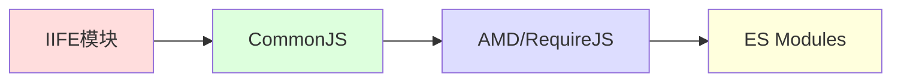

# JavaScript IIFE模块

## 什么是IIFE？

IIFE (Immediately Invoked Function Expression) 是指**立即执行函数表达式**，它是JavaScript中一种常见的设计模式，可以创建一个立即执行的函数作用域。在模块化编程中，IIFE是最基础也最早期的模块化实现方式之一。

基本语法如下：

```javascript
(function() {
  // 函数体，在这里编写的代码会立即执行
  // 同时具有自己的作用域
})();
```

:::note
括号中的函数是一个表达式，外面的括号()会立即调用这个函数。
:::

## IIFE的基本结构

IIFE通常有两种写法：

```javascript
// 写法一：最常见
(function() {
  console.log('我会立即执行！');
})();

// 写法二：同样有效
(function() {
  console.log('我也会立即执行！');
}());
```

输出：
```
我会立即执行！
我也会立即执行！
```

## 为什么需要IIFE？

在ES6模块化标准出现之前，JavaScript没有官方的模块系统。IIFE提供了一种创建隔离作用域的方法，帮助我们：

1. **避免全局命名空间污染**
2. **保护变量不被外部访问**
3. **创建私有变量和方法**
4. **组织相关功能为一个整体**

## 使用IIFE创建简单模块

下面是一个使用IIFE创建简单计数器模块的例子：

```javascript
var counter = (function() {
  // 私有变量
  var count = 0;
  
  // 返回包含公共方法的对象
  return {
    increment: function() {
      count++;
      return count;
    },
    decrement: function() {
      count--;
      return count;
    },
    getValue: function() {
      return count;
    }
  };
})();

// 使用模块
console.log(counter.getValue()); // 输出: 0
console.log(counter.increment()); // 输出: 1
console.log(counter.increment()); // 输出: 2
console.log(counter.decrement()); // 输出: 1
```

在这个例子中：
- `count`变量是私有的，外部代码无法直接访问
- 通过返回一个包含方法的对象，我们提供了公共API
- 所有方法共享同一个`count`变量(闭包特性)

## IIFE模块模式的进阶用法

### 1. 带参数的IIFE

我们可以向IIFE传递参数：

```javascript
(function(window, document, $) {
  // 现在可以使用window, document和jQuery($)
  // 好处：参数引用本地化，提高查找速度
  // 同时还可以通过参数重命名
  
  $(document).ready(function() {
    console.log('文档已准备好！');
  });
  
})(window, document, jQuery);
```

### 2. 模块的导入与依赖

IIFE模块可以互相依赖：

```javascript
// 工具模块
var Utils = (function() {
  function formatDate(date) {
    return date.toISOString().slice(0, 10);
  }
  
  return {
    formatDate: formatDate
  };
})();

// 用户模块(依赖工具模块)
var UserModule = (function(utils) {
  var user = {
    name: 'Alice',
    registeredDate: new Date()
  };
  
  function getUserInfo() {
    return {
      name: user.name,
      since: utils.formatDate(user.registeredDate)
    };
  }
  
  return {
    getUserInfo: getUserInfo
  };
})(Utils);

console.log(UserModule.getUserInfo());
// 输出: { name: 'Alice', since: '2023-07-15' } (日期将是当天)
```

### 3. 揭示模块模式(Revealing Module Pattern)

这是IIFE模块的一种变体，保持所有函数都是私有的，只暴露必要的函数：

```javascript
var Calculator = (function() {
  // 所有函数都是私有的
  function add(a, b) {
    return a + b;
  }
  
  function subtract(a, b) {
    return a - b;
  }
  
  function multiply(a, b) {
    return a * b;
  }
  
  // 私有函数，不会被暴露
  function log(result) {
    console.log('计算结果: ' + result);
  }
  
  // 只暴露需要公开的API
  return {
    add: add,
    subtract: subtract,
    multiply: multiply
    // log函数不暴露，保持私有
  };
})();

console.log(Calculator.add(5, 3));      // 输出: 8
console.log(Calculator.subtract(5, 3)); // 输出: 2
// Calculator.log() // 错误: log不是一个函数
```

## IIFE模块的实际应用场景

### 1. jQuery插件开发

jQuery插件通常使用IIFE来避免污染全局命名空间：

```javascript
(function($) {
  $.fn.highlightText = function(options) {
    // 默认配置
    var settings = $.extend({
      color: 'yellow',
      background: 'transparent'
    }, options);
    
    // 返回this以支持链式调用
    return this.each(function() {
      $(this).css({
        'color': settings.color,
        'background-color': settings.background
      });
    });
  };
})(jQuery);

// 使用插件
// $('#element').highlightText({ color: 'red' });
```

### 2. 创建单例模式

```javascript
var Singleton = (function() {
  // 私有变量保存实例
  var instance;
  
  // 实际的构造函数
  function createInstance() {
    var object = {
      name: 'I am the singleton',
      method: function() {
        return 'Hello!';
      }
    };
    return object;
  }
  
  // 返回公共API
  return {
    getInstance: function() {
      if (!instance) {
        instance = createInstance();
      }
      return instance;
    }
  };
})();

var instance1 = Singleton.getInstance();
var instance2 = Singleton.getInstance();

console.log(instance1 === instance2); // 输出: true (两个变量引用相同的实例)
```

### 3. 封装代码库

大型JavaScript库通常使用IIFE来封装整个代码库，只暴露必要的API：

```javascript
var MyLibrary = (function() {
  // 私有变量和函数
  var version = '1.0.0';
  
  function doSomethingInternal() {
    // 内部实现...
  }
  
  // 公共API
  return {
    version: version,
    publicMethod: function() {
      doSomethingInternal();
      return 'Result from public method';
    }
  };
})();

console.log(MyLibrary.version); // 输出: 1.0.0
console.log(MyLibrary.publicMethod()); // 输出: Result from public method
// console.log(MyLibrary.doSomethingInternal()); // 错误: 无法访问私有函数
```

## IIFE模块的优缺点

### 优点

1. **避免全局命名空间污染**
2. **提供数据封装和私有性**
3. **适用于所有JavaScript环境，不需要特殊的编译器或加载器**
4. **有助于组织复杂的代码**

### 缺点

1. **依赖管理不够灵活**：当模块数量增加，依赖关系变得复杂时不易管理
2. **不支持异步加载**：所有代码必须事先加载
3. **无法动态加载模块**：模块结构在定义后无法更改
4. **被现代模块系统(如ES Modules)所取代**：现代项目更多使用ES6模块或CommonJS等标准

## 与现代模块系统的对比



- **IIFE模块**：基于闭包的最早期模块化方案
- **CommonJS**：Node.js使用的模块系统，使用`require`和`module.exports`
- **AMD/RequireJS**：异步模块定义，适用于浏览器环境
- **ES Modules**：JavaScript官方模块系统，使用`import`和`export`语句

:::tip
在现代项目中，推荐使用ES Modules，而IIFE模块主要用于理解JavaScript模块化的历史和基础概念，或在不支持其他模块系统的环境中使用。
:::

## 总结

IIFE模块是JavaScript模块化编程的基石，通过立即执行函数创建私有作用域，有效解决了早期JavaScript缺乏命名空间和模块系统的问题。虽然现代JavaScript开发已有更先进的模块系统，但理解IIFE对理解JavaScript的作用域、闭包和模块化思想仍然至关重要。

IIFE模块通过以下方式工作：
1. 创建一个函数表达式
2. 将其包裹在括号中立即执行
3. 利用闭包特性保持私有状态
4. 通过返回对象暴露公共API

## 实践练习

1. **创建简单计算器模块**：实现一个具有加、减、乘、除功能的计算器模块，使用IIFE确保内部实现不被外部访问。

2. **扩展现有模块**：尝试创建两个IIFE模块，其中一个依赖另一个，实现模块间的通信。

3. **重构现有代码**：找一段全局变量较多的代码，尝试使用IIFE模块模式重构它，减少全局变量的使用。

## 延伸阅读

- JavaScript的闭包概念
- JavaScript模块模式的演进
- ES6模块系统与IIFE的异同
- 模块设计的最佳实践

通过掌握IIFE模块模式，你已经迈出了JavaScript模块化编程的第一步，这将为你学习更现代的模块系统打下坚实基础！