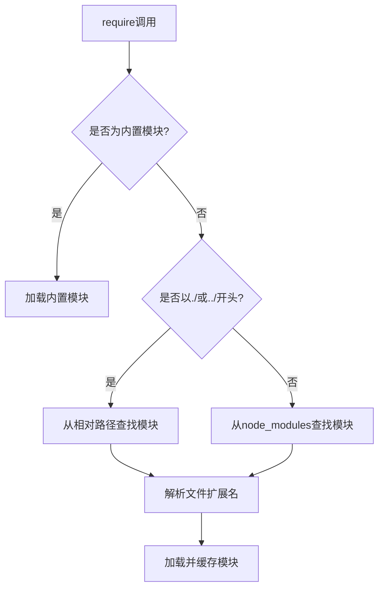

# JavaScript CommonJS模块

## 什么是CommonJS模块？

CommonJS模块是一种JavaScript模块规范，最初是为了在浏览器之外的环境中实现JavaScript模块化编程而设计的。它是Node.js默认采用的模块系统，允许开发者将JavaScript代码封装成独立的模块，以便重用和维护。

:::note
CommonJS模块在使用时是**同步加载**的，这对于服务器端JavaScript来说是合适的，因为文件都存储在本地磁盘，读取速度很快。
:::

## CommonJS模块的基本特点

- **模块作用域**：每个模块内部的变量、函数和类都是私有的，除非显式导出
- **同步加载**：模块加载是同步的，即一个接一个地加载
- **单例模式**：无论一个模块被引用多少次，它只会在第一次被加载时执行一次
- **值拷贝**：模块输出的是值的拷贝，模块内部的变化不会影响已经导出的值

## CommonJS模块的基本语法

### 导出模块内容

在CommonJS中，使用`module.exports`或`exports`对象来导出模块内容：

```js
// 导出单个功能
module.exports = function(x) {
  return x * x;
};

// 导出多个功能
exports.add = function(x, y) {
  return x + y;
};

exports.subtract = function(x, y) {
  return x - y;
};

// 重新定义导出对象
module.exports = {
  name: 'calculator',
  add: function(x, y) {
    return x + y;
  },
  subtract: function(x, y) {
    return x - y;
  }
};
```

:::caution
注意：不能直接给`exports`赋值，因为这样会断开`exports`与`module.exports`的引用关系。
```js
// 错误用法
exports = { name: 'calculator' }; // 这不会导出任何内容！

// 正确用法
module.exports = { name: 'calculator' };
// 或者
exports.name = 'calculator';
```
:::

### 导入模块内容

使用`require`函数来导入其他模块：

```js
// 导入整个模块
const calculator = require('./calculator');
console.log(calculator.add(5, 3)); // 输出: 8

// 使用解构赋值导入特定功能
const { add, subtract } = require('./calculator');
console.log(add(5, 3)); // 输出: 8
console.log(subtract(5, 3)); // 输出: 2

// 导入Node.js内置模块
const path = require('path');
const fileName = path.basename('/users/test/file.txt');
console.log(fileName); // 输出: file.txt
```

## CommonJS模块解析机制

当你使用`require()`导入模块时，Node.js会按以下顺序查找模块：



1. 如果模块标识符以`/`、`./`或`../`开头，则尝试从相对路径加载
2. 如果是内置模块（如`fs`、`path`等），直接加载
3. 如果不符合上述情况，Node.js会从当前模块的`node_modules`目录开始，然后逐级向上查找

## 实际应用案例

### 案例1：构建一个简单的计算器模块

这是一个展示如何创建和使用CommonJS模块的简单示例。

```js
// calculator.js - 模块文件
const add = (a, b) => a + b;
const subtract = (a, b) => a - b;
const multiply = (a, b) => a * b;
const divide = (a, b) => {
  if (b === 0) throw new Error('除数不能为零');
  return a / b;
};

module.exports = {
  add,
  subtract, 
  multiply,
  divide,
  PI: 3.14159
};
```

```js
// app.js - 使用模块的文件
const calculator = require('./calculator');

console.log(calculator.add(10, 5));      // 输出: 15
console.log(calculator.subtract(10, 5)); // 输出: 5
console.log(calculator.multiply(10, 5)); // 输出: 50
console.log(calculator.divide(10, 5));   // 输出: 2
console.log(`圆周率: ${calculator.PI}`);  // 输出: 圆周率: 3.14159

// 使用解构赋值
const { add, multiply } = require('./calculator');
console.log(add(3, 4));      // 输出: 7
console.log(multiply(3, 4)); // 输出: 12
```

### 案例2：构建一个文件处理工具

这个例子展示了如何创建一个实用的文件处理模块，并在另一个模块中使用它：

```js
// fileUtils.js
const fs = require('fs');
const path = require('path');

function readJsonFile(filePath) {
  try {
    const data = fs.readFileSync(filePath, 'utf8');
    return JSON.parse(data);
  } catch (error) {
    console.error(`读取文件失败: ${error.message}`);
    return null;
  }
}

function writeJsonFile(filePath, data) {
  try {
    const dirName = path.dirname(filePath);
    if (!fs.existsSync(dirName)) {
      fs.mkdirSync(dirName, { recursive: true });
    }
    
    const jsonData = JSON.stringify(data, null, 2);
    fs.writeFileSync(filePath, jsonData);
    return true;
  } catch (error) {
    console.error(`写入文件失败: ${error.message}`);
    return false;
  }
}

module.exports = {
  readJsonFile,
  writeJsonFile
};
```

```js
// dataProcessor.js
const fileUtils = require('./fileUtils');
const path = require('path');

// 读取配置文件
const configPath = path.join(__dirname, 'config.json');
const config = fileUtils.readJsonFile(configPath) || { defaultSettings: true };

// 修改配置
config.lastRun = new Date().toISOString();
config.count = (config.count || 0) + 1;

// 保存修改后的配置
if (fileUtils.writeJsonFile(configPath, config)) {
  console.log('配置已更新');
} else {
  console.log('配置更新失败');
}
```

## CommonJS模块的优缺点

### 优点

- **简单易用**：语法简洁，容易理解和使用
- **同步加载**：适合服务器环境下的模块加载
- **缓存机制**：提高了程序性能，避免重复加载
- **完整生态**：Node.js生态系统基于CommonJS构建，拥有丰富的模块库

### 缺点

- **浏览器不兼容**：浏览器环境无法直接使用CommonJS，需要借助Browserify或Webpack等工具转换
- **同步加载**：不适合浏览器环境，可能造成性能问题
- **静态分析困难**：由于是运行时加载，难以进行静态分析和优化
- **循环依赖处理复杂**：处理模块间循环依赖时可能产生意外结果

## CommonJS与ES模块的比较

| 特性 | CommonJS | ES模块 |
|------|----------|--------|
| 语法 | require/exports | import/export |
| 加载方式 | 同步加载 | 异步加载 |
| 加载时机 | 运行时加载 | 编译时加载 |
| 缓存 | 基于模块对象 | 基于模块URL |
| 浏览器支持 | 需要转换工具 | 原生支持 |
| 条件加载 | 支持动态导入 | 支持动态import() |
| 默认导出 | module.exports = value | export default value |

## 最佳实践

1. **保持模块小巧**：每个模块应该只做一件事情，符合单一职责原则
2. **避免循环依赖**：设计模块时避免形成循环依赖关系
3. **使用解构赋值**：只导入需要的部分，减少内存占用
4. **处理模块加载错误**：使用try-catch捕获require可能产生的错误
5. **理解缓存机制**：了解模块缓存的工作方式，避免意外的副作用

## 总结

CommonJS是Node.js默认使用的模块系统，它提供了一种简单的方式来组织和重用JavaScript代码。通过`module.exports`和`require`语句，开发者可以将代码分割成独立的模块，实现更好的代码组织和维护。

尽管现代JavaScript已经引入了ES模块系统，但由于Node.js生态系统的广泛采用，CommonJS仍然是服务器端JavaScript开发中的重要部分。理解CommonJS模块的工作原理和使用方法，对于Node.js开发来说是必不可少的技能。

## 练习

1. 创建一个名为`mathUtils.js`的模块，其中包含计算一个数的平方、立方和平方根的函数，然后在另一个文件中导入并使用这些函数。

2. 创建一个简单的日志记录模块，可以将消息写入文件，支持不同的日志级别（如info、warn、error）。

3. 尝试创建一个循环依赖的例子，观察其行为，并尝试解决循环依赖问题。

## 额外资源

- [Node.js官方文档 - 模块](https://nodejs.org/api/modules.html)
- [深入理解Node.js中的模块机制](https://nodejs.org/en/learn/getting-started/introduction-to-nodejs)
- [CommonJS规范](http://www.commonjs.org/)

希望这篇教程能帮助你理解CommonJS模块系统的基本概念和使用方法！