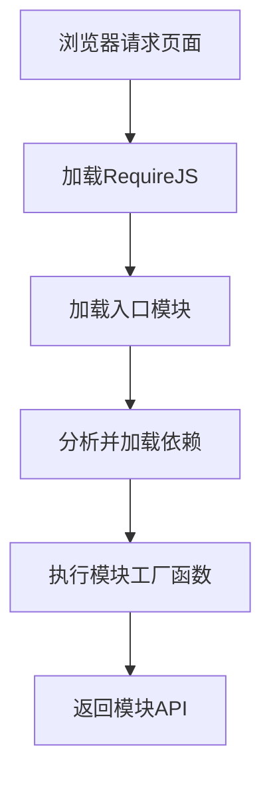

# JavaScript AMD模块

## 什么是AMD模块？

AMD（Asynchronous Module Definition，异步模块定义）是一种用于浏览器端JavaScript模块化开发的规范。它专门为浏览器环境设计，支持异步加载模块，这意味着模块可以按需加载，无需等待所有模块都加载完成。

:::note 为什么需要AMD？
在早期JavaScript开发中，代码组织常常是一个挑战，尤其是对于大型应用程序。AMD规范解决了这个问题，允许开发者将代码分解为模块化的、可重用的单元。
:::

AMD模块的核心特点：

- **异步加载**：不阻塞页面渲染
- **依赖管理**：明确声明并自动管理模块间依赖
- **模块封装**：提供良好的封装，避免全局变量污染
- **浏览器友好**：专为浏览器环境设计

## AMD模块的基本语法

AMD模块主要通过`define()`和`require()`两个函数来实现。

### define() 函数

`define()`函数用于定义模块，语法如下：

```javascript
define(id?, dependencies?, factory);
```

参数说明：
- `id`：可选，模块标识符
- `dependencies`：可选，依赖模块的数组
- `factory`：模块的实现函数，会被执行一次，返回值即为模块暴露的API

### 最简单的AMD模块示例

```javascript
// 定义一个简单的模块，不依赖其他模块
define(function() {
    // 模块代码
    function greeting(name) {
        return "Hello, " + name;
    }
    
    // 返回公开的API
    return {
        sayHello: greeting
    };
});
```

### 带依赖的AMD模块示例

```javascript
// 定义一个依赖其他模块的模块
define(['jquery', 'lodash'], function($, _) {
    // 使用依赖模块
    function formatName(name) {
        return _.trim(name);
    }
    
    function displayGreeting(name) {
        var formattedName = formatName(name);
        $('body').append('<p>Hello, ' + formattedName + '!</p>');
    }
    
    // 返回公开的API
    return {
        display: displayGreeting
    };
});
```

## 使用require.js实现AMD模块

RequireJS是实现AMD规范最流行的库，下面我们来看如何使用它：

### 1. 引入RequireJS

首先，在HTML文件中引入RequireJS：

```html
<!DOCTYPE html>
<html>
<head>
    <title>AMD示例</title>
    <!-- 引入RequireJS -->
    <script data-main="scripts/main" src="scripts/require.js"></script>
</head>
<body>
    <!-- 页面内容 -->
</body>
</html>
```

`data-main`属性指定了应用的入口点模块。

### 2. 配置RequireJS

在main.js中配置RequireJS：

```javascript
// main.js
require.config({
    // 基础路径
    baseUrl: 'scripts',
    
    // 路径映射
    paths: {
        'jquery': 'libs/jquery-3.6.0.min',
        'lodash': 'libs/lodash.min'
    }
});

// 启动应用
require(['app'], function(app) {
    app.init();
});
```

### 3. 创建模块

```javascript
// scripts/mathUtils.js
define(function() {
    return {
        add: function(x, y) {
            return x + y;
        },
        subtract: function(x, y) {
            return x - y;
        },
        multiply: function(x, y) {
            return x * y;
        },
        divide: function(x, y) {
            return x / y;
        }
    };
});

// scripts/app.js
define(['jquery', 'mathUtils'], function($, mathUtils) {
    return {
        init: function() {
            $('#calculateBtn').click(function() {
                var a = parseInt($('#num1').val());
                var b = parseInt($('#num2').val());
                var result = mathUtils.add(a, b);
                $('#result').text("结果: " + result);
            });
        }
    };
});
```

## 模块加载过程

AMD模块的加载过程是异步的，这对于提高页面性能尤为重要：



这种异步加载方式避免了JavaScript文件加载对页面渲染的阻塞，提高了用户体验。

## 实际应用场景

### 场景1：大型单页应用程序(SPA)

在SPA中，AMD模块可以实现按需加载不同页面功能，提高应用启动速度。

```javascript
// 路由控制器
define(['router'], function(router) {
    router.route('/dashboard', function() {
        // 只有用户访问dashboard时才加载相关模块
        require(['dashboard/main'], function(dashboard) {
            dashboard.initialize();
        });
    });
    
    router.route('/profile', function() {
        require(['profile/main'], function(profile) {
            profile.initialize();
        });
    });
});
```

### 场景2：插件系统

AMD模块适合构建可扩展的插件系统：

```javascript
// 插件加载器
define('pluginLoader', ['core'], function(core) {
    return {
        loadPlugin: function(pluginName) {
            require([pluginName], function(plugin) {
                plugin.register(core);
                console.log(pluginName + ' 插件已加载');
            });
        }
    };
});

// 使用
require(['pluginLoader'], function(loader) {
    // 按需加载插件
    loader.loadPlugin('charts');
    loader.loadPlugin('dataExport');
});
```

### 场景3：组件化开发

```javascript
// components/slider.js
define(['jquery'], function($) {
    function Slider(container, options) {
        this.container = $(container);
        this.options = $.extend({}, Slider.defaults, options);
        this.init();
    }
    
    Slider.defaults = {
        autoplay: true,
        interval: 3000
    };
    
    Slider.prototype.init = function() {
        // 初始化轮播组件
    };
    
    return Slider;
});

// 使用组件
require(['components/slider'], function(Slider) {
    var heroSlider = new Slider('#hero-carousel', {
        interval: 5000
    });
});
```

## AMD vs 其他模块系统

:::info 对比
| 特性 | AMD | CommonJS | ES Modules |
|------|-----|----------|------------|
| 执行环境 | 浏览器 | 服务器(Node.js) | 浏览器和服务器 |
| 加载方式 | 异步 | 同步 | 静态(可异步) |
| 语法复杂度 | 中等 | 简单 | 简单 |
| 依赖表达 | 数组参数 | require() | import |
| 主要实现 | RequireJS | Node.js | 原生支持 |
:::

## 最佳实践

1. **模块命名**：为模块提供有意义的ID，便于调试和维护
2. **合理分组**：相关功能放在同一模块，避免过度分割
3. **优化加载**：使用RequireJS优化工具(r.js)合并和压缩模块
4. **依赖管理**：明确声明所有依赖，避免隐式依赖
5. **循环依赖**：尽量避免模块间的循环依赖

## 常见问题与解决方案

### 循环依赖问题

循环依赖可能导致模块加载问题：

```javascript
// moduleA.js
define(['moduleB'], function(B) {
    return {
        name: 'Module A',
        getB: function() {
            return B;
        }
    };
});

// moduleB.js
define(['moduleA'], function(A) { // 循环依赖！
    return {
        name: 'Module B',
        getA: function() {
            return A;
        }
    };
});
```

**解决方案**：重构代码消除循环依赖，或使用require()延迟加载：

```javascript
// moduleB.js改为
define(function() {
    return {
        name: 'Module B',
        getA: function() {
            // 延迟加载moduleA
            var A;
            require(['moduleA'], function(moduleA) {
                A = moduleA;
            });
            return A;
        }
    };
});
```

## 总结

AMD模块是浏览器端JavaScript模块化开发的重要解决方案，其异步加载特性使其特别适合前端应用。虽然随着ES Modules的标准化，AMD使用有所减少，但理解AMD对于维护旧代码和深入理解JavaScript模块化发展历程仍然非常重要。

掌握AMD模块化技术可以帮助你：

- 有效组织大型JavaScript应用程序
- 实现按需加载，提升应用性能
- 创建可重用、可维护的代码
- 更好地理解现代JavaScript模块化系统的演进

## 练习与资源

### 练习

1. 创建一个简单的计算器应用，使用AMD模块分别封装UI交互、数学运算和历史记录功能
2. 将现有的非模块化JavaScript代码重构为AMD模块格式
3. 使用RequireJS的优化工具r.js优化你的AMD应用

### 推荐资源

- [RequireJS官方文档](https://requirejs.org/)
- [AMD规范详解](https://github.com/amdjs/amdjs-api/wiki/AMD)
- [JavaScript模块化编程系列文章](http://www.ruanyifeng.com/blog/2012/10/javascript_module.html)

现在，你已经全面了解了JavaScript AMD模块化方案，可以开始在你的项目中实践这些知识了！