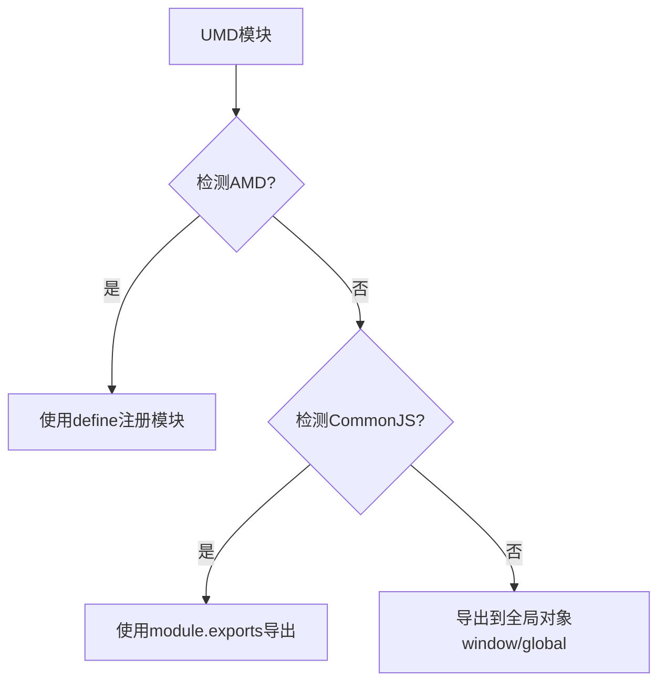

# JavaScript UMD模块

## 什么是UMD模块？

通用模块定义(Universal Module Definition, UMD)是一种JavaScript模块格式，旨在创建能在多种环境中运行的模块。UMD的主要目标是让同一段代码能够在多种模块系统中工作，包括：

- CommonJS (用于Node.js)
- AMD (Asynchronous Module Definition，典型实现如RequireJS)
- 全局变量 (直接在浏览器中使用`<script>`标签引入)

:::info
UMD不是一个官方标准，而是社区开发的一种模式，用来解决JavaScript模块系统碎片化的问题。
:::

## UMD的工作原理

UMD的核心思想是通过检测当前运行环境来确定使用哪种模块系统。它使用一系列的条件检查，按优先级检测不同的模块系统：



## UMD模块的基本结构

下面是一个基本的UMD模块模板：

```javascript
(function(root, factory) {
  // 检测AMD/RequireJS环境
  if (typeof define === 'function' && define.amd) {
    define(['dependencyModule'], factory);
  } 
  // 检测CommonJS环境
  else if (typeof exports === 'object') {
    module.exports = factory(require('dependencyModule'));
  } 
  // 浏览器全局变量
  else {
    root.myModule = factory(root.dependencyModule);
  }
}(typeof self !== 'undefined' ? self : this, function(dependencyModule) {
  // 在这里定义你的模块内容
  var myModule = {};
  
  myModule.doSomething = function() {
    return 'UMD模块工作了!';
  };
  
  return myModule;
}));
```

这个结构乍看复杂，但实际分解为几个部分：

1. 自执行函数，接收两个参数：`root`（全局对象）和`factory`（模块工厂函数）
2. 条件检测不同的模块环境
3. 工厂函数，定义模块内容并返回模块API

## 详细解析UMD模式

### 1. 自执行函数

```javascript
(function(root, factory) {
  // 模块系统检测逻辑
}(typeof self !== 'undefined' ? self : this, function(dependency) {
  // 模块实现
}));
```

这个自执行函数创建了一个闭包，防止变量泄露到全局作用域。`root`参数指向全局对象（浏览器中是`window`或`self`，Node.js中是`global`）。

### 2. AMD模块系统检测

```javascript
if (typeof define === 'function' && define.amd) {
  define(['dependencyModule'], factory);
}
```

如果检测到AMD环境（通过`define`函数和`define.amd`属性），使用AMD的`define`方法注册模块和依赖。

### 3. CommonJS模块系统检测

```javascript
else if (typeof exports === 'object') {
  module.exports = factory(require('dependencyModule'));
}
```

如果检测到CommonJS环境（通过`exports`对象），使用`module.exports`导出模块。

### 4. 浏览器全局变量

```javascript
else {
  root.myModule = factory(root.dependencyModule);
}
```

如果前两种环境都未检测到，假定在浏览器中通过脚本标签加载，将模块挂载到全局对象上。

## UMD模块实战示例

下面是一个实用的UMD模块示例，创建一个简单的工具库：

```javascript
// utils.js - UMD工具库
(function(root, factory) {
  if (typeof define === 'function' && define.amd) {
    define([], factory);
  } else if (typeof exports === 'object') {
    module.exports = factory();
  } else {
    root.Utils = factory();
  }
}(typeof self !== 'undefined' ? self : this, function() {
  
  // 模块内部代码
  var Utils = {};
  
  // 工具方法：格式化日期
  Utils.formatDate = function(date) {
    var d = date || new Date();
    return d.getFullYear() + '-' + 
           ('0' + (d.getMonth() + 1)).slice(-2) + '-' + 
           ('0' + d.getDate()).slice(-2);
  };
  
  // 工具方法：生成随机ID
  Utils.generateId = function(length) {
    var len = length || 8;
    var chars = '0123456789abcdefghijklmnopqrstuvwxyzABCDEFGHIJKLMNOPQRSTUVWXYZ';
    var result = '';
    for (var i = 0; i < len; i++) {
      result += chars[Math.floor(Math.random() * chars.length)];
    }
    return result;
  };
  
  return Utils;
}));
```

### 在不同环境中使用上面的UMD模块

**1. 在浏览器中通过脚本标签使用：**

```html
<!DOCTYPE html>
<html>
<head>
  <title>UMD测试</title>
  <script src="utils.js"></script>
  <script>
    document.addEventListener('DOMContentLoaded', function() {
      // 直接使用全局Utils对象
      console.log('今天的日期:', Utils.formatDate());
      console.log('随机ID:', Utils.generateId(12));
    });
  </script>
</head>
<body>
  <h1>UMD模块测试</h1>
</body>
</html>
```

**输出:**
```
今天的日期: 2023-05-20
随机ID: a7bFe9cD4gH2
```

**2. 在AMD环境中使用（RequireJS）：**

```html
<!DOCTYPE html>
<html>
<head>
  <title>UMD测试 - AMD</title>
  <script src="https://cdnjs.cloudflare.com/ajax/libs/require.js/2.3.6/require.min.js"></script>
  <script>
    requirejs(['utils'], function(Utils) {
      console.log('今天的日期:', Utils.formatDate());
      console.log('随机ID:', Utils.generateId(12));
    });
  </script>
</head>
<body>
  <h1>UMD模块测试 - AMD</h1>
</body>
</html>
```

**3. 在Node.js（CommonJS）环境中使用：**

```javascript
// app.js
const Utils = require('./utils');

console.log('今天的日期:', Utils.formatDate());
console.log('随机ID:', Utils.generateId(12));
```

**运行结果:**
```
今天的日期: 2023-05-20
随机ID: 7dkF83pQ4lZx
```

## 带依赖的UMD模块示例

下面是一个带有外部依赖的UMD模块，演示如何处理依赖关系：

```javascript
// calculator.js - 依赖于我们前面创建的Utils模块
(function(root, factory) {
  if (typeof define === 'function' && define.amd) {
    // AMD. 注册为匿名模块
    define(['utils'], factory);
  } else if (typeof module === 'object' && module.exports) {
    // Node. 不支持严格CommonJS
    module.exports = factory(require('./utils'));
  } else {
    // 浏览器全局变量
    root.Calculator = factory(root.Utils);
  }
}(typeof self !== 'undefined' ? self : this, function(Utils) {
  
  var Calculator = {};
  
  Calculator.add = function(a, b) {
    return a + b;
  };
  
  Calculator.subtract = function(a, b) {
    return a - b;
  };
  
  // 使用Utils依赖
  Calculator.getCalculationId = function() {
    return 'calc_' + Utils.generateId(5) + '_' + Utils.formatDate();
  };
  
  return Calculator;
}));
```

## UMD模块的优势与局限

### 优势

1. **兼容性强** - 可在几乎所有JavaScript运行环境中工作
2. **一次编写，多处运行** - 减少了为不同环境维护多个版本的麻烦
3. **向后兼容** - 可以与旧的代码库和模块系统一起工作

### 局限性

1. **代码量增加** - UMD包装增加了额外的代码量
2. **复杂性** - 模块定义结构较为复杂
3. **现代化** - 在支持ES模块的现代环境中有更简洁的替代方案

:::tip
随着ES模块（ESM）在现代浏览器和Node.js中的广泛支持，UMD的使用场景正在减少。但是，对于需要支持各种环境的库来说，UMD仍然是一个有价值的选择。
:::

## UMD vs 其他模块格式

| 特性 | UMD | CommonJS | AMD | ES Modules |
|------|-----|----------|-----|------------|
| 浏览器支持 | ✓ | ✗ | ✓ | 现代浏览器 |
| Node.js支持 | ✓ | ✓ | 需插件 | 较新版本 |
| 动态导入 | ✗ | ✗ | ✓ | ✓ |
| 语法简洁性 | 复杂 | 中等 | 中等 | 简洁 |
| 静态分析 | ✗ | ✗ | ✗ | ✓ |
| 树摇优化 | ✗ | ✗ | ✗ | ✓ |

## 何时使用UMD

UMD模块在以下情况下特别有用：

- 开发需要跨环境工作的JavaScript库
- 创建需要支持多种模块系统的开源项目
- 处理混合使用不同模块系统的老项目
- 需要最大兼容性的公共API或SDK

## 现代替代方案

随着JavaScript生态系统的发展，现在有更多现代化的选择：

1. **ES模块** - 现代JavaScript的官方模块系统
2. **构建工具** - 如Webpack, Rollup可以输出多种模块格式
3. **包管理工具** - npm包可以在package.json中指定多种入口点

## 总结

UMD模块模式是在JavaScript模块化早期碎片化的环境中诞生的聪明解决方案。它通过检测运行环境并相应地调整模块的加载和导出方式，使一个模块可以在所有主要环境中工作。

虽然现代JavaScript开发趋向于使用ES模块，但UMD依然在一些需要广泛兼容性的场景中有其重要价值。理解UMD不仅能帮助你处理现有的使用这种模式的代码库，还能让你更全面地了解JavaScript模块化的历史与演进。

## 练习与进一步学习

### 练习题

1. 将一个简单的字符串处理库转换为UMD模块
2. 创建一个带有依赖关系的UMD模块
3. 尝试在不同环境中加载和使用同一个UMD模块

### 学习资源

- [UMD GitHub仓库](https://github.com/umdjs/umd) - 包含各种UMD模式的示例
- 探索流行的开源库如何使用UMD，例如jQuery、Lodash等
- 了解构建工具如Webpack和Rollup如何生成UMD格式的输出

:::caution
虽然UMD是一种有价值的模式，但在新项目中，优先考虑使用ES模块可能是更好的选择，因为它是JavaScript的官方标准，提供更好的性能和工具支持。
:::