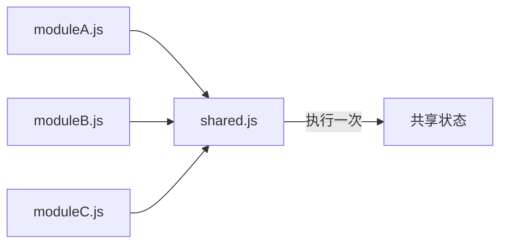

# JavaScript ES6模块

## 什么是ES6模块

ES6模块系统（也称为ESM或ECMAScript模块）是JavaScript的原生模块系统，在ECMAScript 2015（ES6）标准中引入。它提供了一种标准化的方式来组织和分享代码，解决了JavaScript长期以来缺乏官方模块化解决方案的问题。

:::note 核心概念
ES6模块系统通过`import`和`export`关键字，允许开发者在不同文件之间共享和重用代码，显著提升了代码的维护性、可读性和可扩展性。
:::

## 为什么需要模块化

在深入了解ES6模块之前，让我们先理解为什么JavaScript需要模块化：

1. **避免全局作用域污染** - 模块提供独立的作用域，防止变量和函数冲突
2. **代码重用** - 将功能封装在模块中，便于在多个项目中重用
3. **依赖管理** - 清晰地声明和管理模块间的依赖关系
4. **提高代码可维护性** - 将相关功能组织在一起，使结构更清晰
5. **提升加载性能** - 支持按需加载，减少不必要资源的加载

## ES6模块基础语法

### 导出(Export)

在ES6模块中，可以使用`export`关键字将变量、函数、类等导出，以供其他模块使用：

```javascript
// math.js - 基本导出示例

// 命名导出 - 导出单个项
export const PI = 3.14159;

// 导出函数
export function add(a, b) {
  return a + b;
}

// 导出类
export class Calculator {
  multiply(a, b) {
    return a * b;
  }
}

// 一次性导出多个项
const subtract = (a, b) => a - b;
const divide = (a, b) => a / b;
export { subtract, divide };
```

你还可以使用默认导出，每个模块仅允许有一个默认导出：

```javascript
// user.js - 默认导出示例
export default class User {
  constructor(name) {
    this.name = name;
  }
  
  sayHello() {
    return `Hello, I'm ${this.name}`;
  }
}
```

### 导入(Import)

使用`import`关键字从其他模块导入内容：

```javascript
// app.js - 导入示例

// 导入命名导出
import { PI, add, Calculator } from './math.js';
console.log(PI); // 3.14159
console.log(add(2, 3)); // 5

const calc = new Calculator();
console.log(calc.multiply(4, 5)); // 20

// 导入默认导出
import User from './user.js';
const user = new User('Alice');
console.log(user.sayHello()); // Hello, I'm Alice

// 导入全部并使用命名空间
import * as MathUtils from './math.js';
console.log(MathUtils.PI); // 3.14159
console.log(MathUtils.divide(10, 2)); // 5
```

### 重命名导入和导出

可以在导入或导出时重命名项目：

```javascript
// 导出时重命名
const sum = (a, b) => a + b;
export { sum as add };

// 导入时重命名
import { add as sum } from './math.js';
console.log(sum(5, 3)); // 8
```

## 模块特性与注意事项

### 1. 模块始终在严格模式下运行

ES6模块总是在严格模式("use strict")下执行，无需显式声明。

### 2. 模块级作用域

模块中声明的变量、函数和类在其他模块中不可见，除非明确导出：

```javascript
// module1.js
const privateVar = "这个变量在其他模块中不可见";
export const publicVar = "这个变量可以被其他模块导入";

// module2.js
import { publicVar } from './module1.js';
console.log(publicVar); // "这个变量可以被其他模块导入"
console.log(privateVar); // ReferenceError: privateVar is not defined
```

### 3. 模块只执行一次

无论一个模块被导入多少次，它只会被执行一次，其导出的值在所有导入它的模块之间共享：



### 4. 静态结构

ES6模块是静态的，意味着`import`和`export`语句必须位于模块顶层，不能放在条件语句或函数内部：

```javascript
// 正确
import { something } from './module.js';

// 错误 - 不允许在条件语句中导入
if (condition) {
  import { something } from './module.js'; // 语法错误
}
```

## 动态导入

虽然静态导入必须在顶层使用，但ES6提供了动态导入功能，使用`import()`函数：

```javascript
// 动态导入示例
button.addEventListener('click', async () => {
  try {
    // 仅当用户点击按钮时才加载模块
    const { formatDate } = await import('./date-utils.js');
    const formattedDate = formatDate(new Date());
    console.log(formattedDate);
  } catch (error) {
    console.error('模块加载失败', error);
  }
});
```

动态导入的优势：
- 按需加载，提高性能
- 可以在条件语句或函数中使用
- 返回Promise，支持异步操作

## 实际应用案例

### 案例1: 构建模块化计算器

```javascript
// calculator/operations.js
export const add = (a, b) => a + b;
export const subtract = (a, b) => a - b;
export const multiply = (a, b) => a * b;
export const divide = (a, b) => a / b;

// calculator/validator.js
export function validateNumbers(...numbers) {
  return numbers.every(num => typeof num === 'number' && !isNaN(num));
}

// calculator/index.js
import { add, subtract, multiply, divide } from './operations.js';
import { validateNumbers } from './validator.js';

export default class Calculator {
  calculate(operation, a, b) {
    if (!validateNumbers(a, b)) {
      throw new Error('Invalid numbers provided');
    }
    
    switch (operation) {
      case 'add': return add(a, b);
      case 'subtract': return subtract(a, b);
      case 'multiply': return multiply(a, b);
      case 'divide': return divide(a, b);
      default: throw new Error(`Unknown operation: ${operation}`);
    }
  }
}

// app.js - 使用计算器模块
import Calculator from './calculator/index.js';

const calc = new Calculator();
console.log(calc.calculate('add', 5, 3)); // 8
console.log(calc.calculate('multiply', 4, 2)); // 8
```

### 案例2: 模块化用户界面组件

```javascript
// components/button.js
export default class Button {
  constructor(text, onClick) {
    this.element = document.createElement('button');
    this.element.textContent = text;
    this.element.addEventListener('click', onClick);
  }
  
  render(container) {
    container.appendChild(this.element);
    return this.element;
  }
}

// components/modal.js
import Button from './button.js';

export default class Modal {
  constructor(title, content) {
    this.modal = document.createElement('div');
    this.modal.className = 'modal';
    
    const header = document.createElement('h2');
    header.textContent = title;
    
    const body = document.createElement('div');
    body.textContent = content;
    
    this.closeButton = new Button('关闭', () => this.close());
    
    this.modal.appendChild(header);
    this.modal.appendChild(body);
    this.modal.appendChild(this.closeButton.element);
  }
  
  open() {
    document.body.appendChild(this.modal);
  }
  
  close() {
    this.modal.remove();
  }
}

// app.js - 使用UI组件模块
import Button from './components/button.js';
import Modal from './components/modal.js';

// 创建显示模态框的按钮
const showModalButton = new Button('显示信息', () => {
  const infoModal = new Modal('欢迎', '欢迎学习ES6模块！');
  infoModal.open();
});

showModalButton.render(document.body);
```

## 在浏览器中使用ES6模块

在HTML中，可以通过在`<script>`标签中添加`type="module"`属性来使用ES6模块：

```html
<!DOCTYPE html>
<html lang="zh-CN">
<head>
  <meta charset="UTF-8">
  <title>ES6模块演示</title>
</head>
<body>
  <h1>ES6模块演示</h1>
  
  <!-- 使用type="module"属性 -->
  <script type="module">
    import { add } from './math.js';
    console.log(add(5, 7)); // 12
  </script>
  
  <!-- 也可以引用外部模块脚本 -->
  <script type="module" src="app.js"></script>
</body>
</html>
```

:::caution 注意事项
在浏览器中使用ES6模块时需要注意：
1. 模块脚本自动采用延迟加载（相当于添加了`defer`属性）
2. 必须通过HTTP/HTTPS协议加载，本地文件（file://）不支持
3. 旧浏览器可能不支持，需要使用Babel等工具转译
:::

## 模块与传统脚本的区别

| 特性 | ES6模块 | 传统脚本 |
|------|---------|---------|
| 默认模式 | 严格模式 | 非严格模式 |
| 顶层变量 | 模块作用域 | 全局作用域 |
| this值 | undefined | window对象 |
| 加载方式 | 异步加载 | 同步加载 |
| 导入导出 | 支持静态分析 | 无原生支持 |
| 文件扩展名 | .js, .mjs | .js |

## 最佳实践

1. **使用命名导出组织相关功能**：将相关功能组织在一起，使用命名导出使API更加明确。

2. **合理使用默认导出**：当模块主要提供单一功能时使用默认导出。

3. **保持模块纯净**：每个模块应该有明确的职责，避免副作用。

4. **避免循环依赖**：设计模块时应避免循环依赖，可能导致未预期的行为。

5. **使用索引文件聚合导出**：通过创建索引文件（如index.js）重新导出相关模块，简化导入路径：

```javascript
// utils/index.js
export { default as formatDate } from './formatDate.js';
export { default as formatCurrency } from './formatCurrency.js';

// 在其他文件中使用
import { formatDate, formatCurrency } from './utils';
```

## 总结

ES6模块是现代JavaScript开发的重要组成部分，提供了一种标准化、强大且灵活的方式来组织和管理代码。通过使用`import`和`export`语句，开发者可以创建清晰的依赖关系，避免全局命名空间污染，并享受更好的性能和代码维护性。

ES6模块系统的优势包括：
- 原生JavaScript支持，不需要额外库
- 静态结构，支持树摇（tree shaking）和更好的工具分析
- 明确的导入/导出语法
- 支持异步加载

随着现代浏览器和Node.js对ES6模块的广泛支持，它已成为JavaScript应用程序开发的首选模块化解决方案。

## 练习与挑战

1. **基础练习**：创建一个数学工具模块，包含基本运算和几何计算功能，然后在另一个文件中导入并使用它。

2. **中级挑战**：设计一个简单的电子商务应用模块结构，包括产品、购物车和结账模块，使用ES6模块组织代码。

3. **高级项目**：构建一个模块化的Web应用，包括用户界面组件、数据管理、和API交互模块，实践模块化设计的最佳实践。

## 资源链接

- MDN Web文档：[JavaScript 模块](https://developer.mozilla.org/zh-CN/docs/Web/JavaScript/Guide/Modules)
- 探索更多关于ES6模块的内容：[JavaScript.info - 模块简介](https://zh.javascript.info/modules-intro)
- Node.js ES模块文档：[ECMAScript模块](https://nodejs.org/api/esm.html)

通过掌握ES6模块系统，你将能够构建更加模块化、可维护和可扩展的JavaScript应用程序。开始尝试在你的项目中使用它吧！