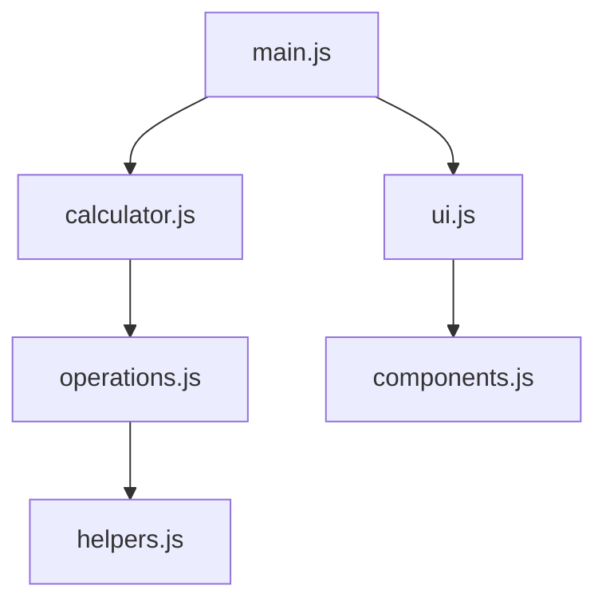

# JavaScript 模块导入

在现代JavaScript开发中，模块化是一种将代码分割成独立、可重用部分的强大方式。了解如何正确导入模块对于构建可维护的应用程序至关重要。本文将全面介绍JavaScript中的模块导入方式和技巧。

## 什么是模块导入？

模块导入是指在一个JavaScript文件中引用并使用其他文件导出的功能的过程。通过导入模块，你可以：

- 重用已有的代码
- 组织代码结构
- 避免变量名冲突
- 控制代码的可见性

## ES模块导入语法

ES模块（ECMAScript模块）是JavaScript的官方标准模块系统，使用`import`和`export`语句。

### 基本导入

从一个模块中导入所有命名导出：

```javascript
// math.js - 导出文件
export function add(a, b) {
  return a + b;
}

export function subtract(a, b) {
  return a - b;
}

// app.js - 导入文件
import { add, subtract } from './math.js';

console.log(add(5, 3));      // 输出: 8
console.log(subtract(10, 4)); // 输出: 6
```

### 重命名导入

当你想避免命名冲突时，可以在导入时重命名：

```javascript
import { add as addition, subtract as subtraction } from './math.js';

console.log(addition(5, 3));      // 输出: 8
console.log(subtraction(10, 4));  // 输出: 6
```

### 导入默认导出

当一个模块只有一个主要功能时，通常使用默认导出：

```javascript
// user.js
export default class User {
  constructor(name) {
    this.name = name;
  }
  
  sayHello() {
    return `Hello, I'm ${this.name}`;
  }
}

// app.js
import User from './user.js';

const user = new User('Alice');
console.log(user.sayHello());  // 输出: Hello, I'm Alice
```

### 混合导入默认导出和命名导出

```javascript
// api.js
export default function fetchData() {
  // 获取数据的代码
}

export function processData(data) {
  // 处理数据的代码
}

// app.js
import fetchData, { processData } from './api.js';

fetchData().then(data => {
  const result = processData(data);
  console.log(result);
});
```

### 导入所有内容

使用命名空间导入所有导出：

```javascript
// utils.js
export function format(text) {
  return text.trim();
}

export function validate(text) {
  return text.length > 0;
}

// app.js
import * as Utils from './utils.js';

console.log(Utils.format('  Hello  '));  // 输出: "Hello"
console.log(Utils.validate(''));         // 输出: false
```

## CommonJS模块导入

在Node.js环境中，传统上使用CommonJS模块系统，使用`require()`函数导入模块。

```javascript
// math.js
module.exports.add = function(a, b) {
  return a + b;
};

module.exports.subtract = function(a, b) {
  return a - b;
};

// 或者更简洁的写法
exports.multiply = function(a, b) {
  return a * b;
};

// app.js
const math = require('./math.js');
console.log(math.add(5, 3));      // 输出: 8
console.log(math.subtract(10, 4)); // 输出: 6
console.log(math.multiply(2, 3));  // 输出: 6

// 使用解构赋值
const { add, subtract } = require('./math.js');
console.log(add(7, 2));           // 输出: 9
```

:::note
CommonJS是同步导入的，而ES模块是异步导入的。这是两者的主要区别之一。
:::

## 动态导入

ES模块系统支持动态导入，允许你在运行时根据条件加载模块：

```javascript
async function loadModule() {
  if (someCondition) {
    // 动态导入，返回一个Promise
    const module = await import('./feature.js');
    module.doSomething();
  }
}

// 或者使用Promise链
button.addEventListener('click', () => {
  import('./dialog.js')
    .then(module => {
      module.openDialog();
    })
    .catch(err => {
      console.error('加载模块失败:', err);
    });
});
```

动态导入的优势在于可以实现代码分割和按需加载，这在构建复杂的Web应用时特别有用。

## 模块导入路径

导入模块时，可以使用不同类型的路径：

1. **相对路径**：以`./`或`../`开头
   ```javascript
   import { helper } from './utils/helper.js';
   import { config } from '../config.js';
   ```

2. **绝对路径**：从项目根目录开始
   ```javascript
   import { API } from '/src/services/api.js';
   ```

3. **包导入**：直接使用包名（从node_modules导入）
   ```javascript
   import React from 'react';
   import axios from 'axios';
   ```

## 实际案例：构建模块化计算器

让我们看一个实际的例子，创建一个模块化计算器应用：



### 基本操作模块

```javascript
// operations.js
export function add(a, b) {
  return a + b;
}

export function subtract(a, b) {
  return a - b;
}

export function multiply(a, b) {
  return a * b;
}

export function divide(a, b) {
  if (b === 0) throw new Error('Cannot divide by zero');
  return a / b;
}
```

### 计算器核心模块

```javascript
// calculator.js
import * as operations from './operations.js';

export default class Calculator {
  constructor() {
    this.memory = 0;
  }

  calculate(operation, a, b) {
    switch(operation) {
      case 'add': return operations.add(a, b);
      case 'subtract': return operations.subtract(a, b);
      case 'multiply': return operations.multiply(a, b);
      case 'divide': return operations.divide(a, b);
      default: throw new Error('Unsupported operation');
    }
  }

  saveToMemory(value) {
    this.memory = value;
  }
  
  getMemory() {
    return this.memory;
  }
}
```

### UI组件模块

```javascript
// components.js
export function createButton(text, onClick) {
  const button = document.createElement('button');
  button.textContent = text;
  button.addEventListener('click', onClick);
  return button;
}

export function createDisplay() {
  const display = document.createElement('div');
  display.className = 'calculator-display';
  return display;
}
```

### UI控制模块

```javascript
// ui.js
import { createButton, createDisplay } from './components.js';

export function createCalculatorUI(calculator) {
  const container = document.createElement('div');
  const display = createDisplay();
  
  // 添加数字按钮
  for (let i = 0; i <= 9; i++) {
    const button = createButton(i.toString(), () => {
      // 处理数字输入
    });
    container.appendChild(button);
  }
  
  // 添加操作按钮
  ['add', 'subtract', 'multiply', 'divide'].forEach(op => {
    const button = createButton(op, () => {
      // 处理操作
    });
    container.appendChild(button);
  });
  
  return container;
}
```

### 主程序

```javascript
// main.js
import Calculator from './calculator.js';
import { createCalculatorUI } from './ui.js';

document.addEventListener('DOMContentLoaded', () => {
  const calculator = new Calculator();
  const calculatorUI = createCalculatorUI(calculator);
  
  document.body.appendChild(calculatorUI);
  
  console.log('Calculator app initialized');
});
```

## 常见问题和解决方案

### CORS错误

在浏览器中使用ES模块时，可能会遇到CORS（跨源资源共享）错误。

:::caution
当你从文件系统直接打开HTML文件时，使用ES模块会导致CORS错误。解决方案是使用本地服务器（如Live Server、http-server等）。
:::

```bash
# 使用Node.js的http-server
npm install -g http-server
http-server .
```

### 模块文件扩展名

在浏览器环境中，导入ES模块时通常需要包含文件扩展名：

```javascript
// 在浏览器中，需要扩展名
import { helper } from './utils/helper.js';

// 在某些打包工具或Node.js环境中，可能不需要扩展名
import { helper } from './utils/helper';
```

### 循环依赖

当两个或多个模块相互导入时，可能会导致循环依赖问题：

:::warning
循环依赖可能导致未初始化的变量或其他意外行为。尽量通过重构代码来避免循环依赖。
:::

## 最佳实践

1. **尽量使用命名导出**：这样更容易追踪哪些功能来自哪个模块。

2. **每个文件一个职责**：保持模块专注于单一功能。

3. **避免过度模块化**：不要为了模块化而模块化，太多的小模块可能增加复杂性。

4. **使用明确的命名**：模块名和导出名应该能够清楚地表达其用途。

5. **考虑使用桶文件（barrel files）**：创建索引文件整合多个模块导出，简化导入路径。

   ```javascript
   // utils/index.js
   export { default as format } from './format';
   export { default as validate } from './validate';
   
   // 使用
   import { format, validate } from './utils';
   ```

## 总结

JavaScript模块导入是现代Web开发的基础，掌握不同的导入方法可以帮助你组织和管理更复杂的代码库。随着项目规模的增长，良好的模块化实践变得尤为重要。

主要记住：
- ES模块使用`import`/`export`语法，是现代推荐的方式
- CommonJS使用`require`/`module.exports`，主要用于Node.js环境
- 动态导入用于按需加载模块
- 注意不同环境的特殊要求（如浏览器中的CORS和文件扩展名）

## 练习

1. 创建一个简单的工具库，包含至少三个实用函数，并导出它们。然后创建一个主文件导入并使用这些函数。

2. 实现一个带有动态导入的应用，根据用户点击按钮加载不同的模块。

3. 尝试重构现有代码，将一个大文件拆分成多个模块，并正确导入/导出功能。

## 延伸阅读

- [JavaScript模块 - MDN Web 文档](https://developer.mozilla.org/zh-CN/docs/Web/JavaScript/Guide/Modules)
- [ES6 模块导入与导出 - 现代 JavaScript 教程](https://javascript.info/import-export)
- [深入理解 ES 模块](https://exploringjs.com/es6/ch_modules.html)

掌握模块导入是构建可维护JavaScript应用程序的关键步骤。通过实践和不断学习，你将能够更有效地组织代码并提高开发效率。